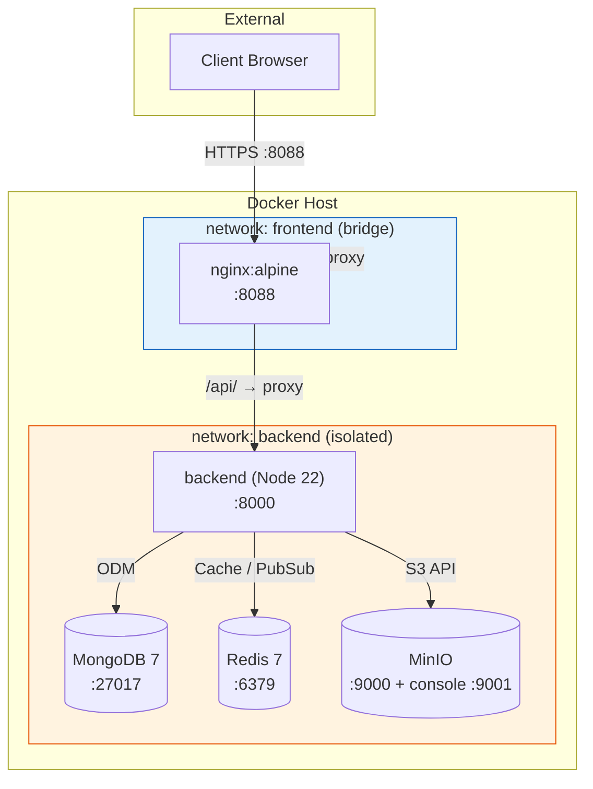
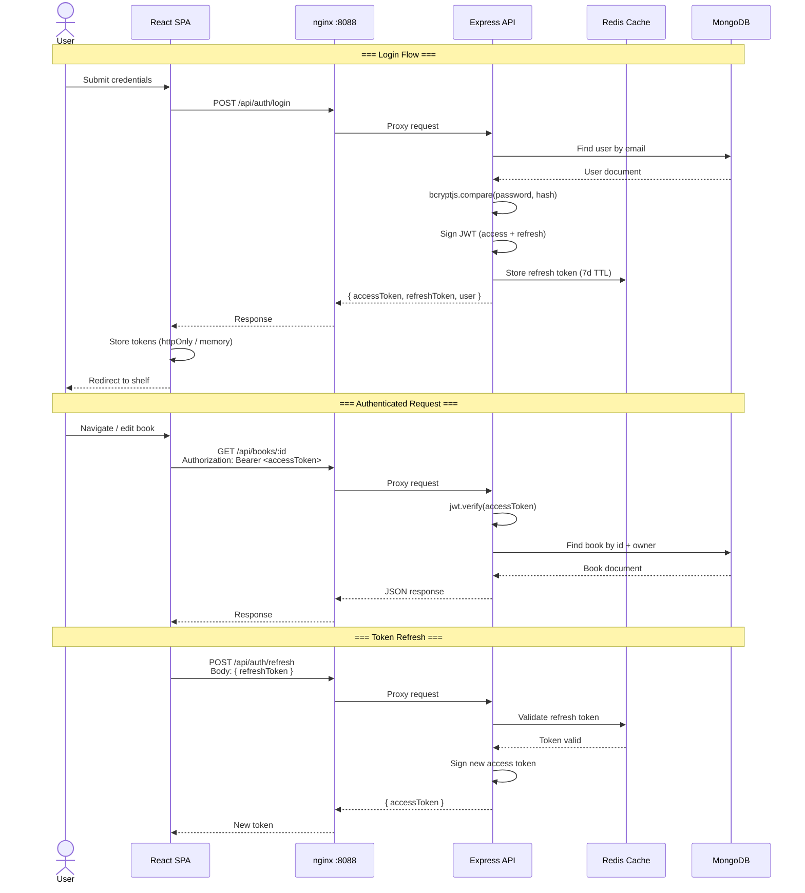

# Contopia — Tech Stack Documentation

**Last Updated**: 2026-05-09
**Architecture Pattern**: Layered Modular Monolith

---

## Stack Overview

| Layer | Technology | Version | Rationale |
|-------|-----------|---------|-----------|
| Runtime | Node.js | 22 LTS | Long-term support, ESM-native, V8 engine maturity |
| API Framework | Express | 4.x | Battle-tested, middleware ecosystem, lightweight |
| Primary Database | MongoDB | 7 | Document model fits book metadata, shelf hierarchies, flexible schema |
| ODM | Mongoose | 8.x | Schema validation, middleware hooks, population |
| Cache / Session / PubSub | Redis | 7 | Session store, rate-limit counters, real-time collaboration backbone |
| Object Storage | MinIO / S3-compatible | Latest | Book covers, exported PDFs, user uploads; S3 API for portability |
| Frontend Framework | React | 18 | Component model, rich editor ecosystem (TipTap, Fabric.js) |
| Build Tool | Vite | 5.x | Fast HMR, ESM-native, PWA plugin support |
| Styling | Tailwind CSS | 3.x | Utility-first, responsive design, design system consistency |
| UI Components | Flowbite React | Latest | Pre-built Tailwind-compatible components |
| Animations | Framer Motion | Latest | Declarative animations, gesture support |
| Rich Text Editor | TipTap (ProseMirror) | Latest | Extensible, headless, real-time collaboration ready |
| Canvas Editor | Fabric.js | Latest | Book cover designer, image manipulation |
| State Management | Zustand + TanStack Query | Latest | Client state (Zustand) + server state (React Query) separation |
| i18n | react-i18next | Latest | Mature i18n framework, language detection, lazy loading |
| Reverse Proxy | nginx | Alpine | TLS termination, static asset caching, rate limiting |
| Containerization | Docker + Compose | Latest | Consistent environments, multi-service orchestration |
| CI/CD | GitHub Actions | Latest | Integrated with GitHub, matrix builds, container registry |

---

## NFR Compliance Map

| NFR ID | Requirement | Implementation | Verification |
|--------|-------------|----------------|--------------|
| NFR-PRF-01 | API response < 200ms p95 | Redis caching, MongoDB indexes, connection pooling | Load testing (k6) |
| NFR-PRF-02 | Page load < 2s (LCP) | Vite code splitting, nginx gzip, PWA caching | Lighthouse CI |
| NFR-PRF-03 | Support 10K concurrent users | Horizontal scaling, Redis cluster, MongoDB replica set | Stress testing |
| NFR-SEC-01 | TLS everywhere | nginx TLS termination (prod), CSP headers, HSTS | Security scan (Snyk/Trivy) |
| NFR-SEC-02 | Encrypted asset storage | MinIO server-side encryption, signed URLs | S3 encryption verification |
| NFR-SEC-03 | JWT auth + refresh tokens | bcryptjs, jsonwebtoken, 30m access / 7d refresh | Auth integration tests |
| NFR-SEC-04 | Rate limiting per IP | express-rate-limit (API) + nginx limit_req_zone | Rate-limit test suite |
| NFR-SEC-05 | No secrets in code/images | Docker secrets, .env gitignored, build-arg for Vite | CI secret scanning |
| NFR-SEC-06 | Input validation | Zod schemas on all endpoints, sanitized MongoDB queries | Unit + integration tests |
| NFR-AVL-01 | 99.9% uptime | Docker healthchecks, restart policies, graceful shutdown | Uptime monitoring |
| NFR-AVL-02 | Graceful degradation | Circuit breakers, fallback UI when API unavailable | Chaos engineering |
| NFR-SCL-01 | Horizontal scaling | Stateless API containers, shared Redis/MongoDB | Autoscaling tests |
| NFR-SCL-02 | Database read scaling | MongoDB read preference, Redis read replicas | Read throughput tests |
| NFR-SCL-03 | Asset storage scaling | MinIO distributed mode, S3-compatible migration path | Storage capacity tests |
| NFR-SCL-04 | CDN-ready assets | nginx cache headers, immutable asset fingerprints | CDN integration test |
| NFR-MNT-01 | Structured logging | Pino JSON logs, request IDs, log levels | Log aggregation setup |
| NFR-MNT-02 | Health check endpoints | /health (liveness + readiness), compose healthchecks | Health check monitoring |
| NFR-MNT-03 | Metrics collection | Prometheus endpoints, request duration histograms | Grafana dashboards |
| NFR-DPL-01 | Zero-downtime deployments | Rolling updates, blue-green via compose profiles | Deployment simulation |
| NFR-DPL-02 | Automated rollback | Health check gates, previous image tags preserved | Rollback drill |
| NFR-DPL-03 | Environment parity | Identical Docker images dev→staging→prod | Environment diff check |

---

## Deployment Topology



---

## Authentication Flow



---

## Alternatives Considered

| Component | Chosen | Alternative | Why Rejected |
|-----------|--------|-------------|--------------|
| Runtime | Node.js 22 | Deno 2 | Ecosystem maturity — TipTap/Fabric.js/Mongoose compatibility |
| API Framework | Express | Fastify | Express: larger ecosystem, simpler middleware for MVP stage |
| API Framework | Express | NestJS | Over-engineering for layered monolith; heavier learning curve |
| Database | MongoDB 7 | PostgreSQL | Document model suits book metadata + shelf hierarchies better |
| ODM/ORM | Mongoose | Prisma (MongoDB) | Prisma MongoDB support is less mature; Mongoose middleware hooks |
| Cache | Redis 7 | Memcached | Redis needed for PubSub (collaboration) + sessions; Memcached limited |
| Object Storage | MinIO | AWS S3 direct | Self-hosted for dev; S3-compatible for cloud migration path |
| Frontend | React 18 | Vue 3 / Svelte | TipTap + Fabric.js ecosystem strongest in React |
| Styling | Tailwind | MUI / Chakra | Utility-first gives more control for custom design system |
| Build | Vite | Next.js | PWA-first approach; no SSR needed for editor-heavy app |
| i18n | react-i18next | LinguiJS | Larger community, more plugins, wider adoption |
| Canvas | Fabric.js | Konva.js | Fabric.js has richer image manipulation APIs for cover editor |
| CI/CD | GitHub Actions | GitLab CI | GitHub-native, simpler secrets management for MVP |
| Reverse Proxy | nginx | Traefik | nginx: simpler static config, no need for dynamic routing |

---

## Architecture Pattern: Layered Modular Monolith

### Why a Monolith?

The Contopia "Estante Digital" application is a cohesive domain — book management, reading, and cover editing are tightly coupled features that share the same user context, auth, and asset storage. A layered monolith provides:

1. **Simple deployment** — single backend API, single frontend bundle
2. **Shared data access** — MongoDB and Redis are colocated; no distributed transactions needed
3. **Low operational overhead** — one set of health checks, logs, and monitoring
4. **Migration path** — domain modules are namespaced (`/app/auth`, `/app/book`, etc.) for future extraction into microservices if needed

### Layered Architecture

```
┌─────────────────────────────────────────────────┐
│                  Presentation                     │
│          React SPA (Vite + Tailwind)              │
├─────────────────────────────────────────────────┤
│               Application Layer                   │
│    Express Routes → Zod Validation → Controllers  │
├─────────────────────────────────────────────────┤
│                Domain Layer                       │
│   Business Logic (src/app/<domain>/manager.js)   │
├─────────────────────────────────────────────────┤
│             Infrastructure Layer                  │
│  Mongoose Models | Redis Client | MinIO Client   │
├─────────────────────────────────────────────────┤
│                 External                         │
│  MongoDB | Redis | MinIO/S3 | SMTP               │
└─────────────────────────────────────────────────┘
```

### Domain Modules (`backend/src/app/`)

| Module | Responsibility |
|--------|----------------|
| `auth` | Registration, login, JWT management, parental consent |
| `book` | Book CRUD, metadata, search, ownership |
| `shelf` | Collections, organization, sharing |
| `editor` | Rich text editing (TipTap-backed), chapter management |
| `cover` | Cover designer (Fabric.js canvas), image export |
| `reader` | Book reading UI, progress tracking, TTS |
| `storage` | Asset upload/download, S3 presigned URLs, image processing |
| `common` | Shared middleware, pagination, error helpers, constants |

### Key Principles

- **Dependency direction**: Modules depend on infrastructure (down), never sideways or up
- **Shared nothing per domain**: Each domain manages its own routes and persistence via its DAO layer
- **Cross-cutting via common**: Logging, auth middleware, rate limiting live in `common/`
- **Config at boundary**: `src/config/` owns all env var parsing and external service setup
