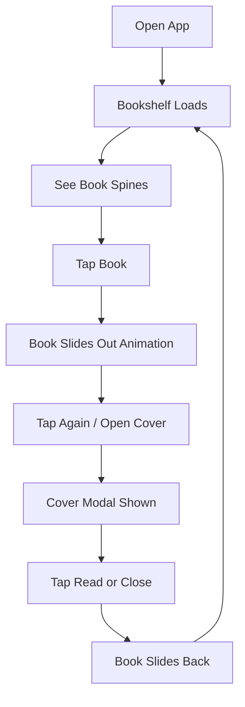

# EPIC-001: Digital Bookshelf Core Experience

**Status**: Draft  
**Priority**: Must Have  
**Estimate**: M  
**Target Release**: MVP

---

## 👤 Personas Impacted

- **Primary**: Julia — The Young Author — *She sees her personal library as a visual, tactile space.*
- **Secondary**: Mãe da Julia — The Caring Parent — *She sees her daughter engaged with a beautiful, productive app.*

## 🎯 Business Value

The bookshelf is the product's core metaphor and primary interface. Without a delightful, intuitive shelf, the product is just another file manager. This epic establishes the "room" feeling that differentiates Estante Digital. It directly drives session frequency and emotional attachment to the product.

## 📊 Success Metrics (KPIs)

- **Primary KPI**: >70% of returning users open the app and interact with the shelf within 10 seconds.
- **Secondary KPIs**:
  - Average books per shelf ≥3 within first 14 days.
  - Shelf animation interactions (pull out / place back) ≥2 per session for active users.

## 📝 Description

Build the foundational bookshelf UI where Julia sees her books arranged visually on shelves. Books are represented by their spines. Tapping a book triggers a smooth animation sliding it out from the shelf. A second tap opens the cover view. The shelf must feel playful, responsive, and personal — like a bedroom bookshelf, not a database table.

## 🔗 Dependencies

- **Blocked by**: EPIC-010 (Platform Foundation) — needs auth, storage, and basic data model.
- **Blocks**: EPIC-002 (Reading), EPIC-004 (Cover Designer), EPIC-006 (Sorting).
- **Related to**: EPIC-003 (Writing) — new books appear on shelf automatically.

## ✅ Scope (In)

- Visual shelf grid with horizontal rows (shelves).
- Book spines rendered using cover color + title text.
- Tap-to-pull animation (book slides forward/out).
- Tap-again to view full cover overlay/modal.
- "Place back" animation returning book to shelf.
- Empty shelf state with friendly illustration + CTA to write/import.
- Basic responsive layout (mobile-first, tablet, desktop).
- Default sorting (newest first).

## ❌ Scope (Out)

- **Custom shelf backgrounds or themes** — deferred to V1.1; MVP uses a single, polished default theme.
- **Multiple shelves / rooms** — deferred to V2.0; MVP has one continuous shelf.
- **Social features** (shared shelves, public profiles) — explicitly out of vision.
- **3D WebGL rendering** — not needed; CSS transforms and SVG are sufficient and more performant.

## 📋 Business Rules

1. Every book MUST have a spine representation even if no custom cover is uploaded (fallback color + title).
2. Shelf layout MUST accommodate variable spine widths without breaking the grid.
3. Animations MUST be skippable/accessibility-respecting (reduced motion support).
4. The shelf MUST display the user's own books only; no public or sample content.

## 🚦 Non-Functional Requirements

- **Performance**: Shelf render <500ms for up to 50 books on mid-range mobile.
- **Security**: No PII exposed in book metadata to frontend beyond what's necessary.
- **Accessibility**: Shelf navigable by keyboard; spines have aria-labels with book title.

## 🗺️ High-Level User Flow

## 📖 Feature Scenarios (BDD)

### Feature: View Bookshelf

**Scenario**: Julia opens the app and sees her books
- **Given** Julia has 3 books saved
- **When** she opens Estante Digital
- **Then** she sees 3 book spines on the shelf

**Scenario**: Empty bookshelf for new user
- **Given** Julia has no books
- **When** she opens Estante Digital
- **Then** she sees an empty shelf illustration and a button to "Write My First Book"

**Scenario**: Pull a book from the shelf
- **Given** Julia sees her bookshelf
- **When** she taps a book spine
- **Then** the book animates forward and she sees the cover summary view

## 🧪 Acceptance Criteria (Epic Level)

- [ ] Shelf renders all user books as spines with title and color.
- [ ] Tapping a spine triggers a smooth pull-out animation.
- [ ] Tapping the pulled-out book displays the cover overlay.
- [ ] A "close" or "place back" action returns the book with animation.
- [ ] Empty state is friendly and guides to creation.
- [ ] Layout works on mobile, tablet, and desktop.
- [ ] Respects `prefers-reduced-motion`.

## ⚠️ Risks and Assumptions

- **Risk**: Complex animations may cause jank on low-end devices. → **Mitigation**: Use CSS transforms only; test on target hardware.
- **Assumption**: Children prefer tap-to-open over long-press or right-click. → **Validation**: Usability test with 3–5 children in target age group.

## 🔄 PM Decomposition Hints

- Split by viewport: mobile shelf story, tablet shelf story, desktop shelf story.
- Split by state: populated shelf, empty shelf, loading shelf.
- Split by interaction: tap-to-pull story, tap-to-cover story, close/place-back story.
- One story for animation system (shared component).

---

*Last updated: 2026-05-07*  
*Owner: ProductOwner*
