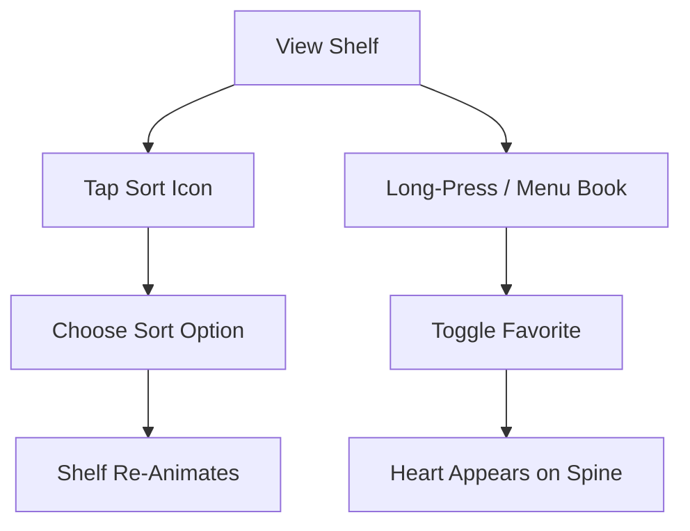

# EPIC-006: Shelf Organization & Sorting

**Status**: Draft  
**Priority**: Should Have  
**Estimate**: S  
**Target Release**: MVP

---

## 👤 Personas Impacted

- **Primary**: Julia — The Young Author — *She wants her shelf organized her way: favorites first, alphabetical, or by recent reads.*
- **Secondary**: Mãe da Julia — The Caring Parent — *She likes seeing her daughter curate her own space.*

## 🎯 Business Value

Organization is a form of play for children. Allowing Julia to sort and favorite her books increases time spent on the shelf, deepens ownership, and supports the "collection" job. It also makes the shelf more usable as the library grows beyond 5–10 books.

## 📊 Success Metrics (KPIs)

- **Primary KPI**: >70% of users with 3+ books use a non-default sorting option or mark favorites.
- **Secondary KPIs**:
  - Favorite marking used by >40% of active users.
  - Sorting change frequency ≥1 per week for engaged users.

## 📝 Description

Enable Julia to organize her bookshelf by three modes: **Alphabetical**, **Favorites**, and **Recently Read**. She can also mark books as "Favorites" (a heart or star), which affects sort order and can be filtered. The shelf layout updates smoothly when sorting changes.

## 🔗 Dependencies

- **Blocked by**: EPIC-001 (Bookshelf Core) — needs shelf UI and data model.
- **Blocks**: None.
- **Related to**: EPIC-010 (Platform Foundation) — reading history needed for "Recently Read."

## ✅ Scope (In)

- Sort options: Alphabetical (A–Z), Favorites First, Recently Read First.
- "Mark as Favorite" toggle on book (from shelf or cover view).
- Visual indicator for favorited books on spine (heart icon or gold accent).
- Smooth re-sort animation when option changes.
- Default sort: Recently Read (or Newest for MVP if history not ready).
- Sort selection UI: simple, kid-friendly icons + text.

## ❌ Scope (Out)

- **Custom categories or tags** — Could Have for V1.2 (e.g., "Fantasy," "School").
- **Manual drag-and-drop reordering** — Could Have for V1.2; complex on mobile.
- **Multiple shelves / collections** — Won't Have until V2.0.
- **Reading lists or queues** — Could Have for V1.2.

## 📋 Business Rules

1. Favorites MUST be per-user and private; no public visibility.
2. Recently Read sort MUST update immediately after a reading session ends.
3. Alphabetical sort MUST ignore articles ("A," "An," "O," "A" in Portuguese) for titles.
4. Sort preference MUST persist across sessions.

## 🚦 Non-Functional Requirements

- **Performance**: Re-sort animation completes in <500ms for up to 50 books.
- **Accessibility**: Sort controls are labeled and keyboard-accessible.

## 🗺️ High-Level User Flow

## 📖 Feature Scenarios (BDD)

### Feature: Sort Bookshelf

**Scenario**: Sort by favorites
- **Given** Julia has 5 books, 2 favorited
- **When** she chooses "Favorites"
- **Then** the 2 favorite books appear first

**Scenario**: Mark a favorite
- **Given** Julia is viewing a book cover
- **When** she taps the heart
- **Then** the book is favorited and the heart remains filled

## 🧪 Acceptance Criteria (Epic Level)

- [ ] Three sort options available: Alphabetical, Favorites, Recently Read.
- [ ] Favorite toggle on each book.
- [ ] Visual favorite indicator on spine.
- [ ] Smooth animation when sort changes.
- [ ] Sort preference persists across sessions.

## ⚠️ Risks and Assumptions

- **Risk**: "Recently Read" requires reading history tracking that may not be ready for MVP. → **Mitigation**: Default to "Newest First" for MVP if history tracking is incomplete; switch to Recently Read in V1.1.

## 🔄 PM Decomposition Hints

- Split by sort type: alphabetical, favorites, recently read.
- Split by interaction: sort menu, favorite toggle, persistence.
- One story for animation/rendering performance.

---

*Last updated: 2026-05-07*  
*Owner: ProductOwner*
