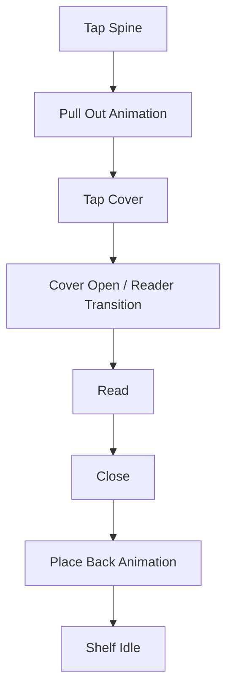

# EPIC-007: Animations & Delight

**Status**: Draft  
**Priority**: Should Have  
**Estimate**: M  
**Target Release**: MVP

---

## 👤 Personas Impacted

- **Primary**: Julia — The Young Author — *Animations make the app feel alive and magical.*
- **Secondary**: Mãe da Julia — The Caring Parent — *Polish signals quality and safety.*

## 🎯 Business Value

Animations are not decorative — they are core to the product's differentiation. The tactile feeling of pulling a book from the shelf and placing it back transforms a web app into a "digital toy." Delight directly correlates with emotional attachment, session length, and word-of-mouth among children.

## 📊 Success Metrics (KPIs)

- **Primary KPI**: User-triggered animation completion rate >80% (users don't skip or abandon mid-animation).
- **Secondary KPIs**:
  - Session time positively correlated with animation richness (observe in analytics).
  - Zero animation-related performance complaints in support tickets.

## 📝 Description

Design and implement the core animation system for Estante Digital, focusing on book-spine interactions: pulling out, opening cover, placing back, and shelf re-sorting. Animations must feel responsive, not sluggish; playful, not childish; and respect accessibility settings.

## 🔗 Dependencies

- **Blocked by**: EPIC-001 (Bookshelf Core) — needs shelf UI to animate.
- **Blocks**: None directly; enhances all other epics.
- **Related to**: EPIC-010 (Platform Foundation) — needs performant rendering layer.

## ✅ Scope (In)

- **Pull out**: Book spine scales and translates forward when tapped; subtle shadow growth.
- **Open cover**: Cover flips open (3D CSS transform) or fades to reader with page-curl transition.
- **Place back**: Reverse of pull-out; snaps to shelf with subtle bounce.
- **Shelf re-sort**: Books glide to new positions with staggered timing.
- **Page turn**: In reader, subtle slide or curl when navigating pages.
- **Idle micro-animations**: Subtle spine glow on favorite books; gentle dust-motes or sparkles (optional, theme-dependent).
- **prefers-reduced-motion**: All animations degrade gracefully to instant transitions or subtle fades.

## ❌ Scope (Out)

- **Full 3D WebGL bookshelf** — Won't Have; overkill for MVP, performance risk.
- **Physics-based ragdoll animations** — Won't Have; unnecessary complexity.
- **Sound effects** — Could Have for V1.2; requires audio asset pipeline and consent.
- **Haptic feedback** — Could Have for V1.2; limited web API support.

## 📋 Business Rules

1. All animations MUST be interruptible; tapping again cancels and proceeds.
2. Animation duration SHOULD be 200–400ms for interactions; re-sort may be 500–800ms.
3. Reduced-motion mode MUST disable all motion except opacity fades (accessibility).
4. Animations MUST not block user input or data saving.

## 🚦 Non-Functional Requirements

- **Performance**: Animations run at 60fps on target devices (mid-range mobile, 2019+).
- **Accessibility**: Respects `prefers-reduced-motion`; no seizures/flashing.
- **Battery**: Animations pause when app is backgrounded.

## 🗺️ High-Level User Flow

## 📖 Feature Scenarios (BDD)

### Feature: Pull Book from Shelf

**Scenario**: Julia taps a book
- **Given** the shelf is visible
- **When** Julia taps a spine
- **Then** the book animates forward in 300ms

**Scenario**: Reduced motion
- **Given** the device has reduced motion enabled
- **When** Julia taps a spine
- **Then** the book appears forward instantly with a fade

## 🧪 Acceptance Criteria (Epic Level)

- [ ] Pull-out animation is smooth and responsive.
- [ ] Cover-to-reader transition is immersive.
- [ ] Place-back animation mirrors pull-out.
- [ ] Re-sort animation is staggered and satisfying.
- [ ] All animations respect `prefers-reduced-motion`.
- [ ] 60fps maintained on mid-range mobile devices.

## ⚠️ Risks and Assumptions

- **Risk**: Too many simultaneous animations cause frame drops. → **Mitigation**: Limit concurrent animations; use CSS transforms only (GPU-accelerated).
- **Assumption**: Children value speed over elaborate effects. → **Validation**: Keep animations short; test with users.

## 🔄 PM Decomposition Hints

- Split by animation: pull-out, open-cover, place-back, re-sort, page-turn.
- Split by system: animation engine/timing, reduced-motion handling, performance testing.
- One spike story to prototype and benchmark chosen tech (CSS vs. Framer Motion vs. GSAP).

---

*Last updated: 2026-05-07*  
*Owner: ProductOwner*
