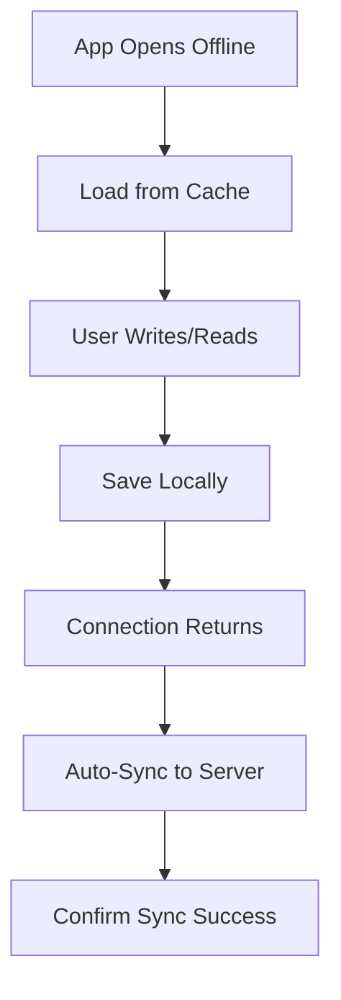

# EPIC-008: Offline Writing & Reading

**Status**: Draft  
**Priority**: Could Have  
**Estimate**: L  
**Target Release**: V1.1

---

## 👤 Personas Impacted

- **Primary**: Julia — The Young Author — *She writes in the car, at grandparents' house, or places with bad Wi-Fi.*
- **Secondary**: Mãe da Julia — The Caring Parent — *She wants the app to work reliably even when traveling.*

## 🎯 Business Value

Children do not have reliable internet everywhere. Offline capability removes a major friction point and unlocks usage in cars, planes, rural areas, and shared devices without mobile data. It increases session frequency and reduces abandonment due to "no connection" errors. It also signals quality and reliability to parents.

## 📊 Success Metrics (KPIs)

- **Primary KPI**: 0 data loss incidents reported during offline sessions.
- **Secondary KPIs**:
  - >20% of writing sessions occur while offline (indicates trust and reliance).
  - Offline-to-online sync success rate >99%.

## 📝 Description

Enable Julia to write and read her own books without an internet connection. Changes are stored locally (e.g., IndexedDB, localStorage, or Service Worker cache) and synchronized to the server when connectivity returns. The experience must feel seamless — Julia shouldn't need to know she's offline.

## 🔗 Dependencies

- **Blocked by**: EPIC-002 (Reading), EPIC-003 (Writing), EPIC-010 (Platform Foundation).
- **Blocks**: None.
- **Related to**: EPIC-009 (Parent Dashboard) — offline activity must eventually sync for parent view.

## ✅ Scope (In)

- Service Worker registering core assets for offline app load.
- Local storage of book content (chapters, text, metadata) for own books.
- Offline writing: new drafts and edits saved locally.
- Offline reading: all "published" books available offline automatically.
- Automatic sync when connectivity returns (conflict resolution: last-write-wins with visual indicator).
- Offline indicator: subtle, non-intrusive icon when offline (not a blocking error).
- Graceful degradation: if sync fails, local data remains safe and retry is automatic.

## ❌ Scope (Out)

- **Offline import of new files** — Won't Have; file import requires server processing for MVP.
- **Offline cover designer image upload** — Won't Have; image processing may need server.
- **Real-time multi-device sync** — Could Have for V2.0; MVP syncs on reconnect only.
- **Conflict resolution UI for manual merge** — Could Have for V2.0; V1.1 uses last-write-wins.

## 📋 Business Rules

1. User MUST be able to open the app and access the shelf even offline (cached assets).
2. Writing offline MUST autosave locally with the same frequency as online.
3. When connectivity returns, sync MUST happen automatically without user action.
4. If a conflict occurs (device edited while offline and server has newer version), last-write-wins WITH a subtle "merged" indicator.
5. No data loss is acceptable; local data MUST be treated as authoritative until confirmed synced.

## 🚦 Non-Functional Requirements

- **Performance**: Local save <100ms; sync on reconnect <5s for average book size.
- **Storage**: Local storage limit communicated to user; graceful handling when limit reached.
- **Reliability**: 0 data loss tolerance; extensive QA on network interruption scenarios.

## 🗺️ High-Level User Flow

## 📖 Feature Scenarios (BDD)

### Feature: Write Offline

**Scenario**: Julia writes without Wi-Fi
- **Given** Julia has no internet
- **When** she writes 2 chapters
- **Then** the content is saved locally

**Scenario**: Sync on reconnect
- **Given** Julia wrote offline
- **When** Wi-Fi returns
- **Then** her new chapters sync to the server automatically

**Scenario**: Read offline
- **Given** Julia has no internet
- **When** she opens a published book
- **Then** the full book is readable from local cache

## 🧪 Acceptance Criteria (Epic Level)

- [ ] App loads and shelf renders offline.
- [ ] Writing works offline with local autosave.
- [ ] Reading works offline for published books.
- [ ] Auto-sync on reconnect with success indicator.
- [ ] Conflict resolution does not lose data.
- [ ] Offline state is subtly communicated, not alarming.

## ⚠️ Risks and Assumptions

- **Risk**: IndexedDB / localStorage has size limits and may be cleared by browser/OS. → **Mitigation**: Use persistent storage request; warn user if near limit; implement export/backup.
- **Assumption**: Last-write-wins conflict resolution is acceptable for a single-user app. → **Validation**: True for single-user context; no collaboration planned.

## 🔄 PM Decomposition Hints

- Split by capability: offline reading, offline writing, sync engine.
- Split by layer: Service Worker, local data store, conflict resolution, UI indicators.
- One spike story to evaluate PWA / Service Worker / IndexedDB strategy.
- One story for QA edge cases (interrupted sync, storage full, browser deletion).

---

*Last updated: 2026-05-07*  
*Owner: ProductOwner*
