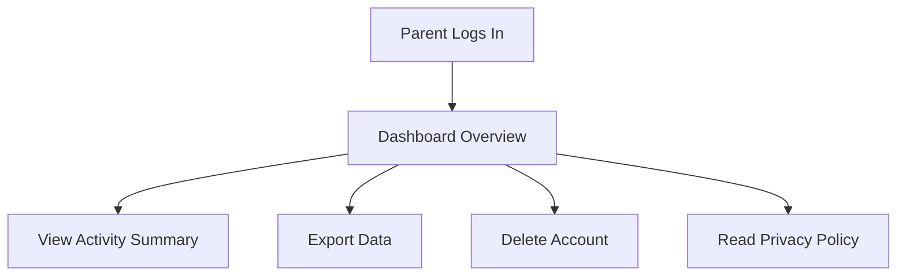

# EPIC-009: Parent Dashboard & Safety Controls

**Status**: Draft  
**Priority**: Could Have  
**Estimate**: M  
**Target Release**: V1.1

---

## 👤 Personas Impacted

- **Primary**: Mãe da Julia — The Caring Parent — *She wants transparency and control over her child's data and activity.*
- **Secondary**: Professora Ana — The Educator — *She needs confidence in privacy compliance to recommend the app.*

## 🎯 Business Value

Parent trust is a gatekeeper for adoption. A visible, transparent parent dashboard addresses the #1 concern of parents: "What is my child doing, and is it safe?" It reduces support burden, increases NPS, and creates a differentiation from apps that hide behind black-box privacy policies.

## 📊 Success Metrics (KPIs)

- **Primary KPI**: >60% of parent accounts access the dashboard at least once in the first 30 days.
- **Secondary KPIs**:
  - Parent confidence score (onboarding survey) ≥4/5.
  - Zero GDPR/COPPA complaints in Year 1.

## 📝 Description

Provide a password-protected parent dashboard accessible from the same app/web interface (or via a separate login if architecture demands). Parents can view high-level activity (number of books, time spent), export their child's data, and delete the account if desired. The dashboard is simple, transparent, and reassuring — not surveillance.

## 🔗 Dependencies

- **Blocked by**: EPIC-010 (Platform Foundation) — needs auth, data model, audit logs.
- **Blocks**: None.
- **Related to**: EPIC-008 (Offline Mode) — offline activity must sync before visible in dashboard.

## ✅ Scope (In)

- Parent login linked to child account (setup during onboarding or later).
- Dashboard view: list of child's books (titles only; not full content unless child shares).
- Activity summary: time spent, books created, books read (aggregated, not minute-by-minute tracking).
- Data export: download all child's books and metadata as a ZIP.
- Account deletion: parent can delete child account and all data (GDPR/COPPA "right to be forgotten").
- Privacy policy and data usage explanation (plain language, not legalese).
- Contact/support link for privacy questions.

## ❌ Scope (Out)

- **Full content surveillance** (reading every story) — Won't Have; violates trust and child autonomy.
- **Screen time limits or remote lock** — Won't Have; out of scope, parent OS tools exist.
- **Real-time location tracking** — Explicitly out of vision.
- **Social monitoring or friend lists** — Not applicable; no social features.
- **In-app messaging from parent to child** — Could Have for V2.0.

## 📋 Business Rules

1. Dashboard access MUST require re-authentication (not auto-logged in with child's session).
2. Data export MUST include all user-generated content and metadata in an open format (JSON + TXT/EPUB).
3. Account deletion MUST be irreversible and complete within 30 days; confirmation required.
4. Activity data MUST be retained no longer than 12 months; automatic purging beyond that.
5. No third-party analytics or tracking pixels on the parent dashboard.

## 🚦 Non-Functional Requirements

- **Security**: Parent login uses strong auth (password + optional 2FA); sessions time out.
- **Compliance**: GDPR Article 15 (access), Article 17 (deletion), COPPA parental consent and access.
- **Accessibility**: Dashboard meets WCAG 2.1 AA.
- **Privacy**: Activity summaries are aggregated; no granular logging of page-turns or keystrokes.

## 🗺️ High-Level User Flow

## 📖 Feature Scenarios (BDD)

### Feature: View Activity Summary

**Scenario**: Parent checks activity
- **Given** a parent is logged in
- **When** they open the dashboard
- **Then** they see: "Julia has written 3 books and read 2 this week."

**Scenario**: Export data
- **Given** a parent wants a backup
- **When** they tap "Download All Data"
- **Then** a ZIP file with all books and metadata is generated and downloaded

**Scenario**: Delete account
- **Given** a parent wants to delete the account
- **When** they request deletion and confirm
- **Then** all data is queued for deletion and a confirmation email is sent

## 🧪 Acceptance Criteria (Epic Level)

- [ ] Parent can log in to a separate dashboard.
- [ ] Dashboard shows aggregated activity (books, time) — not surveillance.
- [ ] Data export generates a complete, open-format archive.
- [ ] Account deletion request initiates full data purge.
- [ ] Privacy policy is plain-language and visible.
- [ ] Dashboard is secure and inaccessible from child's session.

## ⚠️ Risks and Assumptions

- **Risk**: Parents may find aggregated data insufficient and demand full surveillance. → **Mitigation**: Position product as trust-based, not surveillance-based; offer export as a way to review content offline.
- **Assumption**: A parent email is collected during onboarding. → **Validation**: Ensure onboarding flow captures verifiable parent email for COPPA.

## 🔄 PM Decomposition Hints

- Split by feature: login, activity view, data export, account deletion, privacy policy display.
- Split by compliance: GDPR access story, GDPR deletion story, COPPA consent story.
- One story for email/notification plumbing (export ready, deletion confirmation).

---

*Last updated: 2026-05-07*  
*Owner: ProductOwner*
