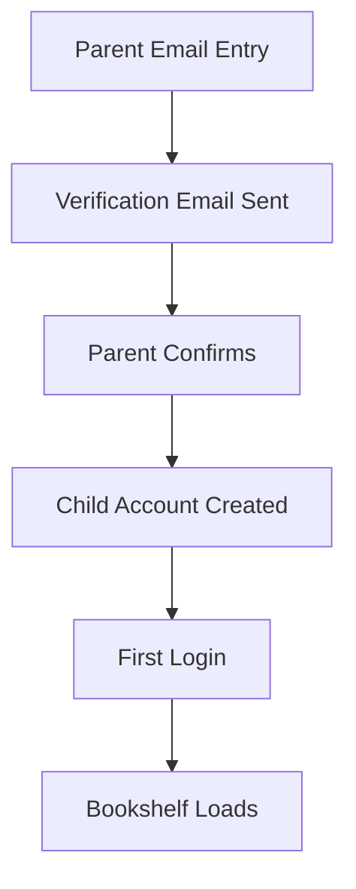

# EPIC-010: Platform Foundation (Auth, Storage, Data Model, Base Infra)

**Status**: Draft  
**Priority**: Must Have  
**Estimate**: XL  
**Target Release**: MVP

---

## 👤 Personas Impacted

- **Primary**: Julia — The Young Author — *Needs a safe, fast, and reliable account.*
- **Secondary**: Mãe da Julia — The Caring Parent — *Needs confidence in data security and privacy.*

## 🎯 Business Value

This is the foundational epic upon which all others depend. Without secure authentication, a robust data model, and reliable storage, no book can be written, no shelf can be rendered, and no parent can trust the platform. It is invisible to users but critical to every KPI.

## 📊 Success Metrics (KPIs)

- **Primary KPI**: Zero credential breaches or unauthorized data access in Year 1.
- **Secondary KPIs**:
  - API response time P95 <500ms for authenticated endpoints.
  - Uptime >99.5% for auth and core CRUD APIs.
  - Account creation completion rate >85% (friction-free onboarding).

## 📝 Description

Establish the technical foundation of Estante Digital: user authentication with COPPA/GDPR-safe onboarding, a data model for users/books/chapters/assets, file storage, and core API services. This epic ensures the platform is secure, scalable, and compliant before any user-facing features ship.

## 🔗 Dependencies

- **Blocked by**: None. This is the foundation.
- **Blocks**: ALL other epics (EPIC-001 through EPIC-009).
- **Related to**: All.

## ✅ Scope (In)

- **Authentication & Onboarding**:
  - COPPA-compliant registration: child account linked to verified parent email.
  - Session management (JWT or secure cookie-based).
  - Passwordless or simple password options (child-friendly but secure).
  - Logout and session timeout.
- **Data Model**:
  - Users (child + parent link, minimal PII).
  - Books (metadata, status: draft/published, timestamps).
  - Chapters (order, content references).
  - Assets (covers, spines, edges, uploaded images).
  - Reading progress (book, last position, percentage).
  - Activity logs (aggregated for parent dashboard; minimal granularity).
- **Storage**:
  - Object storage for images/assets (S3-compatible or equivalent).
  - Database for relational data (PostgreSQL or equivalent).
  - CDN for static assets and book covers.
- **API Layer**:
  - RESTful or GraphQL API for all CRUD operations.
  - Rate limiting and input validation.
  - Error handling with child-friendly messages propagated to UI.
- **Infrastructure**:
  - CI/CD pipeline.
  - Automated backups (daily).
  - SSL/TLS everywhere.
  - Environment separation (dev/staging/prod).

## ❌ Scope (Out)

- **Advanced analytics / BI pipelines** — Could Have for V2.0; basic product analytics only for MVP.
- **Multi-region deployment** — Could Have for V2.0; single region for MVP.
- **Machine learning / content recommendation** — Won't Have; no algorithmic curation.
- **Real-time collaboration / WebSockets** — Won't Have; single-user app.
- **Third-party OAuth (Google, Facebook)** — Won't Have for MVP; simplified auth preferred for child safety.

## 📋 Business Rules

1. Parent email MUST be verified before child account is activated (COPPA).
2. No email marketing or notifications to child accounts.
3. Passwords (if used) MUST meet minimum strength; passwordless options MUST be secure (magic link to parent email).
4. All data transfers MUST use TLS 1.2+.
5. Asset storage MUST separate user content by tenant/account with no cross-access.
6. PII MUST be minimal: store only what's legally required and functionally necessary.

## 🚦 Non-Functional Requirements

- **Performance**: API P95 <500ms; database queries <100ms for typical shelf load.
- **Security**: OWASP Top 10 mitigation; regular dependency scanning; penetration test before public launch.
- **Compliance**: COPPA (US), GDPR (EU/LGPD Brazil), data minimization, parental consent workflow.
- **Scalability**: Support 10,000 concurrent users on MVP infrastructure.
- **Availability**: 99.5% uptime; daily backups; recovery point objective (RPO) <24h.
- **Observability**: Application logging, error tracking, uptime monitoring.

## 🗺️ High-Level User Flow

## 📖 Feature Scenarios (BDD)

### Feature: COPPA-Compliant Onboarding

**Scenario**: Parent sets up account
- **Given** a parent enters their email and child's first name
- **When** they confirm via email link
- **Then** the child account is activated and the parent is linked

**Scenario**: Invalid email
- **Given** a parent enters a malformed email
- **When** they submit
- **Then** they see a friendly error: "Please check the email address."

**Scenario**: Session timeout
- **Given** Julia is inactive for 30 minutes
- **When** she tries to save
- **Then** she is prompted to log in again

## 🧪 Acceptance Criteria (Epic Level)

- [ ] COPPA-compliant onboarding with parent email verification.
- [ ] Secure authentication and session management.
- [ ] Data models defined and migrated.
- [ ] CRUD APIs for books, chapters, assets.
- [ ] File storage with secure, isolated access.
- [ ] SSL/TLS, rate limiting, and input validation.
- [ ] Automated backups and monitoring.

## ⚠️ Risks and Assumptions

- **Risk**: COPPA/GDPR compliance is complex and varies by jurisdiction. → **Mitigation**: Legal review of onboarding flow; data minimization by design.
- **Assumption**: A single authentication model works for both child and parent when needed. → **Mitigation**: Design role-based access from day one.

## 🔄 PM Decomposition Hints

- Split by domain: auth/onboarding, book data model, asset storage, API endpoints.
- Split by operation: create book, read book list, update book, delete book.
- One spike story to decide auth strategy (custom vs. Auth0 vs. Firebase Auth with COPPA compliance).
- One story for database schema design and migration.
- One story for DevOps: deployment, backups, monitoring.

---

*Last updated: 2026-05-07*  
*Owner: ProductOwner*
