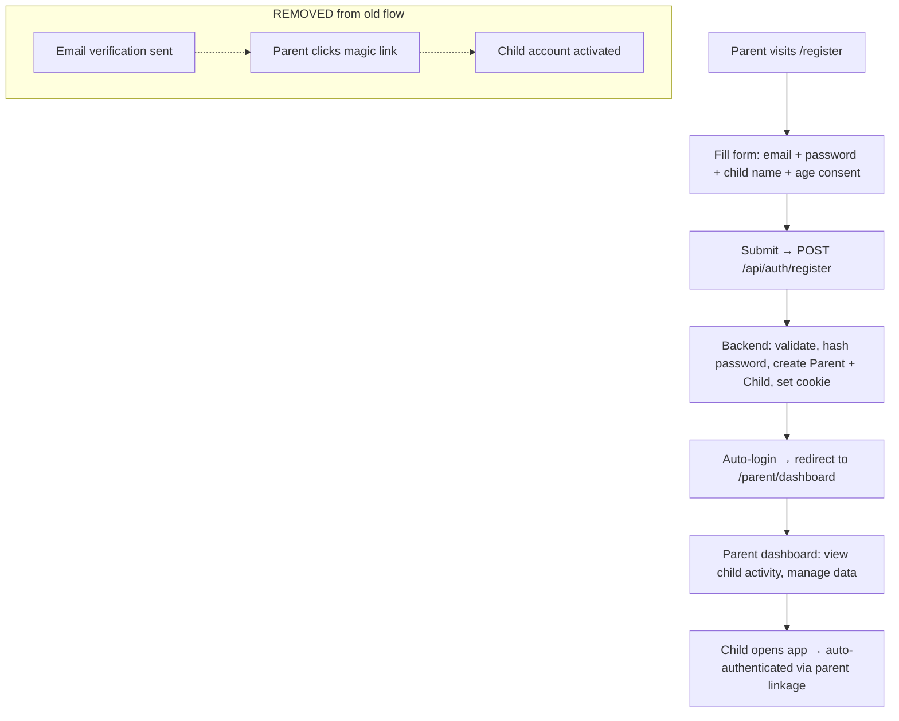

# EPIC-011: Simplified Parent-First Onboarding

**Status**: In Progress  
**Priority**: Must Have  
**Estimate**: L  
**Target Release**: MVP

---

## 👤 Personas Impacted

- **Primary**: Mãe da Julia — The Caring Parent — *Needs a fast, trustworthy registration flow that doesn't block her child from using the app.*
- **Secondary**: Julia — The Young Author — *Benefits from frictionless access once her parent sets up the account.*

## 🎯 Business Value

The original magic-link onboarding flow (STORY-001/002) was over-engineered for the MVP context. It introduced email deliverability risk, rate-limiting complexity, token management overhead, and a multi-step parent confirmation flow that created friction before the child could use the product. With a closed beta of 10 families and no public launch, full COPPA-grade email verification is unnecessary overhead. This epic pivots to a **parent-first registration** model that eliminates magic links entirely, replaces them with a simple email + password + age-consent checkbox flow, and uses cookie-based sessions for security. The result: faster time-to-value, fewer moving parts, significantly lower implementation risk, and a single implementation sprint instead of two.

**Key decision**: The COPPA requirement for "verified parental consent" is satisfied via an age-consent checkbox (self-attestation) rather than email magic-link verification. This is acceptable for closed beta (see STRATEGIC-PIVOT-ONBOARDING.md). The stricter email-verified mechanism can be reintroduced at V1.1 when scaling to public users.

## 📊 Success Metrics (KPIs)

- **Primary KPI**: Parent registration completion rate >90% (measured as: started form → successful registration → redirected to parent dashboard).
- **Secondary KPIs**:
  - Parent session creation time <1s (from `/api/auth/register` to JWT cookie set).
  - Zero critical security vulnerabilities in the new registration flow (OWASP Top 10).
  - Parent login success rate >95% on first attempt.
  - Child onboarding flow (STORY-052) functional with zero regressions after pivot.

## 📝 Description

Pivot from the original COPPA-compliant magic-link onboarding flow (STORY-001 + STORY-002) to a simplified **parent-first registration** model. The key change: instead of the parent entering their email, receiving a magic link, clicking it to verify, and then having the child account activated — the parent now registers directly with email + password + age-consent checkbox, receives an immediate cookie-based JWT session, and the child account is activated inline.

This eliminates:
- Nodemailer SMTP dependency and email deliverability risk
- 72-hour token expiry and resend-verification logic
- Magic link routes, VerifyPage, ParentSetupPasswordPage
- Separate registration → verification → activation lifecycle
- 6 backend modules (email-service, verification tokens, etc.) and 3 frontend pages

This enables:
- Single-step registration (POST /api/auth/register)
- Cookie-based JWT sessions (httpOnly, secure, sameSite)
- Auto-login after registration
- Simplified parent dashboard access (STORY-052 revised)
- Child authentication adapted to work with the new parent-first model

## 🔗 Dependencies

- **Blocked by**: None (this is the new foundation).
- **Blocks**: STORY-052 (Parent Login & Dashboard — must be revised), all downstream user-facing stories.
- **Supersedes**: STORY-001 (COPPA-Compliant Parent-Child Onboarding — CANCELLED), STORY-002 (Child Authentication & Session Management — REVISED).
- **Related to**: EPIC-010 (Platform Foundation — partially superseded by this pivot).

## ✅ Scope (In)

- **Parent Registration**:
  - Direct email + password + ageConsent checkbox registration form.
  - Inline validation (Zod: email format, password min 4 chars, ageConsent required).
  - Post-registration: auto-login, cookie-based JWT session, redirect to parent dashboard.
  - No email verification step.
- **Parent Session**:
  - httpOnly JWT cookie for parent auth (secure, sameSite strict).
  - Parent login with email + password.
  - Session timeout: 30 minutes of inactivity.
  - Logout: clear cookie, revoke session.
- **Child Account Linkage**:
  - Child account created inline during parent registration (childFirstName field).
  - Child `isActive` defaults to `true` (no verification gate).
  - Child session managed separately from parent session.
- **Database Migration**:
  - Remove magic-link fields from Parent schema (verificationToken, verificationTokenExpires, isVerified).
  - Add password field (bcrypt-hashed), lastLogin timestamp, avatarSeed.
  - Add migration for existing or in-progress registrations.
- **Route Cleanup**:
  - Remove: POST /register (old), GET /verify/:token, POST /resend-verification, POST /child-login.
  - Keep/Add: POST /api/auth/register (new), POST /api/auth/login, POST /api/auth/logout, POST /api/auth/refresh, GET /api/auth/me.

## ❌ Scope (Out)

- **Email verification / magic links** — Removed entirely for MVP. Reintroduced at V1.1 if public launch requires stricter COPPA compliance.
- **Two-factor authentication** — Won't Have for MVP.
- **Multi-parent support per child** — Won't Have for MVP.
- **Parent social login (Google, Apple, etc.)** — Won't Have for MVP.
- **Password reset flow** — Deferred to V1.1 (covered by support intervention in beta).
- **Full COPPA email-verified parental consent** — Deferred to V1.1 when user base scales beyond closed beta.

## 📋 Business Rules

1. Parent MUST provide valid email, password (min 4 chars), and check the age-consent box to register.
2. Child account is created and activated immediately upon parent registration — no separate verification gate.
3. Parent session cookie MUST be httpOnly, secure (HTTPS only), and sameSite=strict.
4. No marketing emails, notifications, or upsells sent to parent email.
5. Password MUST be bcrypt-hashed before storage.
6. Age consent checkbox MUST be recorded in audit log for compliance trail.
7. Parent can delete child account and all associated data (GDPR/LGPD right to erasure).

## 🚦 Non-Functional Requirements

- **Performance**: Registration endpoint P95 <500ms; login P95 <300ms.
- **Security**: OWASP Top 10 mitigation; bcrypt cost factor 10; cookie flags httpOnly+secure+sameSite; input validation via Zod; rate limiting on login/register (10 req/min per IP).
- **Compliance**: Age consent checkbox logged for COPPA audit trail; data minimization (email + first name only); right to erasure (parent can delete account).
- **Scalability**: Support 10,000 parent accounts on MVP infrastructure.
- **Availability**: 99.5% uptime for auth endpoints.
- **Observability**: Structured logging (Pino) with hashed identifiers; session lifecycle events (CREATED, LOGOUT, EXPIRED).

## 🗺️ High-Level User Flow



## 📖 Feature Scenarios (BDD)

### Feature: Parent-First Registration

**Scenario**: Happy path — parent registers successfully
- **Given** a parent is on the registration page
- **When** they enter valid email, password (min 4 chars), child first name, and check the age consent box
- **Then** they are registered, auto-logged in, and redirected to the parent dashboard
- **And** a child account is created and activated
- **And** an httpOnly JWT cookie is set

**Scenario**: Invalid email format
- **Given** a parent is on the registration page
- **When** they enter "not-an-email" in the email field and submit
- **Then** they see a friendly validation error: "Please check the email address."
- **And** no account is created

**Scenario**: Password too short
- **Given** a parent is on the registration page
- **When** they enter a password with fewer than 4 characters
- **Then** they see a validation error: "Password must be at least 4 characters."
- **And** no account is created

**Scenario**: Age consent not checked
- **Given** a parent is on the registration page
- **When** they submit without checking the age consent checkbox
- **Then** they see a validation error: "You must confirm you are the parent or legal guardian."
- **And** no account is created

**Scenario**: Duplicate email registration
- **Given** a parent already has an active account
- **When** they try to register again with the same email
- **Then** they receive a 409 response: "An account with this email already exists. Please log in instead."
- **And** the login link is displayed

**Scenario**: Parent login
- **Given** a parent has registered
- **When** they enter email and password on the login page
- **Then** they are authenticated and redirected to the parent dashboard
- **And** a new JWT session cookie is set

**Scenario**: Rate limiting on registration
- **Given** a user attempts to register rapidly
- **When** they exceed 10 requests in 1 minute from the same IP
- **Then** they receive a 429 response: "Too many attempts. Please try again later."

## 🧪 Acceptance Criteria (Epic Level)

- [ ] Parent can register with email + password + child first name + age consent in a single step.
- [ ] Registration auto-authenticates the parent via httpOnly JWT cookie.
- [ ] Child account is created and activated inline (no verification gate).
- [ ] Parent can log in with email + password on `/login`.
- [ ] Parent can log out; cookie is cleared and session revoked.
- [ ] Old magic-link routes, pages, and dependencies are fully removed.
- [ ] Database migration runs cleanly (no orphaned magic-link fields).
- [ ] STORY-052 (Parent Dashboard) functions correctly with the new auth model.
- [ ] Rate limiting applied to both `/register` and `/login` endpoints.
- [ ] All forms meet WCAG 2.1 AA accessibility standards.
- [ ] Age consent checkbox state is logged for COPPA audit trail.

## ⚠️ Risks and Assumptions

| Risk | Likelihood | Impact | Mitigation |
|------|-----------|--------|------------|
| COPPA compliance gap: no email verification means we rely on self-attested age consent | Medium | High (if audited or if public launch happens) | Acceptable for closed beta of 10 families. Must reintroduce verified consent before public launch (V1.1). Audit trail of ageConsent checkbox provides defensible record. |
| Passwords stored with bcrypt but no password reset flow exists | Medium | Medium | Acceptable for closed beta (support can reset manually). Password reset is a V1.1 story. |
| Cookie-based auth requires same-origin deployment (Vite proxy in dev, same domain in prod) | Low | Medium | Already the architecture — single Express server serves API + static frontend. Document deployment constraint. |
| Existing STORY-001/002 code creates merge conflicts with pivot migration | Medium | Medium | Pivot migration (`003-pivot-parent-child.js`) is run first; STORY-001/002 branches are abandoned. |
| Child session management needs rework after parent-first model | Medium | Medium | STORY-052 revised to handle the new auth model; child auth inherits from parent linkage. |

**Assumptions**:
- Closed beta with 10 families validates the simpler flow without regulatory risk.
- Parents understand the age-consent checkbox and consent truthfully.
- Email + password is sufficient for parent identity (no 2FA needed for beta).
- Nodemailer/SMTP dependency can be fully removed from the codebase.

## 🔄 PM Decomposition Hints

The ProductManager decomposed this epic into 6 stories:

| Story ID | Title | Decomposition Hint |
|----------|-------|---------------------|
| STORY-056 | Backend Schema & Auth Migration | Split by layer: model → DAO → manager → router → migration. Pure backend, no UI. |
| STORY-057 | Direct Registration Flow (Frontend + Backend) | Split by platform: backend registration endpoint + frontend RegisterPage/RegisterForm rewrite. Cookie-based session. |
| STORY-058 | Parent Dashboard UI | Full parent dashboard with sidebar, activity view, data export, account deletion, privacy policy. |
| STORY-059 | Child Auth Adaptation | Adapt child login to work with parent-first model. Remove magic-link dependencies from child session. |
| STORY-060 | Parent Session Management & Security | Session timeout, refresh, logout, rate limiting, audit logging, secure cookie config. |
| STORY-061 | Integration Testing & QA Signoff | End-to-end flow validation: register → dashboard → child login → shelf. Regression testing on STORY-052. |

### Implementation Sequence
```
STORY-056 (Backend foundation) → STORY-057 (Registration flow)
                                → STORY-058 (Parent Dashboard)
                                → STORY-059 (Child Auth Adaptation)
                                → STORY-060 (Session Security)
                                → STORY-061 (Integration + QA)
```

**Parallelism**: STORY-058, 059, and 060 can be partially parallelized once STORY-056 and 057 provide the stable auth foundation.

---

## 📊 Story Status (Current)

| Story ID | Title | Points | Status | Notes |
|----------|-------|--------|--------|-------|
| STORY-056 | Backend Schema & Auth Migration | 5 | Implemented | Migration 003 run; tests pending |
| STORY-057 | Direct Registration Flow | 5 | Implemented | Frontend + backend done; tests pending |
| STORY-058 | Parent Dashboard UI | 5 | Code Reviewed | APPROVED with minor fixes |
| STORY-059 | Child Auth Adaptation | 3 | Pending | Not yet started |
| STORY-060 | Parent Session Management | 3 | Pending | Not yet started |
| STORY-061 | Integration Testing & QA | 3 | Pending | Depends on 056-060 |

---

*Created: 2026-06-11*  
*Owner: ProductOwner*  
*Status: In Progress — 3 of 6 stories implemented; 3 pending*
