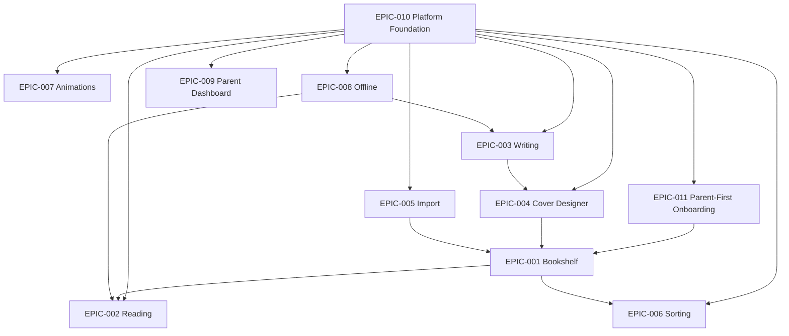

# Estante Digital — Epic Backlog Summary

> Single-source-of-truth for all epics, priorities, estimates, and dependencies.

---

## 📋 Epic Inventory

| ID | Title | Priority | Estimate | Target | Primary KPI |
|----|-------|----------|----------|--------|-------------|
| EPIC-010 | Platform Foundation | **Must Have** | XL | MVP | Zero breaches; API P95 <500ms |
| EPIC-011 | Simplified Parent-First Onboarding | **Must Have** | L | MVP | >80% parent completes registration in <2 min |
| EPIC-001 | Digital Bookshelf Core | **Must Have** | M | MVP | >70% interact with shelf within 10s |
| EPIC-002 | Book Reading Experience | **Must Have** | M | MVP | >50% read >3 min |
| EPIC-003 | Book Writing & Editing | **Must Have** | L | MVP | >40% create a book in 30 days |
| EPIC-004 | Cover, Spine & Edge Designer | **Must Have** | M | MVP | >50% custom covers at 60 days |
| EPIC-006 | Shelf Organization & Sorting | **Should Have** | S | MVP | >70% use non-default sort |
| EPIC-007 | Animations & Delight | **Should Have** | M | MVP | >80% animation completion |
| EPIC-005 | Book Import System | **Should Have** | M | V1.1 | >90% import success rate |
| EPIC-008 | Offline Writing & Reading | **Could Have** | L | V1.1 | 0 data loss incidents |
| EPIC-009 | Parent Dashboard & Safety | **Could Have** | M | V1.1 | >60% parent access in 30 days |

---

## 🔗 Dependency Graph

### Dependency Notes
- **EPIC-010 is the foundation**: All other epics depend on it. It must be completed first.
- **EPIC-011 depends on EPIC-010**: Parent-first onboarding needs platform foundation (auth, data model, audit logs).
- **EPIC-001 depends on EPIC-011**: Bookshelf needs authentication; parent must be registered before child can access the bookshelf.
- **EPIC-001 and EPIC-003 are the core UX**: They unlock the primary Jobs-To-Be-Done.
- **EPIC-004 depends on EPIC-003**: A book needs a title before a cover can be designed.
- **EPIC-002 depends on EPIC-001**: Reading is triggered from the bookshelf.
- **EPIC-005 (Import) depends on EPIC-001 and EPIC-002**: Imported books must appear on the shelf and be readable.
- **EPIC-008 (Offline) depends on EPIC-002 and EPIC-003**: Must be able to read and write before adding offline layers.
- **EPIC-009 (Parent Dashboard) depends on EPIC-011**: Parent dashboard features (data export, account deletion) now build on the EPIC-011 auth model. Original EPIC-009 auth scope is partially superseded by EPIC-011.

---

## 🎯 MoSCoW Summary

### Must Have (MVP Blockers)
1. **EPIC-010** — Platform Foundation
2. **EPIC-001** — Digital Bookshelf Core
3. **EPIC-003** — Book Writing & Editing
4. **EPIC-002** — Book Reading Experience
5. **EPIC-004** — Cover, Spine & Edge Designer
6. **EPIC-011** — Simplified Parent-First Onboarding *(supersedes parts of EPIC-009 and EPIC-010 onboarding/auth flows)*

### Should Have (MVP Enrichers)
6. **EPIC-006** — Shelf Organization & Sorting
7. **EPIC-007** — Animations & Delight
8. **EPIC-005** — Book Import System (moved to V1.1, but Should Have overall)

### Could Have (Post-MVP)
9. **EPIC-008** — Offline Writing & Reading
10. **EPIC-009** — Parent Dashboard & Safety Controls

### Won't Have (Explicitly Out of Scope)
- Public sharing / social features.
- Marketplace or paid content.
- School LMS integration.
- Real-time collaboration.
- AI-generated content.
- 3D WebGL bookshelf.
- Video/animated covers.

---

## 📊 Effort Distribution (T-Shirt)

| Size | Count | Epics |
|------|-------|-------|
| XS | 0 | — |
| S | 1 | EPIC-006 |
| M | 5 | EPIC-001, EPIC-002, EPIC-004, EPIC-007, EPIC-009 |
| L | 3 | EPIC-003, EPIC-008, EPIC-011 |
| XL | 1 | EPIC-010 |

---

## 🚦 Status Overview

| Status | Count | Epics |
|--------|-------|-------|
| Draft | 10 | EPIC-001 through EPIC-010 |
| Approved | 0 | Awaiting review |
| In Progress | 1 | EPIC-011 (3 stories done, 3 pending) |
| Done | 0 | Not started |

---

## 🗺️ Persona Coverage

| Persona | Primary Epics | Secondary Epics |
|---------|---------------|-------------------|
| Julia — The Young Author | EPIC-001, EPIC-002, EPIC-003, EPIC-004, EPIC-005, EPIC-006, EPIC-007, EPIC-008 | EPIC-009, EPIC-011 |
| Mãe da Julia — The Caring Parent | EPIC-009, EPIC-010, EPIC-011 | EPIC-001, EPIC-002, EPIC-007, EPIC-008 |
| Professora Ana — The Educator | EPIC-003, EPIC-005 | EPIC-009 |

---

*Last updated: 2026-05-07*  
*Owner: ProductOwner*  
*Next review: Every sprint retrospective*
