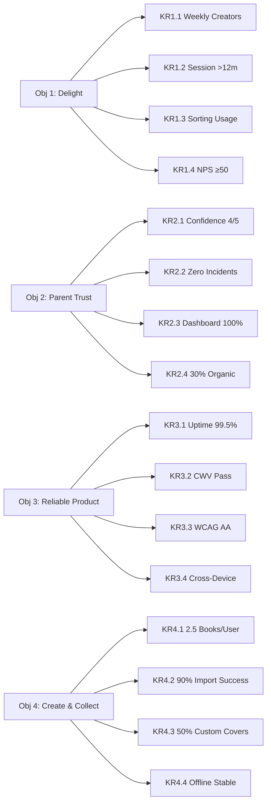

# Estante Digital — OKRs (Objectives & Key Results)

> OKRs are set for the first 12 months post-launch (MVP release).

---

## 🎯 Objective 1: Delight the Young Author

**Statement**: Create an experience so fun and intuitive that Julia chooses to write and read on Estante Digital over other apps or notebooks.

| Key Result | Target | Measurement |
|------------|--------|-------------|
| KR1.1 — Weekly Active Creators | 60% of active users write or import at least one book in their first 30 days. | Product analytics |
| KR1.2 — Session Engagement | Average session duration >12 minutes. | Product analytics |
| KR1.3 — Shelf Organization | 70% of users with 3+ books use a non-default sorting (favorites, alphabetical, recently read). | Product analytics |
| KR1.4 — Child Satisfaction | NPS from children (via parent survey) ≥50. | Quarterly survey |

---

## 🎯 Objective 2: Earn Parent Trust

**Statement**: Become the app parents recommend because it is safe, transparent, and genuinely supports their child's creativity.

| Key Result | Target | Measurement |
|------------|--------|-------------|
| KR2.1 — Parent Confidence | 80% of parents who respond to onboarding survey rate "safety/privacy confidence" as 4+ out of 5. | Onboarding survey |
| KR2.2 — Zero Incidents | Zero reported privacy breaches, COPPA complaints, or data misuse incidents in Year 1. | Compliance audit |
| KR2.3 — Data Transparency | 100% of parent dashboard features (view activity, export data, delete account) functional and documented. | Feature audit |
| KR2.4 — Organic Referral | 30% of new signups come from parent-to-parent referral or teacher recommendation. | Attribution survey |

---

## 🎯 Objective 3: Build a Reliable, Lovable Product

**Statement**: Deliver a technically solid, beautiful, and accessible product that works flawlessly for children and parents across devices.

| Key Result | Target | Measurement |
|------------|--------|-------------|
| KR3.1 — Uptime | 99.5% uptime for core shelf and reading experience. | Monitoring dashboard |
| KR3.2 — Performance | Core Web Vitals LCP <2.5s, INP <200ms on mid-range mobile devices. | Lighthouse / RUM |
| KR3.3 — Accessibility | WCAG 2.1 AA compliance for all core flows (shelf navigation, reading, writing). | Accessibility audit |
| KR3.4 — Cross-Device | 100% of MVP features functional on iOS Safari, Android Chrome, and desktop Chrome. | QA matrix |

---

## 🎯 Objective 4: Enable Creation & Collection

**Statement**: Make it effortless for children to build a personal library — whether by writing, importing, or designing.

| Key Result | Target | Measurement |
|------------|--------|-------------|
| KR4.1 — Books Created | Average of 2.5 original books created per active user in first 90 days. | Product analytics |
| KR4.2 — Imports Successful | >90% of supported file imports (TXT, PDF, EPUB) complete without user-reported errors. | Error tracking |
| KR4.3 — Cover Design | 50% of books have a custom cover or spine (not default). | Product analytics |
| KR4.4 — Offline Writing | Offline writing mode available and stable; 0 data loss incidents reported. | QA + support tickets |

---

## 🗓️ OKR Cadence

| Quarter | Focus |
|---------|-------|
| **Q1 (MVP Launch)** | Objective 1 + Objective 3 — Prove delight and reliability. |
| **Q2 (Post-MVP)** | Objective 2 + Objective 4 — Build trust and expand creation tools. |
| **Q3–Q4 (Scale)** | All 4 objectives — Optimize and prepare for educator channel. |

---

---

*Last updated: 2026-05-07*  
*Owner: ProductOwner*  
*Next review: 2026-08-07*
