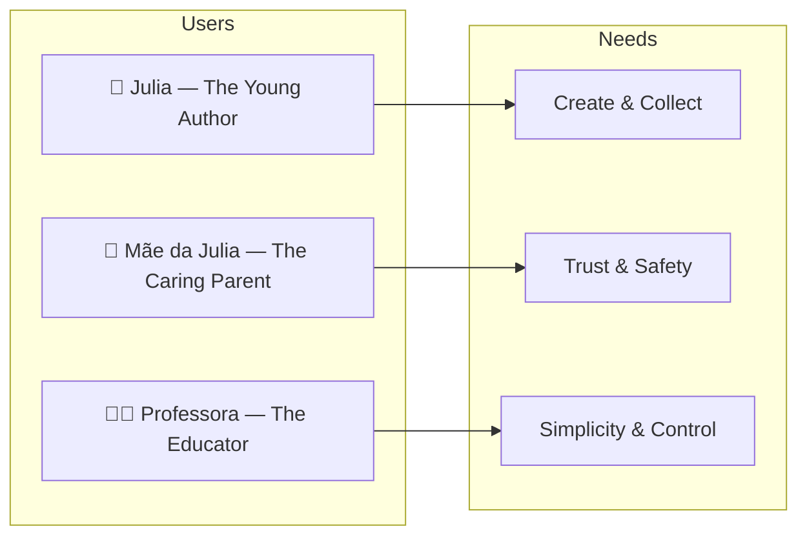

# Estante Digital — Personas & JTBD

> Every feature, epic, and design decision must trace back to at least one persona below.

---

## Persona Matrix

---

## 👧 Persona 1: Julia — The Young Author

**Archetype**: Creative 7th-grade student who loves reading fantasy and writes short stories in her notebook.

**Demographics**:
- **Age**: 12 years old
- **Grade**: 7th grade (ensino fundamental II)
- **Tech savvy**: Medium — uses Instagram/TikTok, plays Roblox, types essays at school.
- **Devices**: Family tablet, shared laptop, sometimes her mother's phone.
- **Reading habits**: Reads 2–3 books per month; enjoys series and fanfiction.

**Jobs-To-Be-Done (JTBD)**:
1. *When I finish writing a story in my notebook, I want to turn it into a real-looking book with a cool cover, so I can feel proud and show my mom.*
2. *When I download a free e-book or get a PDF from school, I want to put it on a beautiful shelf, not in a boring folder, so I enjoy finding it later.*
3. *When I open my bookshelf, I want it to look like MY room, with my favorite books up front, so reading feels fun, not like homework.*
4. *When I am bored on a car ride, I want to keep writing my story even without Wi-Fi, so I don't lose my ideas.*

**Pains**:
- Generic document tools (Word, Google Docs) feel like schoolwork, not creativity.
- e-Reader apps are boring and don't let her organize books "her way."
- She loses handwritten stories or can't share them digitally.
- She worries about "messing up" — needs undo and autosave.
- Some apps have scary pop-ups, ads, or strangers talking to her.

**Gains**:
- Wants to feel like a "real author" with a finished, bound-looking book.
- Loves personalization: colors, stickers, custom covers.
- Enjoys collecting and organizing things (shelf by color, favorites, etc.).
- Wants to read her own stories back and improve them.

**Typical Tools Used Today**:
- Physical notebooks and colored pens
- Google Docs (for school)
- Wattpad/Archive of Our Own (reads fanfiction; scared to post)
- Kindle app (for bought books; doesn't feel "hers")
- Canva (tries to make covers; too complex)

---

## 👩 Persona 2: Mãe da Julia — The Caring Parent

**Archetype**: Concerned parent who wants her daughter to have safe, productive screen time.

**Demographics**:
- **Age**: 38–45 years old
- **Occupation**: Professional, works from home or office
- **Tech savvy**: Medium — uses WhatsApp, Netflix, online banking; cautious about children's apps.
- **Devices**: Manages family devices; controls screen time.

**Jobs-To-Be-Done (JTBD)**:
1. *When Julia asks to use an app, I want to know it's safe and has no strangers or ads, so I don't have to hover over her shoulder.*
2. *When Julia shows me a story she wrote, I want to easily read it and save it, so I can encourage her and keep a memory.*
3. *When I set up the app, I want to know what data is collected and how to delete it, so I can protect her privacy.*

**Pains**:
- Most apps for kids are either too babyish or have hidden ads/social features.
- Doesn't understand privacy policies; distrusts apps that require accounts.
- Worries about screen addiction; wants apps that feel "active," not passive.
- Difficulty retrieving or backing up her child's creative work.

**Gains**:
- Wants to support her daughter's creativity and literacy.
- Appreciates transparency: knows what data exists and how to export it.
- Loves features that encourage reading and writing over scrolling.

**Typical Tools Used Today**:
- WhatsApp family groups
- Google Family Link (screen time control)
- Kindle / Apple Books (for her own reading)
- School parent portals

---

## 👩‍🏫 Persona 3: Professora Ana — The Educator

**Archetype**: Middle-school Portuguese/Arts teacher who wants a simple, safe tool for student creative writing projects.

**Demographics**:
- **Age**: 30–55 years old
- **Occupation**: Public or private school teacher
- **Tech savvy**: Medium — uses Google Classroom, basic LMS; avoids complex setups.
- **Class size**: 25–35 students.

**Jobs-To-Be-Done (JTBD)**:
1. *When I assign a creative writing project, I want students to produce something that looks finished and beautiful, so they feel proud and engaged.*
2. *When I review student work, I want to access it easily without managing accounts or passwords for 30 kids, so I save time.*
3. *When I recommend tools to parents, I want to be confident there are no privacy risks, so the school doesn't face compliance issues.*

**Pains**:
- Students submit messy Word docs or handwritten pages.
- Setting up 30 accounts on a platform is a nightmare.
- Worries about COPPA/GDPR compliance in school contexts.
- Existing tools are either too complex (Adobe) or too babyish (cartoon avatars).

**Gains**:
- Wants students to feel like "real authors" at the end of a project.
- Needs easy export/sharing of finished books for school events.
- Values platforms that require minimal IT support.

**Typical Tools Used Today**:
- Google Classroom / Microsoft Teams
- Canva (for posters; too hard for books)
- School printing services for "booklets"

---

## 🧭 Persona Priority

| Priority | Persona | Rationale |
|----------|---------|-----------|
| **P0** | Julia — The Young Author | Primary end-user; all UX decisions serve her first. |
| **P1** | Mãe da Julia — The Caring Parent | Gatekeeper for adoption; trust and safety must satisfy her. |
| **P2** | Professora Ana — The Educator | Growth channel; secondary for MVP, important for scaling. |

---

*Last updated: 2026-05-07*  
*Owner: ProductOwner*
