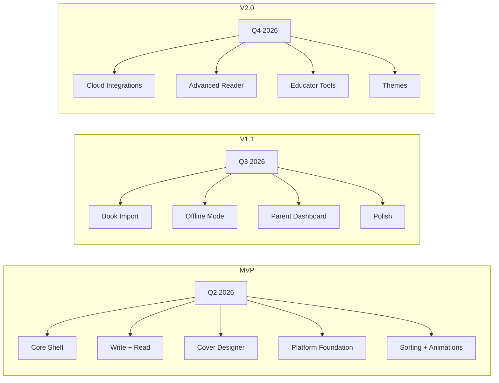
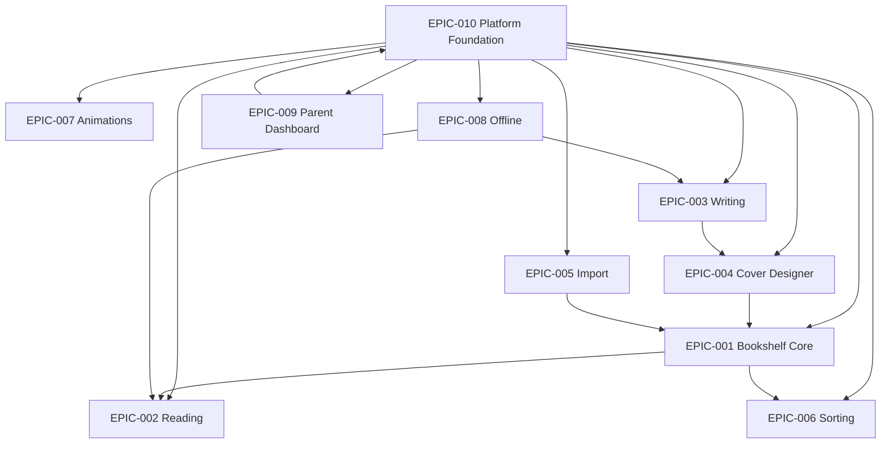

# Estante Digital — Product Roadmap

> Time horizons are quarterly; dates are approximate.

---

## 🗓️ Release Timeline

---

## 📦 MVP (Q2 2026) — "The Magical Shelf"

**Goal**: Prove that children love the bookshelf metaphor and will write/read on the platform.

| Epic | Title | Priority | Status |
|------|-------|----------|--------|
| EPIC-010 | Platform Foundation | Must Have | Foundation |
| EPIC-001 | Digital Bookshelf Core | Must Have | Core UX |
| EPIC-003 | Book Writing & Editing | Must Have | Core UX |
| EPIC-002 | Book Reading Experience | Must Have | Core UX |
| EPIC-004 | Cover, Spine & Edge Designer | Must Have | Delight |
| EPIC-007 | Animations & Delight | Should Have | Delight |
| EPIC-006 | Shelf Organization & Sorting | Should Have | Core UX |

**Definition of MVP Ready**:
- Julia can create a book, design a cover, and see it on her shelf.
- She can open and read the book end-to-end.
- Animations make the experience feel tactile and fun.
- Parent email is collected; COPPA-compliant onboarding.
- Platform is stable, secure, and performant.

**What MVP does NOT include**:
- Importing external books.
- Offline mode.
- Parent dashboard beyond basic account linking.
- Advanced reading features (notes, highlights).
- Cloud integrations.

---

## 📦 V1.1 (Q3 2026) — "My Complete Library"

**Goal**: Make Estante Digital the place for ALL of Julia's books, not just the ones she writes.

| Epic | Title | Priority | Status |
|------|-------|----------|--------|
| EPIC-005 | Book Import System | Should Have | Expansion |
| EPIC-008 | Offline Writing & Reading | Could Have | Reliability |
| EPIC-009 | Parent Dashboard & Safety Controls | Could Have | Trust |
| EPIC-007 (cont.) | Animation Polish & Sound | Could Have | Delight |

**Key Additions**:
- Import TXT, PDF, EPUB.
- Offline mode for writing and reading.
- Parent dashboard with activity export.
- Optional sound effects and richer animations.
- Custom shelf themes could be introduced.

---

## 📦 V2.0 (Q4 2026+) — "A Safe Creative World"

**Goal**: Scale to families and classrooms; become the trusted creative platform for young authors.

| Capability | Description | Persona |
|------------|-------------|---------|
| Cloud Import | Google Drive, Dropbox, OneDrive import | Julia |
| Advanced Reader | Highlights, notes, bookmarks, dictionary | Julia |
| Educator Tools | Class codes, group shelves, assignment support | Professora Ana |
| Shelf Themes | Multiple backgrounds, room customizations | Julia |
| Multi-Device Sync | Seamless sync across tablet, laptop, phone | Julia + Parent |
| Community (Private) | Share with family only via secure links | Julia + Parent |

**Out of scope for V2.0**:
- Public social features.
- Marketplace or paid content.
- AI-generated stories.
- School LMS integrations.

---

## 🗺️ Dependency Graph

---

## 🏁 Milestones

| Milestone | Target | Definition |
|-----------|--------|------------|
| **Foundation Ready** | Month 1 | Auth, DB, API, CI/CD operational. |
| **Shelf Preview** | Month 2 | Shelf renders, books appear, basic animations. |
| **Authoring Ready** | Month 2.5 | Writing + cover designer functional. |
| **MVP Launch** | Month 3 | All Must-Haves shipped; internal beta with 10 families. |
| **V1.1 Launch** | Month 5 | Import + offline + parent dashboard + 100 beta users. |
| **V2.0 Planning** | Month 6 | Educator research, advanced features scoped. |

---

*Last updated: 2026-05-07*  
*Owner: ProductOwner*  
*Next review: 2026-06-07*
