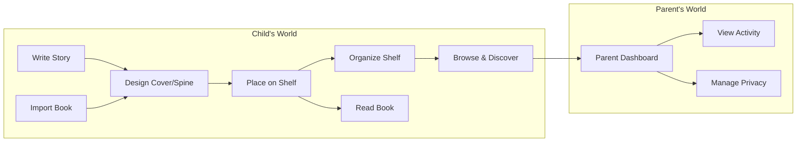

# Estante Digital — Product Vision & Strategy

> **Vision Statement**: To be the most delightful and safe digital bookshelf where children create, collect, and read their own stories — turning screen time into imagination time.

---

## 🎯 Product Vision

Estante Digital is a web-based, mobile-app-like experience designed specifically for pre-teen readers and aspiring young authors. It transforms the act of reading and writing into a tactile, playful digital experience — a bookshelf that feels as magical as a real one, with the superpowers of the digital world.

Unlike generic e-readers or document tools, Estante Digital is:
- **Child-first**: Every pixel, interaction, and flow is designed for a 12-year-old.
- **Creation-first**: Not just consumption — it empowers kids to *write* their own books.
- **Playful**: Books have spines, covers, and edges. The shelf is organized and animated. It feels like a *room*, not a file system.
- **Safe**: Privacy-by-design for minors, with no social pressure, no ads, and no tracking.

---

## 📐 Strategic Pillars

| Pillar | Description | Differentiator |
|--------|-------------|----------------|
| **Playful Ownership** | Kids don't "upload files" — they *place books* on a shelf they can arrange, decorate, and personalize. | Tactile metaphors, not file metaphors. |
| **Create & Collect** | Native writing tools + import capability means the bookshelf grows with the child's creativity. | First platform built for *both* reading and authoring for kids. |
| **Safe Independence** | A space where a child feels independent, creative, and in control — without exposure to inappropriate content, ads, or social comparison. | Privacy-first, parent-respecting, no dark patterns. |
| **Magic in Details** | Animations for pulling books off the shelf, opening covers, and organizing. The UI rewards curiosity and exploration. | Delight-by-design, not utility-by-design. |

---

## 🧒 Who We Serve

**Primary**: Creative pre-teens (10–14) who love reading, writing stories, or collecting things.
**Secondary**: Parents who want a safe, productive, and fun digital space for their children.
**Tertiary**: Teachers/educators looking for a simple, safe platform for student creative writing.

---

## 🏆 Jobs-To-Be-Done (Product Level)

> When I finish writing a story in my notebook, I want to turn it into a *real-looking book* on my own shelf, so I can feel proud and share it with my family.

> When I download a story I love, I want to place it on a beautiful shelf that feels like *my room*, not a boring folder, so I enjoy re-reading it.

> When I want to read, I want to pick a book the same way I do in real life — by seeing its spine and cover — so reading feels special, not like homework.

---

## 📊 Success Vision (3-Year Horizon)

- **Engagement**: Average session >15 min, 3+ sessions/week.
- **Creation**: 50%+ of active users have written at least one original book.
- **Satisfaction**: NPS from kids (via parent proxy) >50.
- **Safety**: Zero privacy incidents, 100% GDPR/COPPA compliance maintained.

---

## 🗺️ Product Vision Diagram

---

## 🚫 What's NOT Our Vision

- **Not a social network**: No public sharing, likes, comments, or follower counts.
- **Not a store**: No marketplace, no in-app purchases for content.
- **Not a school LMS**: No assignments, grades, or institutional workflows.
- **Not a generic document editor**: The writing tool is book-first, not page-first.

---

## 🔄 Evolution Logic

| Phase | Focus |
|-------|-------|
| **MVP** | Core shelf + write + read + basic cover. Prove engagement. |
| **V1.1** | Import + rich cover designer + sorting. Prove value for collectors. |
| **V2.0** | Offline mode + parent dashboard + expanded formats. Prove safety and trust. |

---

*Last updated: 2026-05-07*  
*Owner: ProductOwner*  
*Next review: 2026-08-07*
