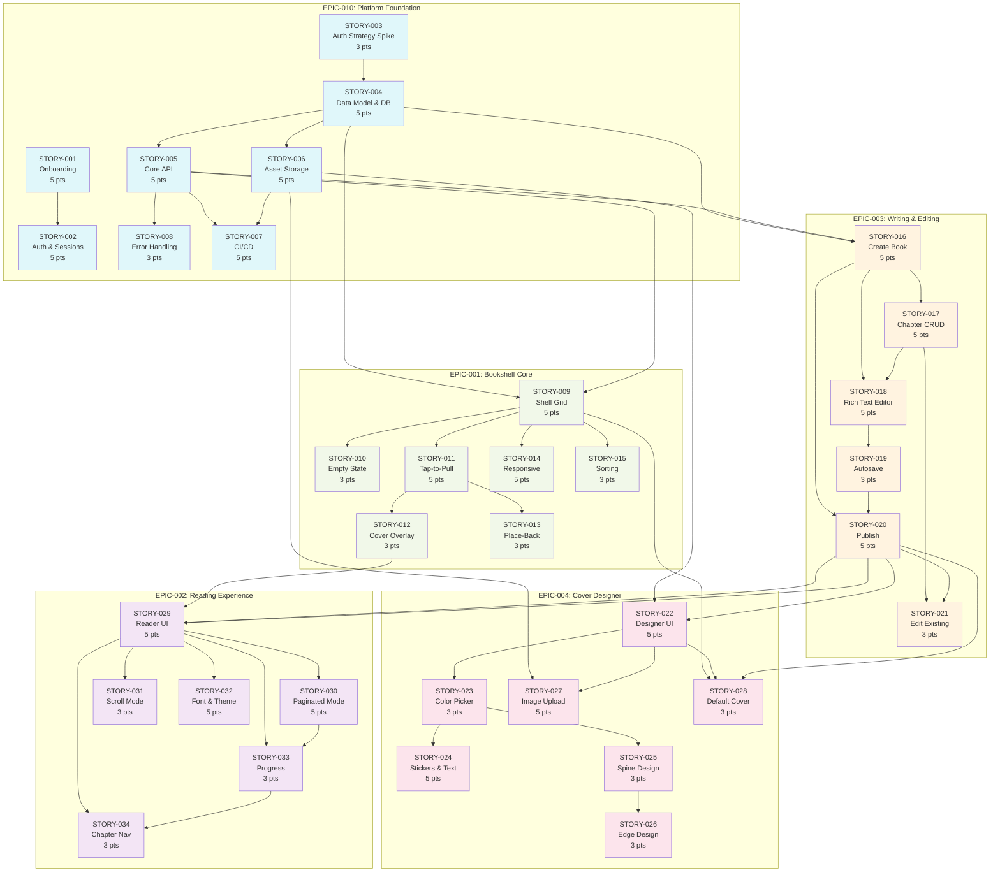

# Estante Digital — Backlog Summary (MVP)

> All Must-Have epics decomposed into sprint-ready stories. Total: **34 stories**, **140 story points**.

---

## 📊 Story Count & Points by Epic

| Epic | Title | Stories | Total Points |
|------|-------|---------|--------------|
| EPIC-010 | Platform Foundation | 8 | 36 |
| EPIC-001 | Digital Bookshelf Core | 7 | 27 |
| EPIC-003 | Book Writing & Editing | 6 | 26 |
| EPIC-004 | Cover, Spine & Edge Designer | 7 | 27 |
| EPIC-002 | Book Reading Experience | 6 | 24 |
| **Total** | | **34** | **140** |

---

## 📋 Full Story Inventory

### EPIC-010 — Platform Foundation (8 stories, 36 pts)

| ID | Title | Points | Priority | Primary Persona | Dependencies |
|----|-------|--------|----------|-----------------|-------------|
| STORY-001 | COPPA-Compliant Parent-Child Onboarding | 5 | Must Have | Mãe da Julia | None |
| STORY-002 | Child Authentication & Session Management | 5 | Must Have | Julia | STORY-001 |
| STORY-003 | Authentication Strategy Spike | 3 | Must Have | Mãe da Julia | None |
| STORY-004 | Core Data Model & Database Migrations | 5 | Must Have | Julia | STORY-003 |
| STORY-005 | Core REST API Scaffolding & CRUD Endpoints | 5 | Must Have | Julia | STORY-004 |
| STORY-006 | Secure Asset Storage & CDN Setup | 5 | Must Have | Mãe da Julia | STORY-004 |
| STORY-007 | DevOps, CI/CD & Deployment Pipeline | 5 | Must Have | Mãe da Julia | STORY-005, STORY-006 |
| STORY-008 | API Error Handling & Child-Friendly Messages | 3 | Must Have | Julia | STORY-005 |

### EPIC-001 — Digital Bookshelf Core (7 stories, 27 pts)

| ID | Title | Points | Priority | Primary Persona | Dependencies |
|----|-------|--------|----------|-----------------|-------------|
| STORY-009 | Bookshelf Grid Rendering | 5 | Must Have | Julia | STORY-004, STORY-005 |
| STORY-010 | Empty Bookshelf State | 3 | Must Have | Julia | STORY-009 |
| STORY-011 | Tap-to-Pull Animation | 5 | Must Have | Julia | STORY-009 |
| STORY-012 | Cover Overlay View | 3 | Must Have | Julia | STORY-011 |
| STORY-013 | Place-Back Animation | 3 | Must Have | Julia | STORY-011 |
| STORY-014 | Responsive Shelf Layout | 5 | Must Have | Julia | STORY-009 |
| STORY-015 | Default Sorting & Book Placement | 3 | Must Have | Julia | STORY-009 |

### EPIC-003 — Book Writing & Editing (6 stories, 26 pts)

| ID | Title | Points | Priority | Primary Persona | Dependencies |
|----|-------|--------|----------|-----------------|-------------|
| STORY-016 | Create a New Book | 5 | Must Have | Julia | STORY-004, STORY-005 |
| STORY-017 | Chapter-Based Writing & CRUD | 5 | Must Have | Julia | STORY-016 |
| STORY-018 | Simplified Rich Text Editor | 5 | Must Have | Julia | STORY-016, STORY-017 |
| STORY-019 | Autosave with Visual Indicator | 3 | Must Have | Julia | STORY-018 |
| STORY-020 | Publish Book to Shelf | 5 | Must Have | Julia | STORY-016, STORY-019 |
| STORY-021 | Edit Existing Book | 3 | Must Have | Julia | STORY-017, STORY-020 |

### EPIC-004 — Cover, Spine & Edge Designer (7 stories, 27 pts)

| ID | Title | Points | Priority | Primary Persona | Dependencies |
|----|-------|--------|----------|-----------------|-------------|
| STORY-022 | Cover Designer UI & Template Selection | 5 | Must Have | Julia | STORY-006, STORY-020 |
| STORY-023 | Color Picker & Background Customization | 3 | Must Have | Julia | STORY-022 |
| STORY-024 | Sticker Placement & Text on Cover | 5 | Must Have | Julia | STORY-023 |
| STORY-025 | Spine Auto-Generation & Manual Override | 3 | Must Have | Julia | STORY-023 |
| STORY-026 | Edge Design | 3 | Must Have | Julia | STORY-025 |
| STORY-027 | Image Upload for Cover | 5 | Must Have | Julia | STORY-006, STORY-022 |
| STORY-028 | Default Cover Generation | 3 | Must Have | Julia | STORY-009, STORY-022 |

### EPIC-002 — Book Reading Experience (6 stories, 24 pts)

| ID | Title | Points | Priority | Primary Persona | Dependencies |
|----|-------|--------|----------|-----------------|-------------|
| STORY-029 | Reader UI & Fullscreen View | 5 | Must Have | Julia | STORY-012, STORY-020 |
| STORY-030 | Paginated Reading Mode | 5 | Must Have | Julia | STORY-029 |
| STORY-031 | Continuous Scroll Reading Mode | 3 | Must Have | Julia | STORY-029 |
| STORY-032 | Font Size & Theme Settings | 5 | Must Have | Julia | STORY-029 |
| STORY-033 | Reading Progress Tracking | 3 | Must Have | Julia | STORY-029, STORY-030 |
| STORY-034 | Chapter Navigation | 3 | Must Have | Julia | STORY-029, STORY-033 |

---

## 🔗 Dependency Graph



---

## 🚦 Critical Path (Stories That Block Others)

The following stories are on the critical path; any delay here delays downstream MVP delivery:

| Story | Points | Blocks |
|-------|--------|--------|
| **STORY-003** — Auth Strategy Spike | 3 | STORY-004 (Data Model) |
| **STORY-004** — Core Data Model & DB Migrations | 5 | STORY-005 (API), STORY-006 (Storage), STORY-009 (Shelf), STORY-016 (Create Book) |
| **STORY-005** — Core REST API | 5 | STORY-007 (CI/CD), STORY-008 (Errors), STORY-009 (Shelf), STORY-016 (Create Book) |
| **STORY-006** — Secure Asset Storage | 5 | STORY-007 (CI/CD), STORY-022 (Designer), STORY-027 (Upload) |
| **STORY-009** — Bookshelf Grid Rendering | 5 | STORY-010, STORY-011, STORY-014, STORY-015, STORY-028 |
| **STORY-012** — Cover Overlay View | 3 | STORY-029 (Reader) |
| **STORY-018** — Rich Text Editor | 5 | STORY-019 (Autosave) |
| **STORY-019** — Autosave | 3 | STORY-020 (Publish) |
| **STORY-020** — Publish Book | 5 | STORY-021 (Edit), STORY-022 (Designer), STORY-028 (Default Cover), STORY-029 (Reader) |

### Critical Path Sequence (earliest possible)
```
STORY-003 → STORY-004 → STORY-005 → STORY-009
                                   ↘ STORY-006 → STORY-007
                                              ↘ STORY-022, STORY-027
```

- **Sprint 1–2**: STORY-003, STORY-001, STORY-004, STORY-005, STORY-006
- **Sprint 3–4**: STORY-002, STORY-007, STORY-008, STORY-009, STORY-016
- **Sprint 5–6**: STORY-011, STORY-012, STORY-013, STORY-010, STORY-014, STORY-015, STORY-017, STORY-018
- **Sprint 6–7**: STORY-019, STORY-020, STORY-021, STORY-022, STORY-023, STORY-028
- **Sprint 7–8**: STORY-024, STORY-025, STORY-026, STORY-027, STORY-029, STORY-030, STORY-031
- **Sprint 8–9**: STORY-032, STORY-033, STORY-034, buffer / polish / QA

---

## ✅ Splits Performed

All stories are ≤ 5 points following the 8-point max rule from PM-HANDOFF. The following topics were split to stay within the limit:

| Original Topic | Split Into | Rationale |
|----------------|-----------|-----------|
| Auth + Onboarding | STORY-001 (onboarding), STORY-002 (auth/sessions) | Different flows; onboarding is parent-facing, auth is child-facing. |
| Data model + API + Storage | STORY-004 (schema), STORY-005 (API), STORY-006 (storage) | Each is a distinct technical domain; combining would exceed 8 pts. |
| Writing lifecycle | STORY-016 (create), STORY-017 (chapters), STORY-018 (editor), STORY-019 (autosave), STORY-020 (publish), STORY-021 (edit) | Editor alone is complex; autosave and publish are independent. |
| Cover designer | STORY-022 (templates), STORY-023 (colors), STORY-024 (stickers), STORY-025 (spine), STORY-026 (edge), STORY-027 (upload) | Each design element is its own interaction-heavy feature. |
| Reading modes | STORY-029 (reader UI), STORY-030 (paginated), STORY-031 (scroll), STORY-032 (settings), STORY-033 (progress), STORY-034 (chapters) | Paginated vs scroll are different rendering engines; settings/progress are independent. |

---

## 📐 Definition of Ready Validation

All stories meet the PO handoff criteria:
- [x] Clear title and user-centric description
- [x] Referenced persona(s) from PERSONAS.md
- [x] Referenced parent epic (EPIC-XXX)
- [x] Acceptance criteria in GIVEN-WHEN-THEN format (3–8 per story)
- [x] NFRs identified and testable per story
- [x] Dependencies identified between stories
- [x] UI/UX notes included for user-facing stories

---

*Generated: 2026-05-08*  
*Decomposed by: ProductManager*  
*Status: Ready for Architect planning*
