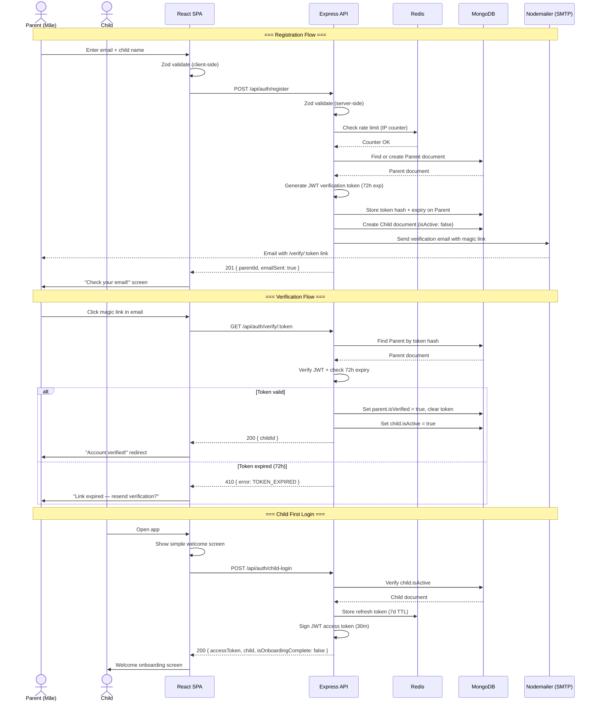
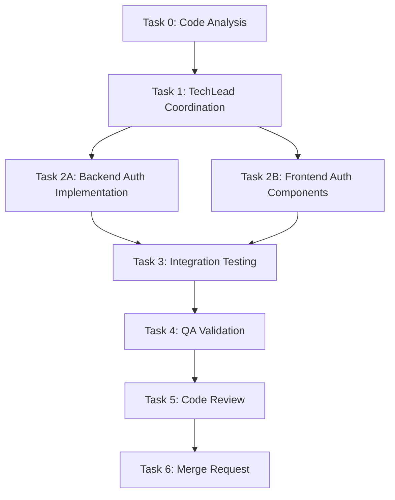

# STORY-001 Technical Analysis: COPPA-Compliant Parent-Child Onboarding

**Epic**: EPIC-010  
**Persona**: Mãe da Julia — The Caring Parent  
**Stack Source**: `docs/architecture/TECH-STACK.md` (greenfield)  
**Language**: Node.js (ESM) — detected from `package.json` + `"type": "module"`  
**Frontend**: React 18 + Vite + Tailwind + Flowbite → **FrontendDeveloperReact**  
**Integration**: Node.js fullstack — shared Zod schemas, Vite proxy → Express, single repo

---

## 1. Component / Module Breakdown

### Backend (`backend/src/app/auth/`)

| Module | File | Responsibility |
|--------|------|----------------|
| Model | `auth-model.js` | Mongoose schemas for `Parent` and `Child` documents |
| DAO | `auth-dao.js` | DB queries: find parent by email, create child, update verification status |
| Manager | `auth-manager.js` | Business logic: registration flow, token generation/verification, email dispatch orchestration |
| Router | `auth-router.js` | Express routes: `POST /api/auth/register`, `GET /api/auth/verify/:token`, `POST /api/auth/resend-verification` |
| Middleware | `rate-limit-middleware.js` | Per-IP rate limiter for registration endpoint (5 req/IP/hour) |

### Backend Config / Shared (`backend/src/`)

| Module | File | Responsibility |
|--------|------|----------------|
| Config | `config/email.js` | Nodemailer transport setup (SMTP from env vars) |
| Config | `config/database.js` | Mongoose connection (exists) |
| Config | `config/redis.js` | Redis client (exists) |
| Shared | `app/common/email-service.js` | Email templating + dispatch via nodemailer |
| Shared | `app/common/error-middleware.js` | Centralized error handler (enhance existing) |
| Shared | `app/common/validation-schemas.js` | Shared Zod schemas for email + name validation |

### Frontend (`frontend/src/`)

| Module | File | Responsibility |
|--------|------|----------------|
| Page | `app/auth/RegisterPage.jsx` | Parent registration form (email + child first name) |
| Page | `app/auth/VerifyPage.jsx` | Verification confirmation screen (after magic link click) |
| Page | `app/auth/WelcomePage.jsx` | Child first-login welcome screen |
| Component | `components/auth/RegisterForm.jsx` | Form with react-hook-form + zod validation |
| Component | `components/auth/VerificationStatus.jsx` | Verification status display (pending / success / expired) |
| Hook | `hooks/useRegister.js` | TanStack Query mutation for registration API call |
| Hook | `hooks/useVerify.js` | TanStack Query mutation for verification API call |
| Store | `stores/auth-store.js` | Zustand store for auth state (token, user, onboarding status) |
| i18n | `i18n/locales/pt-BR/auth.json` | Portuguese auth strings |
| i18n | `i18n/locales/en/auth.json` | English auth strings |

---

## 2. API Contract

### `POST /api/auth/register`
Rate-limited: 5 requests per IP per hour.

**Request:**
```json
{
  "parentEmail": "maria@example.com",
  "childFirstName": "Julia"
}
```

**Zod validation schema** (shared frontend + backend):
```typescript
{
  parentEmail: z.string().email(),
  childFirstName: z.string().min(1).max(50).regex(/^[\\p{L}]+$/u)  // letters only, Unicode
}
```

**Responses:**

| Status | Condition | Body |
|--------|-----------|------|
| `201` | New registration, email sent | `{ data: { parentId: "...", emailSent: true }, meta: { requestId } }` |
| `200` | Email already registered, not yet verified — resend link | `{ data: { parentId: "...", emailSent: true, resent: true }, meta: { requestId } }` |
| `409` | Child account already active for this email+name combo | `{ error: { code: "ACCOUNT_EXISTS", message: "..." }, meta: { requestId } }` |
| `422` | Validation failure | `{ error: { code: "VALIDATION_ERROR", details: [...] }, meta: { requestId } }` |
| `429` | Rate limit exceeded | `{ error: { code: "RATE_LIMITED", message: "..." }, meta: { requestId } }` |

### `GET /api/auth/verify/:token`
Magic link endpoint embedded in email.

**Responses:**

| Status | Condition | Body |
|--------|-----------|------|
| `200` | Token valid, account activated | `{ data: { childId: "..." }, meta: { requestId } }` |
| `410` | Token expired (72h passed) | `{ error: { code: "TOKEN_EXPIRED", message: "..." }, meta: { requestId } }` |
| `404` | Token not found / already used | `{ error: { code: "TOKEN_NOT_FOUND", message: "..." }, meta: { requestId } }` |

### `POST /api/auth/resend-verification`
Re-send verification email for expired tokens.

**Request:**
```json
{
  "parentEmail": "maria@example.com"
}
```

**Responses:**

| Status | Condition | Body |
|--------|-----------|------|
| `200` | Resent successfully | `{ data: { emailSent: true }, meta: { requestId } }` |
| `404` | No pending registration found | `{ error: { code: "NOT_FOUND", message: "..." }, meta: { requestId } }` |
| `429` | Rate limit exceeded | `{ error: { code: "RATE_LIMITED", message: "..." }, meta: { requestId } }` |

### `POST /api/auth/child-login`
Child login after account activation (no password — parent-mediated).

**Request:**
```json
{
  "childId": "...",
  "parentId": "..."
}
```

**Responses:**

| Status | Condition | Body |
|--------|-----------|------|
| `200` | Login success | `{ data: { accessToken, childId, childFirstName, isOnboardingComplete: false }, meta: { requestId } }` |
| `403` | Account not verified | `{ error: { code: "NOT_VERIFIED", message: "..." } }` |
| `404` | Account not found | `{ error: { code: "NOT_FOUND", message: "..." } }` |

---

## 3. Database Schema (Mongoose)

### `Parent` Collection

```javascript
// backend/src/app/auth/auth-model.js

const parentSchema = new mongoose.Schema({
  email: {
    type: String,
    required: true,
    unique: true,
    lowercase: true,
    trim: true,
    match: [/^[^\s@]+@[^\s@]+\.[^\s@]+$/, 'Invalid email format'],
  },
  verificationToken: {
    type: String,
    select: false, // never include in queries by default
  },
  verificationTokenExpires: {
    type: Date,
    select: false,
  },
  isVerified: {
    type: Boolean,
    default: false,
  },
  createdAt: {
    type: Date,
    default: Date.now,
  },
}, { timestamps: true });

// Indexes
parentSchema.index({ email: 1 }, { unique: true });
parentSchema.index({ verificationToken: 1 }, { sparse: true });
```

### `Child` Collection

```javascript
const childSchema = new mongoose.Schema({
  parentId: {
    type: mongoose.Schema.Types.ObjectId,
    ref: 'Parent',
    required: true,
    index: true,
  },
  firstName: {
    type: String,
    required: true,
    trim: true,
    maxlength: 50,
  },
  isActive: {
    type: Boolean,
    default: false, // activated on email verification
  },
  onboardingCompleted: {
    type: Boolean,
    default: false,
  },
  createdAt: {
    type: Date,
    default: Date.now,
  },
}, { timestamps: true });

// Compound index: one active child per parent email + first name
childSchema.index({ parentId: 1, firstName: 1 }, { unique: true, partialFilterExpression: { isActive: true } });
```

**COPPA note**: Only `firstName` stored — no last name, DOB, geolocation, or behavioral data (NFR-PRV-03).

---

## 4. Auth Flow Sequence Diagram



---

## 5. Rate Limiting Strategy

| Layer | Tool | Config | Scope |
|-------|------|--------|-------|
| nginx | `limit_req_zone` | 5r/m per IP on `/api/auth/*` | L7 reverse proxy |
| Express | `express-rate-limit` | 5 requests per IP per 60 minutes on `POST /api/auth/register` | Application layer |
| Express | `express-rate-limit` | 10 requests per IP per 60 minutes on `POST /api/auth/resend-verification` | Application layer |
| Redis | Rate-limit key pattern | `rl:register:{ip}` with TTL 3600s | Distributed counter |

**Implementation detail**: Express `rate-limit` already configured globally in `app.js` (100 req/min). The auth-specific limiter is MORE restrictive — it overrides the global limiter for these routes only by applying the auth limiter first in the middleware stack.

**Dual-layer rationale**: nginx rate limiting rejects before reaching Express (DOS protection). Express rate limiting gives application-level granularity with Redis-backed distributed counting (works across multiple containers).

---

## 6. Email Dispatch Strategy

### Nodemailer + SMTP

| Config | Env Var | Default |
|--------|---------|---------|
| Host | `SMTP_HOST` | — (required) |
| Port | `SMTP_PORT` | `587` |
| User | `SMTP_USER` | — (required) |
| Pass | `SMTP_PASS` | — (required) |
| From | `PARENT_EMAIL_FROM` | `noreply@estantedigital.example` |

### Email Template

- **Subject**: pt-BR: "Confirme sua conta no Contopia" / en: "Confirm your Contopia account"
- **Body**: HTML email with:
  - Friendly greeting addressing parent
  - Child's first name confirmation
  - Magic link button: `${APP_URL}/verify/:token`
  - Fallback plain text with link
  - Note: "This link expires in 72 hours"
  - Footer: COPPA privacy notice

### Service Layer

`backend/src/app/common/email-service.js`:
- Wraps `nodemailer.createTransport()`
- Singleton transport (reused across requests)
- Connection test on startup (warn, not crash if SMTP unavailable in dev)
- Retry logic: 3 attempts with exponential backoff for transient failures
- Logging: email dispatch events with hashed recipient (NFR-OBS-04)

---

## 7. JWT Token Design

### Verification Token (Magic Link)

| Claim | Value | Purpose |
|-------|-------|---------|
| `sub` | Parent `_id` | Identify parent |
| `email` | Parent email | Re-verify identity |
| `childId` | Child `_id` | Link to child account |
| `type` | `"email_verification"` | Distinguish from auth tokens |
| `iat` | Issued at | Token creation time |
| `exp` | `iat + 72h` | Expiry per AC-4 |

- **Signed with**: `JWT_SECRET` (same key, different `type` claim prevents confusion)
- **Stored hashed**: SHA-256 of JWT stored in `Parent.verificationToken` — prevents token theft from DB
- **Not stored in Redis**: Stateless verification — JWT contains all claims; hash lookup confirms not-revoked

### Access Token (Post-verification login)

| Claim | Value | Purpose |
|-------|-------|---------|
| `sub` | Child `_id` | Identify child |
| `parentId` | Parent `_id` | Link to parent |
| `role` | `"child"` | Role-based access |
| `type` | `"access"` | Token type |
| `iat` | Issued at | — |
| `exp` | `iat + 30m` | Short expiry per NFR-SEC-03 |

### Refresh Token

| Claim | Value | Purpose |
|-------|-------|---------|
| `sub` | Child `_id` | Identify child |
| `type` | `"refresh"` | Token type |
| `exp` | `iat + 7d` | Long-lived per NFR-SEC-03 |

- **Stored in Redis**: `refresh:{childId}` → token hash, TTL 7 days
- **Rotation**: New refresh token issued on each refresh; old one invalidated

### Token Security

- **HS256** algorithm (symmetric, `JWT_SECRET` from env)
- **No PII in token**: email NOT included in access/refresh tokens (only `sub` = ID)
- **Type claim prevents confusion**: verification token can't be used as access token
- **Token revocation**: Redis `bl:{tokenHash}` set on logout, checked by auth middleware

---

## 8. Frontend Component Tree

```
App.jsx
└── <BrowserRouter>
    └── <QueryClientProvider>
        └── <I18nextProvider>
            └── Routes
                ├── / → RegisterPage
                │   └── RegisterForm
                │       ├── EmailInput (react-hook-form + zod)
                │       ├── ChildNameInput (react-hook-form + zod)
                │       ├── ErrorMessage (Flowbite Alert)
                │       └── SubmitButton (Flowbite Button, large, child-friendly)
                │
                ├── /verify/:token → VerifyPage
                │   └── VerificationStatus
                │       ├── Success state → redirect to /welcome
                │       ├── Expired state → ResendVerificationLink
                │       └── Error state → retry + contact support
                │
                ├── /welcome → WelcomePage
                │   └── WelcomeScreen
                │       ├── Child name greeting (large, friendly)
                │       ├── Illustrated welcome (Framer Motion animations)
                │       └── StartButton (large, accessible)
                │
                ├── /resend → ResendVerificationPage
                │   └── ResendForm
                │
                └── /login → ChildLoginPage (future story)
```

### Form Validation: `react-hook-form` + `zod`

Shared Zod schema (identical rules on frontend and backend):
- `parentEmail`: `z.string().email()` — friendly error: "Por favor, verifique o email" / "Please check the email address"
- `childFirstName`: `z.string().min(1).max(50).regex(/^\p{L}+$/u)` — Unicode letters only, friendly error: "Apenas o primeiro nome, sem números" / "First name only, no numbers"
- Error messages use i18n keys, displayed via Flowbite `Alert` component

### Accessibility (NFR-ACC-01)

- All form inputs: `aria-label`, `aria-describedby` for error messages
- Keyboard navigable: Tab order logical, Enter submits
- Screen reader: `role="alert"` on validation errors, `aria-live="polite"` on status changes
- Color contrast: WCAG 2.1 AA minimum 4.5:1 ratio
- Focus management: auto-focus first error field on submission failure

---

## 9. i18n Strings Needed

### pt-BR (`frontend/src/i18n/locales/pt-BR/auth.json`)

```json
{
  "register": {
    "title": "Crie uma conta para sua criança",
    "parentEmail": "Seu email",
    "parentEmailPlaceholder": "exemplo@email.com",
    "childFirstName": "Nome da criança",
    "childFirstNamePlaceholder": "Apenas o primeiro nome",
    "submit": "Criar conta",
    "success": "Enviamos um email de confirmação!",
    "checkEmail": "Verifique sua caixa de entrada e clique no link para ativar a conta.",
    "errorEmailInvalid": "Por favor, verifique o endereço de email.",
    "errorNameInvalid": "Apenas o primeiro nome, sem números ou símbolos.",
    "errorAccountExists": "Já existe uma conta ativa com este email.",
    "errorRateLimited": "Muitas tentativas. Tente novamente em alguns minutos.",
    "errorGeneric": "Algo deu errado. Tente novamente."
  },
  "verify": {
    "title": "Confirmando sua conta...",
    "success": "Conta confirmada! Sua criança já pode usar o Contopia.",
    "expired": "O link expirou (válido por 72 horas).",
    "invalid": "Link inválido. Solicite um novo.",
    "resend": "Reenviar email de confirmação"
  },
  "welcome": {
    "title": "Bem-vindo ao Contopia, {{name}}!",
    "subtitle": "Sua estante digital está pronta.",
    "start": "Começar!"
  },
  "resend": {
    "title": "Reenviar confirmação",
    "email": "Email do responsável",
    "submit": "Reenviar",
    "success": "Email reenviado com sucesso!",
    "notFound": "Nenhum cadastro pendente encontrado."
  }
}
```

### en (`frontend/src/i18n/locales/en/auth.json`)

```json
{
  "register": {
    "title": "Create an account for your child",
    "parentEmail": "Your email",
    "parentEmailPlaceholder": "example@email.com",
    "childFirstName": "Child's first name",
    "childFirstNamePlaceholder": "First name only",
    "submit": "Create account",
    "success": "We sent a confirmation email!",
    "checkEmail": "Check your inbox and click the link to activate the account.",
    "errorEmailInvalid": "Please check the email address.",
    "errorNameInvalid": "First name only, no numbers or symbols.",
    "errorAccountExists": "An active account already exists with this email.",
    "errorRateLimited": "Too many attempts. Please try again in a few minutes.",
    "errorGeneric": "Something went wrong. Please try again."
  },
  "verify": {
    "title": "Confirming your account...",
    "success": "Account confirmed! Your child can now use Contopia.",
    "expired": "The link has expired (valid for 72 hours).",
    "invalid": "Invalid link. Request a new one.",
    "resend": "Resend confirmation email"
  },
  "welcome": {
    "title": "Welcome to Contopia, {{name}}!",
    "subtitle": "Your digital bookshelf is ready.",
    "start": "Let's go!"
  },
  "resend": {
    "title": "Resend confirmation",
    "email": "Parent's email",
    "submit": "Resend",
    "success": "Email resent successfully!",
    "notFound": "No pending registration found."
  }
}
```

---

## 10. NFR Verification Checklist

| NFR ID | Requirement | Verification Method | Status |
|--------|-------------|---------------------|--------|
| NFR-PRV-01 | Parental consent via verified email before activation | Integration test: child `isActive = false` until magic link clicked | ☐ |
| NFR-PRV-03 | Only first name + parent email collected | Schema review: no geolocation, no behavioral fields in Child/Parent models | ☐ |
| NFR-SEC-01 | TLS 1.2+ for all onboarding data | nginx TLS termination; Vite dev proxy; verify in staging | ☐ |
| NFR-SEC-04 | Input validation + sanitization on email/name | Zod validation on both frontend + backend; regex rejection on injection chars | ☐ |
| NFR-SEC-06 | Rate limit registration endpoint 5/IP/hour | Unit test: `express-rate-limit` with Redis store; manual burst test | ☐ |
| NFR-ACC-01 | WCAG 2.1 AA: keyboard nav, screen reader labels | Lighthouse accessibility audit; manual keyboard-only test; axe-core scan | ☐ |
| NFR-ACC-07 | Onboarding UI in pt-BR + en | i18n string coverage; manual locale toggle test | ☐ |
| NFR-SEC-03 | JWT auth + refresh tokens (30m/7d) | Unit test: token expiry; integration test: refresh flow | ☐ |
| NFR-OBS-04 | No PII in logs — hashed user IDs only | Code review: pino logger redaction; grep for email/name in log calls | ☐ |

---

## 11. Test Strategy

### Unit Tests (`backend/src/app/auth/__tests__/`)

| Test | Scope | Tool | Cases |
|------|-------|------|-------|
| `auth-manager.test.js` | Business logic | Vitest | Token generation, 72h expiry check, duplicate registration, resend logic, activation flow |
| `auth-dao.test.js` | Data access | Vitest + MongoDB Memory Server | CRUD operations, compound unique index, token lookup |
| `validation-schemas.test.js` | Zod schemas | Vitest | Invalid email formats, empty name, Unicode names, XSS in name field, SQL/NoSQL injection attempts |
| `email-service.test.js` | Email dispatch | Vitest + nodemailer mock | Template rendering, retry logic, error handling, hashed recipient logging |

### API Integration Tests (`backend/src/__tests__/auth-api.test.js`)

| Test | Scope | Tool | Cases |
|------|-------|------|-------|
| Registration endpoint | HTTP | supertest + Vitest | Valid registration, missing fields, duplicate email, rate limiting (burst 6 requests) |
| Verification endpoint | HTTP | supertest + Vitest | Valid token, expired token, invalid token, already-used token |
| Resend endpoint | HTTP | supertest + Vitest | Valid resend, non-existent email, rate limiting |
| Child login endpoint | HTTP | supertest + Vitest | Active child login, inactive child (403), non-existent (404) |

### Frontend Tests (`frontend/src/__tests__/`)

| Test | Scope | Tool | Cases |
|------|-------|------|-------|
| `RegisterForm.test.jsx` | Component | Vitest + Testing Library | Form validation errors, successful submit, loading state, error state |
| `VerifyPage.test.jsx` | Component | Vitest + Testing Library | Success rendering, expired token UI, resend trigger |
| `WelcomePage.test.jsx` | Component | Vitest + Testing Library | Correct child name rendering, start button click |

### E2E Tests (Manual — QA)

- Full flow: register → receive email → click link → verify → welcome screen
- Mobile responsive: iOS Safari, Android Chrome
- Keyboard-only navigation through entire flow
- Screen reader announcements (VoiceOver / TalkBack)

### Coverage Target

- **Backend**: ≥ 90% line coverage (mandatory)
- **Frontend**: ≥ 80% line coverage on auth pages

---

## 12. Impacted Files

### New Files (Backend)

| File | Purpose |
|------|---------|
| `backend/src/app/auth/auth-model.js` | Parent + Child Mongoose schemas |
| `backend/src/app/auth/auth-dao.js` | Data access layer |
| `backend/src/app/auth/auth-manager.js` | Business logic |
| `backend/src/app/auth/auth-router.js` | Express routes |
| `backend/src/app/common/email-service.js` | Nodemailer email dispatch |
| `backend/src/app/common/validation-schemas.js` | Shared Zod schemas |
| `backend/src/config/email.js` | SMTP transport config |
| `backend/src/app/auth/__tests__/auth-manager.test.js` | Manager unit tests |
| `backend/src/app/auth/__tests__/auth-dao.test.js` | DAO unit tests |
| `backend/src/app/__tests__/auth-api.test.js` | API integration tests |

### New Files (Frontend)

| File | Purpose |
|------|---------|
| `frontend/src/app/auth/RegisterPage.jsx` | Registration page |
| `frontend/src/app/auth/VerifyPage.jsx` | Verification page |
| `frontend/src/app/auth/WelcomePage.jsx` | Welcome page |
| `frontend/src/components/auth/RegisterForm.jsx` | Registration form component |
| `frontend/src/components/auth/VerificationStatus.jsx` | Verification status component |
| `frontend/src/hooks/useRegister.js` | Registration mutation hook |
| `frontend/src/hooks/useVerify.js` | Verification mutation hook |
| `frontend/src/stores/auth-store.js` | Zustand auth store |
| `frontend/src/i18n/locales/pt-BR/auth.json` | Portuguese strings |
| `frontend/src/i18n/locales/en/auth.json` | English strings |

### Modified Files

| File | Change |
|------|--------|
| `backend/src/app.js` | Mount auth routes, add auth rate limiter |
| `backend/src/main.js` | No change (DB + Redis already initialized) |
| `frontend/src/App.jsx` | Add React Router routes for auth pages |
| `frontend/src/main.jsx` | Wrap app with `QueryClientProvider` + `BrowserRouter` |
| `frontend/src/i18n/index.js` | Import auth locale files |

---

## Task Breakdown & Execution Order



| Task | Agent | Description | Depends On | Parallel | Estimate |
|------|-------|-------------|------------|----------|----------|
| 0 | CodeAnalyzer | Analyze codebase for auth patterns, existing middleware, DB setup | — | — | 30m |
| 1 | TechLead | Coordinate implementation, review analysis, assign subtasks | T0 | — | 15m |
| 2A | BackendDeveloper | Implement auth module: model, DAO, manager, router, email service, rate limiter | T1 | ✅ (with 2B) | 4h |
| 2B | FrontendDeveloperReact | Implement auth pages: RegisterForm, VerifyPage, WelcomePage, i18n, hooks, store | T1 | ✅ (with 2A) | 4h |
| 3 | TestEngineer | Write unit + API integration tests (backend + frontend) | T2A, T2B | — | 2h |
| 4 | QAAnalyst | Validate acceptance criteria, accessibility, i18n, rate limiting | T3 | — | 1h |
| 5 | CodeReviewer | Code review: security, COPPA compliance, code quality | T4 | — | 30m |
| 6 | MergeRequestCreator | Create MR with traceability to STORY-001 | T5 | — | 15m |

---

## Risk Assessment

| Risk | Likelihood | Impact | Mitigation |
|------|-----------|--------|------------|
| Email deliverability issues (spam filters) | Medium | High | Use reputable SMTP provider; set up SPF/DKIM/DMARC; test with Mailtrap in dev |
| SMTP provider downtime | Low | High | Queue emails in Redis with retry; show user-friendly "try again" message |
| Token theft from email interception | Low | Critical | HTTPS-only links; short TTL (72h); hash stored in DB; one-time use |
| Rate limit bypass via IP rotation | Medium | Medium | nginx + Express dual rate limiting; CAPTCHA fallback for future story |
| Child account enumeration via verification | Low | Medium | Generic success message regardless of whether email exists (AC does NOT require "email not found" response for register) |
| MongoDB injection via name field | Low | Critical | Zod regex validation (`^\p{L}+$`); Mongoose schema sanitization; no raw queries |

---

## Implementation Recommendations

1. **Database-first approach**: Create Mongoose models first, then DAO, then manager, then router — allows frontend mocking against stable schemas.
2. **Shared Zod schemas**: Extract `registerSchema` to `backend/src/app/common/validation-schemas.js` and duplicate in `frontend/src/schemas/` (or share via monorepo workspace) to keep client + server validation identical.
3. **Email templates**: Use simple HTML templates stored as `backend/src/app/common/templates/verification-email.html` — no template engine needed for MVP.
4. **Token hashing**: Store SHA-256 hash of verification JWT in `Parent.verificationToken` — the full JWT is only in the email link, never stored plaintext.
5. **Idempotent registration**: If `parentEmail` already has a pending (unverified) child with the same `firstName`, resend the verification email instead of creating a duplicate.
6. **Graceful SMTP fallback**: In development, use `nodemailer` ethereal email or log to console. Never crash on SMTP failure — queue and retry.
7. **Accessibility-first**: Build RegisterForm with keyboard navigation from the start; add `aria-*` attributes in the component code, not as an afterthought.