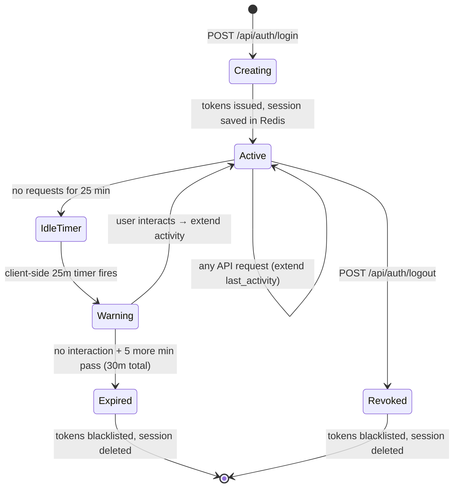
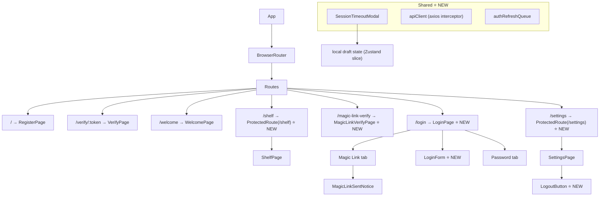
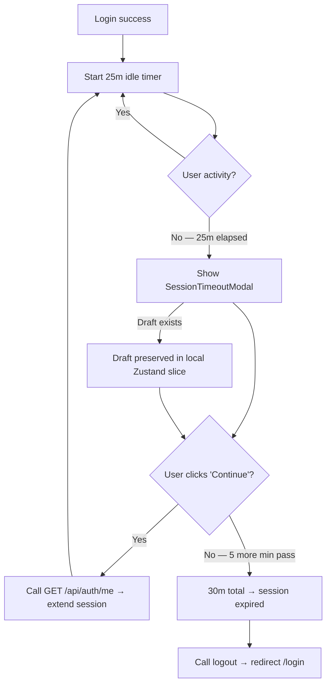
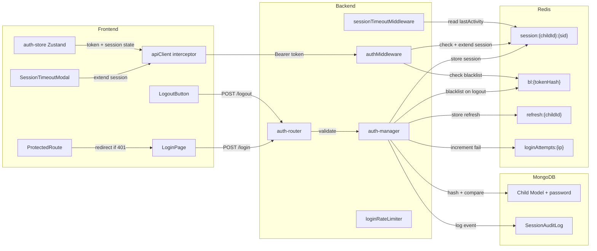
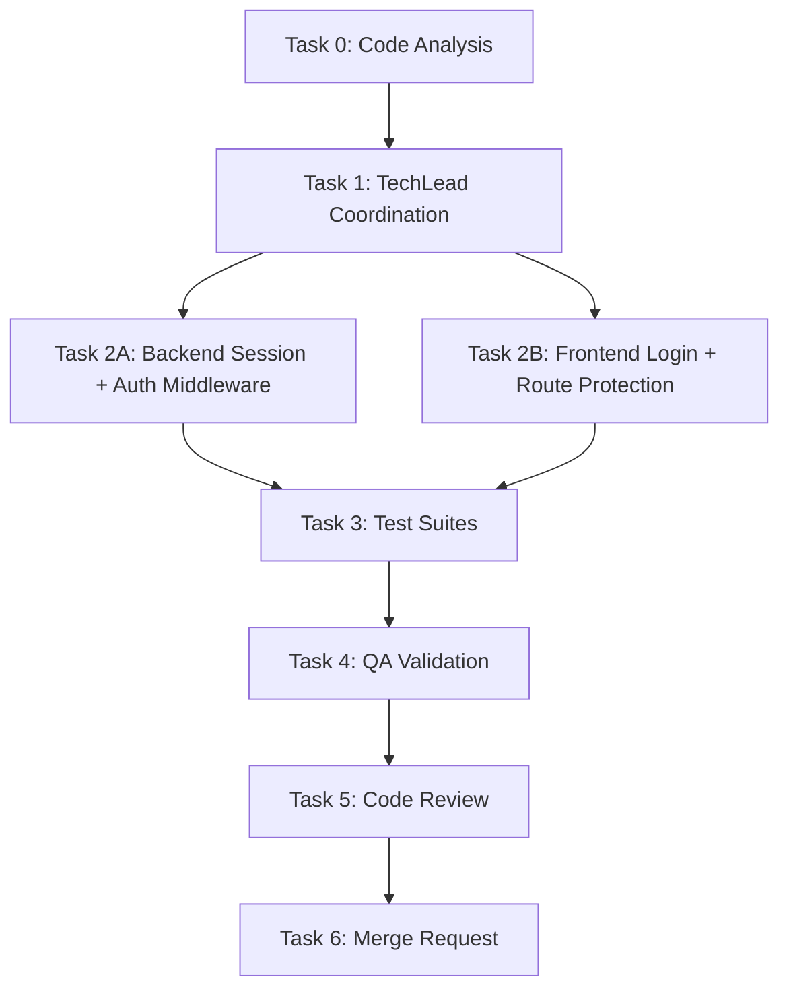

# STORY-002 Technical Analysis: Child Authentication & Session Management

**Epic**: EPIC-010
**Persona**: Julia — The Young Author
**Stack Source**: `docs/architecture/TECH-STACK.md` (greenfield)
**Language**: Node.js (ESM) — detected from `package.json` + `"type": "module"`
**Frontend**: React 18 + Vite + Tailwind + Flowbite → **FrontendDeveloperReact**
**Integration**: Node.js fullstack — shared Zod schemas, Vite proxy → Express, single repo

---

## 1. Existing Auth Infrastructure (STORY-001)

STORY-001 already provides:

| Component | File | What it does |
|-----------|------|-------------|
| Token generation | `auth-manager.js` | `generateAccessToken(child)` → 30m JWT, `generateRefreshToken(child)` → 7d JWT, `hashToken()` → SHA-256 |
| Child login | `auth-manager.js` | `childLogin({ childId, parentId })` → issues access + refresh tokens, stores refresh hash in Redis |
| Routes | `auth-router.js` | POST /register, GET /verify/:token, POST /resend-verification, POST /child-login |
| Redis client | `config/redis.js` | ioredis singleton, `refresh:{childId}` → hash, TTL 7d |
| Models | `auth-model.js` | Parent + Child schemas (no password field, no session metadata) |
| Validation | `validation-schemas.js` | registerSchema, resendSchema, childLoginSchema (Zod) |
| Rate limiters | `auth-router.js` | Redis-backed `express-rate-limit` factory per endpoint |
| Frontend store | `auth-store.js` | Zustand: token, user, onboardingComplete, logout() — memory-only (COPPA) |
| Express app | `app.js` | helmet, pino, request ID, global rate limit, mounts `/api/auth` |

**Gaps STORY-002 must fill:**
- No auth middleware (route protection / token validation)
- No session tracking (idle timeout, activity monitoring)
- No token revocation / blacklist on logout
- No `/logout`, `/refresh`, `/me` endpoints
- No password authentication (only ID-based child-login)
- No frontend route guards, timeout modal, or settings logout
- No audit logging for session events

---

## 2. Session Lifecycle Design



### Lifecycle Events

| Event | Backend Action | Redis Key Ops | Audit Log |
|-------|---------------|--------------|-----------|
| Login | Validate credentials → issue access + refresh tokens | `session:{childId}:{sessionId}` SET (TTL 30m), `refresh:{childId}` SET (TTL 7d) | `SESSION_CREATED` |
| Activity | Any authenticated request through `authMiddleware` | `session:{childId}:{sessionId}` EXPIRE (reset TTL 30m), update `last_activity` field | — (batched) |
| Refresh | Validate refresh token → issue new access token | Verify `refresh:{childId}`, check not in `bl:{tokenHash}` | `SESSION_REFRESHED` |
| Logout | Blacklist access + refresh tokens, delete session | `bl:{accessHash}` SET (TTL = remaining access TTL), `bl:{refreshHash}` SET (TTL = remaining refresh TTL), DEL `session:{childId}:{sessionId}`, DEL `refresh:{childId}` | `SESSION_LOGOUT` |
| Idle Expire | Client-side 30m timer or server middleware detects expiry | Redis TTL auto-eviction for session key; blacklist tokens via `session:expired` scan (lazy) | `SESSION_EXPIRED` |
| Forced Revoke | Admin or security event | Same as logout | `SESSION_REVOKED` |

---

## 3. Redis Key Schema

### New Keys (STORY-002)

| Key Pattern | Value | TTL | Purpose |
|-------------|-------|-----|---------|
| `session:{childId}:{sessionId}` | JSON: `{ createdAt, lastActivity, deviceHint, ip }` | 1800s (30m) | Active session tracking; TTL = auto-evict on idle timeout |
| `bl:{tokenHash}` | `1` | remaining token TTL | Token blacklist (access + refresh); checked by authMiddleware |
| `loginAttempts:{ip}` | counter (integer) | 900s (15m) | Failed login attempt counter for rate limiting |
| `refresh:{childId}` | refresh token hash | 604800s (7d) | **Existing** from STORY-001 — no schema change needed |

### Example Session Document (Redis String)

```json
{
  "sessionId": "sess_a1b2c3d4",
  "childId": "664a1b2c3d4e5f6a7b8c9d0e",
  "parentId": "664a1b2c3d4e5f6a7b8c9d0f",
  "createdAt": "2026-05-11T10:00:00Z",
  "lastActivity": "2026-05-11T10:15:00Z",
  "ip": "192.168.1.42",
  "deviceHint": "iPad/Safari"
}
```

### Key Design Decisions

- **Session TTL = idle timeout**: Redis TTL on `session:{childId}:{sessionId}` equals the 30-minute idle window. Any authenticated request resets TTL via `EXPIRE`. If no request arrives in 30m, Redis auto-evicts → session is gone.
- **Blacklist TTL = remaining token TTL**: No memory leak — blacklisted tokens auto-expire when the original token would have expired anyway.
- **One session per child**: Only one `session:{childId}:*` key per child at a time. New login replaces old session (single-device policy for child safety, avoids data leakage on shared family tablets per QA note).
- **Login attempt counter**: `loginAttempts:{ip}` with 900s TTL; incremented on failed auth, deleted on successful login.

---

## 4. Middleware Design

### 4.1 `authMiddleware` (new: `backend/src/app/common/auth-middleware.js`)

```mermaid
flowchart TD
    A[Request arrives] --> B{Authorization header?}
    B -->|No| C[401 UNAUTHORIZED]
    B -->|Yes| D[jwt.verify → decode token]
    D -->|Invalid/expired| E[401 TOKEN_EXPIRED]
    D -->|Valid| F{type === 'access'?}
    F -->|No| G[401 INVALID_TOKEN_TYPE]
    F -->|Yes| H{bl:{tokenHash} exists in Redis?}
    H -->|Yes| I[401 TOKEN_REVOKED]
    H -->|No| J[session:{childId}:{sessionId} exists?]
    J -->|No| K[401 SESSION_EXPIRED]
    J -->|Yes| L[Reset session TTL to 30m]
    L --> M[Update lastActivity in session]
    M --> N[Attach req.childId, req.parentId, req.sessionId]
    N --> O[next]
```

**Responsibilities:**
1. Extract `Authorization: Bearer <token>` header
2. `jwt.verify()` — check signature + expiry
3. Validate `type === 'access'` (prevent refresh-token-as-access confusion)
4. Check Redis blacklist: `GET bl:{hashToken(accessToken)}`
5. Check Redis session: `GET session:{childId}:{sessionId}` (sessionId from JWT `sid` claim)
6. Reset session TTL: `EXPIRE session:{childId}:{sessionId} 1800`
7. Attach `req.childId`, `req.parentId`, `req.sessionId` to request
8. Call `next()`

**JWT Access Token Enhancement** (add `sid` claim):

| Claim | Value | Purpose |
|-------|-------|---------|
| `sub` | Child `_id` | Identify child |
| `parentId` | Parent `_id` | Link to parent |
| `role` | `"child"` | Role-based access |
| `type` | `"access"` | Token type |
| `sid` | Session ID (random) | Link to Redis session key |
| `iat` | Issued at | — |
| `exp` | `iat + 30m` | Short expiry |

### 4.2 `sessionTimeoutMiddleware` — Server-side idle guard

Applied **after** `authMiddleware` on sensitive routes (e.g., destructive actions):

1. Read `lastActivity` from session document
2. If `now - lastActivity > 25 minutes` → return `419 SESSION_TIMEOUT_WARNING` (tells frontend to show modal)
3. If `now - lastActivity > 30 minutes` → return `401 SESSION_EXPIRED` (force re-auth)

> Note: Since Redis TTL handles hard expiry, this middleware provides the **soft warning** at 25m and a secondary check at 30m for edge cases where Redis TTL is slightly delayed.

### 4.3 `loginRateLimitMiddleware` (enhance existing rate limiter pattern)

```javascript
const loginLimiter = createLimiter({
  windowMs: 15 * 60 * 1000, // 15 minutes
  max: 5,                   // 5 attempts
  message: 'Too many login attempts.',
});
```

Applied to `POST /api/auth/login`. Counter resets on successful login (delete `loginAttempts:{ip}` key).

---

## 5. API Contract

### `POST /api/auth/login`

Unifies child-login from STORY-001 with password + magic link options.

**Request:**

```json
{
  "method": "password",
  "childId": "664a1b2c3d4e5f6a7b8c9d0e",
  "password": "iluvbooks"
}
```

OR magic link:

```json
{
  "method": "magic-link",
  "parentEmail": "maria@example.com",
  "childFirstName": "Julia"
}
```

**Zod validation schema:**

```typescript
const loginSchema = z.discriminatedUnion('method', [
  z.object({
    method: z.literal('password'),
    childId: z.string().regex(/^[a-f\d]{24}$/i),
    password: z.string().min(4).max(20),
  }),
  z.object({
    method: z.literal('magic-link'),
    parentEmail: z.string().email(),
    childFirstName: z.string().min(1).max(50).regex(/^[\p{L}]+$/u),
  }),
]);
```

**Responses:**

| Status | Condition | Body |
|--------|-----------|------|
| `200` | Login success | `{ data: { accessToken, childId, childFirstName, isOnboardingComplete, method }, meta: { requestId } }` |
| `401` | Wrong password | `{ error: { code: "INVALID_CREDENTIALS", message: "..." }, meta: { requestId } }` |
| `403` | Account not verified | `{ error: { code: "NOT_VERIFIED", message: "..." }, meta: { requestId } }` |
| `404` | Account not found | `{ error: { code: "NOT_FOUND", message: "..." }, meta: { requestId } }` |
| `200` | Magic link sent (no session yet) | `{ data: { magicLinkSent: true, parentEmail }, meta: { requestId } }` |
| `429` | Rate limit exceeded | `{ error: { code: "RATE_LIMITED", message: "..." }, meta: { requestId } }` |

**Password flow:** Validate bcrypt hash → issue tokens immediately.
**Magic link flow:** Send magic link to parent email → parent clicks → frontend calls a verification endpoint → then issue tokens.

### `POST /api/auth/logout`

**Request:**

```json
{
  "sessionId": "sess_a1b2c3d4"
}
```

> Session ID extracted from JWT `sid` claim by `authMiddleware` — body field is redundant but explicit for audit clarity.

**Headers:** `Authorization: Bearer <accessToken>`

**Responses:**

| Status | Condition | Body |
|--------|-----------|------|
| `200` | Logout success | `{ data: { loggedOut: true }, meta: { requestId } }` |
| `401` | No valid session | `{ error: { code: "UNAUTHORIZED", message: "..." }, meta: { requestId } }` |

**Actions on logout:**
1. Blacklist access token: `SET bl:{hashToken(accessToken)} 1 EX {remainingTTL}`
2. Blacklist refresh token: lookup `refresh:{childId}` → `SET bl:{value} 1 EX {remainingTTL}`
3. Delete session: `DEL session:{childId}:{sessionId}`
4. Delete refresh token: `DEL refresh:{childId}`
5. Audit log: `SESSION_LOGOUT`

### `POST /api/auth/refresh`

**Request:**

```json
{
  "refreshToken": "eyJhbGciOiJIUzI1NiIs..."
}
```

**Responses:**

| Status | Condition | Body |
|--------|-----------|------|
| `200` | Refresh success | `{ data: { accessToken, childId, childFirstName }, meta: { requestId } }` |
| `401` | Refresh token invalid/expired | `{ error: { code: "INVALID_REFRESH_TOKEN", message: "..." }, meta: { requestId } }` |
| `401` | Refresh token revoked (in blacklist) | `{ error: { code: "TOKEN_REVOKED", message: "..." }, meta: { requestId } }` |

**Actions on refresh:**
1. `jwt.verify(refreshToken)` → check `type === 'refresh'`
2. Check blacklist: `GET bl:{hashToken(refreshToken)}`
3. Verify stored hash: `GET refresh:{childId}` → compare with `hashToken(refreshToken)`
4. Issue new access token (with `sid` claim from existing session)
5. Reset session TTL to 30m
6. **Token rotation**: Issue new refresh token, store new hash in Redis, blacklist old refresh token
7. Audit log: `SESSION_REFRESHED`

### `GET /api/auth/me`

**Headers:** `Authorization: Bearer <accessToken>`

**Responses:**

| Status | Condition | Body |
|--------|-----------|------|
| `200` | Authenticated | `{ data: { childId, childFirstName, isOnboardingComplete, sessionCreatedAt, lastActivity }, meta: { requestId } }` |
| `401` | Not authenticated | `{ error: { code: "UNAUTHORIZED", message: "..." }, meta: { requestId } }` |

Used by frontend on app load to determine auth state and session info.

---

## 6. Database Schema Changes

### `Child` Collection — Add Password Field

```javascript
// Add to existing childSchema in auth-model.js
password: {
  type: String,
  select: false,  // never include by default — only loaded for login
},
```

- Hashed via `bcryptjs` (cost factor 10)
- `select: false` — excluded from all queries unless explicitly `.select('+password')`
- **Optional**: a child can have `password: null` (magic-link-only) or `password: "hash..."` (password set)
- Password set during onboarding or via a settings flow (future story)

### `SessionAuditLog` Collection (new)

```javascript
const sessionAuditSchema = new Schema({
  childId: { type: Schema.Types.ObjectId, ref: 'Child', required: true, index: true },
  sessionId: { type: String, required: true, index: true },
  event: {
    type: String,
    enum: ['SESSION_CREATED', 'SESSION_REFRESHED', 'SESSION_LOGOUT', 'SESSION_EXPIRED', 'SESSION_REVOKED'],
    required: true,
  },
  ip: { type: String },
  deviceHint: { type: String },
  createdAt: { type: Date, default: Date.now, index: true },
}, { timestamps: true });

// TTL index: auto-delete audit logs after 90 days
sessionAuditSchema.index({ createdAt: 1 }, { expireAfterSeconds: 90 * 24 * 60 * 60 });
```

**COPPA note**: No PII in audit logs — only `childId` (internal ID), `ip`, and `deviceHint` (derived from User-Agent, no raw UA string stored).

---

## 7. Frontend Design

### Component Tree (STORY-002 additions)



### New Components

| Component | File | Responsibility |
|-----------|------|---------------|
| `LoginPage` | `app/auth/LoginPage.jsx` | Tabs: password login / magic link request |
| `ProtectedRoute` | `components/auth/ProtectedRoute.jsx` | Wrapper: redirect to `/login` if no token; render children if authenticated |
| `SessionTimeoutModal` | `components/auth/SessionTimeoutModal.jsx` | Warning at 25m idle, countdown to 30m; "Continue" button extends session; preserves draft |
| `LogoutButton` | `components/auth/LogoutButton.jsx` | In settings menu; calls `POST /api/auth/logout`, clears store |
| `MagicLinkVerifyPage` | `app/auth/MagicLinkVerifyPage.jsx` | Handles magic link click for login (distinct from registration verification) |

### Zustand Store Enhancement

```javascript
// Enhanced auth-store.js
const useAuthStore = create((set, get) => ({
  // Existing
  token: null,
  user: null,
  onboardingComplete: false,

  // NEW: Session tracking
  sessionId: null,
  sessionCreatedAt: null,
  lastActivity: null,

  // Existing actions (enhanced)
  setToken: (token) => set({ token }),
  setUser: (user) => set({ user }),
  setOnboardingComplete: (v) => set({ onboardingComplete: v }),
  setSession: (session) => set({
    sessionId: session.sessionId,
    sessionCreatedAt: session.createdAt,
    lastActivity: session.lastActivity,
  }),

  // Enhanced logout: call API, then clear state
  logout: async () => {
    const { token, sessionId } = get();
    if (token && sessionId) {
      try {
        await apiClient.post('/auth/logout', { sessionId });
      } catch { /* token already invalid — still clear local */ }
    }
    set({ token: null, user: null, onboardingComplete: false, sessionId: null, sessionCreatedAt: null, lastActivity: null });
  },

  // NEW: Track activity for client-side timeout
  updateActivity: () => set({ lastActivity: Date.now() }),
}));
```

### API Client (axios interceptor with silent refresh)

```javascript
// frontend/src/lib/api-client.js
const apiClient = axios.create({ baseURL: '/api' });

// Request interceptor: attach Bearer token
apiClient.interceptors.request.use((config) => {
  const { token } = useAuthStore.getState();
  if (token) config.headers.Authorization = `Bearer ${token}`;
  return config;
});

// Response interceptor: handle 401 → attempt refresh
let isRefreshing = false;
let refreshQueue = [];

apiClient.interceptors.response.use(
  (response) => response,
  async (error) => {
    const originalRequest = error.config;
    if (error.response?.status === 401 && !originalRequest._retry) {
      if (isRefreshing) {
        // Queue subsequent requests while refreshing
        return new Promise((resolve) => {
          refreshQueue.push(() => resolve(apiClient(originalRequest)));
        });
      }
      originalRequest._retry = true;
      isRefreshing = true;
      try {
        const { data } = await axios.post('/api/auth/refresh', { refreshToken: getRefreshToken() });
        useAuthStore.getState().setToken(data.data.accessToken);
        useAuthStore.getState().updateActivity();
        refreshQueue.forEach((cb) => cb());
        refreshQueue = [];
        return apiClient(originalRequest);
      } catch {
        // Refresh failed → full logout
        useAuthStore.getState().logout();
        window.location.href = '/login';
        return Promise.reject(error);
      } finally {
        isRefreshing = false;
      }
    }
    // 419 = session timeout warning → show modal
    if (error.response?.status === 419) {
      useAuthStore.getState().setSessionTimeoutWarning(true);
    }
    return Promise.reject(error);
  }
);
```

### Session Timeout Logic (client-side)



**Activity tracking**: `mousemove`, `keydown`, `scroll`, `touchstart` → debounced (5s) → call `useAuthStore.updateActivity()` + send lightweight ping (or rely on API calls through interceptor to extend server-side TTL).

> **Design choice**: Client timer is the primary mechanism for the UX (showing modal at 25m). Server-side Redis TTL is the authoritative session expiry. If client timer fires but server session is still valid, the "Continue" button succeeds. If Redis evicted before client timer, the next API call returns 401 → interceptor refreshes or redirects.

### Draft Preservation on Timeout

When `SessionTimeoutModal` appears while the user is writing:
1. Draft content already lives in Zustand editor slice (memory-only per COPPA)
2. On timeout → redirect to `/login` with `?returnTo=/editor/bookId` query param
3. After re-auth → redirect back to editor → draft still in memory (tab never closed, just overlay)
4. If browser tab refreshed → draft lost (acceptable: same as any non-saved content)

**Alternative for hard refresh protection** (optional, post-MVP):
- Save draft to `localStorage` with session-scoped key
- On re-auth, check for orphaned draft → prompt restore
- Clear draft from localStorage after restore or explicit discard

---

## 8. Architecture Diagram — Impacted Components



---

## 9. Execution Plan — Task Breakdown



| Task | Agent | Description | Depends On | Parallel | Estimate |
|------|-------|-------------|------------|----------|----------|
| 0 | CodeAnalyzer | Analyze existing auth codebase, identify extension points in auth-manager, auth-router, auth-model, auth-store | — | — | 30m |
| 1 | TechLead | Coordinate implementation, review analysis, assign subtasks, ensure contract alignment | T0 | — | 15m |
| 2A | BackendDeveloper | Session management, authMiddleware, sessionTimeoutMiddleware, login with password, /logout, /refresh, /me, blacklist, audit logging, rate limiting on login | T1 | ✅ (with 2B) | 5h |
| 2B | FrontendDeveloperReact | LoginPage (password + magic link), ProtectedRoute, SessionTimeoutModal, LogoutButton, apiClient interceptor, auth-store enhancement, MagicLinkVerifyPage | T1 | ✅ (with 2A) | 5h |
| 3 | TestEngineer | Unit + API integration tests (backend); component + hook tests (frontend) | T2A, T2B | — | 2.5h |
| 4 | QAAnalyst | Validate AC: session timeout boundary, redirect, draft preservation, rate limiting, accessibility | T3 | — | 1h |
| 5 | CodeReviewer | Security review: token blacklist, bcrypt, COPPA compliance, no PII leaks | T4 | — | 30m |
| 6 | MergeRequestCreator | Create MR with traceability to STORY-002 | T5 | — | 15m |

---

## 10. Impacted Files

### New Files (Backend)

| File | Purpose |
|------|---------|
| `backend/src/app/common/auth-middleware.js` | JWT validation, blacklist check, session extension |
| `backend/src/app/common/session-timeout-middleware.js` | Idle timeout soft warning (419) |
| `backend/src/app/auth/session-audit-model.js` | SessionAuditLog Mongoose schema |
| `backend/src/app/auth/session-audit-dao.js` | Audit log CRUD |
| `backend/src/app/auth/__tests__/auth-middleware.test.js` | Middleware unit tests |
| `backend/src/app/auth/__tests__/session-manager.test.js` | Session logic unit tests |
| `backend/src/app/__tests__/session-api.test.js` | Session API integration tests |

### New Files (Frontend)

| File | Purpose |
|------|---------|
| `frontend/src/app/auth/LoginPage.jsx` | Login page (password + magic link tabs) |
| `frontend/src/app/auth/MagicLinkVerifyPage.jsx` | Magic link verification for login |
| `frontend/src/components/auth/ProtectedRoute.jsx` | Route guard component |
| `frontend/src/components/auth/SessionTimeoutModal.jsx` | Idle timeout warning modal |
| `frontend/src/components/auth/LogoutButton.jsx` | Settings menu logout |
| `frontend/src/hooks/useLogin.js` | TanStack Query mutation for login |
| `frontend/src/hooks/useLogout.js` | TanStack Query mutation for logout |
| `frontend/src/hooks/useRefreshToken.js` | TanStack Query mutation for refresh |
| `frontend/src/hooks/useCurrentUser.js` | TanStack Query for GET /me |
| `frontend/src/hooks/useSessionTimeout.js` | Client-side idle timer hook |
| `frontend/src/lib/api-client.js` | Axios instance with interceptors |

### Modified Files

| File | Change |
|------|--------|
| `backend/src/app/auth/auth-manager.js` | Add `loginWithPassword()`, `logout()`, `refreshSession()`, `getCurrentUser()`, `createSession()`, `blacklistToken()`; modify `generateAccessToken()` to include `sid` claim |
| `backend/src/app/auth/auth-router.js` | Add routes: POST /login, POST /logout, POST /refresh, GET /me; add `loginLimiter`; apply `authMiddleware` to protected routes |
| `backend/src/app/auth/auth-model.js` | Add `password` field (select: false) to Child schema; add `SessionAuditLog` model |
| `backend/src/app/common/validation-schemas.js` | Add `loginSchema` (discriminated union), `logoutSchema`, `refreshSchema` |
| `backend/src/app.js` | Mount protected routes under `authMiddleware`; add `sessionTimeoutMiddleware` |
| `frontend/src/stores/auth-store.js` | Add sessionId, sessionCreatedAt, lastActivity, setSession, logout async, updateActivity, sessionTimeoutWarning |
| `frontend/src/App.jsx` | Add /login, /magic-link-verify, /shelf (ProtectedRoute), /settings (ProtectedRoute) routes |
| `frontend/src/i18n/locales/pt-BR/auth.json` | Add session, login, timeout strings |
| `frontend/src/i18n/locales/en/auth.json` | Add session, login, timeout strings |

---

## 11. NFR Verification Checklist

| NFR ID | Requirement | Verification Method | Status |
|--------|-------------|---------------------|--------|
| NFR-SEC-03 | Sessions expire after 30m inactivity | Integration test: login → wait 30m (mocked clock) → verify 401; verify Redis TTL set to 1800s | ☐ |
| NFR-SEC-03 | Re-auth for destructive actions | Unit test: sessionTimeoutMiddleware returns 419 at 25m | ☐ |
| NFR-SEC-01 | TLS 1.2+ for all auth endpoints | nginx TLS config; verify in staging with `curl -v --tlsv1.2` | ☐ |
| NFR-SEC-04 | Input validation on password/login | Zod schema: password 4-20 chars, childId regex, email validation | ☐ |
| NFR-SEC-06 | Rate limiting: 5 failed / 15min / IP | Unit test: `express-rate-limit` config; manual burst: 6 rapid POST /login with wrong password → 6th returns 429 | ☐ |
| NFR-ACC-01 | Login meets WCAG 2.1 AA | Lighthouse audit; axe-core scan; contrast ratio on login form | ☐ |
| NFR-ACC-02 | Keyboard operable login | Manual test: Tab through login form → Enter submits → Escape closes timeout modal | ☐ |
| NFR-SEC-03 | JWT auth + refresh rotation | Integration test: refresh → verify old refresh token blacklisted; verify new token works | ☐ |
| NFR-SEC-03 | httpOnly + secure + sameSite cookie flags | Browser DevTools: inspect Set-Cookie headers; verify flags present | ☐ |
| NFR-PRV-03 | No PII in audit logs | Code review: SessionAuditLog schema has only childId, ip, deviceHint; no email/name | ☐ |
| NFR-MNT-01 | Structured audit logging | Pino logs for SESSION_CREATED/LOGOUT/EXPIRED/REFRESHED events; JSON format | ☐ |

---

## 12. Test Strategy

### Unit Tests — Backend (`backend/src/app/auth/__tests__/`)

| Test File | Scope | Tool | Cases |
|-----------|-------|------|-------|
| `auth-middleware.test.js` | Middleware | Vitest + mock Redis | Valid token, expired token, blacklisted token, missing session, type mismatch, session TTL reset |
| `session-manager.test.js` | Business logic | Vitest + mock Redis | `createSession`, `logout` (blacklist + delete), `refreshSession` (rotation), `getCurrentUser`, idle detection |
| `login-password.test.js` | Password login | Vitest | Correct password, wrong password (increment attempts), rate limit (5th attempt → 429), inactive account |
| `validation-schemas.test.js` | Zod schemas | Vitest | Login schema (password method, magic-link method), logout, refresh — valid + invalid inputs |

### API Integration Tests (`backend/src/__tests/`)

| Test File | Scope | Tool | Cases |
|-----------|-------|------|-------|
| `auth-session-api.test.js` | HTTP | supertest + Vitest | POST /login (password + magic-link), POST /logout, POST /refresh, GET /me; 401 without token; session TTL; blacklist check after logout; rate limiting burst |

### Frontend Tests (`frontend/src/__tests__/`)

| Test File | Scope | Tool | Cases |
|-----------|-------|------|-------|
| `LoginPage.test.jsx` | Component | Vitest + Testing Library | Tab switching, password form submission, magic link request, validation errors, rate limit error |
| `ProtectedRoute.test.jsx` | Component | Vitest + Testing Library | Redirect when no token, render children with token, redirect preserves returnTo |
| `SessionTimeoutModal.test.jsx` | Component | Vitest + Testing Library | Shows at 25m, "Continue" extends session, auto-logout at 30m, draft preserved |
| `LogoutButton.test.jsx` | Component | Vitest + Testing Library | Click calls logout, clears store, redirects |
| `api-client.test.js` | Interceptor | Vitest + MSW | Attaches Bearer token, handles 401 → refresh, queues concurrent requests, refresh failure → logout |

### E2E Tests (Manual — QA)

| Scenario | Steps | Expected |
|----------|-------|----------|
| Session timeout boundary | Login → idle 29m 50s → make API call | Request succeeds (within 30m) |
| Session timeout expired | Login → idle 30m+ → make API call | 401 → redirect to /login |
| Draft preservation | Login → write in editor → idle 25m → modal appears | Draft text still visible; modal offers "Continue" |
| Rate limiting brute-force | POST /login with wrong password × 6 | 6th returns 429 |
| Shared tablet isolation | Login as Child A → logout → login as Child B | No Child A data visible to Child B |
| Keyboard-only login | Tab to password → type → Enter | Login succeeds; no mouse needed |
| Logout button | Settings → tap Logout | Redirected to /login; protected routes return 401 |

### Coverage Target

- **Backend**: ≥ 90% line coverage (mandatory)
- **Frontend**: ≥ 80% line coverage on auth + session components

---

## 13. Risk Assessment

| Risk | Likelihood | Impact | Mitigation |
|------|-----------|--------|------------|
| Redis unavailability → sessions can't be validated | Low | Critical | Degrade gracefully: if Redis down, authMiddleware rejects with 503 (not 401); healthcheck marks Redis dependency; retry with backoff |
| Client-server timer drift → timeout modal shows too early/late | Medium | Low | Server Redis TTL is authoritative; client timer is UX hint only. 25m modal threshold gives 5m buffer before hard 30m expiry |
| Password complexity vs child usability | Medium | Medium | 4-char minimum (child-friendly); no complexity rules for MVP; parent sets password during onboarding; magic-link as fallback |
| Token refresh race condition → multiple concurrent refreshes | Medium | Medium | `isRefreshing` flag + request queue in apiClient interceptor; only one refresh in flight at a time |
| Magic link reuse (click twice) | Low | Low | Single-use: after login, session created; magic link token is one-time (invalidate after use via Redis key) |
| Session audit log growth | Low | Low | MongoDB TTL index (90 days); capped collection alternative if write volume high |
| bcrypt CPU cost on login | Low | Low | Cost factor 10 (standard); Node.js crypto is non-blocking for single requests; rate limiter prevents brute-force CPU saturation |

---

## 14. Implementation Recommendations

1. **Middleware-first**: Build `authMiddleware` before any protected routes — all downstream features depend on it.
2. **Password as optional**: Child schema `password` field defaults to `null`. Magic link remains primary. Password is for families who prefer no email dependency each login.
3. **Single-session policy**: One active `session:{childId}:*` key per child. New login deletes old session key + blacklists old tokens. Prevents data leakage on shared family tablets (QA note).
4. **Silent refresh on authMiddleware**: Let the axios interceptor handle refresh transparently. The frontend never needs to manually check token expiry — interceptor catches 401 and retries after refresh.
5. **Session audit as fire-and-forget**: Write audit logs asynchronously (don't await or block login/refresh response on audit write failure). Audit is observability, not critical path.
6. **Rate limit reset on success**: Delete `loginAttempts:{ip}` key on successful login so the counter doesn't penalize a user after one mistake.
7. **Accessibility-first login form**: Large touch targets (48×48dp minimum), high-contrast mascot illustration, `aria-live` for error messages, tab order: child selector → password → submit.
8. **SessionTimeoutModal UX**: Friendly language ("Your session is about to expire!"), large "Continue" button, countdown timer visible. No technical jargon. Draft auto-saves to Zustand on modal appearance.
9. **Magic link login flow distinct from registration verification**: Registration uses `GET /api/auth/verify/:token`. Login magic link uses a separate endpoint and token type (`type: "login_magic"`) to avoid confusion.
10. **No refresh token in localStorage**: COPPA compliance — refresh token stays in memory (Zustand store) only. On page refresh, user must re-authenticate. Acceptable for child app (short sessions).