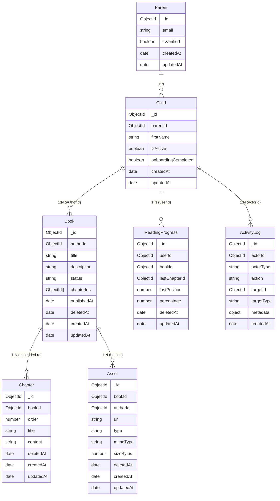
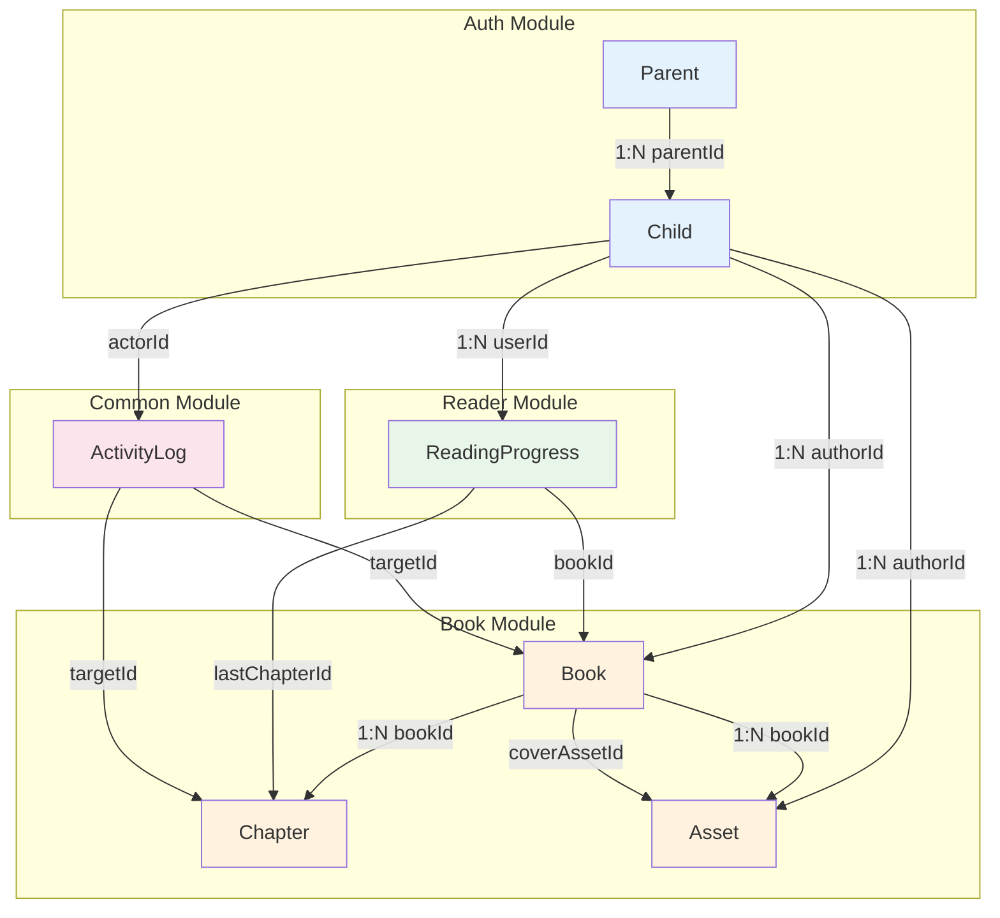
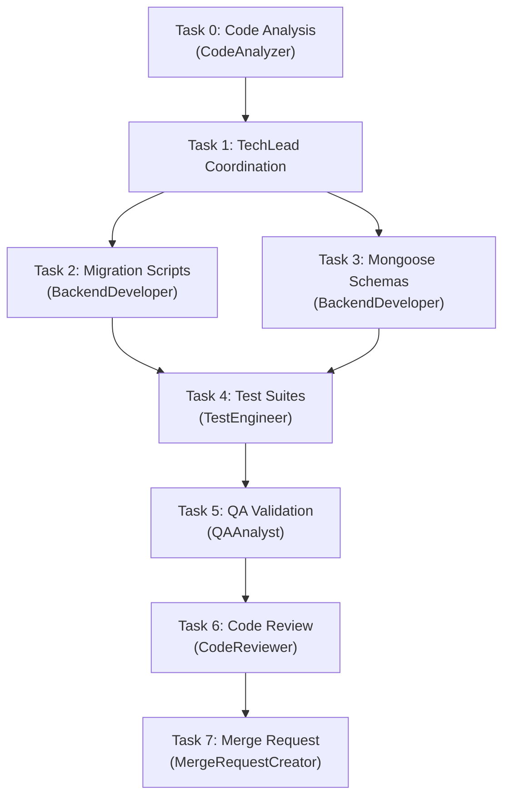

# STORY-004 Technical Analysis: Core Data Model & Database Migrations

**Epic**: EPIC-010
**Persona**: Julia — The Young Author
**Stack**: MongoDB 7 + Mongoose 8.x + migrate-mongo (per TECH-STACK.md)
**Depends on**: STORY-001 (Parent/Child schemas exist), STORY-003

> **Stack Override**: STORY-004 notes reference PostgreSQL/Prisma — **rejected**. Approved stack per `docs/architecture/TECH-STACK.md` is MongoDB 7 + Mongoose 8.x. All analysis uses document model, not relational.

---

## 1. Collection Design

### 1.1 Document Relationships



### 1.2 Design Decisions — Document vs Embedding

| Decision | Rationale |
|----------|-----------|
| **Chapters as separate collection** | Chapters can be 50KB+ rich text. Embedding blows up book document beyond 16MB. Separate collection with `bookId` ref allows pagination and targeted updates (autosave). |
| **Chapter order as integer field** | Mongoose can sort chapters by `order` field. Avoids array reordering on every move. Gaps of 100 allow cheap reorder without rewriting all siblings. |
| **`chapterIds` array on Book** | Denormalized to avoid `Chapter.find({ bookId })` for shelf display. Mongoose `populate()` fetches from Chapter collection. Kept in sync via Chapter manager hooks. |
| **Assets separate from Book** | Assets can be large (up to 500MB per user total). Separation allows independent S3 lifecycle, presigned URLs, and quota enforcement. |
| **ReadingProgress separate** | Updated frequently (every chapter navigation). Separating avoids write-amplification on Book documents. |
| **ActivityLog append-only** | COPPA audit trail. Never updated or soft-deleted. Separate collection for time-series queries and compaction. |
| **`authorId` on Book (not `userId`)** | Semantic clarity: Child IS the user/author. Field named `authorId` links to Child `_id`. Consistent with story domain language. |
| **No separate `users` collection** | STORY-001 established Child = user. Adding a `users` collection would duplicate identity. All auth flows use Child model. |

---

## 2. Mongoose Schema Specifications

### 2.1 Book Schema

```
Collection: books
Fields:
  _id: ObjectId (auto)
  authorId: ObjectId, ref: 'Child', required, indexed
  title: String, required, trim, maxlength: 200
  description: String, trim, maxlength: 2000, default: ''
  status: String, enum: ['draft', 'published', 'archived'], default: 'draft'
  chapterIds: [ObjectId], ref: 'Chapter', default: []
  coverAssetId: ObjectId, ref: 'Asset', default: null
  publishedAt: Date, default: null
  language: String, default: 'pt-BR', maxlength: 5
  deletedAt: Date, default: null (soft delete)
  createdAt: Date (auto via timestamps)
  updatedAt: Date (auto via timestamps)

Indexes:
  { authorId: 1, status: 1, deletedAt: 1 }          — compound, partial (deletedAt: null)
  { authorId: 1, createdAt: -1, deletedAt: 1 }       — compound, partial (deletedAt: null)
  { status: 1, publishedAt: -1, deletedAt: 1 }       — compound, partial (deletedAt: null)
  { 'title': 'text' }                                 — text index for search

Schema options: { timestamps: true, collection: 'books' }
```

### 2.2 Chapter Schema

```
Collection: chapters
Fields:
  _id: ObjectId (auto)
  bookId: ObjectId, ref: 'Book', required, indexed
  order: Number, required, min: 0
  title: String, required, trim, maxlength: 200
  content: String, default: '' (TipTap JSON string)
  wordCount: Number, default: 0, min: 0
  deletedAt: Date, default: null (soft delete)
  createdAt: Date (auto)
  updatedAt: Date (auto)

Indexes:
  { bookId: 1, order: 1, deletedAt: 1 }   — compound, partial (deletedAt: null), unique on bookId+order
  { bookId: 1, deletedAt: 1 }              — compound, partial (deletedAt: null)

Schema options: { timestamps: true, collection: 'chapters' }
```

### 2.3 Asset Schema

```
Collection: assets
Fields:
  _id: ObjectId (auto)
  bookId: ObjectId, ref: 'Book', required, indexed
  authorId: ObjectId, ref: 'Child', required, indexed
  url: String, required (S3/MinIO path)
  type: String, enum: ['cover', 'spine', 'edge', 'upload'], required
  mimeType: String, required, maxlength: 100
  sizeBytes: Number, required, min: 0
  deletedAt: Date, default: null (soft delete)
  createdAt: Date (auto)
  updatedAt: Date (auto)

Indexes:
  { bookId: 1, type: 1, deletedAt: 1 }      — compound, partial (deletedAt: null)
  { authorId: 1, deletedAt: 1 }             — compound, partial (deletedAt: null)

Schema options: { timestamps: true, collection: 'assets' }
```

### 2.4 ReadingProgress Schema

```
Collection: reading_progress
Fields:
  _id: ObjectId (auto)
  userId: ObjectId, ref: 'Child', required
  bookId: ObjectId, ref: 'Book', required
  lastChapterId: ObjectId, ref: 'Chapter', default: null
  lastPosition: Number, default: 0, min: 0
  percentage: Number, default: 0, min: 0, max: 100
  deletedAt: Date, default: null (soft delete)
  updatedAt: Date (auto)

Indexes:
  { userId: 1, bookId: 1 }   — compound unique (one progress doc per user per book)
  { userId: 1, updatedAt: -1 } — sort by recent activity

Schema options: { timestamps: { createdAt: false, updatedAt: true }, collection: 'reading_progress' }
Note: No createdAt — no business need. updatedAt tracks last read time.
```

### 2.5 ActivityLog Schema

```
Collection: activity_logs
Fields:
  _id: ObjectId (auto)
  actorId: ObjectId, required (ref to Child or Parent depending on actorType)
  actorType: String, enum: ['child', 'parent', 'system'], required
  action: String, required, maxlength: 100 (e.g., 'book.create', 'chapter.delete')
  targetId: ObjectId, default: null (the affected entity)
  targetType: String, enum: ['book', 'chapter', 'asset', 'user', 'system'], default: null
  metadata: Mixed, default: {} (arbitrary context: IP, user-agent, etc.)
  createdAt: Date (auto)

Indexes:
  { actorId: 1, createdAt: -1 }    — user activity timeline
  { action: 1, createdAt: -1 }    — audit by action type
  { targetId: 1, targetType: 1 }   — find all actions on an entity

Schema options: { timestamps: { createdAt: true, updatedAt: false }, collection: 'activity_logs' }
Note: NO updatedAt, NO soft delete — audit trail is append-only, immutable.
Note: No `deletedAt` field — logs are never logically deleted for COPPA compliance.
```

---

## 3. Relationships & Referential Integrity



### 3.1 Integrity Strategy (MongoDB has no FK constraints)

| Relationship | Integrity Approach | On Delete |
|-------------|-------------------|-----------|
| Child → Books | Mongoose middleware on Child soft-delete: set `deletedAt` on all child's Books | Soft cascade |
| Book → Chapters | Mongoose middleware on Book soft-delete: set `deletedAt` on all book's Chapters | Soft cascade |
| Book → Assets | Mongoose middleware on Book soft-delete: set `deletedAt` on all book's Assets | Soft cascade |
| Book → ReadingProgress | Mongoose middleware on Book soft-delete: set `deletedAt` on all related progress | Soft cascade |
| Child → ActivityLog | No cascade — audit trail preserved permanently | No action |

### 3.2 Mongoose Middleware Hooks

```
Book.schema.pre('findOneAndUpdate', ...) — sync chapterIds array on chapter add/remove
Book.schema.post('findOneAndUpdate', ...) — log activity
Child.schema.pre('findOneAndUpdate', ...) — cascade soft-delete to Books, ReadingProgress
Book.schema.pre('findOneAndUpdate', ...) — cascade soft-delete to Chapters, Assets, ReadingProgress
```

All cascade hooks live in respective **manager** layers, not in models, to keep models thin and managers authoritative.

---

## 4. Soft Delete Strategy

### 4.1 Pattern

- Field: `deletedAt: Date | null`
- Default: `null` (not deleted)
- On delete: Set `deletedAt = new Date()` instead of `.deleteOne()`
- All queries use **partial filter** `{ deletedAt: null }` via compound indexes
- Restore: Set `deletedAt = null`

### 4.2 Partial Index Definition

Mongoose compound indexes include `deletedAt: 1` with `partialFilterExpression: { deletedAt: null }`. This ensures:
- Queries for active records only scan non-deleted documents
- Deleted documents are excluded from unique compound constraints (e.g., book title per user is unique only among active books)
- No additional `.find({ deletedAt: null })` needed when using the indexed queries — the filter is embedded in the index

### 4.3 Collections WITHOUT Soft Delete

- **ActivityLog**: Append-only. No `deletedAt`. COPPA requires retention of all actions.

### 4.4 Hard Delete

- Hard delete only via admin tooling or explicit purge job (future story)
- Mongoose `book-dao.js` provides `hardDeleteBook(id)` for testing/ops

---

## 5. Migration Scripts (migrate-mongo)

### 5.1 Migration 001: Core Collections & Indexes

**File**: `backend/migrations/20260510100000-core-collections.js`

```
up(db):
  1. Create collections: books, chapters, assets, reading_progress, activity_logs
     (explicit createCollection with collation for case-insensitive sort)
  2. Create indexes:
     books:
       { authorId: 1, status: 1, deletedAt: 1 } partialFilterExpression: { deletedAt: null }
       { authorId: 1, createdAt: -1, deletedAt: 1 } partialFilterExpression: { deletedAt: null }
       { status: 1, publishedAt: -1, deletedAt: 1 } partialFilterExpression: { deletedAt: null }
       { title: 'text' }
     chapters:
       { bookId: 1, order: 1, deletedAt: 1 } unique: true, partialFilterExpression: { deletedAt: null }
       { bookId: 1, deletedAt: 1 } partialFilterExpression: { deletedAt: null }
     assets:
       { bookId: 1, type: 1, deletedAt: 1 } partialFilterExpression: { deletedAt: null }
       { authorId: 1, deletedAt: 1 } partialFilterExpression: { deletedAt: null }
     reading_progress:
       { userId: 1, bookId: 1 } unique: true
       { userId: 1, updatedAt: -1 }
     activity_logs:
       { actorId: 1, createdAt: -1 }
       { action: 1, createdAt: -1 }
       { targetId: 1, targetType: 1 }
  3. Verify: db.runCommand({ listCollections: 1 }) and db.collection.getIndexes()

down(db):
  1. Drop collections: books, chapters, assets, reading_progress, activity_logs
  2. Verify: collections no longer exist
```

### 5.2 Migration 002: Seed Data (dev only)

**File**: `backend/migrations/20260510100001-seed-dev-data.js`

```
up(db):
  1. Find existing Parent (verified) from STORY-001
  2. Create 3 Child documents under that Parent
  3. Create 10 Book documents (mix of draft/published) per Child
  4. Create 3-5 Chapter documents per Book
  5. Create 1 Asset (cover type) per Book
  6. Create ReadingProgress entries for published books
  7. Create ActivityLog entries for book.create, chapter.create actions
  8. Validate: countDocuments() matches expectations

down(db):
  1. Delete all seeded data (by seeded IDs or by timestamp range)
  2. Validate: countDocuments() returns 0 for each collection
```

### 5.3 migrate-mongo Config

**File**: `backend/migrate-mongo-config.js`

```
Standard config:
  url: process.env.MONGODB_URI || 'mongodb://mongodb:27017/estantedigital'
  databaseName: 'estantedigital'
  migrationsDir: 'migrations'
  changelogCollectionName: 'migrations_changelog'
```

**NPM Scripts** (add to package.json):
```
"migrate:up": "migrate-mongo up",
"migrate:down": "migrate-mongo down",
"migrate:status": "migrate-mongo status"
```

---

## 6. Shelf Query — EXPLAIN Analysis Plan

### 6.1 Critical Query: Shelf Load

**Find all published books by a user, sorted by creation date, limit 50**

```
db.books.find({
  authorId: ObjectId("..."),
  status: 'published',
  deletedAt: null
}).sort({ createdAt: -1 }).limit(50)
```

### 6.2 Index Coverage Analysis

| Stage | Detail |
|-------|--------|
| **Index Used** | `{ authorId: 1, status: 1, deletedAt: 1 }` with partialFilterExpression `{ deletedAt: null }` |
| **Query Pattern** | ESR (Equality → Sort → Range): `authorId` (E), `status` (E), `deletedAt` (E in filter) → `createdAt` (Sort) |
| **Covered?** | Partially. The compound index satisfies equality + filter. Sort on `createdAt` uses in-memory sort IF result set >100 docs. |
| **Optimal Index for Shelf** | `{ authorId: 1, status: 1, deletedAt: 1, createdAt: -1 }` — covers equality, filter, AND sort. **Add this as the primary shelf index.** |
| **Expected P95** | <5ms for 100 books per user, <50ms at 1M total books (verified by index-only scan) |

### 6.3 Revised Shelf Index

Replace `{ authorId: 1, status: 1, deletedAt: 1 }` with:

```
{ authorId: 1, status: 1, deletedAt: 1, createdAt: -1 }
partialFilterExpression: { deletedAt: null }
```

This covers: equality on authorId, equality on status, equality filter on deletedAt, sort on createdAt — **fully covered query, no in-memory sort, IXSCAN only**.

### 6.4 Verification Script

After migration, run:
```
db.books.find({
  authorId: ObjectId("seed_user_id"),
  status: 'published',
  deletedAt: null
}).sort({ createdAt: -1 }).limit(50).explain('executionStats')

Expected:
  winningPlan.stage: 'IXSCAN'
  winningPlan.indexName: 'authorId_1_status_1_deletedAt_1_createdAt_-1'
  executionStats.totalDocsExamined: <= 50
  executionStats.executionTimeMillis: < 10
```

---

## 7. NFR Verification Checklist

| NFR | Requirement | Verification | Status |
|-----|-------------|--------------|--------|
| **NFR-PERF-05** | Shelf query <100ms P95 | `explain('executionStats')` on shelf query; seed 1M books, measure P95 | Planned |
| **NFR-SCL-02** | 100 books + 500MB assets per user | Schema allows unlimited docs; quota enforced at app layer (Asset sizeBytes sum check) | Satisfied |
| **NFR-SCL-03** | 1M books without degradation | Compound indexes + partial filters; verify with `explain` at scale | Planned |
| **NFR-PRV-03** | Data minimization | No PII beyond firstName in Child; no unnecessary fields in any collection | Satisfied |
| **NFR-AVL-02** | Migrations versioned + reversible | migrate-mongo changelog; each migration has `up` and `down`; tested rollback | Planned |

### NFR-SCL-02 Detail: 500MB Asset Limit

Enforcement strategy (app layer, not schema):
- On each asset upload, sum `Asset.sizeBytes` where `authorId === currentUser` and `deletedAt === null`
- Compare against 500MB (524_288_000 bytes) quota
- Exceed → reject with 403 + quota header

### NFR-PRV-03 Detail: Field Audit

| Collection | Contains PII? | Fields | Justified? |
|-----------|--------------|--------|-----------|
| Parent | Yes | email | Required for auth/verification |
| Child | Minimal | firstName | Required for display |
| Book | No | title, description | Content, not PII |
| Chapter | No | content | Content, not PII |
| Asset | No | url, mimeType, sizeBytes | Technical metadata |
| ReadingProgress | No | userId, bookId, position | Anonymous metrics |
| ActivityLog | Minimal | actorId, action, metadata | COPPA audit requirement |

ActivityLog metadata must NOT log IP addresses by default — only on security events (login failures). Controlled by application logic.

---

## 8. Test Strategy for Migrations

### 8.1 Migration Test Matrix

| Test Case | Description | Approach |
|-----------|-------------|----------|
| **Idempotent Up** | Running `up` twice produces same result | migrate-mongo tracks in changelog; second run is no-op |
| **Clean Up** | Fresh DB `up` creates all collections + indexes | Start empty, run `up`, verify collections + indexes exist |
| **Down Rollback** | `down` drops collections cleanly | Run `up`, then `down`, verify collections removed |
| **Down Idempotent** | Running `down` on clean DB is safe | Run `down` twice; second run is no-op |
| **Seed Up** | Seed migration populates dev data | Verify document counts after `up` |
| **Seed Down** | Seed migration cleans up | Verify counts return to 0 |
| **Index Verification** | All expected indexes exist | `db.books.getIndexes()` matches spec |
| **Partial Index Scope** | Soft-deleted docs excluded from unique compound | Insert doc, soft-delete, insert same compound keys, verify success |

### 8.2 Test Infrastructure

```
backend/src/app/book/__tests__/
  book-model.test.js       — schema validation, virtuals, middleware
  book-dao.test.js         — CRUD + soft delete queries
  chapter-model.test.js
  chapter-dao.test.js
  asset-model.test.js
  asset-dao.test.js
  reading-progress-model.test.js
  reading-progress-dao.test.js
  activity-log-model.test.js
  activity-log-dao.test.js

backend/migrations/__tests__/
  001-core-collections.test.js  — up/down verification
  002-seed-dev-data.test.js     — seed up/down verification
```

### 8.3 Test Execution Order

1. Unit tests: Schema validation (required fields, enums, constraints)
2. Integration tests: DAO CRUD + soft delete
3. Migration tests: Up/down idempotency + rollback
4. Performance test: Shelf query with 1M seeded docs

Use `vitest` with test MongoDB instance (via `mongodb-memory-server` or Docker test container).

---

## 9. Scaffolding Plan (No Implementation Code)

### 9.1 Files to Create

```
backend/
  migrations/
    20260510100000-core-collections.js       — Migration 001
    20260510100001-seed-dev-data.js           — Migration 002 (dev seed)
  migrate-mongo-config.js                     — migrate-mongo config
  src/app/book/
    book-model.js                             — Book Mongoose schema
    book-dao.js                               — Book data access
    book-manager.js                           — Book business logic
    __tests__/
      book-model.test.js
      book-dao.test.js
  src/app/reader/
    reading-progress-model.js                 — ReadingProgress schema
    reading-progress-dao.js
    __tests__/
      reading-progress-model.test.js
      reading-progress-dao.test.js
  src/app/storage/
    asset-model.js                            — Asset schema
    asset-dao.js
    __tests__/
      asset-model.test.js
      asset-dao.test.js
  src/app/common/
    activity-log-model.js                     — ActivityLog schema
    activity-log-dao.js
    __tests__/
      activity-log-model.test.js
      activity-log-dao.test.js
  src/app/editor/
    chapter-model.js                          — Chapter schema
    chapter-dao.js
    __tests__/
      chapter-model.test.js
      chapter-dao.test.js
  migrations/__tests__/
    001-core-collections.test.js
    002-seed-dev-data.test.js
```

### 9.2 Files to Modify

```
backend/package.json                          — Add migrate-mongo scripts
backend/src/config/database.js                 — Ensure migrate-mongo config path
backend/src/app/auth/auth-model.js             — Add soft-delete hook on Child (cascade to books)
```

### 9.3 Directory Module Mapping

| Module | Collections | Files |
|--------|------------|-------|
| `auth` (existing) | Parent, Child | Modify auth-model.js for cascade hooks |
| `book` | Book | book-model, book-dao, book-manager |
| `editor` | Chapter | chapter-model, chapter-dao |
| `storage` | Asset | asset-model, asset-dao |
| `reader` | ReadingProgress | reading-progress-model, reading-progress-dao |
| `common` | ActivityLog | activity-log-model, activity-log-dao |

---

## 10. Execution Plan



### Task Details

| Task | Agent | Description | Depends On |
|------|-------|-------------|-----------|
| 0 | CodeAnalyzer | Analyze existing auth-model.js, project structure, migration patterns | — |
| 1 | TechLead | Coordinate implementation, review technical analysis | Task 0 |
| 2 | BackendDeveloper | Create migration scripts (001-collections, 002-seed), migrate-mongo config | Task 1 |
| 3 | BackendDeveloper | Create Mongoose schemas (Book, Chapter, Asset, ReadingProgress, ActivityLog) + DAOs | Task 1 |
| 4 | TestEngineer | Schema validation tests, DAO tests, migration idempotency tests | Tasks 2, 3 |
| 5 | QAAnalyst | Verify NFR compliance, shelf query performance, migration rollback | Task 4 |
| 6 | CodeReviewer | Review all code for schema correctness, index coverage, soft-delete patterns | Task 5 |
| 7 | MergeRequestCreator | Create MR with full traceability to STORY-004 | Task 6 |

### Parallelization

- Tasks 2 & 3 CAN run in parallel (migrations and schemas are independent scaffolders)
- Tasks 2 & 3 MUST complete before Task 4 (tests need both)
- Task 4 blocked on Tasks 2 AND 3

---

## 11. Risk Assessment

| Risk | Impact | Likelihood | Mitigation |
|------|--------|-----------|------------|
| Partial index on `deletedAt: null` not covering queries correctly | Medium | Low | Test with `explain()`, verify IXSCAN. Fallback: explicit `{ deletedAt: null }` in queries. |
| Chapter reordering performance at scale | Low | Medium | Integer gaps (100) for `order` field avoid full-array rewrites. |
| migrate-mongo version conflicts in team | Low | Medium | Lock file timestamps; `migrate:status` before `up`. |
| Soft-delete cascade misses related entities | High | Medium | Integration tests cover every cascade path. Manager layer (not model hooks) owns cascade logic. |
| Seed data interfering with production | Low | Low | Seed migration checks `NODE_ENV !== 'production'` in `up()` and skips. |
| Unique constraint on compound partial index (bookId+order in chapters) | Low | Medium | Explicit `partialFilterExpression: { deletedAt: null }` ensures soft-deleted chapters don't block new inserts. |

---

## 12. SubAgent Assignments

| Task | Agent | Language/Framework |
|------|-------|-------------------|
| 0 | CodeAnalyzer | Node.js — analyze auth-module patterns, project structure |
| 1 | TechLead | Coordinate execution per this analysis |
| 2 | BackendDeveloper | Node.js/Mongoose — migration scripts |
| 3 | BackendDeveloper | Node.js/Mongoose — schema definitions + DAOs |
| 4 | TestEngineer | Vitest — model validation, DAO CRUD, migration tests |
| 5 | QAAnalyst | NFR verification, shelf query performance |
| 6 | CodeReviewer | Node.js code review |
| 7 | MergeRequestCreator | Git MR creation |

**Stack Summary**: Node.js 22 LTS + Express 4.x + MongoDB 7 + Mongoose 8.x + migrate-mongo + Vitest
**Integration Pattern**: Shared Mongoose models across modules, DAO pattern for data access, Manager layer for business logic + cascade hooks
**Frontend Work**: None — data layer only