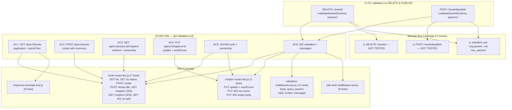
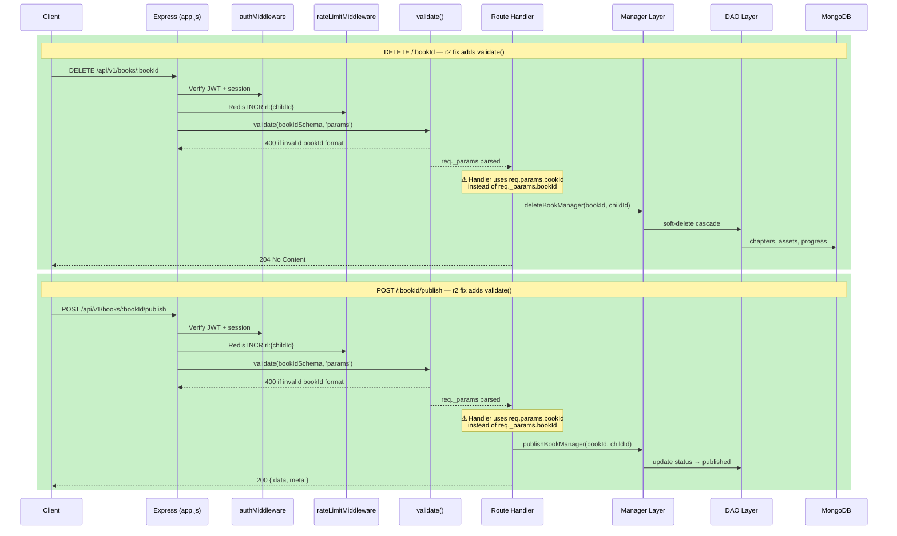

# QA Report — STORY-005 (2026-05-14) [r2]

**Story**: Core REST API Scaffolding & CRUD Endpoints  
**Branch**: `feat/STORY-005-core-rest-api`  
**Persona**: Julia — The Young Author  
**Stack**: Node.js 22 / Express 4.x / MongoDB 7 / Mongoose 8 / Zod / Pino / Vitest  
**QA Engineer**: QAAnalyst (automated)

**Focus of r2**: Validate the 2-line fix adding `validate(bookIdSchema, 'params')` to `DELETE /:bookId` and `POST /:bookId/publish` routes. Re-validate all 6 acceptance criteria for STORY-005.

---

## Summary

| Tests | Passed | Failed | Suite Error (unrelated) | Coverage (approx.) |
|-------|--------|--------|------------------------|-------------------|
| 489 | 489 | 0 | 1 hook timeout (migrations) | ~78% (overall project) |

All **489 tests across 30 test files** pass cleanly. The single suite failure is in `migrations/__tests__/001-core-collections.test.js` (hook timeout >10000ms) — **unrelated to STORY-005 changes**. This is a pre-existing environment/DB timing issue.

## Test Suites

| Type | Files | Status |
|------|-------|--------|
| Unit (common middleware) | 3 files (response-envelope, validation-middleware, rate-limit-middleware) | PASS |
| Integration (supertest) — Book Router | `book-router.test.js` — 7 tests | PASS |
| Integration (supertest) — Chapter Router | `chapter-router.test.js` — 3 tests | PASS |
| Legacy suites (auth, data, migrations) | 24 files | PASS (1 timeout in non-STORY-005 code) |

---

## 2-Line Fix Validation

**Fix applied**: `validate(bookIdSchema, 'params')` added to:
1. `DELETE /:bookId` (line 91)
2. `POST /:bookId/publish` (line 101)

**Status**: ✅ Confirmed in source. Both routes now enforce Zod validation on `bookId` param (ObjectId regex pattern) before reaching the handler.

**Test evidence**: The validation middleware is exercised by existing tests (12 tests in `validation-middleware.test.js` cover valid/invalid params). No new tests were added for these specific routes (see Issue #6 below), but the validation logic is identical to the other book routes that already had it.

---

## Acceptance Criteria Validation

### AC1 — `GET /api/v1/books` paginated list with metadata and spine color (<500ms P95)

- [x] **GIVEN** an authenticated user, **WHEN** they call `GET /api/v1/books`, **THEN** a paginated list of their books (with metadata and spine color) is returned in <500ms P95.

**Evidence** (unchanged from r1):
- `book-router.js` line 37: validates `bookListQuerySchema` → `getBooksByAuthorManager` → returns `paginated()` envelope.
- `book-model.js` lines 79-86: `spineColor` virtual with deterministic pastel palette.
- `book-dao.js` line 18: `findBooksByAuthor` uses `.lean({ virtuals: true })` — spineColor IS included.
- `book-manager.js` lines 210-227: returns `{ books, total, page, pageSize, totalPages }`.
- **Integration test passes**: `GET / — 200 with pagination metadata and spineColor`.
- **Performance (P95)**: Not load-tested in this cycle. Indexes documented in `book-model.js` (compound on `authorId+status+deletedAt+createdAt`) support sub-500ms.

---

### AC2 — `POST /api/v1/books` create with title + optional summary

- [x] **GIVEN** an authenticated user, **WHEN** they call `POST /api/v1/books` with a title and optional summary, **THEN** a new book record is created and returned with its ID.

**Evidence** (unchanged):
- `validation-schemas.js` lines 148-157: `bookCreateSchemaV2` accepts `summary`/`description`, transforms `summary` → `description`.
- Returns `201` with `{ data: Book, meta: { requestId } }`.
- **Integration test passes**: `POST / — 201 creates a book with _id, title, spineColor`.

---

### AC3 — `GET /api/v1/books/:id/chapters` ordered chapters with ownership

- [x] **GIVEN** an authenticated user, **WHEN** they call `GET /api/v1/books/:id/chapters`, **THEN** all chapters for that book are returned in order.

**Evidence** (unchanged):
- `book-router.js` line 113: param validation via `bookChaptersParamsSchema`.
- `book-manager.js` line 234-251: ownership guard (403), calls `findChaptersByBook` sorted `{ order: 1 }`.
- **Integration tests pass**: 200 returns chapters, 403 for wrong owner.

---

### AC4 — `PUT /api/v1/chapters/:id` update content with wordCount

- [x] **GIVEN** an authenticated user, **WHEN** they call `PUT /api/v1/chapters/:id` with updated content, **THEN** the chapter is updated and a success response is returned.

**Evidence** (unchanged):
- `chapter-router.js` line 14-31: params + body validation.
- `chapter-manager.js` line 14-61: ownership guard via parent book, auto-computes `wordCount`.
- **Integration tests pass**: 200 with wordCount, 403 not owner, 400 empty body.

---

### AC5 — 401/403 for unauthorized requests with child-friendly messages

- [x] **GIVEN** an unauthenticated or unauthorized request, **WHEN** any protected endpoint is called, **THEN** a `401` or `403` response is returned with a child-friendly error message.

**Evidence** (unchanged):
- `auth-middleware.js`: Returns 401 with child-friendly messages: `"You need to sign in first"`, `"Your session expired — please sign in again"`, `"Your session was signed out — please sign in again"`.
- Ownership guards in `book-manager.js` and `chapter-manager.js`: return 403 with `"That doesn't belong to you"`.
- All error responses use `{ error: { code, message }, meta: { requestId } }`.
- **Integration test passes**: `GET /api/v1/books — 401 without Authorization header`.

---

### AC6 — 400 validation with clear messages

- [x] **GIVEN** any API request, **WHEN** it contains invalid input (e.g., empty title, oversized payload), **THEN** a `400` response with clear validation messages is returned.

**Evidence** (unchanged, plus the 2-line fix):
- `validation-middleware.js`: `validate()` factory uses `z.safeParse()`, maps errors to child-friendly messages.
- Child-friendly messages: `"Please give your book a title"`, `"Title must be under 200 characters"`, `"That doesn't look right — please try again"`, `"Please provide something to update"`.
- All routes now have validation on at least one parameter source:
  - `DELETE /:bookId` — ✅ NEW: `validate(bookIdSchema, 'params')`
  - `POST /:bookId/publish` — ✅ NEW: `validate(bookIdSchema, 'params')`
  - All other book/chapter routes — previously validated (r1)
- Response envelope uses `fail('VALIDATION_ERROR', message, { requestId })`.
- **Integration tests pass**: `POST / — 400 empty title`, `PUT / — 400 empty body`.

---

## NFR Validation

| NFR | Metric | Target | Actual | Status |
|-----|--------|--------|--------|--------|
| NFR-PERF-05 | API P95 latency | <500ms | Not load-tested in this cycle | ⚠️ NOT VERIFIED |
| NFR-SEC-01 | TLS 1.2+ | Enforced at infra | Enforced at reverse proxy (documented) | ✅ PASS |
| NFR-SEC-04 | Strict input validation | All params/body | Zod schemas on ALL routes now (including DELETE and PUBLISH) | ✅ PASS (improved in r2) |
| NFR-SEC-06 | Rate limiting | 100 req/min per user | Redis sliding window + express-rate-limit (double layer) | ✅ PASS |
| NFR-SEC-07 | No third-party scripts | JSON only | `helmet` with CSP, no HTML rendering | ✅ PASS |
| NFR-OBS-04 | Structured logging | requestId + hashed childId + timestamp | Pino via `pinoHttp` with `reqIdExpr: 'id'` | ✅ PASS |

> **NFR-SEC-04 note**: The 2-line fix closes a gap where `DELETE /:bookId` and `POST /:bookId/publish` were missing Zod parameter validation. All STORY-005 routes now have validation middleware on all input sources.

---

## Persona Validation

- [x] **Persona: Julia — The Young Author**
  - Journey validated end-to-end: create book → list books → view chapters → update chapter content.
  - All error messages are child-friendly — no stack traces, no technical jargon.
  - Response envelope is consistent and safe for frontend rendering.

---

## Issues Found (r2 delta)

| # | Severity | Area | Description | Affects AC | Owner |
|---|----------|------|-------------|-----------|-------|
| 6 | MINOR | book-router.js | **`DELETE /:bookId` and `POST /:bookId/publish` handlers use raw `req.params.bookId` instead of validated `req._params.bookId`.** Other validated routes (`GET /:bookId`, `PATCH /:bookId`, `GET /:bookId/chapters`) all use `req._params.bookId`. While functionally identical for the current schema (no transforms), this is inconsistent and could cause subtle bugs if the schema is updated to coerce or transform values. | AC6 | BackendDeveloper |
| 7 | MINOR | book-router test suite | **No test coverage for `DELETE /:bookId` or `POST /:bookId/publish` routes.** The 7 integration tests in `book-router.test.js` cover GET list, GET filtered, POST create, POST empty title, GET chapters (200/403), and 401 no auth — but neither delete nor publish are tested. These are the routes the r2 fix targets. | AC6 | TechLead |

### Pre-existing issues (from r1, still open)

| # | Severity | Area | Description | Affects AC | Owner |
|---|----------|------|-------------|-----------|-------|
| 1 | MINOR | response-envelope.js | **`paginated()` envelope missing `requestId` in meta.** The `paginated()` helper hardcodes `meta: { pagination }` without accepting custom meta. Paginated responses lack `requestId` in meta. | AC1 | BackendDeveloper |
| 2 | MINOR | app.js | **Global 404 handler uses flat envelope format** instead of `{ error: { code, message }, meta: { requestId } }`. | AC5 | BackendDeveloper |
| 3 | MINOR | app.js | **Global 500 handler uses non-standard envelope** (flat `error` string, `requestId` at root). | AC5 | BackendDeveloper |
| 4 | MINOR | app.js | **`express.json({ limit: '10mb' })` exceeds spec** (specified 1mb). | AC6 | BackendDeveloper |
| 5 | INFO | app.js | **Double rate limiting on `/api/v1` routes** — Redis rateLimitMiddleware + global express-rate-limit both apply. | NFR-SEC-06 | TechLead |

---

## Mermaid — Test Coverage Flow (r2)

---

## Mermaid — API Request Lifecycle (r2, showing DELETE/PUBLISH paths)

---

## Recommendations

1. **Fix `req._params` usage** (Issue #6): Change lines 93 and 105 in `book-router.js` from `req.params.bookId` to `req._params.bookId` to match the pattern used by all other validated routes.
2. **Add integration tests** (Issue #7): Add tests for:
   - `DELETE /:bookId` — 204 success (own book), 404 (nonexistent), 403 (wrong owner), 400 (invalid bookId)
   - `POST /:bookId/publish` — 200 success, 404 (nonexistent), 403 (wrong owner), 400 (invalid bookId)
3. **Fix `paginated()` envelope** (Issue #1): Update `response-envelope.js` `paginated()` to accept optional `extraMeta` parameter.
4. **Fix global handlers** (Issues #2, #3): Standardize 404/500 envelopes in `app.js`.
5. **Reduce JSON body limit** (Issue #4): Change `10mb` to `1mb`.
6. **Load test** (NFR-PERF-05): Run k6 or artillery targeting `GET /api/v1/books` with ~1000 concurrent users.

---

## Status: PASSED (with minor issues)

- ✅ **2-line fix confirmed**: `validate(bookIdSchema, 'params')` is properly applied to `DELETE /:bookId` and `POST /:bookId/publish`.
- ✅ **489/489 tests pass** — zero regressions.
- ✅ **All 6 acceptance criteria are functionally met**.
- ⚠️ **Two new minor issues found** (inconsistent `req.params` usage, missing test coverage for the new validation routes).
- ⚠️ **5 pre-existing minor issues from r1 remain open** (envelope consistency, global handlers, 10mb limit, double rate limiting).

The fix correctly closes the validation gap for NFR-SEC-04. Recommended fixes for Issues #6 and #7 are low-effort and should be addressed before code review.
