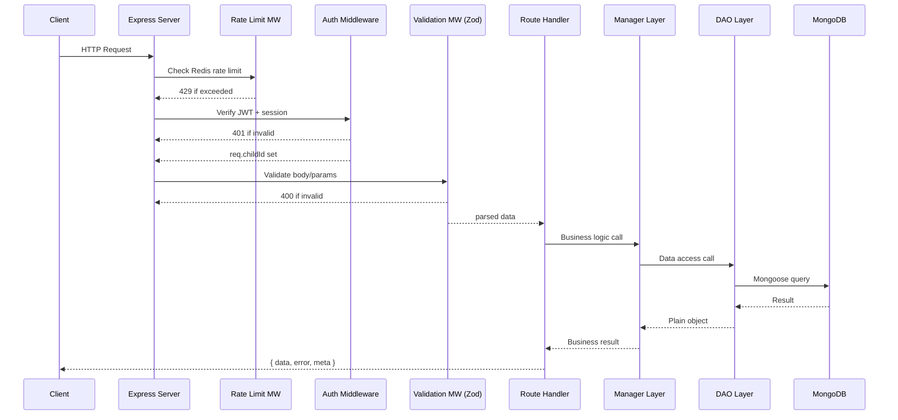
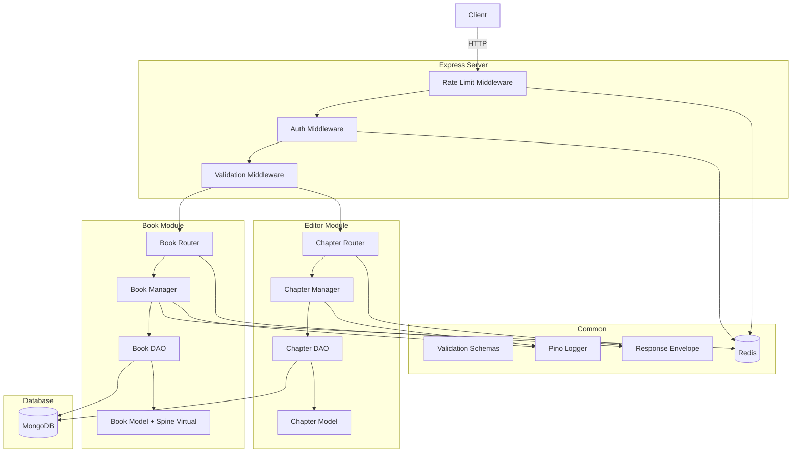
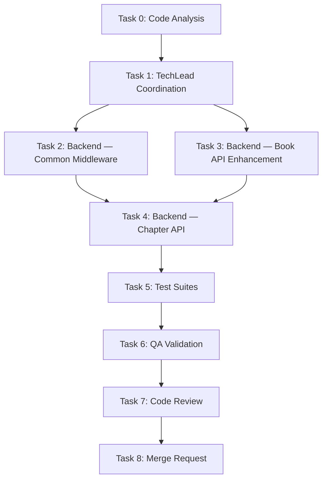

# STORY-005: Technical Analysis — Core REST API Scaffolding & CRUD Endpoints

**Epic**: EPIC-010  
**Parent**: STORY-005  
**Persona**: Julia — The Young Author  
**Stack**: Node.js 22 / Express 4.x / MongoDB 7 / Mongoose 8 / Zod / Pino / Vitest  
**Language**: Node.js  
**Frontend**: React 18 + Vite (SPA mode — typed API client, CORS, JWT manual handling)

---

## 1. Overview

- STORY-005 delivers the **REST API layer** wiring existing data models (STORY-004) to authenticated HTTP endpoints.
- Four CRUD endpoints: books list (paginated), book create, chapters list, chapter update.
- Auth middleware already exists; validation schemas exist but need **chapter update (PUT)** schema addition.
- Key gaps: spine-color virtual on Book model, pagination metadata in list responses, chapter-update route under a dedicated `/api/v1/chapters/:id` path, rate-limit middleware, validation middleware refactor, and integration tests.

---

## 2. Modules to Create / Modify

### New Files

| File | Purpose |
|------|---------|
| `src/app/common/rate-limit-middleware.js` | Per-user rate limiting (100 req/min) using Redis |
| `src/app/common/validation-middleware.js` | Generic Zod validation middleware factory (replaces inline `safeParse`) |
| `src/app/common/response-envelope.js` | Standard `{ data, error, meta }` response helpers |
| `src/app/book/__tests__/book-router.test.js` | Integration tests (Supertest) for book endpoints |
| `src/app/editor/chapter-router.js` | Chapter CRUD routes (standalone `/api/v1/chapters` prefix) |
| `src/app/editor/chapter-manager.js` | Chapter business logic (update, ownership check) |
| `src/app/editor/__tests__/chapter-router.test.js` | Integration tests for chapter endpoints |

### Modified Files

| File | Change |
|------|--------|
| `src/app/book/book-model.js` | Add `spineColor` virtual field |
| `src/app/book/book-router.js` | Replace inline validation with `validate()` middleware; add pagination metadata; add rate-limit; add `summary` alias for `description` |
| `src/app/book/book-manager.js` | Return pagination metadata (`total`, `page`, `pageSize`) from `getBooksByAuthorManager` |
| `src/app/book/book-dao.js` | `findBooksByAuthor` already supports `limit`/`skip`; add `countBooksByAuthor` call support |
| `src/app/common/validation-schemas.js` | Add `chapterPutSchema` for `PUT /api/v1/chapters/:id` |
| `src/app/server.js` (or `src/app/index.js`) | Mount `editor/chapter-router` at `/api/v1/chapters`; enable rate-limit middleware globally on API routes |

---

## 3. Data Flow



---

## 4. API Endpoints

### 4.1 GET /api/v1/books — List User's Books (Paginated)

| Field | Value |
|-------|-------|
| **Method** | `GET` |
| **Path** | `/api/v1/books` |
| **Auth** | Bearer JWT (authMiddleware) |
| **Request Validation** | Query params: `status` (optional, enum `draft\|published\|archived`), `page` (optional, int ≥1, default 1), `pageSize` (optional, int 1–100, default 20) |
| **Success Response** | `200` — `{ data: BookWithSpine[], meta: { requestId, pagination: { total, page, pageSize, totalPages } } }` |
| **Error Responses** | `401` UNAUTHORIZED, `429` RATE_LIMITED |

**Zod Schema:**
```js
import { z } from 'zod';

export const bookListQuerySchema = z.object({
  status: z.enum(['draft', 'published', 'archived']).optional(),
  page: z.coerce.number().int().min(1).default(1),
  pageSize: z.coerce.number().int().min(1).max(100).default(20),
});
```

**Spine Color Virtual (added to book-model.js):**
```js
bookSchema.virtual('spineColor').get(function () {
  // Deterministic pastel from book ID — child-safe palette
  const palette = ['#FF6B6B', '#4ECDC4', '#45B7D1', '#96CEB4', '#FFEAA7', '#DDA0DD', '#98D8C8'];
  const idx = this._id.toString().split('').reduce((acc, ch) => acc + ch.charCodeAt(0), 0) % palette.length;
  return palette[idx];
});

bookSchema.set('toObject', { virtuals: true });
bookSchema.set('toJSON', { virtuals: true });
```

**Response Envelope Helper:**
```js
// src/app/common/response-envelope.js
export function ok(data, meta = {}) {
  return { data, meta };
}

export function paginated(data, pagination) {
  return { data, meta: { pagination } };
}

export function fail(code, message, meta = {}) {
  return { error: { code, message }, meta };
}
```

---

### 4.2 POST /api/v1/books — Create Book

| Field | Value |
|-------|-------|
| **Method** | `POST` |
| **Path** | `/api/v1/books` |
| **Auth** | Bearer JWT (authMiddleware) |
| **Request Validation** | `bookCreateSchema` (already exists) — `title` (1–200 chars, trimmed), `description`/`summary` (0–2000, optional, default `""`), `language` (max 5, optional, default `pt-BR`) |
| **Success Response** | `201` — `{ data: Book, meta: { requestId } }` |
| **Error Responses** | `400` VALIDATION_ERROR, `401` UNAUTHORIZED, `403` BOOK_LIMIT_REACHED, `429` RATE_LIMITED |

**Note:** The story mentions "summary" as the optional field. The existing model uses `description`. The router should accept both `summary` and `description` in the create schema, mapping `summary` → `description` internally.

```js
export const bookCreateSchemaV2 = z.object({
  title: z.string().min(1).max(200).trim(),
  summary: z.string().max(2000).trim().optional().default(''),
  description: z.string().max(2000).trim().optional(),
  language: z.string().max(5).optional().default('pt-BR'),
}).transform((data) => ({
  title: data.title,
  description: data.summary || data.description || '',
  language: data.language,
}));
```

---

### 4.3 GET /api/v1/books/:id/chapters — List Chapters for a Book

| Field | Value |
|-------|-------|
| **Method** | `GET` |
| **Path** | `/api/v1/books/:bookId/chapters` |
| **Auth** | Bearer JWT (authMiddleware) |
| **Request Validation** | Params: `bookId` (ObjectId) |
| **Success Response** | `200` — `{ data: Chapter[], meta: { requestId } }` |
| **Error Responses** | `400` VALIDATION_ERROR, `401` UNAUTHORIZED, `403` FORBIDDEN (not book owner), `404` NOT_FOUND, `429` RATE_LIMITED |

**Business logic:** Manager must verify `book.authorId === req.childId` before returning chapters. Current `getChaptersByBookManager` only fetches — needs ownership guard.

**Zod Schema (params):**
```js
export const bookChaptersParamsSchema = z.object({
  bookId: z.string().regex(objectIdRegex, 'Invalid book ID format'),
});
```

---

### 4.4 PUT /api/v1/chapters/:id — Update Chapter Content

| Field | Value |
|-------|-------|
| **Method** | `PUT` |
| **Path** | `/api/v1/chapters/:chapterId` |
| **Auth** | Bearer JWT (authMiddleware) |
| **Request Validation** | Params: `chapterId` (ObjectId). Body: `chapterPutSchema` (see below) |
| **Success Response** | `200` — `{ data: Chapter, meta: { requestId } }` |
| **Error Responses** | `400` VALIDATION_ERROR, `401` UNAUTHORIZED, `403` FORBIDDEN (not chapter's book owner), `404` NOT_FOUND, `429` RATE_LIMITED |

**Zod Schema:**
```js
export const chapterPutSchema = z.object({
  chapterId: z.string().regex(objectIdRegex, 'Invalid chapter ID format'),
});

export const chapterPutBodySchema = z.object({
  title: z.string().min(1).max(200).trim().optional(),
  content: z.string().optional(),
  wordCount: z.number().int().min(0).optional(),
}).refine((data) => data.title !== undefined || data.content !== undefined || data.wordCount !== undefined, {
  message: 'At least one field must be provided for update',
});
```

**Business logic (new `updateChapterManager`):**
1. Fetch chapter by `chapterId`; 404 if not found or soft-deleted.
2. Fetch parent book by `chapter.bookId`; verify `book.authorId === req.childId`; 403 if mismatch.
3. If `content` is provided, compute `wordCount` automatically (split on whitespace).
4. Call `updateChapterById(chapterId, updates)`.
5. Audit log: `chapter.update`.

### Endpoint Path Rationale

The story explicitly says `PUT /api/v1/chapters/:id` (chapter-level path, not nested under books). This requires a new standalone router mounted at `/api/v1/chapters`. The existing placeholder routes under `book-router` (`PATCH /:bookId/chapters/:chapterId`) will be deprecated/removed in favor of this new structure.

---

## 5. Error Handling & Edge Cases

| Scenario | HTTP Status | Code | Child-Friendly Message |
|----------|-------------|------|----------------------|
| Missing Bearer token | `401` | `UNAUTHORIZED` | "You need to sign in first" |
| Expired JWT | `401` | `TOKEN_EXPIRED` | "Your session expired — please sign in again" |
| Revoked token | `401` | `TOKEN_REVOKED` | "Your session was signed out — please sign in again" |
| Access another user's book | `403` | `FORBIDDEN` | "That doesn't belong to you" |
| Book limit (100) reached | `403` | `BOOK_LIMIT_REACHED` | "You've reached the maximum number of books" |
| Empty title on create | `400` | `VALIDATION_ERROR` | "Please give your book a title" |
| Title > 200 chars | `400` | `VALIDATION_ERROR` | "Title must be under 200 characters" |
| Invalid ObjectId path param | `400` | `VALIDATION_ERROR` | "That doesn't look right — please try again" |
| Book not found | `404` | `NOT_FOUND` | "We couldn't find that book" |
| Rate limit exceeded | `429` | `RATE_LIMITED` | "Slow down — try again in a minute" |
| Internal error | `500` | `INTERNAL_ERROR` | "Something went wrong — please try again later" |
| Redis unavailable | `503` | `SERVICE_UNAVAILABLE` | "We're having trouble right now — please try again later" |

**Error response format (all paths):**
```json
{
  "error": { "code": "VALIDATION_ERROR", "message": "..." },
  "meta": { "requestId": "..." }
}
```

**No stack traces, no internal paths, no SQL/Mongo query details in production responses.**

---

## 6. Testing Strategy

### Unit Tests (Vitest)

| Module | Key Assertions |
|--------|---------------|
| `book-manager.js` | `createBookManager`: enforces MAX_BOOKS_PER_USER limit, audit log fired |
| `book-manager.js` | `getBooksByAuthorManager`: returns pagination metadata |
| `chapter-manager.js` | `updateChapterManager`: ownership check, wordCount auto-compute |
| `validation-schemas.js` | `bookCreateSchemaV2`, `chapterPutBodySchema`, `bookListQuerySchema` — valid/invalid cases |

### Integration Tests (Supertest)

| Endpoint | Key Scenarios |
|----------|--------------|
| `GET /api/v1/books` | 200 with pagination, 401 without token, 429 on rate limit |
| `POST /api/v1/books` | 201 create, 400 empty title, 403 limit reached, 401 no token |
| `GET /api/v1/books/:id/chapters` | 200 ordered chapters, 403 wrong owner, 404 book not found |
| `PUT /api/v1/chapters/:id` | 200 update content, 403 wrong owner, 404 chapter not found, 400 no fields |

**Test helpers:**
- Auth helper: generate JWT for test user, set `Authorization: Bearer <token>` header
- Redis mock: `ioredis-mock` or `redis-mock` for rate limiting tests
- MongoDB: in-memory `mongodb-memory-server` or test database with `beforeAll`/`afterAll` lifecycle

---

## 7. Performance & Security

### Performance (NFR-PERF-05: P95 < 500ms)

| Optimization | Detail |
|-------------|--------|
| **Compound index** | `Book` already indexed on `{ authorId: 1, status: 1, deletedAt: 1, createdAt: -1 }` — covers paginated list |
| **Compound index** | `Chapter` indexed on `{ bookId: 1, order: 1, deletedAt: 1 }` — covers ordered chapter list |
| **Lean queries** | All DAOs use `.lean()` — no Mongoose document overhead |
| **Pagination** | Skip/limit with count query; consider cursor-based for >10k books per user (unlikely) |
| **Redis caching** | Rate-limit counters in Redis; no book/chapter caching needed initially |
| **Payload size** | Express `json()` limit set to `1mb` to reject oversized payloads early |

### Security (NFR-SEC-01/04/06/07)

| Control | Detail |
|---------|--------|
| **TLS 1.2+** | Enforced at reverse proxy / load balancer (not Express) |
| **Input validation** | Zod schemas on all endpoints — reject unexpected fields via `.strict()` on body schemas |
| **Rate limiting** | Redis-based sliding window, 100 req/min per `childId`, returns `429` with `Retry-After` header |
| **No injection** | Mongoose parameterized queries; Zod sanitizes strings (`.trim()`); never pass raw user input to `$where` or map-reduce |
| **No XSS in responses** | Content-Type: application/json; no HTML rendering; `helmet` middleware for CSP headers |
| **Child-safe errors** | No stack traces, no internal paths, no DB error details — all wrapped in envelope |
| **Request ID** | `express-request-id` or `uuid` middleware; included in `meta.requestId` and Pino logs |

### Rate Limit Middleware Design

```js
// src/app/common/rate-limit-middleware.js
// Sliding window counter in Redis: key = rl:{childId}, TTL = 60s
// On each request: INCR + EXPIRE (if new key). If count > 100, return 429.
import redis from '../../config/redis.js';
import pino from 'pino';

const logger = pino({ name: 'rate-limit', level: process.env.LOG_LEVEL || 'info' });
const WINDOW_SECONDS = 60;
const MAX_REQUESTS = 100;

export const rateLimitMiddleware = async (req, res, next) => {
  if (!req.childId) return next(); // Skip if not authenticated (auth middleware runs first)

  const key = `rl:${req.childId}`;
  try {
    const count = await redis.incr(key);
    if (count === 1) await redis.expire(key, WINDOW_SECONDS);
    if (count > MAX_REQUESTS) {
      res.set('Retry-After', String(WINDOW_SECONDS));
      return res.status(429).json({
        error: { code: 'RATE_LIMITED', message: 'Slow down — try again in a minute' },
        meta: { requestId: req.id },
      });
    }
    next();
  } catch (err) {
    logger.warn({ err }, 'Rate limit Redis error — allowing request');
    next(); // Fail open — don't block on Redis failure
  }
};
```

---

## 8. OpenAPI / Swagger Generation Approach

**Recommended**: `swagger-jsdoc` + `swagger-ui-express`

1. Add JSDoc annotations above each route handler in the router files.
2. Generate spec at startup from `swagger-jsdoc` scanning all `*-router.js` files.
3. Serve at `GET /api/v1/docs` (dev/staging only, disabled in production via env var).
4. Include Zod-to-OpenAPI conversion via `zod-openapi` or manually sync schemas.

**Example annotation:**
```js
/**
 * @openapi
 * /api/v1/books:
 *   get:
 *     summary: List authenticated user's books
 *     tags: [Books]
 *     security:
 *       - bearerAuth: []
 *     parameters:
 *       - in: query
 *         name: page
 *         schema: { type: integer, default: 1 }
 *       - in: query
 *         name: pageSize
 *         schema: { type: integer, default: 20, maximum: 100 }
 *     responses:
 *       200:
 *         description: Paginated list of books
 *       401:
 *         description: Unauthorized
 */
```

---

## 9. Acceptance Criteria Mapping

| AC# | Requirement | Implementation | Test |
|-----|-------------|----------------|------|
| AC1 | `GET /api/v1/books` paginated with metadata + spine color | `bookListQuerySchema`, `getBooksByAuthorManager` returns `{ data, meta: { pagination } }`, Book model gains `spineColor` virtual | Integration: 200 paginated, pagination metadata present, spineColor in response |
| AC2 | `POST /api/v1/books` create with title + optional summary | `bookCreateSchemaV2` (accepts `summary` → `description`), `createBookManager`, 201 response | Integration: 201 create, 400 empty title, 403 book limit |
| AC3 | `GET /api/v1/books/:id/chapters` ordered chapters | `bookChaptersParamsSchema`, ownership guard in manager, `findChaptersByBook` sorted by `order` | Integration: 200 ordered list, 403 wrong owner |
| AC4 | `PUT /api/v1/chapters/:id` update content | New `chapter-router.js` at `/api/v1/chapters`, `chapterPutBodySchema`, `updateChapterManager` with ownership + wordCount | Integration: 200 update, 403 wrong owner, 400 no fields |
| AC5 | 401/403 for unauthorized | `authMiddleware` (401), ownership check in managers (403), child-friendly messages | Integration: 401 no token, 403 wrong owner |
| AC6 | 400 validation with clear messages | Zod `safeParse` → child-friendly mapped messages, `validation-middleware.js` factory | Unit: schema edge cases; Integration: 400 bad input |

---

## 10. Architecture Diagram



---

## 11. Task Decomposition & Execution Order



| Task | Agent | Description | Depends On |
|------|-------|-------------|------------|
| 0 | CodeAnalyzer | Analyze existing book/editor module code, identify integration points | — |
| 1 | TechLead | Coordinate implementation across tasks | 0 |
| 2 | BackendDeveloper | Create `rate-limit-middleware.js`, `validation-middleware.js`, `response-envelope.js`; add `spineColor` virtual to Book model; enhance `book-router.js` with pagination + `summary` field | 1 |
| 3 | BackendDeveloper | Create `chapter-router.js`, `chapter-manager.js`; implement `PUT /api/v1/chapters/:id` with ownership guard and wordCount auto-compute; mount router in server | 2 |
| 4 | TestEngineer | Write unit tests for managers; write integration tests (Supertest) for all 4 endpoints + auth + validation + rate limit | 2, 3 |
| 5 | QAAnalyst | Validate against all 6 acceptance criteria; run k6 load test for P95 <500ms | 4 |
| 6 | CodeReviewer | Review all new/modified files for security, child-safe errors, quality | 5 |
| 7 | MergeRequestCreator | Create MR with traceability to STORY-005 | 6 |

---

## 12. Risk Assessment

| Risk | Likelihood | Impact | Mitigation |
|------|-----------|--------|------------|
| Rate limit Redis failure blocks all requests | Medium | High | Fail-open strategy — log warning, allow request through |
| Spine color hash collision across books | Low | Low | Palette has 7 colors — acceptable for visual categorization |
| Ownership check N+1 on chapter update | Low | Medium | Single `findChapterById` + `findBookById` (2 queries total, both indexed) |
| `summary` / `description` field confusion | Medium | Low | Schema `.transform()` normalizes; API docs clarify both accepted |
| Pagination performance on large datasets | Low | Medium | Compound index covers `authorId + createdAt`; cursor-based fallback available |

---

## 13. NFR Analysis

| NFR | Target | Approach |
|-----|--------|----------|
| **NFR-PERF-05** | P95 < 500ms | Indexed queries, `.lean()`, Redis rate limit, pagination (no unbounded lists) |
| **NFR-SEC-01** | TLS 1.2+ | Enforced at infra level (reverse proxy); Express redirects HTTP → HTTPS |
| **NFR-SEC-04** | Strict input validation | Zod `.strict()` on body schemas; all path/query params validated |
| **NFR-SEC-06** | Rate limiting 100 req/min | Redis sliding window; fail-open on Redis error |
| **NFR-SEC-07** | No third-party scripts via API | JSON-only responses; `helmet` CSP headers; no HTML rendering |
| **NFR-OBS-04** | Structured logging | Pino with `requestId` + hashed `childId` + timestamp on every API call |