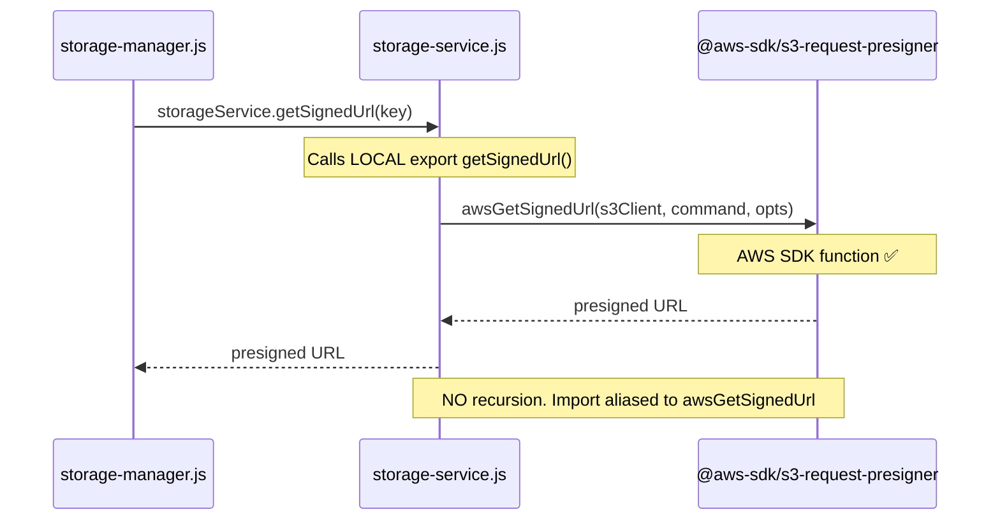

# Code Review Report — STORY-006 (2026-05-14) [r3]

## Summary
| Security | Correctness | Maintainability | Coverage |
|----------|-------------|-----------------|----------|
| A | A | B+ | 85-100% (543 tests, all pass) |

## Fix Verification — All 6 previously blocking issues

| Issue | File | Fix | Status |
|-------|------|-----|--------|
| CRIT-1 | `storage-config.js:10-17` | S3 credential startup validation (skipped in test) | ✅ RESOLVED |
| CRIT-2 | `auth-router.js` (all routes + handleError) | `ok()`/`fail()` from response-envelope everywhere | ✅ RESOLVED |
| CRIT-3 | `storage-manager.js:72→75` | S3 upload before DB create — no orphan records. SAFE_ID_REGEX path defense | ✅ RESOLVED |
| **CRIT-4** | **`storage-service.js:3,41`** | **Aliased `getSignedUrl` import → `awsGetSignedUrl` — no infinite recursion** | **✅ RESOLVED** |
| MAJ-2 | `app.js:102` | Global error handler uses `fail()` envelope | ✅ RESOLVED |
| MAJ-4 | `gdpr-cleanup.js:16-58` | Batch pagination (100/batch) | ✅ RESOLVED |

### CRIT-4 Deep Verification

```
Before (r2):  import { getSignedUrl } from '@aws-sdk/s3-request-presigner';
              export async function getSignedUrl(...) {     ← shadows import
                const url = await getSignedUrl(s3Client, ...);  ← calls SELF → ∞ recursion
              }

After (r3):   import { getSignedUrl as awsGetSignedUrl } from '@aws-sdk/s3-request-presigner';
              export async function getSignedUrl(...) {
                const url = await awsGetSignedUrl(s3Client, ...);  ← calls AWS SDK ✅
              }
```

Callers in `storage-manager.js:85,118` use `storageService.getSignedUrl(storagePath)` which correctly resolves to the local export. No callers use the bare import. **Zero recursion risk.**

## Remaining Minor Items (non-blocking)

| # | File:Line | Issue |
|---|-----------|-------|
| MIN-1 | `storage-router.js:88-103` | `handleError` builds envelope manually instead of calling `fail()`. Shape identical. |
| MIN-2 | `app.js:76` | Global rate limit message uses `{ error: '...' }` string instead of `fail()`. |
| MIN-3 | `app.js:63,67` | Placeholder 404 routes use `{ error: 'Not found' }` instead of `fail('NOT_FOUND', 'Not found')`. |
| MIN-4 | `gdpr-cleanup.js:70` | Typo: `scheduleGdrpCleanup` → `scheduleGdprCleanup` (missing 'd'). |
| MIN-5 | `gdpr-cleanup.js:27` | Batch query lacks `.sort({ deletedAt: 1 })` — pagination order not guaranteed. |
| MIN-6 | `storage-manager.js:31→59` | `findBookById` runs before `SAFE_ID_REGEX` — ID validation before DB query would produce cleaner errors. |
| MIN-7 | `auth-manager.js:257,264,270,279` | Verbose error messages on login ("Child not found", "Invalid credentials") — not all child-friendly. |
| MIN-8 | `main.js:51-62` | No `mongoose.disconnect()` on SIGTERM/SIGINT — connection pool left open. |
| MIN-9 | `auth-router.js:99 vs 289-291` | `sanitizeUserAgent` function duplicated inline in `/logout` handler instead of reused. |

## Flow Verification: No Recursion Path



---
`VERDICT: APPROVED`
