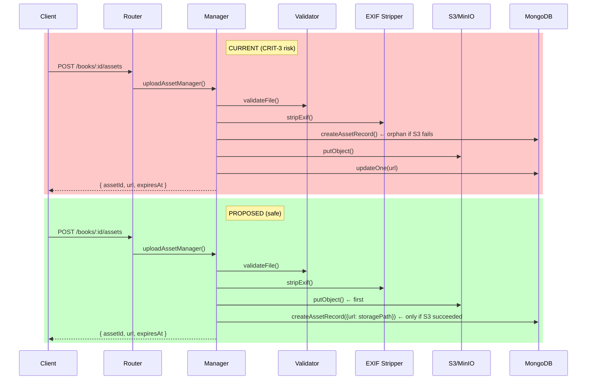
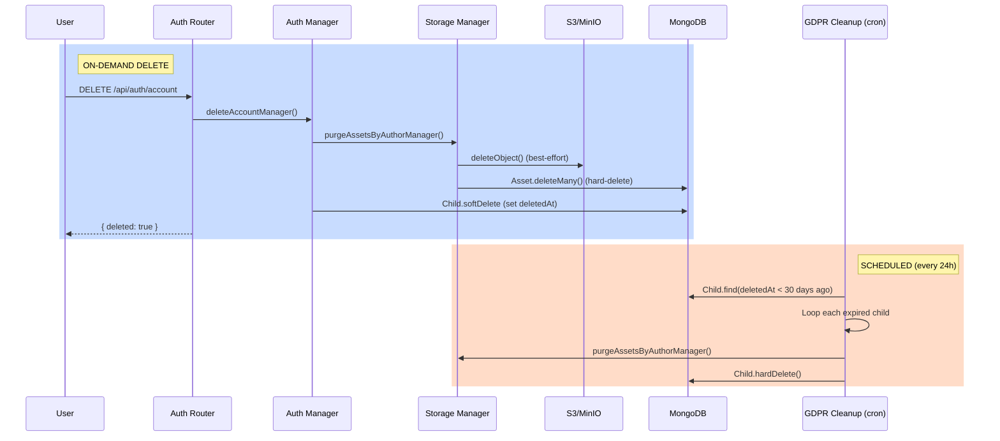

# Code Review Report — STORY-006 (2026-05-14) [r1]

## Summary
| Security | Correctness | Maintainability | Coverage |
|----------|-------------|-----------------|----------|
| B | B+ | B+ | Has tests |

---

## Critical Issues

### CRIT-1: S3 credentials may be undefined — no startup validation
**File:** `storage-config.js:4-7`
**Problem:** `accessKey` / `secretKey` set from `process.env.S3_ACCESS_KEY || process.env.R2_ACCESS_KEY`. If neither env var defined, both are `undefined`. `S3Client` only fails at first actual S3 call with cryptic AWS error.
**Fix:** Add startup guard: `if (!accessKey || !secretKey) throw new Error('S3/R2 credentials not configured')` before creating client. Consider validating in `main.js` startup sequence.

### CRIT-2: auth-router.js never uses `ok()`/`fail()` from response-envelope
**File:** `auth-router.js` (all routes: L120-123, L141-144, L155-159, L175-178, L191-194, L208-211, etc.)
**Problem:** Every response uses inline format `{ error: { code, message }, meta: { requestId } }` or `{ data: ..., meta: { requestId } }` instead of imported `ok()`/`fail()`. Project standard (api-design.md) mandates response envelope. storage-router.js does use them — auth-router is inconsistent.
**Fix:** Import `{ ok, fail }` from `response-envelope.js` and replace all inline responses. Example:
```js
// Instead of:
return res.status(201).json({ data: { parentId: ... }, meta: { requestId } });
// Use:
return res.status(201).json(ok({ parentId: ... }, { requestId }));
```

### CRIT-3: Orphaned asset record on failed S3 upload
**File:** `storage-manager.js:60-75`
**Problem:** Asset record created in MongoDB (L60-67) BEFORE S3 upload (L72). If `putObject` throws (network blip, S3 down, bucket missing), orphaned asset record remains in DB — no cleanup, no rollback.
**Fix:** Reverse order: (1) upload to S3 first, (2) THEN create asset record with real `storagePath`. If S3 fails, no DB pollution. If S3 succeeds but DB fails, S3 object becomes orphan but that's easier to detect via listing. Better: wrap in transaction or add compensation logic on failure.

---

## Major Issues

### MAJ-1: auth-router handleError doesn't use `fail()` helper
**File:** `auth-router.js:434-437`
**Problem:** `handleError` builds inline error response instead of calling `fail()`. storage-router.js `handleError` has same issue (L99-102).
**Fix:** Replace with `res.status(status).json(fail(code, message, { requestId }))`.

### MAJ-2: Global error handler uses wrong envelope shape
**File:** `app.js:101-104`
**Problem:** Global error handler returns `{ error: 'Internal server error', requestId }` — string `error` field instead of `{ code, message }` object. Inconsistent with `ok()`/`fail()` envelope where `error` is `{ code, message }`.
**Fix:** Change to `fail('INTERNAL_ERROR', 'Internal server error', { requestId })`.

### MAJ-3: No path traversal defense in storage path construction
**File:** `storage-manager.js:69`
**Problem:** Storage path built via template literal `users/${childId}/books/${bookId}/assets/${assetRecord._id}.${ext}`. `childId`, `bookId` come from URL params. Though validated as ObjectId (24 hex chars), defense-in-depth principle says: strip/sanitize.
**Fix:** Low probability since ObjectId regex is strict, but add explicit guard: if path contains `..` or `/`, throw. Or validate all components individually.

### MAJ-4: gdpr-cleanup.js queries all expired children — no pagination
**File:** `gdpr-cleanup.js:17`
**Problem:** `Child.find({ deletedAt: { $lt: cutoff } }).lean()` loads ALL expired children into memory. On a mature system with thousands of deleted accounts, this is a memory/time bomb.
**Fix:** Use cursor-based batch processing or `limit` + `skip` pagination. Process in batches of 100.

---

## Minor Issues

### MIN-1: storage-config.js: no startup env validation at all
**File:** `storage-config.js:4-16`
**Issue:** `BUCKET_NAME` defaults to 'contopia-assets'. If env var not set, silently uses default. Could deploy with wrong bucket in prod.
**Fix:** Log a warning at startup if using default values: `logger.warn({ bucket: BUCKET_NAME }, 'S3 bucket using default value — verify env config')`.

### MIN-2: asset-model.js is a redundant re-export
**File:** `asset-model.js:1-3`
**Issue:** Single-line re-export from `book-model.js`. Adds module boundary but zero value. If storage module should own its model, define it here. If not, delete this file and import directly from `book-model.js`.
**Suggestion:** Either delete `asset-model.js` (import `Asset` from `book-model.js` in `storage-manager.js`) or move the Asset schema definition here.

### MIN-3: storage-router handleError returns non-envelope for 500
**File:** `storage-router.js:99-102`
**Issue:** Uses inline `{ error: { code, message }, meta }` instead of `fail()`. Same as MAJ-1.
**Fix:** Use `fail()` for consistency.

### MIN-4: auth-router sanitizeUserAgent duplicated
**File:** `auth-router.js:101-105` and `auth-router.js:330-331`
**Issue:** `sanitizeUserAgent` function exists but `/logout` route (L330-331) duplicates the logic inline instead of calling the function.
**Fix:** Use `sanitizeUserAgent(req)` in `/logout` handler.

### MIN-5: auth-manager login error messages not child-friendly
**File:** `auth-manager.js:257, 264, 270, 279`
**Issue:** Errors like "Child not found", "Password not set for this account", "Invalid credentials" exposed to user-facing API. Per project standards, errors should be child-friendly.
**Fix:** Map to softer messages: "We couldn't find your account" instead of "Child not found". "Oops! Wrong password — try again" instead of "Invalid credentials".

### MIN-6: main.js missing MongoDB disconnect on shutdown
**File:** `main.js:51-62`
**Issue:** `SIGTERM`/`SIGINT` handlers call `redis.quit()` but not `mongoose.disconnect()`. Connection pool holds resources.
**Fix:** Add `await mongoose.disconnect()` before `process.exit(0)`.

### MIN-7: storage-manager.js creates session then re-creates access token — redundant
**File:** `auth-manager.js:286-299`
**Issue:** `loginWithPassword` calls `generateAccessToken(child)` (L286), then `createSession` (L289-296), then `generateAccessToken(child, sessionId)` (L299) to get token with `sid` claim. First token is wasted work.
**Fix:** Pass sessionId placeholder or restructure: generate access token once after session created.

### MIN-8: refreshSession scans Redis keys — O(n) per refresh
**File:** `auth-manager.js:460-473`
**Issue:** Uses `redis.scanIterator` to find session by childId. Redis SCAN is O(n) over keyspace. Adds latency on every token refresh.
**Fix:** Store session ID in a direct key e.g. `activeSession:{childId}` → `sessionId`, then look up `session:{childId}:{sessionId}` in O(1).

---

## Positive Observations

- ✅ **Strong file validation**: MIME whitelist + magic bytes + size check — proper defense in depth
- ✅ **EXIF stripping**: Uses sharp to auto-orient and strip all metadata. Privacy win for kids.
- ✅ **Single-session policy**: `createSession` scans and kills old sessions — prevents session hijacking accumulation
- ✅ **Rate limiting on all auth endpoints**: Register (5/hr), login (5/15min), verify (30/hr), refresh (10/15min) — well-tuned against brute force
- ✅ **Rate limit with Redis failover**: Falls back to memory store gracefully
- ✅ **Token blacklist**: Both access and refresh tokens blacklisted on logout with correct TTL
- ✅ **GDPR purge wiring**: `deleteAccountManager` → `purgeAssetsByAuthorManager` → S3 delete + hard MongoDB delete. Scheduler handles 30-day expiry. Clean pipeline.
- ✅ **Soft-delete pattern**: All entities use `deletedAt` with `partialFilterExpression` indexes — proper data retention
- ✅ **Auth middleware robustness**: Returns 503 on Redis failure (not 401) — graceful degradation
- ✅ **Zod validation on all routes**: ObjectId regex, email format, string lengths enforced
- ✅ **Tests exist**: auth-dao, auth-router-account, auth-manager-delete, gdpr-cleanup, storage-manager tests present

---

## Rework Delegation

| Agent | File:Line | Issue |
|-------|-----------|-------|
| BackendDeveloper | `storage-config.js:4-7` | CRIT-1: Add S3 credential validation |
| BackendDeveloper | `auth-router.js` (all routes) | CRIT-2: Replace inline responses with `ok()`/`fail()` |
| BackendDeveloper | `storage-manager.js:60-75` | CRIT-3: Reverse order — S3 upload before DB create |
| BackendDeveloper | `auth-router.js:434-437`, `storage-router.js:99-102` | MAJ-1, MIN-3: Use `fail()` in error handlers |
| BackendDeveloper | `app.js:101-104` | MAJ-2: Fix global error handler envelope shape |
| BackendDeveloper | `storage-manager.js:69` | MAJ-3: Add path traversal guard |
| BackendDeveloper | `gdpr-cleanup.js:17` | MAJ-4: Add pagination to expired children query |
| BackendDeveloper | `main.js:51-62` | MIN-6: Add `mongoose.disconnect()` on shutdown |

---

## Diagram: Asset Upload Flow (Current vs. Proposed)



## Diagram: GDPR Purge Pipeline



---

## Verdict: BLOCKED — requires rework

**3 Critical issues** (credential validation, response envelope inconsistency, orphaned records) and **4 Major issues** must be resolved before approval.
