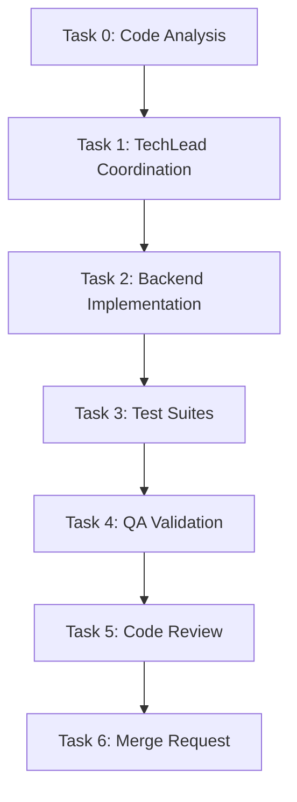
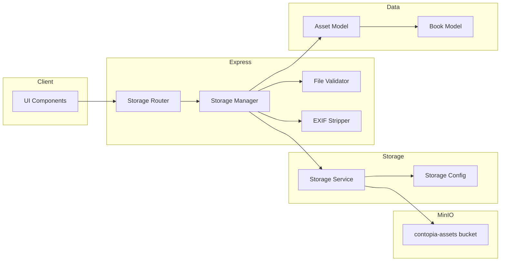

# STORY-006: Technical Analysis — Secure Asset Storage & CDN Setup

**Epic**: EPIC-010  
**Stack**: Node.js 22 / Express 4.x / MongoDB 7 / Mongoose 8 / MinIO (S3-compatible) / sharp / multer  
**Language**: Node.js

---

## 1. Overview

STORY-006 delivers secure image upload, EXIF stripping, and time-limited signed URL access via MinIO (S3-compatible) object storage. Covers book assets (covers, spines, edges) only.

---

## 2. Modules to Create / Modify

### New Files

| File | Purpose |
|------|---------|
| `src/app/storage/storage-config.js` | MinIO client initialization, bucket config |
| `src/app/storage/storage-service.js` | Upload, download (signed URL), delete wrappers around S3 API |
| `src/app/storage/file-validator.js` | MIME type whitelist (image/png, image/jpeg, image/webp), magic bytes check, size ≤5MB |
| `src/app/storage/exif-stripper.js` | sharp-based EXIF/metadata removal |
| `src/app/storage/storage-router.js` | POST /api/v1/books/:bookId/assets, GET /api/v1/assets/:assetId |
| `src/app/storage/storage-manager.js` | Business logic: ownership check, metadata persistence, signed URL generation |
| `src/app/storage/asset-model.js` | Mongoose schema for asset metadata (reference to Book/Child) |
| `src/app/storage/__tests__/storage-router.test.js` | Integration tests |

### Modified Files

| File | Change |
|------|--------|
| `src/app/server.js` | Mount storage-router at `/api/v1` |
| `package.json` | Add `sharp`, `multer`, `@aws-sdk/client-s3` dependencies |
| `docker-compose.yml` | MinIO bucket auto-creation on startup |

---

## 3. Data Flow

### Upload Flow
```
Client → multer(memory) → fileValidator → exifStripper → storageService.putObject → MongoDB (asset metadata) → signed URL response
```

### Download Flow
```
Client → GET /api/v1/assets/:assetId → authMiddleware → storageManager.getSignedUrl → MinIO presigned URL → Client fetches from MinIO directly
```

---

## 4. API Endpoints

### 4.1 POST /api/v1/books/:bookId/assets — Upload Asset
- Auth: Bearer JWT + book ownership check
- Multer: memoryStorage, single('file'), limits: { fileSize: 5 * 1024 * 1024 }
- Validation: MIME whitelist (image/png, image/jpeg, image/webp), magic bytes, EXIF strip via sharp
- Storage path: `users/{childId}/books/{bookId}/assets/{assetId}.{ext}`
- Response: `201` `{ data: { assetId, url, expiresAt } }`

### 4.2 GET /api/v1/assets/:assetId — Download Asset (Redirect)
- Auth: Bearer JWT + asset ownership check
- Response: `302` redirect to MinIO presigned URL (TTL: 1 hour)
- Alternatively: proxy through backend if signed URLs are not used

---

## 5. Storage Layout

MinIO bucket: `contopia-assets`
Path pattern: `users/{child_id}/books/{book_id}/assets/{asset_id}.{ext}`

---

## 6. Security & Privacy

- AES-256 server-side encryption at rest (MinIO default)
- MIME whitelist + magic bytes prevents spoofing
- No public bucket access; all access via presigned URLs or auth-proxied endpoints
- Asset metadata in MongoDB links to Book and Child for ownership tracking
- GDPR/LGPD: account deletion → cascade delete assets + schedule MinIO object purge

---

## 7. CDN Strategy

- Presigned URLs include cache headers (Cache-Control: public, max-age=31536000 for immutable assets)
- Invalidation: new asset upload overwrites → new assetId → new URL → natural cache bust
- No CDN invalidation API needed (immutable URLs)

---

## 8. Error Handling

| Scenario | HTTP | Code | Child-Friendly Message |
|----------|------|------|----------------------|
| File too large (>5MB) | 413 | PAYLOAD_TOO_LARGE | "This file is too big! Try a smaller picture." |
| Invalid file type | 400 | INVALID_FILE_TYPE | "Oops! We only accept pictures (PNG, JPG, WebP)." |
| SVG with scripts | 400 | UNSAFE_CONTENT | "This file has something unsafe inside." |
| EXIF strip failure | 500 | PROCESSING_ERROR | "We couldn't process your picture. Try again." |
| Not owner | 403 | FORBIDDEN | "You don't have permission to see this." |
| Asset not found | 404 | NOT_FOUND | "We couldn't find that picture." |

---

## 9. Testing Strategy

- Unit: fileValidator (MIME + magic bytes + size), exifStripper (sharp output has no EXIF)
- Integration: Supertest upload/download, unauthorized access, oversized file, corrupted file, .exe renamed to .png
- Lifecycle: upload → get signed URL → verify EXIF stripped → delete account → verify purge

---

## 10. NFR Compliance

| NFR | Implementation | Verification |
|-----|----------------|--------------|
| NFR-SEC-02 | MinIO AES-256 server-side encryption | `mc stat` on objects |
| NFR-SEC-05 | sharp EXIF strip + multer size limit + MIME whitelist | Unit tests |
| NFR-SCL-04 | Presigned URLs with cache headers | Integration tests |
| NFR-PRV-02 | Cascade delete on account deletion | Lifecycle test |

---

## 11. Mermaid Diagrams

### Execution Order



### Architecture — Impacted Components



---

## 12. Acceptance Criteria Mapping

| AC | Implementation | Test |
|----|----------------|------|
| AC1 — Upload validated + stripped + stored | fileValidator → exifStripper → storageService.putObject | Upload integration test |
| AC2 — HTTPS + CDN + signed URL | Presigned URL (1h TTL) + cache headers | Download redirect test |
| AC3 — User B denied access | Ownership check in storageManager | Unauthorized access test |
| AC4 — Invalid files rejected | MIME whitelist + magic bytes | Negative upload tests |
| AC5 — Account deletion purges assets | Cascade delete + MinIO delete lifecycle | Account deletion test |

---

## 13. SubAgent Assignments

| Task | Agent | Description |
|------|-------|-------------|
| 0 | CodeAnalyzer | Analyze existing server.js, models, middleware for integration points |
| 1 | TechLead | Coordinate implementation tasks |
| 2 | BackendDeveloper | Implement storage module (config, service, validator, stripper, router, manager, model) |
| 3 | TestEngineer | Unit + integration tests for storage module |
| 4 | QAAnalyst | Validate all ACs against implementation |
| 5 | CodeReviewer | Review code quality, security, privacy |
| 6 | MergeRequestCreator | Create MR with traceability |

## 14. Execution Order

- **Sequential**: Task 0 → Task 1
- **Sequential**: Task 2 (backend storage module — no frontend work in this story)
- **Sequential**: Task 3 → Task 4 → Task 5 → Task 6

## 15. Frontend-Backend Integration

This story is backend-only (no UI work). Frontend will consume the API endpoints in a later story.

---

## 16. Risk Assessment

| Risk | Mitigation |
|------|------------|
| sharp native binary fails in Alpine | Use `sharp` Alpine-compatible build; Docker multi-stage with `node:22-alpine` |
| MinIO bucket not created on startup | Add init script in docker-compose entrypoint |
| EXIF strip increases latency | Process asynchronously; return 202 with polling or webhook |
| Presigned URL expiration edge cases | Set TTL to 1h; document retry strategy for clients |