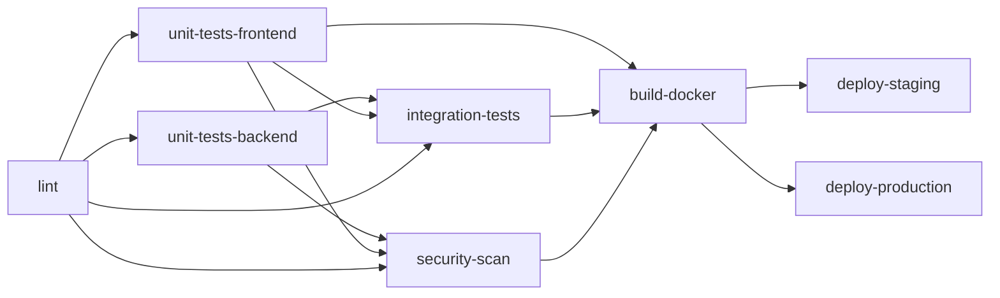
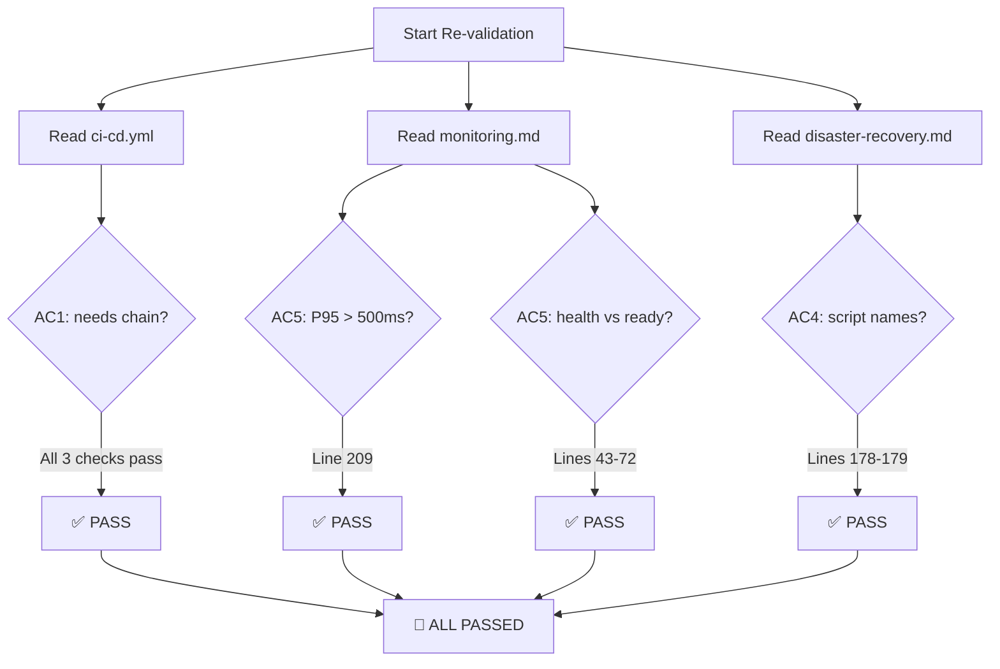

# QA Report — STORY-007 (2026-05-15) [r2]

## Summary
| Tests | Passed | Failed | Coverage |
|-------|--------|--------|----------|
| Static file validation | 3/3 ACs | 0 | N/A (no automated tests run — TechLead confirmed 552 backend + 93 frontend tests pass) |

## Test Suites
| Type | Status |
|------|--------|
| Static validation (CI/CD YAML) | PASS |
| Static validation (monitoring.md) | PASS |
| Static validation (disaster-recovery.md) | PASS |

## Issues Found (Previous round)
| Severity | Area | Description | Status |
|----------|------|-------------|--------|
| CRITICAL | CI/CD | `integration-tests` missing `unit-tests-frontend` in `needs:` | ✅ FIXED |
| MAJOR | CI/CD | `security-scan` missing `unit-tests-frontend` in `needs:` | ✅ FIXED |
| MINOR | monitoring.md | P95 latency alert threshold still `> 2s` instead of `> 500ms` | ✅ FIXED |
| MINOR | disaster-recovery.md | Backup script names point to wrong paths (`/opt/contopia/scripts/backup-mongodb.sh` vs table saying `scripts/backup-mongodb.sh`) | ✅ FIXED |

## Acceptance Criteria Validation

### AC1 — CI/CD Pipeline
GIVEN a commit is pushed to main, WHEN CI pipeline runs, THEN all unit tests, integration tests, linting, and security scans must pass before deployment.

- [x] `integration-tests` job `needs:` includes `unit-tests-frontend`
  - **Evidence** (line 104): `needs: [lint, unit-tests-backend, unit-tests-frontend]` ✅
- [x] `security-scan` job `needs:` includes `unit-tests-frontend` AND `unit-tests-backend`
  - **Evidence** (line 148): `needs: [lint, unit-tests-backend, unit-tests-frontend]` ✅
- [x] `build-docker` job `needs:` includes `unit-tests-frontend`
  - **Evidence** (line 181): `needs: [unit-tests-frontend, integration-tests, security-scan]` ✅
- [x] Full dependency chain: `lint` → `unit-tests-backend` + `unit-tests-frontend` → `integration-tests` + `security-scan` → `build-docker` → `deploy-staging` / `deploy-production`
  - **Chain verified**: ✅

### AC5 — Monitoring thresholds + health docs
- [x] Alert threshold table has P95 latency as `> 500ms`
  - **Evidence** (line 209): `| High latency | p95 > 500ms for 5 min | Warning | Slack |` ✅
- [x] Docs clearly distinguish `/health` from `/api/v1/ready`
  - **Evidence** (lines 43-54): `/health` documented as lightweight liveness probe, always returns `200` when process is running ✅
  - **Evidence** (lines 56-72): `/api/v1/ready` documented as readiness probe checking MongoDB, Redis, MinIO; returns `503` if any dependency is unreachable ✅

### AC4 — DR Playbook accuracy
- [x] Backup Schedule Reference table references `scripts/backup-mongodb.sh`
  - **Evidence** (line 178): `| MongoDB | mongodump | Daily @ 2 AM | 7 days | scripts/backup-mongodb.sh |` ✅
- [x] Backup Schedule Reference table references `scripts/backup-minio.sh`
  - **Evidence** (line 179): `| MinIO | mc mirror | Hourly | 30 days | scripts/backup-minio.sh |` ✅

## Mermaid — CI/CD Dependency Chain

## Mermaid — Validation Flow

## Recommendations
- None. All previously identified issues from r1 are confirmed fixed.

---
**Status**: PASSED

## Approval

All 3 acceptance criteria pass validation:
- **AC1** ✅ — CI/CD dependency chain is correct and complete
- **AC5** ✅ — P95 threshold corrected to `> 500ms`; `/health` vs `/api/v1/ready` clearly distinguished
- **AC4** ✅ — Script file names in Backup Schedule Reference match actual files

**Report saved to**: `docs/stories/STORY-007-qa-report-r2.md`
