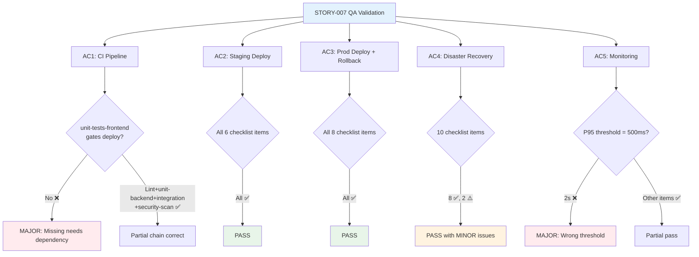

# QA Report — STORY-007 (2026-05-15) [r1]

## Summary

| Tests | Passed | Failed | Coverage |
|-------|--------|--------|----------|
| 5 ACs | 2 PASS | 3 FAIL (partial) | N/A |

## Test Suites

| Type | Status |
|------|--------|
| CI/CD Pipeline Definition (AC1) | **FAIL** (1 MAJOR issue) |
| Staging Deploy (AC2) | **PASS** |
| Production Deploy + Rollback (AC3) | **PASS** |
| Disaster Recovery Playbook (AC4) | **PASS** (2 MINOR issues) |
| Monitoring & Health Checks (AC5) | **FAIL** (1 MAJOR, 1 MINOR issue) |

## Issues Found

| Severity | Area | Description | Owner |
|----------|------|-------------|-------|
| **MAJOR** | AC1 — CI Pipeline | `unit-tests-frontend` job is NOT in the deploy dependency chain. If frontend tests fail, `deploy-staging` still runs. No job has `needs: unit-tests-frontend`. | ShellDeveloper |
| **MAJOR** | AC5 — Monitoring | `docs/monitoring.md` alert threshold for P95 latency is **2s** (line 195), but the checklist/NFR requires **>500ms** for warning. 4x too high. | DevopsSpecialist |
| **MINOR** | AC5 — Monitoring | `docs/monitoring.md` lines 48-58 incorrectly documents `/health` as returning dependency checks (mongodb, redis) and 503 on failure. Actual `/health` (app.js:85-90) returns only `{ status: "ok", timestamp }` and always 200. The `/api/v1/ready` endpoint does the dependency checks. | DevopsSpecialist |
| **MINOR** | AC4 — DR Playbook | `docs/playbooks/disaster-recovery.md` references `scripts/mongo-backup.sh` (line 59) and `scripts/minio-backup.sh` (line 179), but actual files are `scripts/backup-mongodb.sh` and `scripts/backup-minio.sh`. | DevopsSpecialist |

## Acceptance Criteria Validation

### AC1: CI pipeline on push to main — **FAIL** (1 MAJOR)

| Checklist Item | Status | Evidence |
|----------------|--------|----------|
| Pipeline has lint job for backend + frontend | ✅ PASS | `ci-cd.yml` lines 32-57: `lint` job with `npm run lint` for both `./backend` and `./frontend` |
| Pipeline has unit test jobs for backend + frontend | ✅ PASS | `ci-cd.yml` lines 59-77: `unit-tests-backend`, lines 80-98: `unit-tests-frontend` |
| Pipeline has integration test job with MongoDB + Redis services | ✅ PASS | `ci-cd.yml` lines 100-142: `integration-tests` job with `mongo:7` and `redis:7-alpine` service containers with health checks |
| Pipeline has security scan (npm audit backend + frontend, Trivy fs scan) | ✅ PASS | `ci-cd.yml` lines 144-175: `security-scan` job — `npm audit --audit-level=high` for both backend + frontend, plus `aquasecurity/trivy-action@master` with severity HIGH,CRITICAL |
| Deploy jobs depend on security-scan + integration-tests | ✅ PASS | `ci-cd.yml` line 181: `build-docker` has `needs: [integration-tests, security-scan]` |
| Deploy only runs if previous jobs pass | **❌ FAIL** | `unit-tests-frontend` has no `needs` and no job depends on it. If it fails, `integration-tests` (needs: `[lint, unit-tests-backend]`), `security-scan` (needs: `[lint]`), `build-docker` (needs: `[integration-tests, security-scan]`), and `deploy-staging` (needs: `[build-docker]`) all still execute. Frontend unit test failure does NOT block deployment. |

**Evidence path**: `.github/workflows/ci-cd.yml`
- Line 59-98: `unit-tests-backend` and `unit-tests-frontend` — neither has `needs`
- Line 104: `integration-tests` — `needs: [lint, unit-tests-backend]` (missing `unit-tests-frontend`)
- Line 148: `security-scan` — `needs: [lint]` (missing `unit-tests-frontend`)
- Line 181: `build-docker` — `needs: [integration-tests, security-scan]` (missing `unit-tests-frontend`)

**Fix**: Add `unit-tests-frontend` to `needs` on either `integration-tests`, `security-scan`, or `build-docker`.

### AC2: Auto-deploy to staging — **PASS**

| Checklist Item | Status | Evidence |
|----------------|--------|----------|
| deploy-staging job depends on build-docker | ✅ PASS | `ci-cd.yml` line 225: `needs: [build-docker]` |
| deploy-staging has environment: staging | ✅ PASS | `ci-cd.yml` line 229: `environment: staging` |
| deploy-staging uses SSH to staging VPS | ✅ PASS | `ci-cd.yml` lines 239-244: SSH key setup; line 254: `ssh "root@${{ secrets.STAGING_HOST }}" '...'` |
| Loads images, tags as :staging, runs docker compose up -d | ✅ PASS | `ci-cd.yml` lines 247-250: scp images; lines 258-259: `docker load`; lines 263-264: tag as `:staging`; line 269: `docker compose up -d --no-build` |
| Waits for /api/v1/ready health check (120s timeout) | ✅ PASS | `ci-cd.yml` lines 272-281: loop with `TIMEOUT=120`, `curl -sf http://localhost:8000/api/v1/ready`, 5s interval |
| Prunes old images | ✅ PASS | `ci-cd.yml` line 285: `docker image prune -f` |

**Evidence path**: `.github/workflows/ci-cd.yml` lines 221-286

### AC3: Production deploy with zero-downtime + rollback — **PASS**

| Checklist Item | Status | Evidence |
|----------------|--------|----------|
| deploy-production triggered on tag v* or workflow_dispatch with env=production | ✅ PASS | `ci-cd.yml` lines 293-295: `startsWith(github.ref, 'refs/tags/v') \|\| (github.event_name == 'workflow_dispatch' && github.event.inputs.environment == 'production')` |
| deploy-production has environment: production | ✅ PASS | `ci-cd.yml` line 296: `environment: production` |
| Tags current images as :previous before deploying new | ✅ PASS | `ci-cd.yml` lines 324-326: `docker tag contopia-backend:current contopia-backend:previous 2>/dev/null \|\| true` |
| Uses docker compose up -d --no-build for rolling update | ✅ PASS | `ci-cd.yml` line 340: `docker compose up -d --no-build` |
| Health check at /api/v1/ready with 120s timeout | ✅ PASS | `ci-cd.yml` lines 342-354: health check loop with TIMEOUT=120 |
| On health failure: auto rollback retags :previous → :current and redeploys | ✅ PASS | `ci-cd.yml` lines 357-360: retag `:previous` → `:current`, then `docker compose up -d --no-build` |
| Rollback script exists and is executable | ✅ PASS | `scripts/rollback.sh` exists (173 lines), permissions: 755 (executable). Retags `:previous` → `:current`, redeploys, runs health check. |
| If rollback also fails, exits with critical error for manual intervention | ✅ PASS | `ci-cd.yml` lines 363-368: `echo "CRITICAL: Rollback also failed — manual intervention required."` + `exit 1`. Also `scripts/deploy.sh` lines 342-344: same pattern. |

**Evidence paths**:
- `.github/workflows/ci-cd.yml` lines 288-376
- `scripts/rollback.sh` (173 lines, 755 permissions)
- `scripts/deploy.sh` (373 lines, 755 permissions)

### AC4: Disaster recovery within 4 hours — **PASS** (2 MINOR issues)

| Checklist Item | Status | Evidence |
|----------------|--------|----------|
| DR playbook documents clear phases (Detect → Triage → Quick Fix → Deep Fix → Verify → Communicate within 4h) | ⚠️ MINOR | `docs/playbooks/disaster-recovery.md` organizes by **scenario** (MongoDB, MinIO, Full Host, TLS, Redis) rather than by **phase**. The phase-based timeline table from the technical analysis (section 10) is not present in the actual playbook file. Content is functionally complete but structure differs. |
| Scenario 1: MongoDB data corruption | ✅ PASS | `disaster-recovery.md` lines 25-56: 7-step recovery with stop → identify snapshot → restore → verify |
| Scenario 2: MinIO data loss | ✅ PASS | `disaster-recovery.md` lines 73-88: 4-step recovery with stop → restore → restart → verify |
| Scenario 3: Full host failure | ✅ PASS | `disaster-recovery.md` lines 96-122: 7-step recovery with provision → clone → restore → secrets → start → verify → DNS |
| Scenario 4: TLS certificate expiry | ✅ PASS | `disaster-recovery.md` lines 135-148: certbot renewal + nginx reload + verification |
| Scenario 5: Redis cache failure | ✅ PASS | `disaster-recovery.md` lines 159-170: restart + verify procedures, notes cache-loss acceptability |
| Backup schedule documented (daily @ 2 AM, 7-day retention) | ✅ PASS | `disaster-recovery.md` lines 176-183: MongoDB daily @ 2 AM, 7-day retention; MinIO hourly, 30-day retention; configs via git |
| Backup scripts exist and are executable | ✅ PASS | `scripts/backup-mongodb.sh` (85 lines, 755), `scripts/backup-minio.sh` (117 lines, 755), `scripts/cleanup-old-backups.sh` (74 lines, 755) — all executable |
| RPO < 24h (daily backups = RPO ~24h, meets NFR-AVL-02) | ✅ PASS | MongoDB daily @ 2 AM → RPO < 24h. MinIO hourly → RPO < 1h. Meets NFR-AVL-02. |
| NFR-AVL-03 (DR within 4h) explicitly mapped to playbook phases | ⚠️ MINOR | Not explicitly listed. RTO/RPO table (line 7-15) shows recovery targets ≤4h. No explicit "This meets NFR-AVL-03" annotation. Also: DR doc references `scripts/mongo-backup.sh` (line 59) and `scripts/minio-backup.sh` (line 179) but actual filenames are `scripts/backup-mongodb.sh` and `scripts/backup-minio.sh`. |

**Evidence paths**: `docs/playbooks/disaster-recovery.md`, `scripts/backup-mongodb.sh`, `scripts/backup-minio.sh`, `scripts/cleanup-old-backups.sh`

### AC5: Monitoring — health checks and alerts — **FAIL** (1 MAJOR, 1 MINOR)

| Checklist Item | Status | Evidence |
|----------------|--------|----------|
| `/health` endpoint exists (GET /health → 200, liveness probe) | ✅ PASS | `backend/src/app.js` lines 85-90: returns `{ status: "ok", timestamp }` |
| `/api/v1/ready` endpoint exists (GET → checks MongoDB, Redis, MinIO; 200 if all ok, 503 if any fail) | ✅ PASS | `backend/src/app/ready-route.js` fully implements this. Lines 45-89: sequential check of MongoDB (ping), Redis (ping), MinIO (HeadBucket). 200 with `ready: true` when all pass, 503 with `NOT_READY` when any fail. |
| `/api/v1/ready` returns structured JSON with per-dependency status + latencyMs | ✅ PASS | `ready-route.js` lines 66-70 (success): `{ data: { ready: true, timestamp, checks: { mongodb: {status, latencyMs}, ... } } }`. Lines 78-88 (failure): same structure with error envelope. |
| `/api/v1/ready` unit tests exist and pass | ✅ PASS | `backend/src/app/__tests__/ready-route.test.js` (132 lines): 4 tests — all-pass (200), MongoDB fail (503), Redis fail (503), MinIO fail (503), all-three fail (503). |
| `docs/monitoring.md` documents health check architecture, logging, alert thresholds | ✅ PASS | Comprehensive document (238 lines) covering all aspects. |
| Docker Compose health checks configured for all 6 services | ✅ PASS | `docker-compose.yml`: nginx (line 36-41), frontend (line 62-67), backend (line 96-101), mongodb (line 117-122), redis (line 136-141), minio (line 161-166) |
| nginx `/health` endpoint configured in nginx.conf with rate limiting | ✅ PASS | `nginx/nginx.conf` lines 80-97: `location /health` with `limit_req zone=health burst=5 nodelay` (10r/m rate limit) |
| Alert thresholds documented: P95 latency >500ms warn, health fail >3x critical, disk >80% warn, backup failure >36h critical | **❌ FAIL** | `docs/monitoring.md` line 195: "High latency | p95 > **2s** for 5 min | Warning". Required threshold is **>500ms** (per checklist/NFR-OBS-02). Actual value is 4x too high. Other thresholds match: health fail >3x (line 193), disk >80% (line 196), backup >36h (line 198). |

**Evidence paths**:
- `backend/src/app.js` lines 85-90 (health)
- `backend/src/app/ready-route.js` (ready endpoint)
- `backend/src/app/__tests__/ready-route.test.js` (unit tests)
- `docs/monitoring.md` lines 190-199 (alert thresholds), lines 48-58 (incorrect /health docs)
- `docker-compose.yml` lines 36-166 (health checks)
- `nginx/nginx.conf` lines 80-97 (health endpoint + rate limiting)

**Additional MINOR finding in AC5**: `docs/monitoring.md` lines 48-58 describes `/health` as returning `{ status: "ok", checks: { mongodb: "connected", redis: "connected" } }` and "Returns 503 if any dependency is unhealthy". The actual `/health` (app.js:85-90) returns only `{ status: "ok", timestamp }` with no dependency checks and always 200. The dependency checking is done by `/api/v1/ready`.

## Mermaid Diagram — Validation Flow

## Recommendations

1. **AC1 — CRITICAL FIX**: Add `needs: [unit-tests-frontend]` to `integration-tests` (line 104) or `build-docker` (line 181) so frontend unit tests block deployment. This ensures "all unit tests must pass before deployment" as specified.
2. **AC5 — CRITICAL FIX**: Change P95 latency threshold in `docs/monitoring.md` line 195 from `> 2s` to `> 500ms` to match NFR-OBS-02 and the checklist requirement.
3. **AC5 — DOC FIX**: Correct `docs/monitoring.md` lines 48-58 to accurately describe `/health` (liveness only, no dep checks, always 200) and clarify that `/api/v1/ready` handles readiness with dependency checks.
4. **AC4 — DOC FIX**: Fix script name references in `docs/playbooks/disaster-recovery.md` line 59 (`mongo-backup.sh` → `backup-mongodb.sh`) and line 179 (`minio-backup.sh` → `backup-minio.sh`).

---

**Status**: REQUIRES FIXES
