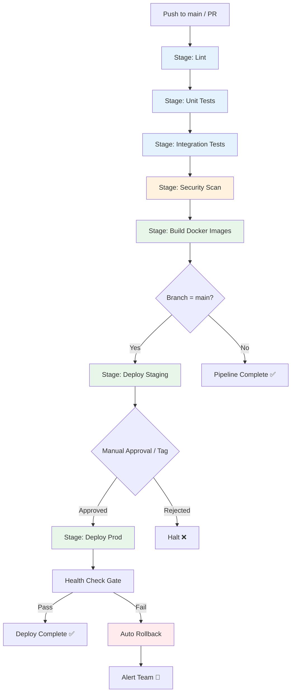
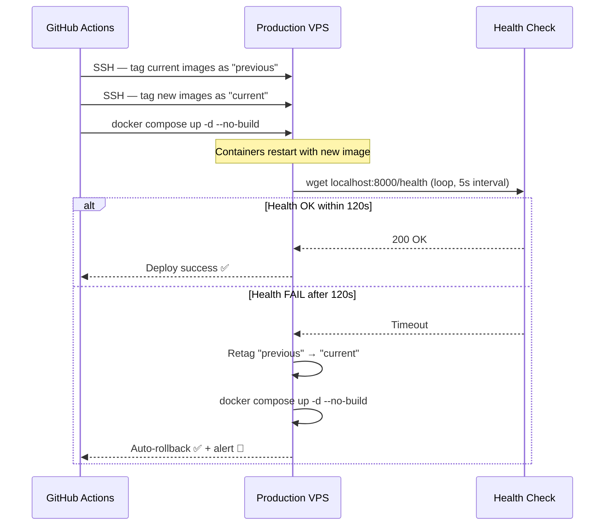
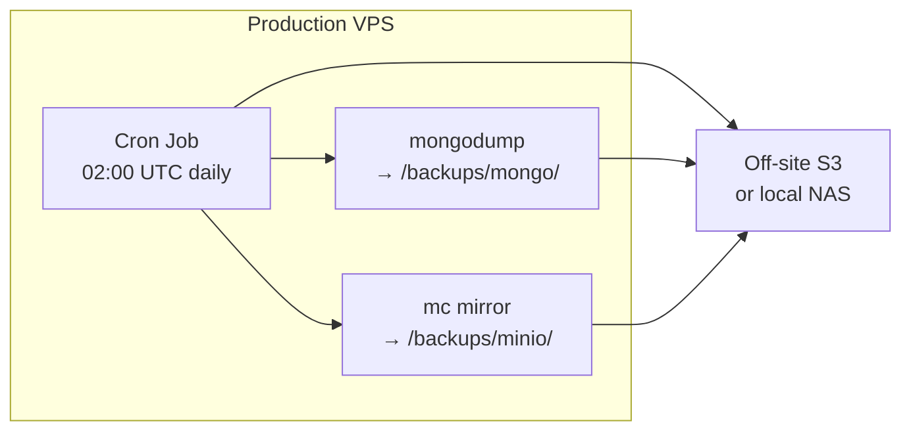
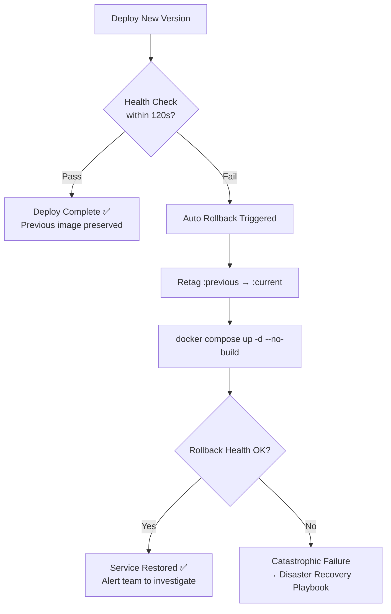
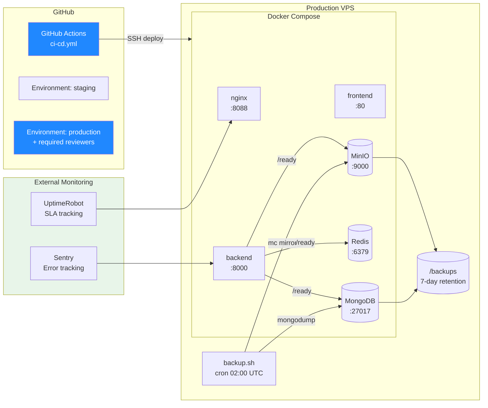
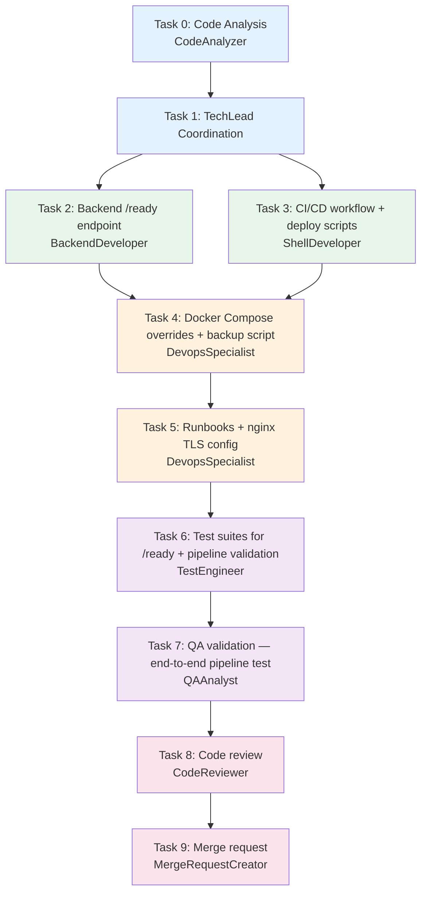

# STORY-007: Technical Analysis — DevOps, CI/CD & Deployment Pipeline

**Epic**: EPIC-010
**Persona**: Mãe da Julia (Caring Parent) — reliable platform availability
**Dependencies**: STORY-005 ✅, STORY-006 ✅
**Stack Source**: `docs/architecture/TECH-STACK.md`

---

## 1. Overview

- Contopia is a Node 22 / Express / React monolith deployed via Docker Compose on a single VPS
- No CI/CD pipelines exist yet (`.github/workflows/` is empty)
- All Docker services already have health checks; backend `/health` endpoint exists but is shallow (no DB/Redis/MinIO connectivity checks)
- Goal: full GitHub Actions pipeline (lint → test → security → deploy) + backup + monitoring + rollback playbooks

---

## 2. Language & Framework Detection

| Indicator | Detected |
|-----------|---------|
| `package.json`, `vitest` | **Node.js 22** |
| `react`, `vite`, `.jsx`/`.tsx` | **React 18 + Vite 5** → FrontendDeveloperReact |

| Path | Tool |
|------|------|
| Backend | BackendDeveloper |
| Frontend | FrontendDeveloperReact |
| CI/CD YAML | ShellDeveloper (workflow authoring) |
| Docker/infra | DevopsSpecialist |

---

## 3. CI/CD Pipeline Design

**Platform**: GitHub Actions (free tier, 2000 min/month)
**Trigger**: Push to `main`, PRs to `main`, manual workflow dispatch, tag `v*`



### Workflow File: `.github/workflows/ci-cd.yml`

```yaml
name: CI/CD Pipeline

on:
  push:
    branches: [main]
    tags: ['v*']
  pull_request:
    branches: [main]
  workflow_dispatch:
    inputs:
      environment:
        description: 'Target environment'
        required: true
        default: 'staging'
        type: choice
        options: [staging, production]

env:
  NODE_VERSION: '22'

jobs:
  # ── Lint ──────────────────────────────────────────────────────────────
  lint:
    runs-on: ubuntu-latest
    steps:
      - uses: actions/checkout@v4
      - uses: actions/setup-node@v4
        with: { node-version: '${{ env.NODE_VERSION }}' }
      - run: npm ci
        working-directory: backend
      - run: npm ci
        working-directory: frontend
      - run: npm run lint
        working-directory: backend
      - run: npm run lint
        working-directory: frontend

  # ── Unit Tests ────────────────────────────────────────────────────────
  unit-tests:
    runs-on: ubuntu-latest
    needs: lint
    strategy:
      matrix:
        scope: [backend, frontend]
    steps:
      - uses: actions/checkout@v4
      - uses: actions/setup-node@v4
        with: { node-version: '${{ env.NODE_VERSION }}' }
      - run: npm ci
        working-directory: ${{ matrix.scope }}
      - run: npm test
        working-directory: ${{ matrix.scope }}

  # ── Integration Tests (backend only, needs MongoDB + Redis) ───────────
  integration-tests:
    runs-on: ubuntu-latest
    needs: lint
    services:
      mongodb:
        image: mongo:7
        ports: ['27017:27017']
        options: >-
          --health-cmd "mongosh --eval 'db.runCommand(\"ping\").ok'"
          --health-interval 10s --health-timeout 5s --health-retries 5
      redis:
        image: redis:7-alpine
        ports: ['6379:6379']
        options: >-
          --health-cmd "redis-cli ping"
          --health-interval 10s --health-timeout 5s --health-retries 5
    env:
      MONGODB_URI: mongodb://localhost:27017/contopia-test
      REDIS_URL: redis://localhost:6379
    steps:
      - uses: actions/checkout@v4
      - uses: actions/setup-node@v4
        with: { node-version: '${{ env.NODE_VERSION }}' }
      - run: npm ci
        working-directory: backend
      - run: npm run test:integration  # or: npm test -- --grep @integration
        working-directory: backend

  # ── Security Scan ────────────────────────────────────────────────────
  security-scan:
    runs-on: ubuntu-latest
    needs: [unit-tests, integration-tests]
    steps:
      - uses: actions/checkout@v4
      - uses: actions/setup-node@v4
        with: { node-version: '${{ env.NODE_VERSION }}' }
      - run: npm ci
        working-directory: backend
      - run: npm ci
        working-directory: frontend
      - name: npm audit (backend)
        run: npm audit --audit-level=high
        working-directory: backend
        continue-on-error: false
      - name: npm audit (frontend)
        run: npm audit --audit-level=high
        working-directory: frontend
        continue-on-error: false
      - name: Trivy filesystem scan
        uses: aquasecurity/trivy-action@master
        with:
          scan-type: fs
          scan-ref: .
          severity: HIGH,CRITICAL
          exit-code: 1

  # ── Build Docker Images ──────────────────────────────────────────────
  build:
    runs-on: ubuntu-latest
    needs: security-scan
    if: github.event_name == 'push' && github.ref == 'refs/heads/main' || startsWith(github.ref, 'refs/tags/v')
    steps:
      - uses: actions/checkout@v4
      - name: Build backend image
        run: docker build -t contopia-backend:${{ github.sha }} --target production ./backend
      - name: Build frontend image
        run: docker build -t contopia-frontend:${{ github.sha }} --target production --build-arg VITE_API_URL=/api ./frontend
      - name: Save images for deployment
        run: |
          docker save contopia-backend:${{ github.sha }} -o /tmp/backend.tar
          docker save contopia-frontend:${{ github.sha }} -o /tmp/frontend.tar
      - uses: actions/upload-artifact@v4
        with:
          name: docker-images
          path: /tmp/*.tar
          retention-days: 5

  # ── Deploy Staging ───────────────────────────────────────────────────
  deploy-staging:
    runs-on: ubuntu-latest
    needs: build
    if: github.ref == 'refs/heads/main'
    environment: staging
    steps:
      - uses: actions/download-artifact@v4
        with: { name: docker-images, path: /tmp }
      - name: Load images
        run: |
          docker load -i /tmp/backend.tar
          docker load -i /tmp/frontend.tar
      - name: Deploy to VPS (staging)
        run: |
          ssh -o StrictHostKeyChecking=no ${{ secrets.STAGING_HOST }} << 'DEPLOY'
            cd /opt/contopia
            export IMAGE_TAG=${{ github.sha }}
            docker compose -f docker-compose.yml -f docker-compose.staging.yml up -d --no-build
            # Wait for health checks
            timeout 120 bash -c 'until docker compose ps | grep -v "unhealthy\|starting"; do sleep 5; done'
          DEPLOY

  # ── Deploy Production ────────────────────────────────────────────────
  deploy-production:
    runs-on: ubuntu-latest
    needs: build
    if: startsWith(github.ref, 'refs/tags/v') || (github.event_name == 'workflow_dispatch' && github.event.inputs.environment == 'production')
    environment: production
    steps:
      - uses: actions/download-artifact@v4
        with: { name: docker-images, path: /tmp }
      - name: Load images
        run: |
          docker load -i /tmp/backend.tar
          docker load -i /tmp/frontend.tar
      - name: Rolling deploy to VPS (production)
        run: |
          ssh -o StrictHostKeyChecking=no ${{ secrets.PROD_HOST }} << 'DEPLOY'
            cd /opt/contopia
            export IMAGE_TAG=${{ github.sha }}
            # Tag current as rollback target
            docker tag contopia-backend:current contopia-backend:previous 2>/dev/null || true
            docker tag contopia-frontend:current contopia-frontend:previous 2>/dev/null || true
            docker tag contopia-backend:${{ github.sha }} contopia-backend:current
            docker tag contopia-frontend:${{ github.sha }} contopia-frontend:current
            # Rolling update: stop old, start new
            docker compose up -d --no-build
            # Health gate (120s timeout)
            timeout 120 bash -c '
              until curl -sf http://localhost:8000/health | grep -q "ok"; do
                sleep 5
              done
            ' || {
              echo "HEALTH CHECK FAILED — rolling back"
              docker tag contopia-backend:previous contopia-backend:current
              docker tag contopia-frontend:previous contopia-frontend:current
              docker compose up -d --no-build
              exit 1
            }
            echo "Deploy successful ✅"
          DEPLOY
```

---

## 4. Pipeline Stages Detail

| Stage | What | Tool | Fail Condition | Duration Est. |
|-------|------|------|----------------|----------------|
| Lint | ESLint backend + frontend | `npm run lint` | Any lint error | ~30s |
| Unit Tests | Vitest backend + frontend | `vitest run` | Any test fail | ~60s |
| Integration Tests | Backend with MongoDB + Redis | GitHub Actions services | Any test fail | ~90s |
| Security Scan | `npm audit` + Trivy FS scan | `npm audit --audit-level=high`, Trivy | High/Critical CVE | ~45s |
| Build | Multi-stage Docker builds | `docker build` | Build failure | ~120s |
| Deploy Staging | SSH + docker compose up | docker compose | Health check fail | ~60s |
| Manual Gate | GitHub Environment protection rules | Required reviewer | Rejection | Manual |
| Deploy Prod | SSH + rolling + health gate | docker compose | Health check fail → auto rollback | ~60s |

**Total pipeline (no manual gate): ~7 min**

---

## 5. Deployment Strategy

### Current State

- Single `docker-compose.yml` with all services
- Dockerfiles multi-stage (dev → production)
- Health checks on all 6 containers
- No environment-specific compose overrides yet

### Rolling Update on Docker Compose



### Blue-Green (Future Enhancement)

For MVP, Docker Compose rolling update is sufficient. Blue-green requires:
- Two compose profiles (`docker-compose.blue.yml`, `docker-compose.green.yml`)
- nginx upstream switching via API or file swap
- Double the container footprint on VPS

**Decision**: Defer blue-green to post-MVP. Rolling + health gate provides adequate zero-downtime for single-VPS deployment.

### Environment Parity

| File | Purpose |
|------|---------|
| `docker-compose.yml` | Base (all services, shared config) |
| `docker-compose.staging.yml` | Staging overrides (ports, env vars) |
| `docker-compose.prod.yml` | Production overrides (TLS, resource limits) |

---

## 6. Backend `/health` Enhancement → `/ready`

**Current**: `GET /health` returns `{ status: "ok", timestamp }` — no dependency checks.

**Required**: Readiness endpoint that verifies connectivity to MongoDB, Redis, and MinIO.

### Proposed Response Model

```
GET /health        → liveness (always 200 if process alive)
GET /ready         → readiness (200 if all deps connected, 503 otherwise)
```

**`/ready` response (healthy):**
```json
{
  "status": "ok",
  "timestamp": "2026-05-15T10:00:00Z",
  "checks": {
    "mongodb": { "status": "ok", "latencyMs": 3 },
    "redis": { "status": "ok", "latencyMs": 1 },
    "minio": { "status": "ok", "latencyMs": 5 }
  }
}
```

**`/ready` response (degraded):**
```json
{
  "status": "degraded",
  "timestamp": "2026-05-15T10:00:00Z",
  "checks": {
    "mongodb": { "status": "ok", "latencyMs": 3 },
    "redis": { "status": "fail", "error": "ECONNREFUSED" },
    "minio": { "status": "ok", "latencyMs": 5 }
  }
}
```

This maps to: Docker HEALTHCHECK uses `/health` (liveness), Kubernetes/future orchestrators and deploy scripts use `/ready` (readiness).

---

## 7. Monitoring & Alerting

### Health Checks (Already in docker-compose.yml)

| Service | Check Method | Interval |
|---------|-------------|----------|
| backend | `wget localhost:8000/health` | 30s |
| frontend | `wget 127.0.0.1/` | 30s |
| nginx | `nginx -t` | 30s |
| mongodb | `mongosh --eval db.runCommand("ping")` | 10s |
| redis | `redis-cli ping` | 10s |
| minio | `wget localhost:9000/minio/health/live` | 10s |

### Monitoring Stack (MVP)

| Tool | Purpose | Setup |
|------|---------|-------|
| `/ready` endpoint | Readiness with dependency checks | Backend route (new) |
| Pino JSON logs | Structured request/error logging | Already in use (`pino-http`) |
| Docker `healthcheck` | Container-level liveness | Already configured |
| External uptime monitor | Uptime tracking (99.5% SLA) | UptimeRobot free tier / cron-job.org |
| Error tracking | Uncaught exceptions, API errors | Sentry free tier (or Logtail) |

### Alert Thresholds (aligned to NFRs)

| Metric | Threshold | Action |
|--------|-----------|--------|
| P95 API latency | > 500ms | Warning alert |
| P99 API latency | > 2000ms | Critical alert |
| Health check fail | 3 consecutive failures | Pager / Slack alert |
| Uptime | < 99.5% over 30d | Incident review |
| Disk usage | > 85% | Warning (backup at risk) |
| MongoDB connections | > 80% pool | Scale investigation |

---

## 8. Backup Strategy

### NFR-AVL-02: Daily backups, RPO < 24h



### Implementation: `scripts/backup.sh`

```bash
#!/usr/bin/env bash
# Contopia — Daily Backup Script
# Runs at 02:00 UTC via cron or Docker sidecar

set -euo pipefail

BACKUP_DIR="/opt/contopia/backups/$(date +%Y-%m-%d)"
mkdir -p "$BACKUP_DIR"

# MongoDB dump
docker exec contopia-mongodb mongodump \
  --uri="$MONGODB_URI" \
  --archive="$BACKUP_DIR/mongodb.archive" \
  --gzip

# MinIO bucket mirror
docker exec contopia-minio mc mirror \
  local/contopia "$BACKUP_DIR/minio/"

# Retention: keep last 7 days
find /opt/contopia/backups -maxdepth 1 -mtime +7 -exec rm -rf {} +

echo "[$(date)] Backup completed → $BACKUP_DIR"
```

### Backup Schedule

| Component | Method | Frequency | Retention |
|-----------|--------|-----------|-----------|
| MongoDB | `mongodump --archive --gzip` | Daily 02:00 UTC | 7 days |
| MinIO | `mc mirror` | Daily 02:30 UTC | 7 days |
| Redis | Not needed (cache only, repopulated) | — | — |
| Config | `.env`, `nginx.conf`, `docker-compose*.yml` | On deploy | Last 5 versions |

### Off-site Replication (MVP)

- Simplest: `rsync` / `scp` backup dir to secondary host or S3 bucket
- Cron after backup: `rsync -avz /opt/contopia/backups/ $OFFSITE:/backups/contopia/`

---

## 9. Rollback Mechanism

### NFR-DPL-02: Automated rollback



### Rollback Steps (Manual Fallback)

1. SSH to VPS: `ssh $PROD_HOST`
2. `cd /opt/contopia`
3. `docker tag contopia-backend:previous contopia-backend:current`
4. `docker tag contopia-frontend:previous contopia-frontend:current`
5. `docker compose up -d --no-build`
6. Verify: `curl http://localhost:8000/health`
7. If still failing → proceed to Disaster Recovery (Section 10)

---

## 10. Disaster Recovery Playbook — 4-Hour Restoration (NFR-AVL-03)

| Phase | Steps | Time |
|-------|-------|------|
| **0. Detect** (0–15m) | Alert fires → on-call acknowledges → assess severity | 15 min |
| **1. Triage** (15–30m) | Check health endpoint, Docker logs, disk space, network connectivity | 15 min |
| **2. Quick Fix** (30m–1h) | Attempt rollback (section 9) → restart containers → verify | 30 min |
| **3. Deep Fix** (1–2h) | If rollback fails: restore MongoDB from backup, rebuild containers from scratch | 1h |
| **4. Verify** (2–3h) | Run smoke tests (auth, book CRUD, file upload), check logs for errors | 1h |
| **5. Communicate** (3–4h) | Update status page, notify users if needed, write incident report | 1h |

### Full Reconstruction Steps

```bash
# 1. Stop all services
docker compose down

# 2. Restore MongoDB from latest backup
docker compose up -d mongodb
sleep 10
docker exec -i contopia-mongodb mongorestore \
  --archive=/backups/mongodb.archive --gzip < /opt/contopia/backups/LATEST/mongodb.archive

# 3. Restore MinIO data
docker compose up -d minio
sleep 10
docker exec contopia-minio mc mirror /backups/minio/ local/contopia

# 4. Start all services
docker compose up -d

# 5. Verify
curl -sf http://localhost:8000/ready | jq .
```

---

## 11. Security Scanning

| Scan Type | Tool | When | Fail Condition |
|-----------|------|------|----------------|
| Dependency audit | `npm audit --audit-level=high` | Every CI run | High/Critical CVE in deps |
| Container image | Trivy | Every CI run | Critical CVE in base image |
| Secret leak | Trivy fs (secrets scanner) | Every CI run | Hardcoded key/token detected |
| License compliance | Trivy | Every CI run | GPL in production deps |

### Additional Hardening

- **Docker images**: Already use non-root user in production stage (`backend/Dockerfile` line 37)
- **TLS**: nginx config has TLS 1.2+ ready (uncomment `ssl_` directives in `nginx.conf`)
- **Secrets**: GitHub Actions secrets for SSH keys, DB URIs, API keys — never in repo
- **`.env` file**: Already gitignored, deployed separately to VPS

---

## 12. Acceptance Criteria Mapping

| AC | Requirement | Implementation | Test |
|----|-------------|---------------|------|
| AC1 | CI runs on push to main: unit tests, integration tests, linting, security scans | `.github/workflows/ci-cd.yml` — lint → unit-tests → integration-tests → security-scan jobs | Push broken test → pipeline halts before staging |
| AC2 | All checks pass → auto-deploy to staging | `deploy-staging` job (needs: build, if: main branch) | Merge PR → staging is updated |
| AC3 | Prod deployment: manual approval or tagged release, zero-downtime + auto-rollback | `deploy-production` job with GitHub Environment protection + health gate + rollback | Deploy broken build → rollback fires |
| AC4 | Catastrophic failure → 4h recovery via playbooks + backups | `docs/runbooks/disaster-recovery.md` + `scripts/backup.sh` daily cron | DR drill: wipe + restore from backup |
| AC5 | Health checks, error tracking, performance alerts | `/ready` endpoint + Sentry + UptimeRobot | Stop MongoDB → `/ready` returns degraded → alert fires |

---

## 13. Files to Create / Modify

### New Files

| File | Purpose | Agent |
|------|---------|-------|
| `.github/workflows/ci-cd.yml` | Full CI/CD pipeline definition | ShellDeveloper |
| `docker-compose.staging.yml` | Staging env overrides (ports, env) | DevopsSpecialist |
| `docker-compose.prod.yml` | Production env overrides (TLS, limits) | DevopsSpecialist |
| `scripts/backup.sh` | MongoDB + MinIO daily backup script | ShellDeveloper |
| `scripts/deploy.sh` | Deployment helper (tag + health gate + rollback) | ShellDeveloper |
| `docs/runbooks/disaster-recovery.md` | 4h DR playbook | DevopsSpecialist |
| `backend/src/app/ready-route.js` (or inline in app.js) | `/ready` endpoint with dependency checks | BackendDeveloper |

### Modified Files

| File | Change | Agent |
|------|--------|-------|
| `backend/src/app.js` | Add `/ready` route (MongoDB ping, Redis ping, MinIO health) | BackendDeveloper |
| `backend/Dockerfile` | HEALTHCHECK change: `/health` → keep (liveness only) | BackendDeveloper |
| `nginx/nginx.conf` | Uncomment TLS directives for production | DevopsSpecialist |
| `backend/package.json` | Add `lint` script (if missing) | BackendDeveloper |
| `frontend/package.json` | Add `lint` script (if missing) | FrontendDeveloperReact |

---

## 14. Architecture: Impacted Components



---

## 15. Task Decomposition & Execution Order



### Task Details

| Task | Agent | Description | Depends On | Est. |
|------|-------|-------------|------------|------|
| 0 | CodeAnalyzer | Analyze existing Docker/health setup, identify gaps | — | 15m |
| 1 | TechLead | Orchestrate all tasks, track dependencies | T0 | — |
| 2 | BackendDeveloper | Add `/ready` endpoint (MongoDB ping, Redis ping, MinIO health check) | T1 | 1h |
| 3 | ShellDeveloper | Create `.github/workflows/ci-cd.yml` and `scripts/deploy.sh` | T1 | 2h |
| 4 | DevopsSpecialist | Create `docker-compose.staging.yml`, `docker-compose.prod.yml`, `scripts/backup.sh` | T2, T3 | 1.5h |
| 5 | DevopsSpecialist | Write `docs/runbooks/disaster-recovery.md`, configure TLS in nginx | T4 | 1h |
| 6 | TestEngineer | Unit tests for `/ready` endpoint, validate CI pipeline runs | T5 | 1h |
| 7 | QAAnalyst | End-to-end: push test commit, verify staging deploy, test rollback | T6 | 1.5h |
| 8 | CodeReviewer | Review all new/modified files | T7 | 30m |
| 9 | MergeRequestCreator | Create MR with story traceability | T8 | 15m |

### Parallelization

- **T2 + T3**: CAN run in parallel (backend route independent of CI workflow YAML)
- **T2 + T3 → T4**: Sequential (compose overrides need the /ready endpoint design)
- **All others**: Sequential chain

---

## 16. Risk Assessment

| Risk | Probability | Impact | Mitigation |
|------|------------|--------|------------|
| GitHub Actions 2000 min/month exceeded (free tier) | Low | Medium | Pipeline is ~7 min × ~20 runs/day = <2.5h/month; well within limit |
| SSH-based deploy fails (network/key issues) | Medium | High | Add connectivity pre-check step; use GitHub Actions SSH action with retry |
| Health gate timeout (120s) too short for cold starts | Medium | Medium | Increase to 180s; use staggered container startup via `depends_on` |
| Backup cron fails silently | Medium | High | Add logging + alert on backup failure; validate backup weekly |
| Trivy false positives block pipeline | Low | Medium | Use `--severity HIGH,CRITICAL` only; add `.trivyignore` for accepted CVEs |
| VPS disk full from Docker images | Medium | High | Add `docker image prune -f` to deploy script; monitor disk usage |

---

## 17. NFR Traceability

| NFR | Implementation | Verification |
|-----|---------------|--------------|
| NFR-AVL-01 (99.5% uptime) | Docker healthchecks + restart:unless-stopped + external uptime monitor | UptimeRobot 30-day report |
| NFR-AVL-02 (RPO <24h) | Daily `mongodump` + `mc mirror` at 02:00 UTC | Backup restore drill |
| NFR-AVL-03 (DR within 4h) | `docs/runbooks/disaster-recovery.md` + backup scripts | DR drill (timed) |
| NFR-SEC-08 (dependency scanning) | `npm audit --audit-level=high` + Trivy in CI | Pipeline blocks on High/Critical CVE |
| NFR-SEC-01 (TLS 1.2+) | nginx TLS config in `docker-compose.prod.yml` | SSL Labs scan |
| NFR-OBS-01 (error tracking) | Sentry integration | Error in prod → Sentry alert |
| NFR-OBS-02 (perf monitoring) | Pino logs + `/ready` latency checks | Alert on P95 > 500ms |
| NFR-OBS-03 (health checks) | `/health` (liveness) + `/ready` (readiness) | UptimeRobot probe |
| NFR-DPL-01 (zero-downtime) | Rolling update + health gate | Deploy while curling endpoint |
| NFR-DPL-02 (auto-rollback) | Retag previous + `docker compose up` on health fail | Deploy broken image → auto rollback |
| NFR-DPL-03 (env parity) | Same Docker images + compose overrides | Diff staging vs prod config |

---

## 18. Persona Impact

**Mãe da Julia** — Caring Parent:
- 99.5% uptime → children's books are always accessible
- Daily backups + 4h DR → no permanent data loss if catastrophe strikes
- Zero-downtime deploy → no "site is down" moments during updates
- Error tracking + alerts → team learns about issues before users do

---

## 19. Frontend-Backend Integration Pattern

**Node.js fullstack (Docker Compose):**
- Shared Docker network (`contopia_frontend`, `contopia_backend`)
- nginx reverse proxy unifies frontend + API on single origin (:8088)
- No CORS issues — browser talks to nginx, nginx proxies to backend
- Health checks: backend `/health` + `/ready`, frontend static `/health`

---

## 20. Recommendations to TechLead

1. **Start with Task 2 + Task 3 in parallel** — backend `/ready` endpoint and CI/CD workflow are independent
2. **Task 4 depends on T2** — compose overrides reference the `/ready` endpoint in health checks
3. **Task 6 is critical** — pipeline must be validated end-to-end before merging
4. **Add `lint` scripts first** if missing from `package.json` — pipeline will fail without them
5. **Sentry setup can be deferred** to a follow-up if time-constrained — Pino logs + UptimeRobot cover MVP monitoring
6. **TLS setup**: uncomment nginx config lines + mount certs via `docker-compose.prod.yml` volume
7. **Secrets**: create GitHub Environment secrets for `STAGING_HOST`, `PROD_HOST`, `SSH_PRIVATE_KEY` before first deploy

---

*Document generated by Architect agent — STORY-007 technical analysis*