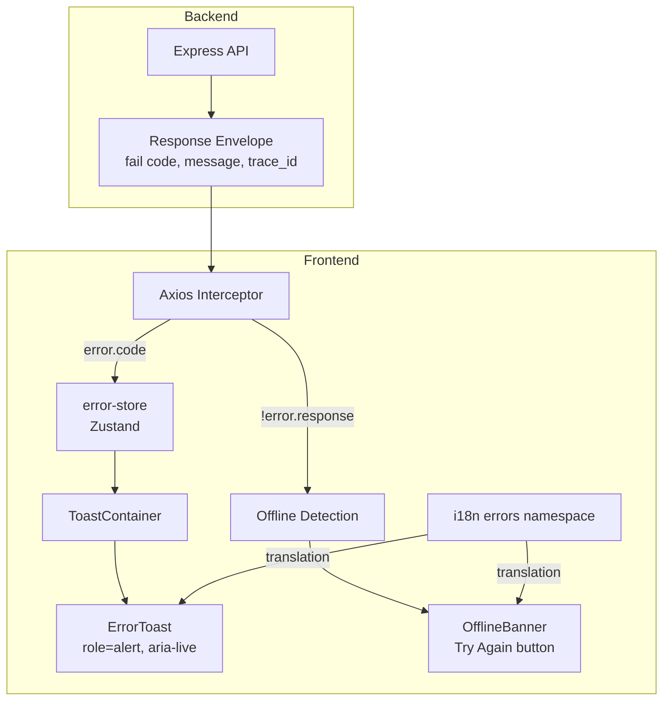
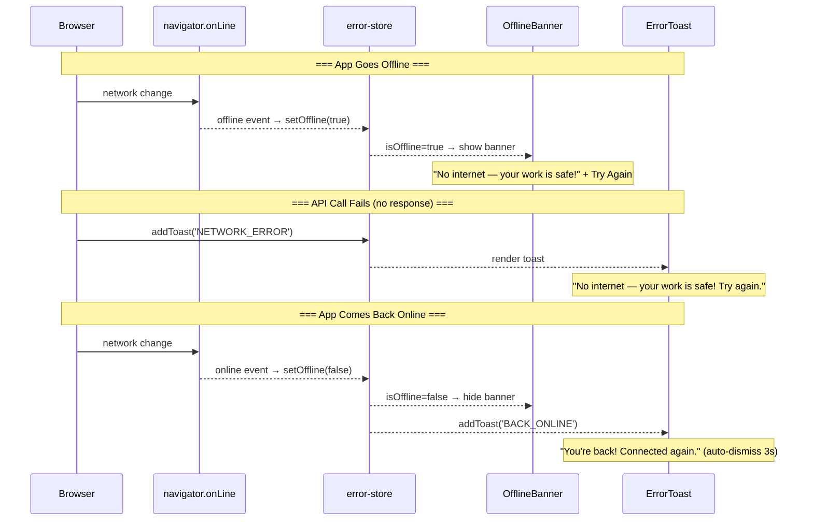
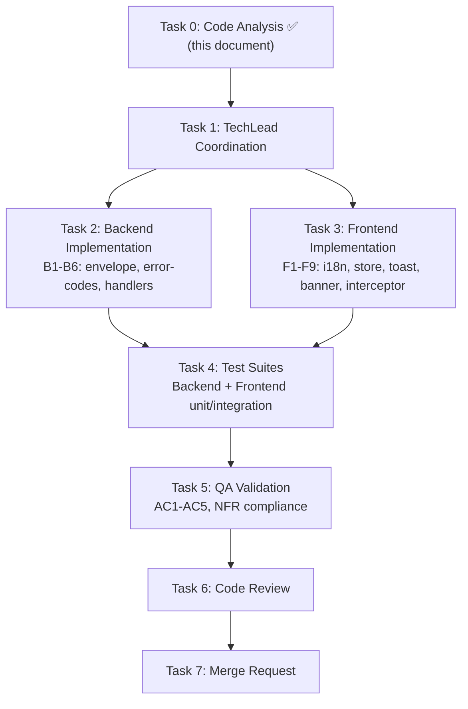

# STORY-008: API Error Handling & Child-Friendly Messages — Technical Analysis

**Epic**: EPIC-010
**Persona**: Julia — The Young Author
**Priority**: Must Have
**Story Points**: 3
**Dependencies**: STORY-005 ✅ (Core REST API + response envelope)

---

## 1. Overview

Contopia serves children under 13. Technical error messages (stack traces, SQL, HTTP codes) must never reach the UI. Instead, every error — validation, auth, network, server — must surface as a localized, encouraging, child-friendly message. This story builds a full-stack error pipeline: backend normalizes errors into structured envelopes; frontend intercepts, translates, and renders them with accessible, debounced toasts and an offline banner.

**Key finding**: Backend already has ~70% of the infrastructure (`fail()` envelope, child-friendly messages in auth/rate-limit/validation middleware). Frontend has ~10% (axios client with 401/419 handling, but no general error interceptor, toast, or offline support).

---

## 2. Language & Framework Detection

| Indicator | Detected | Language |
|-----------|----------|----------|
| `package.json` (backend + frontend) | ✅ | **Node.js** |
| `tsconfig.json` | ❌ | — |
| `.jsx` files, `react` in deps | ✅ | **React** |

| Indicator | Detected | Framework |
|-----------|----------|-----------|
| `react` in `frontend/package.json` | ✅ | **FrontendDeveloperReact** |
| `vite.config.*` | ✅ | Vite SPA |

**Frontend-Backend Integration**: Node.js fullstack SPA mode — Vite dev proxy → Express, typed axios client, JWT manual handling, separate deployment via nginx.

**Stack Reference**: `docs/architecture/TECH-STACK.md`

---

## 3. Current Infrastructure Audit

### Backend — Already in Place

| File | What It Does | Gaps |
|------|-------------|------|
| `backend/src/app/common/response-envelope.js` | `ok()`, `fail()`, `paginated()` envelope helpers | `fail()` doesn't include `trace_id` |
| `backend/src/app/common/validation-middleware.js` | Zod → child-friendly messages (`mapZodIssue()`) | Envelope sent; good |
| `backend/src/app/common/auth-middleware.js` | 401/419/503 with child-friendly messages | Envelope format; good |
| `backend/src/app/common/rate-limit-middleware.js` | 429 with "Slow down — try again in a minute" | Uses raw object, not `fail()` |
| `backend/src/app.js` (L140-148) | Global error handler → `fail('INTERNAL_ERROR', 'Something went wrong...', { requestId })` | No `trace_id`; logs full err but only passes friendly msg |
| `backend/src/app.js` (L132) | 404 handler: `res.status(404).json({ error: 'Not found' })` | **Not using `fail()` envelope** |
| `backend/src/app.js` (L120-127) | Global rate limit: `{ error: 'Too many requests...' }` | **Not using `fail()` envelope** |
| Route-level `handleError()` (auth, storage) | Per-route error mapping | Inconsistent: some use `fail()`, some raw objects |

### Frontend — Already in Place

| File | What It Does | Gaps |
|------|-------------|------|
| `frontend/src/lib/api-client.js` | Axios interceptors: 401→refresh, 419→timeout warning | **No general 4xx/5xx interceptor**; rejects bare error |
| `frontend/src/i18n/index.js` | i18next init, 4 namespaces (auth, shelf, editor, reader) | **No `errors` namespace** |
| `frontend/src/stores/auth-store.js` | Zustand auth store | No error state |
| `frontend/src/stores/book-store.js` | `booksError`, `bookError`, `chaptersError` fields | Per-feature error strings, no centralized handling |
| `frontend/src/components/auth/LoginForm.jsx` | Flowbite `<Alert color="failure">` for server errors | Inline only, no toast system |
| `frontend/src/components/auth/SessionTimeoutModal.jsx` | Modal for 419 session timeout | Good pattern reference for error UI |

### Frontend — Missing (Must Build)

| Component | Purpose |
|-----------|---------|
| `errors` i18n namespace | Error code → localized string mapping |
| Axios error interceptor | Catch all 4xx/5xx → map to error codes → trigger toasts |
| `ErrorToast` component | Animated, accessible, auto-dismissing toast notifications |
| `ToastContainer` component | Fixed container, manages toast queue + debounce |
| `OfflineBanner` component | Persistent banner when `navigator.onLine === false` |
| `useErrorStore` | Zustand store for centralized error state (or extend existing) |

---

## 4. Modules to Create/Modify

### Backend Modifications

| # | File | Action | Description |
|---|------|--------|-------------|
| B1 | `backend/src/app/common/response-envelope.js` | **Modify** | Add `trace_id` to `fail()` output |
| B2 | `backend/src/app.js` | **Modify** | Fix 404 handler to use `fail()`; fix global rate limit to use `fail()` |
| B3 | `backend/src/app/common/error-codes.js` | **Create** | Centralized error code → child-friendly message dictionary |
| B4 | `backend/src/app/common/rate-limit-middleware.js` | **Modify** | Use `fail()` envelope instead of raw object |
| B5 | `backend/src/app.js` (global handler) | **Modify** | Include `trace_id` = `req.id` in envelope; scrub 5xx of all detail |
| B6 | Route-level `handleError()` (auth, storage) | **Modify** | Normalize to use `fail()` envelope + `trace_id` |

### Frontend New Files

| # | File | Action | Description |
|---|------|--------|-------------|
| F1 | `frontend/src/i18n/locales/pt-BR/errors.json` | **Create** | Portuguese error strings |
| F2 | `frontend/src/i18n/locales/en/errors.json` | **Create** | English error strings |
| F3 | `frontend/src/i18n/index.js` | **Modify** | Register `errors` namespace |
| F4 | `frontend/src/lib/api-client.js` | **Modify** | Add general error interceptor (4xx/5xx/NetworkError → error code dispatch) |
| F5 | `frontend/src/stores/error-store.js` | **Create** | Zustand store: toast queue, offline state, debounce logic |
| F6 | `frontend/src/components/common/ErrorToast.jsx` | **Create** | Single toast: Framer Motion enter/exit, `role="alert"`, `aria-live="assertive"`, auto-dismiss 5s |
| F7 | `frontend/src/components/common/ToastContainer.jsx` | **Create** | Fixed container, renders `ErrorToast` stack, max 3 visible, debounce 500ms |
| F8 | `frontend/src/components/common/OfflineBanner.jsx` | **Create** | Persistent banner: "No internet" + "Try Again" button, `navigator.onLine` + event listeners |
| F9 | `frontend/src/App.jsx` (or root layout) | **Modify** | Mount `<ToastContainer />` and `<OfflineBanner />` at app root |

---

## 5. Backend Error Handling

### 5.1 Response Envelope Enhancement

Current `fail()`:
```js
{ error: { code, message }, meta }
```

Enhanced `fail()` (add `trace_id`):
```js
{ error: { code, message, trace_id }, meta: { requestId } }
```

`trace_id` = `req.id` (already set by UUID middleware in `app.js`). This satisfies NFR-OBS-01 (user impact context for support) and NFR-SEC-04 (no stack traces exposed).

### 5.2 Error Code Dictionary (`error-codes.js`)

Centralizes all backend error codes with default child-friendly messages. Middleware/routes can override with context-specific messages (e.g., "Please give your book a title" for title validation).

```js
export const ERROR_CODES = {
  VALIDATION_ERROR:    { status: 400, message: "That doesn't look right — please try again" },
  UNAUTHORIZED:        { status: 401, message: "You need to sign in first" },
  TOKEN_EXPIRED:       { status: 401, message: "Your session expired — please sign in again" },
  TOKEN_REVOKED:       { status: 401, message: "Your session was signed out — please sign in again" },
  FORBIDDEN:           { status: 403, message: "You don't have permission to do that" },
  NOT_FOUND:           { status: 404, message: "We couldn't find that — try going back" },
  RATE_LIMITED:        { status: 429, message: "Slow down — try again in a minute" },
  PAYLOAD_TOO_LARGE:   { status: 413, message: "This file is too big! Try a smaller picture." },
  SESSION_EXPIRED:     { status: 401, message: "Session has expired" },
  SESSION_TIMEOUT:     { status: 419, message: "Session is about to expire due to inactivity" },
  SERVICE_UNAVAILABLE: { status: 503, message: "Something's not working right now — try again soon" },
  INTERNAL_ERROR:      { status: 500, message: "Something went wrong — please try again later" },
};
```

### 5.3 Global Error Handler Fix

Current (inconsistent):
- 404: `res.status(404).json({ error: 'Not found' })` — raw, not envelope
- Rate limit: `{ error: 'Too many requests...' }` — not envelope
- 500: uses `fail()` — good

Target: all errors flow through `fail()`. The global 404 and rate-limit handlers need updating.

### 5.4 NFR-SEC-04 Compliance

The existing handler already scrubs 5xx of detail:
```js
res.status(500).json(fail('INTERNAL_ERROR', 'Something went wrong — please try again later', { requestId: req.id }));
```

Enhancement: Add `trace_id` field so support can cross-reference. Backend logs full `err` object with `requestId`; client only sees `trace_id`.

---

## 6. Frontend Error Handling

### 6.1 Architecture



### 6.2 Axios Interceptor Enhancement

Current interceptor handles 401 (refresh) and 419 (session warning). New logic adds a **general error handler** that runs after the existing 401/419 logic:

```
Response error → 
  if 401 and can refresh → refresh (existing)
  if 419 → session warning (existing)
  else if error.response?.data?.error?.code → 
    dispatch to error-store (code + message fallback)
  else if !error.response (network/timeout) → 
    dispatch NETWORK_ERROR to error-store
    set offline if !navigator.onLine
  else → 
    dispatch UNKNOWN_ERROR to error-store
```

### 6.3 Error Store (`error-store.js`)

```
State:
  toasts: []            // { id, code, message, timestamp }
  isOffline: false      // navigator.onLine
  maxToasts: 3

Actions:
  addToast(code, message?)   → debounce 500ms, then add to toasts[]
  removeToast(id)             → remove by id
  setOffline(boolean)         → set isOffline
  clearAll()                  → clear all toasts
```

**Debounce logic**: 500ms throttle on `addToast`. If errors arrive within 500ms of each other, merge messages into a single toast with count ("3 things went wrong"). Max 3 toasts visible; oldest auto-dismissed.

### 6.4 ErrorToast Component

Props: `id`, `code`, `message`, `onDismiss`

- Framer Motion: `AnimatePresence` + `motion.div` slide-in from top-right
- `role="alert"` + `aria-live="assertive"` + `aria-atomic="true"`
- Child-friendly icon (⚠️ amber for warnings, 🔴 red for errors)
- Auto-dismiss after 5s (clearable timeout on unmount)
- "Got it" dismiss button (min 44px touch target, WCAG AA)
- Uses i18n `errors` namespace for text; falls back to message from API

### 6.5 ToastContainer Component

- Fixed position: top-right on desktop, top-center on mobile
- Renders `ErrorToast` stack (max 3)
- `AnimatePresence` for enter/exit animations
- Connected to `useErrorStore`

### 6.6 OfflineBanner Component

- Persistent (non-dismissable) banner when `isOffline === true`
- Shows: "No internet — your work is safe!" + "Try Again" button
- "Try Again" calls `window.location.reload()` or re-attempts last request
- `role="status"` + `aria-live="polite"`
- Event listeners: `window.addEventListener('online'|'offline')`
- On `online` → dismiss banner + show brief "Back online!" toast

---

## 7. Error Dictionary (i18n)

### `locales/pt-BR/errors.json`

```json
{
  "VALIDATION_ERROR":    "Algo não está certo — tente novamente",
  "UNAUTHORIZED":        "Você precisa entrar primeiro",
  "TOKEN_EXPIRED":       "Sua sessão expirou — entre novamente",
  "TOKEN_REVOKED":       "Sua sessão foi encerrada — entre novamente",
  "FORBIDDEN":           "Você não tem permissão para fazer isso",
  "NOT_FOUND":           "Não conseguimos encontrar isso — tente voltar",
  "RATE_LIMITED":        "Devagar — tente novamente em um minuto",
  "PAYLOAD_TOO_LARGE":   "Esse arquivo é grande demais! Tente uma imagem menor.",
  "SESSION_EXPIRED":     "Sua sessão expirou",
  "SESSION_TIMEOUT":     "Sua sessão vai expirar por inatividade",
  "SERVICE_UNAVAILABLE": "Algo não está funcionando agora — tente novamente em breve",
  "INTERNAL_ERROR":      "Algo deu errado — tente novamente mais tarde",
  "NETWORK_ERROR":       "Sem internet — seu trabalho está salvo! Tente novamente.",
  "TIMEOUT_ERROR":       "Demorou muito para responder — tente novamente.",
  "OFFLINE":             "Sem internet — seu trabalho está salvo!",
  "BACK_ONLINE":         "Voltou! Você está conectado novamente.",
  "TRY_AGAIN":          "Tentar novamente",
  "GOT_IT":             "Entendi",
  "MULTIPLE_ERRORS":    "{{count}} coisas deram errado — tente novamente."
}
```

### `locales/en/errors.json`

```json
{
  "VALIDATION_ERROR":    "That doesn't look right — please try again",
  "UNAUTHORIZED":        "You need to sign in first",
  "TOKEN_EXPIRED":       "Your session expired — please sign in again",
  "TOKEN_REVOKED":       "Your session was signed out — please sign in again",
  "FORBIDDEN":           "You don't have permission to do that",
  "NOT_FOUND":           "We couldn't find that — try going back",
  "RATE_LIMITED":        "Slow down — try again in a minute",
  "PAYLOAD_TOO_LARGE":   "This file is too big! Try a smaller picture.",
  "SESSION_EXPIRED":     "Your session has expired",
  "SESSION_TIMEOUT":     "Your session is about to expire due to inactivity",
  "SERVICE_UNAVAILABLE": "Something's not working right now — try again soon",
  "INTERNAL_ERROR":      "Something went wrong — please try again later",
  "NETWORK_ERROR":       "No internet — your work is safe! Try again.",
  "TIMEOUT_ERROR":       "It's taking too long to respond — try again.",
  "OFFLINE":             "No internet — your work is safe!",
  "BACK_ONLINE":         "You're back! Connected again.",
  "TRY_AGAIN":          "Try Again",
  "GOT_IT":             "Got it",
  "MULTIPLE_ERRORS":    "{{count}} things went wrong — try again."
}
```

### i18n Registration

Add `errors` namespace to `frontend/src/i18n/index.js`:
- Import `ptBRErrors` and `enErrors`
- Add `ns: ['auth', 'shelf', 'editor', 'reader', 'errors']`
- Add to `resources` under both locales

---

## 8. Accessibility Requirements

| Requirement | Implementation | NFR |
|---|---|---|
| Error messages announced by screen readers | `role="alert"` on ErrorToast | NFR-ACC-03 |
| Live region for dynamic updates | `aria-live="assertive"` on error, `aria-live="polite"` on offline | NFR-ACC-01 |
| Atomic announcement | `aria-atomic="true"` on toast content | NFR-ACC-01 |
| Color not sole indicator | Icon + text + color on toasts (amber/red/green) | NFR-ACC-01, WCAG 2.1 AA |
| Touch targets ≥ 44px | "Got it" / "Try Again" buttons ≥ 44px height | WCAG 2.1 AA |
| Focus management | Auto-focus on toast dismiss button when it appears | WCAG 2.1 AA |
| Reduced motion | Respect `prefers-reduced-motion`: skip Framer Motion animations | WCAG 2.1 AA |

---

## 9. Graceful Offline Handling



### Implementation

- `window.addEventListener('online', handler)` and `window.addEventListener('offline', handler)` in `OfflineBanner` or a `useOnlineStatus` hook
- `navigator.onLine` checked on mount for initial state
- "Try Again" on offline banner: `window.location.reload()` (simplest for children)
- PWA service worker (VitePWA) caches pages — existing offline capability preserved

---

## 10. Error Tracking / Observability

| Concern | Implementation | NFR |
|---|---|---|
| Unhandled exceptions logged with request ID | Existing: `app.js` global handler logs `err` + `requestId` | NFR-OBS-01 |
| `trace_id` exposed to client | New: `req.id` surfaced in `fail()` envelope as `trace_id` | NFR-OBS-01 |
| User impact context in logs | Backend: `pino` logs include `childId`, `requestId`, `method`, `url` | NFR-OBS-01 |
| Frontend errors tracked | Future: error boundary + error tracking service (Sentry/etc.) | NFR-OBS-01 |
| No stack traces in client payloads | Backend: 5xx handler returns generic message; `trace_id` for support cross-ref | NFR-SEC-04 |

---

## 11. Testing Strategy

### Backend Tests (Vitest + Supertest)

| Test | Description |
|------|-------------|
| `response-envelope.test.js` | Verify `fail()` includes `trace_id` |
| `error-handler.test.js` | 404 uses envelope; 500 scrubs details; rate limit uses envelope |
| `validation-middleware.test.js` | Verify Zod errors mapped to child-friendly messages |
| Integration | Hit `/api/v1/nonexistent` → 404 with `fail()` envelope |

### Frontend Tests (Vitest + Testing Library)

| Test | Description |
|------|-------------|
| `error-store.test.js` | Add toast, debounce, max 3, offline toggle |
| `ErrorToast.test.js` | Renders message, has `role="alert"`, auto-dismiss, dismiss button works |
| `ToastContainer.test.js` | Renders multiple toasts, respects max limit |
| `OfflineBanner.test.js` | Shows/hides on offline/online events, "Try Again" works |
| `api-client.test.js` | Interceptor dispatches to error-store for 4xx/5xx/network errors |
| E2E | Toggle offline → banner appears; error → toast appears with correct message |

### Manual QA

- Trigger each HTTP status (400, 401, 403, 404, 429, 500, 503) → verify UI message
- Toggle offline/online rapidly → verify debounce, no duplicate toasts
- VoiceOver / TalkBack → verify error announcement
- Check network tab → no stack traces or SQL in responses
- Switch language PT↔EN → verify error string changes

---

## 12. Acceptance Criteria Mapping

| AC# | Criterion | Backend | Frontend |
|-----|-----------|---------|----------|
| AC1 | 4xx/5xx → child-friendly message | B1, B2, B3, B5, B6: envelope + `fail()` + dictionary | F1-F9: interceptor → i18n → toast |
| AC2 | Network timeout/offline → retry message | — | F5, F8: offline banner + "Try Again" |
| AC3 | Validation → encouraging message | B3: existing + enhanced dictionary | F1, F2: i18n validation strings |
| AC4 | Screen reader `role="alert"` | — | F6: `role="alert"`, `aria-live`, `aria-atomic` |
| AC5 | Debounce rapid errors | — | F5: 500ms throttle + merge in error-store |

---

## 13. Execution Plan



### SubAgent Assignments

| Task | Agent | Description |
|------|-------|-------------|
| 1 | TechLead | Coordinate implementation, provide F2-F9 specs |
| 2 | BackendDeveloper | B1-B6: response-envelope trace_id, error-codes.js, fix 404/rate-limit, normalize route handlers |
| 3 | FrontendDeveloperReact | F1-F9: i18n errors namespace, error-store, ErrorToast, ToastContainer, OfflineBanner, api-client interceptor, App.jsx mount |
| 4 | TestEngineer | Backend + Frontend unit tests, integration tests |
| 5 | QAAnalyst | AC validation, accessibility audit, NFR compliance |
| 6 | CodeReviewer | Review all changes |
| 7 | MergeRequestCreator | Create MR with traceability |

### Parallelization

- **Tasks 2 & 3** run in parallel (backend + frontend independent)
- Task 4 requires both T2 + T3 complete
- Tasks 5→6→7 are sequential

---

## 14. Risk Assessment

| Risk | Likelihood | Impact | Mitigation |
|------|-----------|--------|------------|
| Route handlers bypass envelope (inconsistent error format) | Medium | High | Audit all `res.status().json()` calls; enforce `fail()` in code review |
| Toast spam on batch operations (e.g., save 10 chapters) | Medium | Medium | 500ms debounce + max 3 toasts + merge count |
| Offline detection false positives (flaky WiFi) | Low | Low | Debounce online/offline events (1s); banner is non-blocking |
| Screen reader reads stacked toasts simultaneously | Medium | Medium | Only 1 toast with `aria-live="assertive"` at a time; queue others silent |
| i18n missing translations for new error codes | Low | Medium | Fallback to API `message` field if i18n key missing |
| CORS/network errors lack `error.code` in response | High | High | Frontend interceptor maps `!error.response` → `NETWORK_ERROR` / `TIMEOUT_ERROR` with defaults |

---

## 15. Impacted Files Summary

### Backend (6 files)

```
backend/src/app/common/response-envelope.js    → MODIFY (add trace_id)
backend/src/app/common/error-codes.js           → CREATE (error dictionary)
backend/src/app/common/rate-limit-middleware.js  → MODIFY (use fail())
backend/src/app.js                               → MODIFY (404 handler, rate limit, trace_id in global handler)
backend/src/app/auth/auth-router.js              → MODIFY (normalize handleError)
backend/src/app/storage/storage-router.js        → MODIFY (normalize handleError)
```

### Frontend (9 files)

```
frontend/src/i18n/locales/pt-BR/errors.json      → CREATE
frontend/src/i18n/locales/en/errors.json         → CREATE
frontend/src/i18n/index.js                      → MODIFY (add errors namespace)
frontend/src/lib/api-client.js                   → MODIFY (general error interceptor)
frontend/src/stores/error-store.js               → CREATE
frontend/src/components/common/ErrorToast.jsx     → CREATE
frontend/src/components/common/ToastContainer.jsx → CREATE
frontend/src/components/common/OfflineBanner.jsx → CREATE
frontend/src/App.jsx                             → MODIFY (mount ToastContainer + OfflineBanner)
```