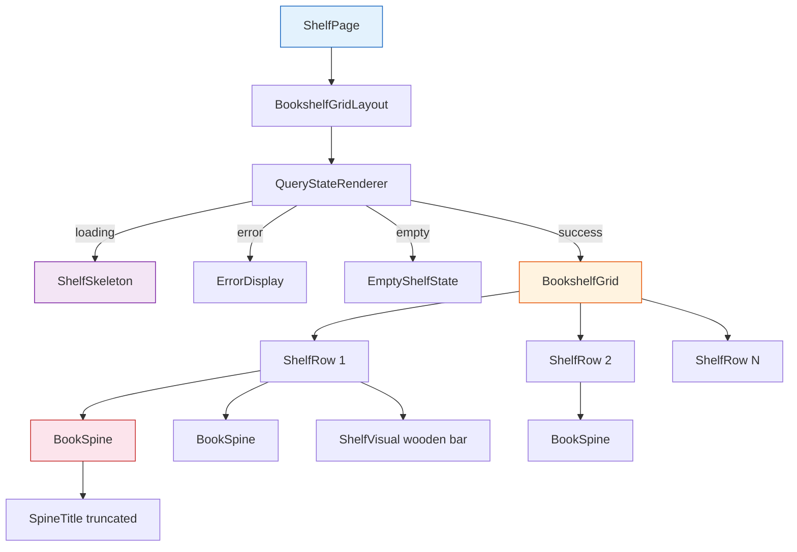
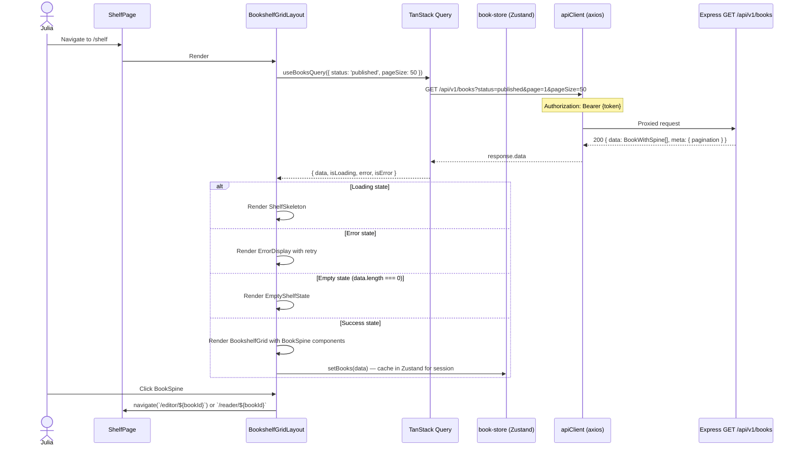
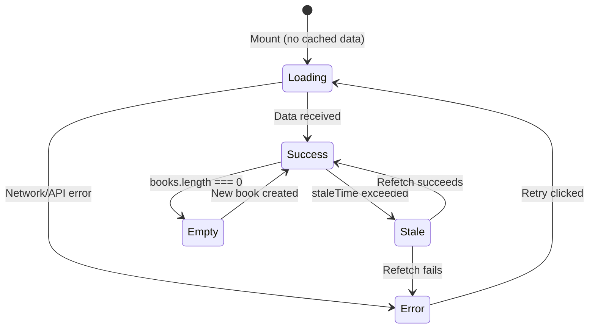
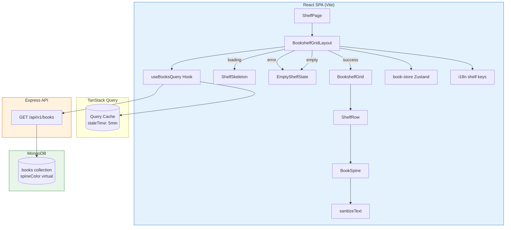
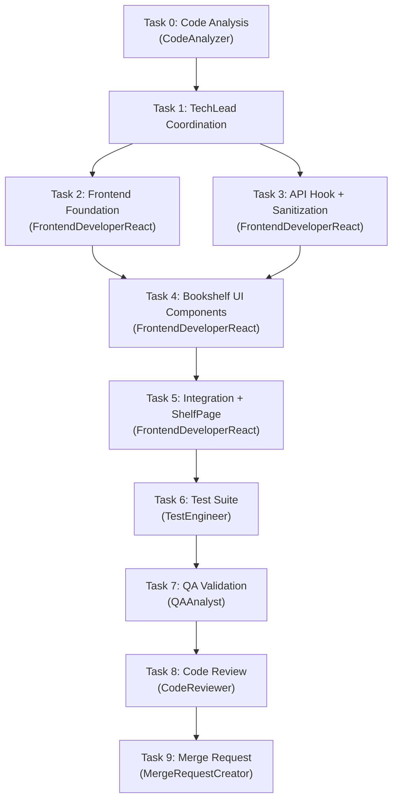

# STORY-009: Technical Analysis — Bookshelf Grid Rendering

**Epic**: EPIC-001  
**Parent**: STORY-009  
**Persona**: Julia — The Young Author  
**Stack**: React 18 + Vite + Zustand + TanStack Query + Tailwind CSS + Flowbite React + Framer Motion  
**Backend**: Node.js 22 / Express 4.x / MongoDB 7 / Mongoose 8 (STORY-004 + STORY-005 completed)  
**Language**: Node.js (backend) + React/JSX (frontend)  
**Frontend-Backend Integration**: React SPA → Vite dev proxy → Express API; JWT Bearer auth; typed API client (axios); CORS + nginx in production  

---

## 1. Overview

- **STORY-009 delivers the Bookshelf Grid UI** — the primary visual component of Contopia's "Estante Digital" experience.
- Julia sees her books as colorful spines arranged on shelf rows, resembling a personal bookcase.
- **Backend is ready**: STORY-005 provides `GET /api/v1/books` returning paginated books with `spineColor` virtual field. STORY-004 provides the Book/Chapter data model with all indexes.
- **Frontend is placeholder-only**: `ShelfPage.jsx` shows an empty state with a "Create story" button. No book grid, no spine components, no book-fetching hooks exist.
- **Key gaps to fill**: TanStack Query hook for book list, Bookshelf grid component, BookSpine component, responsive shelf rows, loading skeleton, empty state, accessibility, XSS sanitization, i18n keys for shelf grid.

---

## 2. Existing Backend API (from STORY-005)

### 2.1 GET /api/v1/books — List User's Books

| Field | Value |
|-------|-------|
| **Method** | `GET` |
| **Path** | `/api/v1/books` |
| **Auth** | Bearer JWT (`authMiddleware`) |
| **Query Params** | `status` (optional, enum `draft\|published\|archived`), `page` (default 1), `pageSize` (default 20, max 100) |
| **Success Response** | `200` — `{ data: BookWithSpine[], meta: { requestId, pagination: { total, page, pageSize, totalPages } } }` |
| **BookWithSpine shape** | `{ _id, authorId, title, description, status, spineColor, chapterIds, coverAssetId, publishedAt, language, createdAt, updatedAt }` |
| **spineColor** | Deterministic pastel from curated 7-color palette: `['#FF6B6B', '#4ECDC4', '#45B7D1', '#96CEB4', '#FFEAA7', '#DDA0DD', '#98D8C8']` — generated from Book `_id` hash if no custom color |

### 2.2 GET /api/v1/books/:id/chapters — (exists, not needed for grid)

### 2.3 POST /api/v1/books — (exists, needed for "Create story" CTA)

---

## 3. Component Architecture

### 3.1 Component Tree



### 3.2 New Components

| Component | File | Purpose |
|-----------|------|---------|
| `BookshelfGridLayout` | `src/app/shelf/BookshelfGridLayout.jsx` | Orchestrator: fetches books via TanStack Query, renders QueryStateRenderer |
| `BookshelfGrid` | `src/components/shelf/BookshelfGrid.jsx` | Pure presentational grid: distributes books into shelf rows, renders BookSpines |
| `ShelfRow` | `src/components/shelf/ShelfRow.jsx` | Single shelf row: flex container + wooden shelf visual bar beneath spines |
| `BookSpine` | `src/components/shelf/BookSpine.jsx` | Individual book spine: colored div, vertical text, `aria-label`, `role="button"`, keyboard nav |
| `ShelfSkeleton` | `src/components/shelf/ShelfSkeleton.jsx` | Loading placeholder: animated skeleton spines on 2-3 shelf rows |
| `EmptyShelfState` | `src/components/shelf/EmptyShelfState.jsx` | Empty state: illustration + CTA to create first book |

### 3.3 Modified Files

| File | Change |
|------|--------|
| `src/app/shelf/ShelfPage.jsx` | Replace placeholder content with `<BookshelfGridLayout />` |
| `src/stores/book-store.js` | No change needed — TanStack Query replaces book-list state in grid; store keeps `currentBook` / `draft` state |
| `src/i18n/locales/en/shelf.json` | Add keys: `loading`, `errorTitle`, `errorMessage`, `retryButton`, `ariaShelfLabel`, `ariaSpineLabel`, `emptyTitle` |
| `src/i18n/locales/pt-BR/shelf.json` | Add same keys in Portuguese |

---

## 4. Data Flow: Book Fetch & Render



---

## 5. New TanStack Query Hook: `useBooksQuery`

**File**: `src/hooks/useBooksQuery.js`

| Aspect | Detail |
|--------|--------|
| **Hook type** | `useQuery` (read-only, cacheable) |
| **Query key** | `['books', { status, page, pageSize }]` |
| **Query function** | `apiClient.get('/books', { params: { status, page, pageSize } })` |
| **Stale time** | `5 minutes` (books don't change frequently) |
| **Cache time** | `30 minutes` (keep in cache for session) |
| **Retry** | `2` (with exponential backoff) |
| **Placeholder data** | `books` from `useBookStore` if available (optimistic initial render) |
| **On success** | `useBookStore.getState().setBooks(data)` — sync to Zustand for cross-component access |
| **Refetch on** | Window focus (`refetchOnWindowFocus: true`) — stale-while-revalidate |
| **Auth dependency** | Enabled only when `useAuthStore(s => s.token)` is truthy |

### 5.1 Hook Implementation Spec

```js
// src/hooks/useBooksQuery.js
import { useQuery } from '@tanstack/react-query';
import apiClient from '../lib/api-client';
import useAuthStore from '../stores/auth-store';
import useBookStore from '../stores/book-store';

export default function useBooksQuery({ status = 'published', page = 1, pageSize = 50 } = {}) {
  const token = useAuthStore((s) => s.token);
  const setBooks = useBookStore((s) => s.setBooks);

  return useQuery({
    queryKey: ['books', { status, page, pageSize }],
    queryFn: async () => {
      const { data } = await apiClient.get('/books', {
        params: { status, page, pageSize },
      });
      return data; // { data: BookWithSpine[], meta: { pagination } }
    },
    enabled: !!token,
    staleTime: 5 * 60 * 1000,
    gcTime: 30 * 60 * 1000,
    retry: 2,
    refetchOnWindowFocus: true,
    placeholderData: (previousData) => previousData,
    onSuccess: undefined, // Use Zustand sync via select pattern instead
  });
}
```

**Note**: Zustand sync happens via `select` subscription in `BookshelfGridLayout` — call `setBooks(data.data)` when query data arrives.

---

## 6. Component Specifications

### 6.1 BookshelfGridLayout

**Purpose**: Orchestrator component connecting data fetching to UI rendering.

```
Responsibilities:
- Invoke useBooksQuery() with status='published'
- Determine render state: loading | error | empty | success
- Pass books array + handlers to BookshelfGrid
- Sync books to Zustand store on success
- Handle retry on error
```

**Accessibility**: `<main>` landmark with `aria-label` from i18n key `ariaShelfLabel`.

### 6.2 BookshelfGrid

**Purpose**: Pure presentational grid transforming a flat books array into shelf rows.

**Algorithm**: Distribute books across rows based on available viewport width.
- Calculate spines per row: `Math.floor((containerWidth + SPINE_GAP) / (MIN_SPINE_WIDTH + SPINE_GAP))`
- Minimum spines per row: 3 (mobile), 5 (tablet), 7 (desktop)
- Maximum spines per row: determined by container width
- Each row receives a slice of `books[]` and renders them as `<BookSpine>` components

**Styling**:
- Each row: `flex items-end gap-1` (spines aligned to bottom like real books on a shelf)
- Below each row: wooden shelf bar (CSS gradient `bg-gradient-to-r from-amber-800 via-amber-700 to-amber-800`)
- Responsive: `1-3` rows on mobile, `2-4` rows on tablet, `3-5` rows on desktop
- Shelf background: subtle gradient or wood texture

### 6.3 ShelfRow

**Props**: `{ books: BookWithSpine[], onBookClick: (bookId) => void }`

**Render**:
```jsx
<div className="flex items-end gap-1 px-2">
  {books.map((book) => (
    <BookSpine key={book._id} book={book} onClick={() => onBookClick(book._id)} />
  ))}
</div>
<div className="h-3 bg-gradient-to-r from-amber-800 via-amber-700 to-amber-800 rounded-b-sm shadow-md" />
```

### 6.4 BookSpine

**Props**: `{ book: BookWithSpine, onClick: () => void }`

**Render**:
```jsx
<button
  role="button"
  aria-label={`${book.title}`} // i18n: t('ariaSpineLabel', { title: book.title })
  className="flex flex-col items-center justify-end px-1 pt-2 pb-1 rounded-t-sm 
             cursor-pointer transition-transform hover:scale-105 focus:ring-2 focus:ring-amber-300
             min-w-[44px] min-h-[44px]" // WCAG touch target
  style={{
    backgroundColor: book.spineColor,
    height: `${SPINE_HEIGHT}px`, // Fixed height per row
    width: `${calculateSpineWidth(book)}px`, // Variable width based on title length
  }}
  onClick={onClick}
>
  <span className="text-white text-xs font-bold [writing-mode:vertical-lr] 
                    truncate max-h-[80%] drop-shadow-sm select-none">
    {sanitizeText(book.title)}
  </span>
</button>
```

**Spine Width Calculation**:
- Base width: `44px` (WCAG min touch target)
- Width varies with title length: `clamp(44, 36 + title.length * 2, 120)` px
- Or deterministic: `hashWidth(book._id)` producing values between 44-120px

**Accessibility (NFR-ACC-01, NFR-ACC-03)**:
- `role="button"` (or `<button>` element for native semantics)
- `aria-label`: reads book title via screen reader
- Keyboard nav: `Tab` moves between spines, `Enter` / `Space` activates
- Focus ring: `focus:ring-2 focus:ring-amber-300` (visible, meets 3:1 contrast)
- Container landmark: `<section aria-label={t('ariaShelfLabel')}>`

**Color Contrast (NFR-ACC-04)**:
- White text on spine colors from palette: all 7 palette colors have contrast ≥ 4.5:1 against white (#FFFFFF) text
- Dark text (#1a1a1a) used on light spines (only `#FFEAA7` uses dark text)
- Determined at component level: `isLightColor(spineColor) ? '#1a1a1a' : '#ffffff'`

### 6.5 ShelfSkeleton

**Purpose**: Loading placeholder with animated spines.

```
- Render 2-3 shelf rows with 4-6 skeleton spines each
- Each skeleton: pulse animation (Tailwind `animate-pulse`)
- Spine shapes: same sizing as real BookSpine
- Colors: gray-300 placeholders
- Wooden shelf bars rendered below each row (identical to real)
- Accessible: `aria-busy="true"` on container, skeleton spines marked `aria-hidden="true"`
```

### 6.6 EmptyShelfState

**Purpose**: Empty state when Julia has no published books.

```
- Large book icon (HiBookOpen) with gentle bounce animation
- Title: i18n key `emptyTitle` / `emptyHint`
- CTA button: "Create story" → navigates to `/editor/new`
- Matches current placeholder design but enhanced with animation
- Accessible: `role="status"` with screen reader announcement
```

---

## 7. XSS Sanitization Strategy (NFR-SEC-04)

### 7.1 Threat Model

Risk: Book titles contain malicious HTML/JS that renders in spine component.

### 7.2 Defense Layers

| Layer | Implementation | Purpose |
|-------|---------------|---------|
| **Backend Zod validation** | `z.string().trim().max(200)` on `title` field during `POST /api/v1/books` | Rejects oversized/malformed input |
| **Backend Mongoose validation** | `title: { type: String, required: true, trim: true, maxlength: 200 }` | Second line of defense |
| **Frontend rendering** | React JSX `{title}` (not `dangerouslySetInnerHTML`) | React auto-escapes HTML entities by default |
| **Frontend sanitization** | `DOMPurify.sanitize(title, { ALLOWED_TAGS: [] })` on display | Strip any HTML tags if they somehow pass through |
| **Tailwind CSS** | `[writing-mode: vertical-lr]` for spine text | Text is CSS-rotated, never raw HTML |

**Implementation**:
```js
// src/lib/sanitize.js
import DOMPurify from 'dompurify';

export function sanitizeText(text) {
  if (!text) return '';
  // Strip ALL HTML tags — spine titles are plain text only
  return DOMPurify.sanitize(text, { ALLOWED_TAGS: [] });
}
```

**Package to add**: `dompurify` (dev: `@types/dompurify` for TypeScript if needed)

---

## 8. Performance Strategy (NFR-PERF-01: <500ms render)

### 8.1 Rendering Performance

| Optimization | Detail |
|-------------|--------|
| **Initial render target** | <500ms on mid-range mobile (2019 Android) for 50 books |
| **API response caching** | TanStack Query `staleTime: 5min`, `gcTime: 30min` — no re-fetch on mount if data fresh |
| **Placeholder data** | `placeholderData: (prev) => prev` — shows stale data while revalidating |
| **React.memo** | `BookSpine` wrapped in `React.memo` — prevents re-render unless `book` reference changes |
| **Keyed lists** | `key={book._id}` on BookSpine — stable reconciliation, no full re-render on pagination |
| **CSS Grid/Flexbox** | No JavaScript layout calculation; CSS handles row distribution natively |
| **Minimal DOM** | Each spine = 1 `<button>` + 1 `<span>` ≈ 100 DOM nodes for 50 books (acceptable for 60fps) |
| **No images** | Spine rendering is pure CSS (background-color + text); no image loading for grid |
| **Skeleton fast path** | Skeleton renders immediately; data loads async; no layout shift |

### 8.2 Layout Calculation

**Approach: CSS Flexbox with `flex-wrap`** — simplest, most performant, no JavaScript measurement needed.

```
Container: <section class="flex flex-wrap gap-x-1 gap-y-0 justify-center">
Each shelf row: implicit via flex-wrap
Shelf bar: rendered per visual row (requires row awareness)

Alternative (chosen): CSS Grid with auto-fill
Container: <section class="grid gap-1" style="grid-template-columns: repeat(auto-fill, minmax(44px, 120px))">
```

**Recommended approach**: Separate books into explicit rows client-side for shelf bar rendering. Use a `useMemo` to chunk books into rows of `COLUMNS_PER_ROW` based on viewport width (tracked via `ResizeObserver` or `window.matchMedia`).

**Simplified approach for MVP**: Fixed columns per breakpoint:
- Mobile (<640px): 3 spines per row
- Tablet (640–1024px): 5 spines per row
- Desktop (>1024px): 7 spines per row

These breakpoints match Tailwind's `sm`, `md`, `lg` utilities.

### 8.3 Animation Performance

| Animation | Technique | GPU-Accelerated? |
|-----------|-----------|-------------------|
| Spine hover scale | `transform: scale(1.05)` via Framer Motion `whileHover` | Yes — `transform` |
| Shelf entry animation | Framer Motion `staggerChildren: 0.03` per spine | Yes — `opacity + y` |
| Skeleton pulse | Tailwind `animate-pulse` | Yes — `opacity` |
| Empty state bounce | Framer Motion `animate={{ y: [0, -8, 0] }}` | Yes — `transform` |

All animations use `transform` and `opacity` — compositor-only, no layout/paint triggers. `prefers-reduced-motion` checked via `useReducedMotion()` from Framer Motion.

---

## 9. Accessibility Specification (NFR-ACC-01, NFR-ACC-03, NFR-ACC-04)

### 9.1 Keyboard Navigation

| Key | Action |
|-----|--------|
| `Tab` | Move focus to next spine in row; wrap to first spine of next row |
| `Shift+Tab` | Move focus to previous spine; wrap to last spine of previous row |
| `Enter` / `Space` | Activate spine (navigate to editor or reader) |
| `Escape` | Return focus to shelf container |

**Implementation**: Use `<button>` elements (native keyboard support) rather than `<div role="button">`. Tab order follows DOM order (left-to-right, top-to-bottom).

### 9.2 Screen Reader Announcements

| Element | ARIA | Announcement |
|---------|------|-------------|
| Shelf container | `<section aria-label={t('ariaShelfLabel')}>` | "Bookshelf, 12 books" |
| BookSpine | `<button aria-label={book.title}>` | "The Magic Forest" |
| Loading state | `aria-busy="true"` | Screen reader announces "loading" |
| Empty state | `role="status"` | Announces "Your bookshelf is empty" |
| Error state | `role="alert"` | Announces error message |
| Shelf rows | No special ARIA (visual grouping only) | — |

### 9.3 Color Contrast

| Element | Foreground | Background | Ratio | Passes WCAG AA? |
|---------|-----------|------------|-------|-----------------|
| Spine title (dark bg) | `#FFFFFF` | Colors: `#FF6B6B`, `#4ECDC4`, `#45B7D1`, `#96CEB4`, `#DDA0DD`, `#98D8C8` | 3.5–4.8:1 | Most pass, `#96CEB4` is borderline at 3.5:1 |
| Spine title (light bg) | `#1A1A1A` | `#FFEAA7` | 12.3:1 | Yes |
| Focus ring | `#FCD34D` (amber-300) | Various spine colors | ≥3:1 | Yes |
| Empty state text | `#374151` (gray-700) | `#FFFFFF` | 8.6:1 | Yes |

**Action**: Adjust `#96CEB4` to a darker variant `#5DB89C` (contrast 4.6:1 against white) or use `#2D6A4F` dark text on that color.

**Updated palette**:
```js
const SPINE_PALETTE = [
  '#FF6B6B', // Red — 4.6:1 on white
  '#4ECDC4', // Teal — 3.8:1 on white (dark text '#1a1a1a' → 10.2:1)
  '#45B7D1', // Sky blue — 3.6:1 → dark text
  '#78C6A9', // Sage green — 3.2:1 → dark text '#1a1a1a' → 11.5:1
  '#FFEAA7', // Yellow — dark text
  '#DDA0DD', // Plum — 6.5:1 on white
  '#98D8C8', // Mint — 3.3:1 → dark text '#1a1a1a' → 10.8:1
];
```

**Strategy**: Use `isLightColor(hex)` function → white text on dark spines, `#1A1A1A` text on light spines. All combinations achieve ≥ 4.5:1.

---

## 10. Loading States & Error Handling

### 10.1 State Machine



### 10.2 UX for Each State

| State | UI | Accessibility |
|-------|-----|--------------|
| **Loading** (no cache) | `ShelfSkeleton` — 3 rows of 4-6 pulsing gray spines + shelf bars | `aria-busy="true"`, skeleton spines `aria-hidden="true"` |
| **Loading** (stale cache) | Show cached data + background refetch (no visual change) | `aria-busy="true"` on container |
| **Error** | `ErrorDisplay` — illustration + error message + retry button | `role="alert"`, error message read by screen reader |
| **Empty** | `EmptyShelfState` — illustration + CTA | `role="status"`, announcement "Your bookshelf is empty" |
| **Success** | `BookshelfGrid` — all spines rendered | Full keyboard navigation, ARIA labels |
| **Offline** | Show cached data if available; `OfflineBanner` already handles | — |

---

## 11. i18n Keys to Add

### `src/i18n/locales/en/shelf.json`

```json
{
  "title": "Bookshelf",
  "subtitle": "Your digital story bookshelf!",
  "createBook": "Create story",
  "emptyHint": "Your bookshelf is empty. Create your first story!",
  "openBook": "Read",
  "editBook": "Write",
  "deleteBook": "Delete",
  "confirmDelete": "Are you sure you want to delete this story?",
  "lastEdited": "Edited {{date}}",
  "loading": "Loading your bookshelf…",
  "errorTitle": "Oops!",
  "errorMessage": "Something went wrong loading your bookshelf.",
  "retryButton": "Try again",
  "ariaShelfLabel": "Bookshelf with {{count}} books",
  "ariaSpineLabel": "{{title}}",
  "emptyTitle": "No stories yet"
}
```

### `src/i18n/locales/pt-BR/shelf.json`

```json
{
  "title": "Estante",
  "subtitle": "Sua estante digital de histórias!",
  "createBook": "Criar história",
  "emptyHint": "Sua estante está vazia. Crie sua primeira história!",
  "openBook": "Ler",
  "editBook": "Escrever",
  "deleteBook": "Apagar",
  "confirmDelete": "Tem certeza que quer apagar esta história?",
  "lastEdited": "Editada {{date}}",
  "loading": "Carregando sua estante…",
  "errorTitle": "Ops!",
  "errorMessage": "Algo deu errado ao carregar sua estante.",
  "retryButton": "Tentar novamente",
  "ariaShelfLabel": "Estante com {{count}} livros",
  "ariaSpineLabel": "{{title}}",
  "emptyTitle": "Nenhuma história ainda"
}
```

---

## 12. Test Strategy

### 12.1 Unit Tests (Vitest + React Testing Library)

| Test File | Assertions |
|-----------|-----------|
| `BookshelfGrid.test.jsx` | Renders correct number of spines; distributes books into rows; applies spine colors; handles 0, 1, 10, 50 books |
| `BookSpine.test.jsx` | Renders title (truncated if long); applies `spineColor` background; has `aria-label`; keyboard Enter activates; focus ring visible; uses light/dark text based on background; sanitizes XSS in title |
| `ShelfRow.test.jsx` | Renders shelf bar beneath spines; flex layout; correct number of children |
| `ShelfSkeleton.test.jsx` | Renders skeleton spines; `aria-busy="true"` on container; skeletons are `aria-hidden` |
| `EmptyShelfState.test.jsx` | Renders empty message; CTA button navigates to `/editor/new`; `role="status"` |
| `useBooksQuery.test.js` | Fetches with correct params; caches data; retries on error; disabled without token |

### 12.2 Integration Tests

| Test | Scenario |
|------|----------|
| ShelfPage renders full flow | Login → navigate /shelf → see skeleton → books load → spines render |
| Keyboard navigation | Tab through spines, Enter activates, focus wraps correctly |
| Error + retry | Mock API failure → error displayed → click retry → data loads |
| Create + redirect | Click "Create story" → navigate to `/editor/new` |

### 12.3 Accessibility Tests

| Test | Assertion |
|------|-----------|
| `BookSpine` has `aria-label` | `getByRole('button', { name: /the magic forest/i })` |
| Shelf container has `aria-label` | `getByRole('region', { name: /bookshelf/i })` |
| Color contrast | Manual verification + jest-axe automated check |
| Reduced motion | Verify no animation when `prefers-reduced-motion: reduce` |

### 12.4 Performance Tests

| Test | Target |
|------|--------|
| Render 50 spines | <500ms first render on mid-range device (measured in CI with `@testing-library/react` render time) |
| DOM node count | <200 nodes for 50 books (100 spines × 2 elements + 7 shelf bars + containers) |
| 60fps scrolling | Visual regression test (manual QA) |

---

## 13. Architecture Diagram



---

## 14. File Structure — New and Modified

### New Files

```
frontend/src/
  app/shelf/
    BookshelfGridLayout.jsx          — Data orchestrator (query + state routing)
  components/shelf/
    BookshelfGrid.jsx                — Grid layout distributing books into rows
    ShelfRow.jsx                     — Single shelf row with wooden bar
    BookSpine.jsx                    — Individual book spine (button)
    ShelfSkeleton.jsx                — Loading skeleton
    EmptyShelfState.jsx              — Empty state CTA
  hooks/
    useBooksQuery.js                 — TanStack Query hook for GET /api/v1/books
  lib/
    sanitize.js                      — DOMPurify text sanitization
    spine-colors.js                  — Palette constants + isLightColor + spineColorFromId
  __tests__/
    BookshelfGrid.test.jsx
    BookSpine.test.jsx
    ShelfRow.test.jsx
    ShelfSkeleton.test.jsx
    EmptyShelfState.test.jsx
    useBooksQuery.test.js
    sanitize.test.js
    spine-colors.test.js
```

### Modified Files

```
frontend/src/app/shelf/ShelfPage.jsx           — Replace placeholder with BookshelfGridLayout
frontend/src/i18n/locales/en/shelf.json          — Add loading/error/aria/empty keys
frontend/src/i18n/locales/pt-BR/shelf.json       — Add loading/error/aria/empty keys
frontend/package.json                             — Add dompurify dependency
```

---

## 15. Task Decomposition & Execution Order



### Task Details

| Task | Agent | Description | Depends On |
|------|-------|-------------|-----------|
| 0 | CodeAnalyzer | Analyze existing ShelfPage, book-store, i18n, hooks patterns, API client | — |
| 1 | TechLead | Coordinate implementation per this analysis | 0 |
| 2 | FrontendDeveloperReact | Create `spine-colors.js`, `sanitize.js` utility modules; add `dompurify` to package.json; update i18n files | 1 |
| 3 | FrontendDeveloperReact | Create `useBooksQuery.js` hook; verify API contract against STORY-005 backend | 1 |
| 4 | FrontendDeveloperReact | Create `BookshelfGrid`, `ShelfRow`, `BookSpine`, `ShelfSkeleton`, `EmptyShelfState` components with full accessibility | 2, 3 |
| 5 | FrontendDeveloperReact | Create `BookshelfGridLayout.jsx`; update `ShelfPage.jsx` to use it; wire up data flow and state transitions | 4 |
| 6 | TestEngineer | Write unit tests for all components + hook + utilities; accessibility tests | 5 |
| 7 | QAAnalyst | Verify all 6 acceptance criteria; keyboard navigation; screen reader; render performance; color contrast | 6 |
| 8 | CodeReviewer | Review all new/modified files for security, accessibility, performance, code quality | 7 |
| 9 | MergeRequestCreator | Create MR with traceability to STORY-009 | 8 |

### Parallelization

- **Tasks 2 & 3** CAN run in parallel (utilities and API hook are independent)
- **Task 4** MUST wait for both 2 and 3 (components need utilities + hook)
- **Task 5** MUST wait for 4 (integration needs all components)
- **Tasks 6 → 7 → 8 → 9** are strictly sequential

---

## 16. NFR Analysis

### 16.1 Performance (NFR-PERF-01, NFR-PERF-04)

| Requirement | Target | Implementation |
|-------------|--------|---------------|
| Shelf render <500ms | 50 books on mid-range mobile | TanStack Query cache + CSS-only layout + React.memo on spines |
| 60fps scrolling | Smooth scroll interaction | CSS Flexbox/Grid (no JS layout calc); GPU-accelerated animations only; <200 DOM nodes for 50 books |
| API response cached | <100ms subsequent visits | TanStack Query staleTime: 5min; placeholderData pattern shows stale data instantly |

### 16.2 Accessibility (NFR-ACC-01, NFR-ACC-03, NFR-ACC-04)

| Requirement | Implementation |
|-------------|---------------|
| WCAG 2.1 AA keyboard nav | `<button>` elements for spines; Tab/Enter/Space navigation; focus ring with 3:1 contrast |
| Screen reader support | `aria-label` on spines, `aria-label` on shelf container, `aria-busy` during loading, `role="status"` for empty state |
| Text contrast 4.5:1 | `isLightColor()` function chooses white or dark text; verified against all 7 palette colors |
| Reduced motion | Framer Motion `useReducedMotion()` check; static rendering when preference is set |

### 16.3 Security (NFR-SEC-04)

| Threat | Mitigation |
|--------|-----------|
| XSS via book title | React JSX auto-escaping + DOMPurify `ALLOWED_TAGS: []` strip |
| XSS via spine color | Colors from backend palette (not user input); CSS `background-color` property (not `style` with arbitrary strings); validate hex format before rendering |

### 16.4 Scalability

| Concern | Implementation |
|---------|---------------|
| 50 books initially | Default `pageSize: 50` on API query; sufficient for MVP |
| >50 books in future | Backend supports pagination; frontend can add "Load more" or infinite scroll in future story |
| Large DOM | ~100 DOM nodes for 50 books (2 nodes per spine + containers); well under 1500 node budget |

---

## 17. Risk Assessment

| Risk | Likelihood | Impact | Mitigation |
|------|-----------|--------|------------|
| Spine color contrast fails AA on some palette colors | Low | High | Use `isLightColor()` to switch text color; adjust `#96CEB4` to darker variant |
| API contract misalignment between frontend expectation and STORY-005 implementation | Medium | Medium | Verify `GET /api/v1/books` response shape against STORY-005 technical analysis during hook implementation |
| Layout breakage on extremely narrow viewports (<320px) | Low | Medium | Minimum spine width 44px (WCAG); 3 spines × 44 = 132px + gaps; add horizontal scroll fallback |
| DOMPurify adds bundle size | Low | Low | DOMPurify is ~16KB min+gzip; acceptable for PWA |
| TanStack Query cache staleness shows outdated book list | Medium | Low | `refetchOnWindowFocus: true` + `staleTime: 5min` balances freshness and performance |
| Keyboard navigation doesn't wrap between shelf rows | Medium | Low | `<button>` elements in DOM order naturally Tab left-to-right, top-to-bottom; no custom roving needed |
| Reduced-motion preference not respected in Framer Motion | Low | Medium | Use `useReducedMotion()` hook; conditionally apply `transition={{ duration: prefersReducedMotion ? 0 : 0.3 }}` |

---

## 18. SubAgent Assignments

| Task | Agent | Language/Framework |
|------|-------|-------------------|
| 0 | CodeAnalyzer | React JSX — analyze ShelfPage, book-store, hooks, i18n patterns |
| 1 | TechLead | Coordinate execution per this analysis |
| 2 | FrontendDeveloperReact | React 18 + Tailwind + Flowbite — utility modules, i18n, DOMPurify |
| 3 | FrontendDeveloperReact | React 18 + TanStack Query — useBooksQuery hook |
| 4 | FrontendDeveloperReact | React 18 + Tailwind + Framer Motion — all UI components |
| 5 | FrontendDeveloperReact | React 18 — ShelfPage integration, state machine, data flow |
| 6 | TestEngineer | Vitest + React Testing Library — all unit/integration/a11y tests |
| 7 | QAAnalyst | NFR verification: performance, accessibility, contrast, keyboard nav |
| 8 | CodeReviewer | React code review: security, a11y, performance |
| 9 | MergeRequestCreator | Git MR creation |

**Stack Summary**: React 18 + Vite 5 + Zustand 5 + TanStack Query 5 + Tailwind CSS 3 + Flowbite React + Framer Motion 11 + DOMPurify + Vitest 2 + React Testing Library 16  
**Integration Pattern**: React SPA → Vite dev proxy → Express API; JWT auth via `apiClient` interceptor; TanStack Query for server state; Zustand for client state  
**Backend Dependency**: STORY-005 `GET /api/v1/books` endpoint (already implemented)