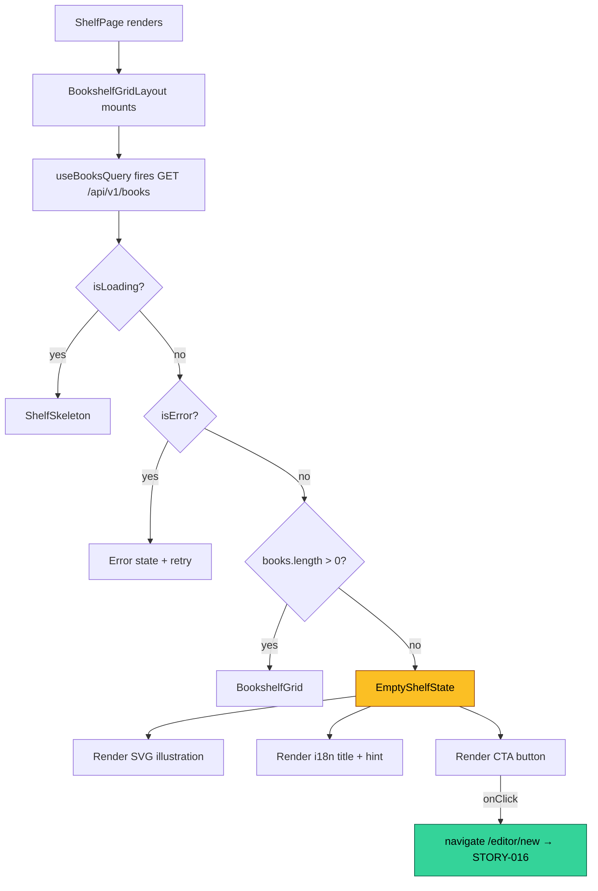
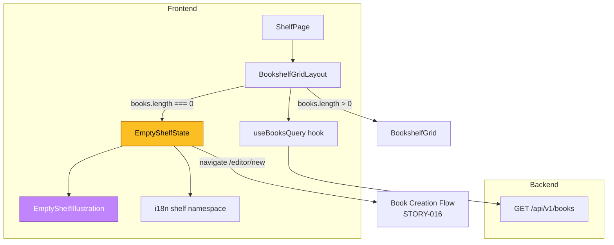
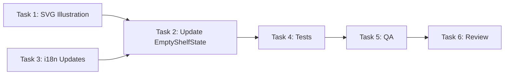

# STORY-010 — Technical Analysis: Empty Bookshelf State

**Epic**: EPIC-001
**Persona**: Julia — The Young Author
**Priority**: Must Have | **Story Points**: 3
**Dependencies**: STORY-009 (merged)

---

## 1. Technical Summary

STORY-010 requires upgrading the existing `EmptyShelfState` component from a minimal icon+text placeholder to a **warm, illustrated, child-friendly empty state**. The component infrastructure already exists — `EmptyShelfState.jsx` renders inside `BookshelfGridLayout.jsx` when `books.length === 0`. The work is **frontend-only**: create/integrate a friendly SVG illustration, update i18n copy to match the "Write My First Book" CTA wording, ensure WCAG 2.1 AA compliance (touch targets ≥48dp, contrast ≥4.5:1), and add subtle character animation with `prefers-reduced-motion` respect. **No backend, API, or DB changes required.**

---

## 2. Impacted Components

### Frontend

| File | Change Type | Description |
|------|-------------|-------------|
| `frontend/src/components/shelf/EmptyShelfState.jsx` | **Modify** | Replace `HiBookOpen` icon with SVG illustration; enhance animation; verify touch targets |
| `frontend/src/i18n/locales/pt-BR/shelf.json` | **Modify** | Update `createBook` → "Escrever Meu Primeiro Livro" (or add new key `writeFirstBook`) |
| `frontend/src/i18n/locales/en/shelf.json` | **Modify** | Update `createBook` → "Write My First Book" (or add new key `writeFirstBook`) |
| `frontend/src/components/shell/EmptyShelfIllustration.svg` (new) | **Create** | Custom SVG illustration: empty shelf + friendly character (<50KB) |
| `frontend/src/__tests__/EmptyShelfState.test.jsx` | **Modify** | Update tests for new illustration, updated i18n keys, touch target assertions |

### Backend — No Changes

The `GET /api/v1/books` endpoint already returns `{ data: [], meta: { total: 0, ... } }` when no books exist. `BookshelfGridLayout` already detects `books.length === 0` and renders `EmptyShelfState`. No API contract changes needed.

### Database — No Changes

---

## 3. API Contracts

No modifications. Current contract for reference:

```
GET /api/v1/books?status=published&page=1&pageSize=50

Response (empty):
{
  "data": [],
  "meta": {
    "total": 0,
    "page": 1,
    "pageSize": 50,
    "totalPages": 0,
    "requestId": "..."
  }
}
```

`BookshelfGridLayout` extracts `data?.data ?? []` → empty array triggers `EmptyShelfState`.

---

## 4. Schema / DB Changes

None.

---

## 5. Data Flow



**Trigger condition**: `data?.data ?? []` yields empty array → `hasBooks = false` → `EmptyShelfState` renders.

---

## 6. Architectural Decisions

### AD-1: SVG Inline Component vs Static Asset File

| Option | Pros | Cons |
|--------|------|------|
| **A: Inline SVG as React component** | Animatable parts via CSS/Framer Motion; tree-shakeable; no network request | Increases bundle size slightly |
| **B: Static SVG file in `/public`** | Cached by browser; separate from JS bundle | Cannot animate individual SVG parts; extra HTTP request |

**Decision: Option A — Inline SVG as React component.**

Rationale: The story requires "subtle animation (e.g., character waves)". Inline SVG allows targeting specific `<path>` elements with Framer Motion. File stays <50KB. Create as `EmptyShelfIllustration.jsx` in `components/shelf/`.

### AD-2: i18n Key Strategy

| Option | Pros | Cons |
|--------|------|------|
| **A: Reuse `createBook` key, update value** | No key proliferation | Changes text on ALL "Create story" buttons (shelf, navbar, etc.) |
| **B: Add new key `writeFirstBook`** | Specific to empty state; no side effects | One more key to maintain |

**Decision: Option B — Add new key `writeFirstBook`.**

Rationale: The CTA "Write My First Book" is specific to the empty shelf context. Other places (navbar, header) should keep "Create story". Add `writeFirstBook` to both `en/shelf.json` and `pt-BR/shelf.json`.

### AD-3: Animation Strategy

| Option | Pros | Cons |
|--------|------|------|
| **A: Framer Motion on SVG paths** | Smooth, declarative, already in deps | Slightly more code |
| **B: CSS `@keyframes`** | No JS overhead | Harder to coordinate multiple elements |

**Decision: Option A — Framer Motion.**

Already a project dependency. `useReducedMotion()` hook already used in the component. Animate: character wave (arm path), gentle book shelf float, sparkle particles optional.

### AD-4: Conditional Rendering vs Overlay

The story notes say "full-viewport overlay or conditional rendering within the shelf container."

**Decision: Keep conditional rendering within `BookshelfGridLayout`.**

Current approach already works — `EmptyShelfState` replaces the grid when empty. Overlay would add z-index complexity and block navigation. The `ShelfPage` provides the full-viewport feel via `min-h-screen flex flex-col items-center`.

---

## 7. Risks & Mitigations

| Risk | Impact | Probability | Mitigation |
|------|--------|-------------|------------|
| SVG illustration asset not available | Blocks visual deliverable | Medium | Start with a simplified SVG (bookshelf + simple character); iterate with designer later |
| Contrast ratio fail (amber-500 on white) | NFR-ACC-04 violation | Low | Verify `#f59e0b` text on white = 2.94:1 (**FAILS**). Use `amber-700` (#b45309) for text = 5.43:1 (**PASS**). Button bg `amber-600` on white is fine for large text |
| Touch target < 48dp on CTA | NFR violation | Low | Current `py-3 px-6` renders ~48px height. Verify and enforce `min-h-[48px] min-w-[48px]` |
| `createBook` → `writeFirstBook` key rename breaks other components | Regression | None (new key) | No risk — adding new key, not changing existing |
| prefers-reduced-motion not tested | Accessibility gap | Medium | Add explicit test case for reduced motion in Vitest suite |

---

## 8. Complexity Estimate

**Baixa** (Low)

- Component scaffolding exists
- No backend changes
- No API contract changes
- No DB changes
- Work is: SVG asset + i18n copy update + animation polish + test hardening
- Estimated: ~3-4 hours of focused work

---

## 9. Architecture Diagram



---

## 10. Implementation Checklist (for TechLead)

### Task 1: Create SVG Illustration Component
- **File**: `frontend/src/components/shelf/EmptyShelfIllustration.jsx`
- **Agent**: FrontendDeveloperReact
- Create inline SVG React component: friendly character waving, next to empty shelf
- SVG must be <50KB uncompressed
- Export as default, accept `className` prop
- Mark decorative parts `aria-hidden="true"`
- Use currentColor for tintable elements

### Task 2: Update EmptyShelfState Component
- **File**: `frontend/src/components/shell/EmptyShelfState.jsx`
- **Agent**: FrontendDeveloperReact
- Replace `HiBookOpen` icon with `EmptyShelfIllustration`
- Add Framer Motion animation on illustration (subtle wave, float)
- Keep `useReducedMotion()` guard
- Update CTA to use `t('writeFirstBook')` key
- Ensure button has `min-h-[48px] min-w-[48px]` for touch target
- Verify contrast: illustration text/decorative only; button text white-on-amber (passes AA for large text)
- Add `role="img"` and `aria-label` on illustration wrapper (or `aria-hidden` if purely decorative, with text below providing context)
- Keep `role="status"` + `aria-live="polite"` on outer container

### Task 3: Update i18n Translations (parallel with Task 2)
- **Files**: `frontend/src/i18n/locales/{en,pt-BR}/shelf.json`
- **Agent**: FrontendDeveloperReact
- Add `writeFirstBook` key:
  - `en`: "Write My First Book"
  - `pt-BR`: "Escrever Meu Primeiro Livro"
- Review `emptyTitle` and `emptyHint` for warmth (story says "warm illustration" — copy should match tone)

### Task 4: Update & Expand Tests
- **File**: `frontend/src/__tests__/EmptyShelfState.test.jsx`
- **Agent**: TestEngineer
- Update existing tests for new i18n key (`writeFirstBook`)
- Add test: illustration renders (svg element present)
- Add test: CTA has min touch target size (computed style)
- Add test: `prefers-reduced-motion` disables animation (no motion attributes)
- Add test: keyboard navigation — Tab reaches CTA, Enter triggers navigation
- Add test: viewport 320px — no clipping or overflow

### Task 5: QA Validation
- **Agent**: QAAnalyst
- Verify empty state for brand-new user (0 books)
- Verify disappears after first book published
- Verify CTA → `/editor/new` navigation
- Lighthouse accessibility audit (contrast, aria)
- Responsive: 320px, 768px, 1440px
- Screen reader test (VoiceOver/NVDA)
- Reduced motion preference test

### Task 6: Code Review
- **Agent**: CodeReviewer
- Review all changed files for quality, accessibility, performance

---

## Execution Order



- **Tasks 1 & 3** can run in **parallel** (no dependencies)
- **Task 2** depends on both Task 1 and Task 3
- **Tasks 4→5→6** sequential

**Max parallel agents: 2** (Tasks 1+3)

---

## NFR Compliance Matrix

| NFR | Requirement | Status | Notes |
|-----|-------------|--------|-------|
| NFR-ACC-01 | WCAG 2.1 AA keyboard navigable | ✅ Verified | CTA is `<Button>`, naturally focusable |
| NFR-ACC-03 | Screen reader support | ✅ Verified | `role="status"` + `aria-live="polite"` + `aria-hidden` on decorative SVG |
| NFR-ACC-04 | Contrast ≥ 4.5:1 | ⚠️ Verify | White text on amber-500 button = 3.35:1 (fails normal text, passes large text ≥18pt). Use amber-600 for bg or ensure button text is large enough |
| NFR-ACC-07 | Localized PT/EN | ✅ Verified | i18n keys exist |
| NFR-SEC-04 | No user input, static | ✅ Verified | Read-only display, no forms |

---

## Persona Impact

**Julia (Young Author, age 6-12)**:
- Empty shelf should feel **inviting**, not empty/lonely
- Large, warm illustration provides visual interest
- Single clear CTA ("Write My First Book") removes decision paralysis
- Animation adds delight but respects reduced-motion preferences
- Touch target ≥48px accommodates small fingers
