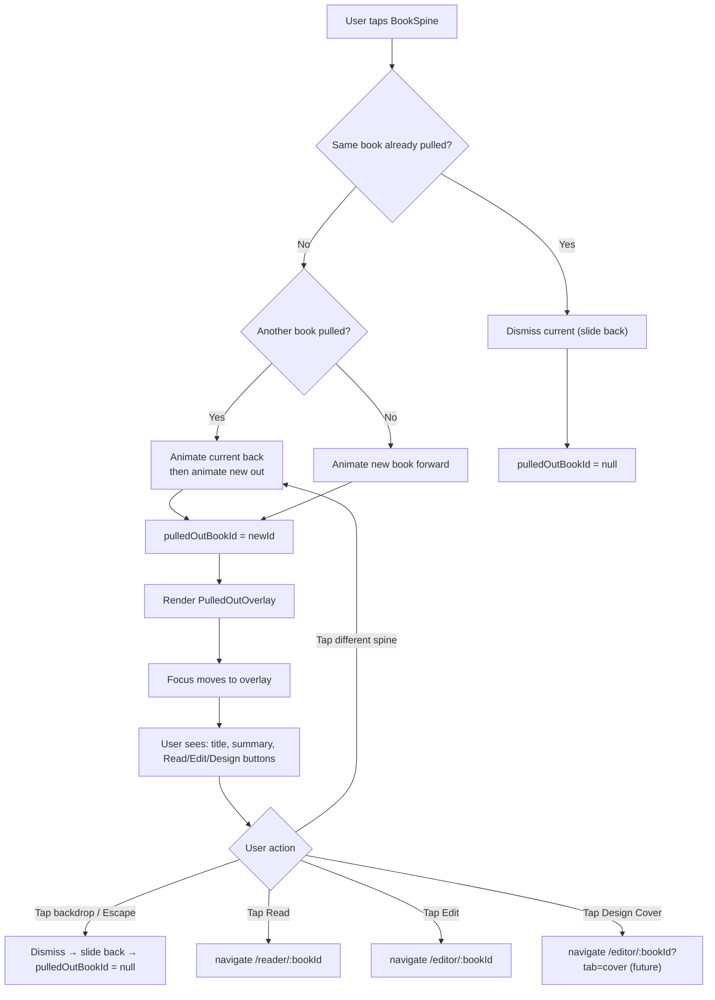
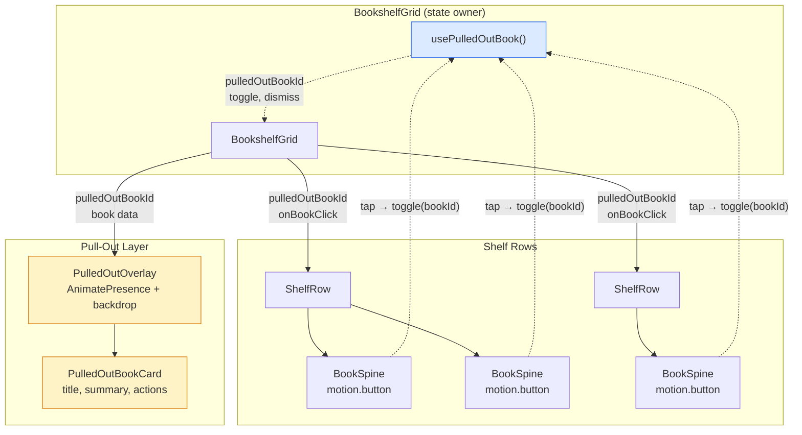
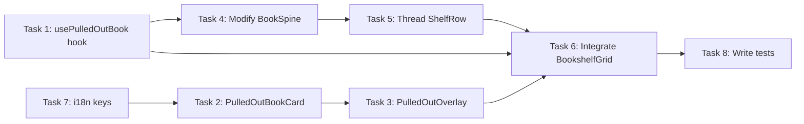

# STORY-011 — Technical Analysis: Tap-to-Pull Animation

**Epic**: EPIC-001 · **Persona**: Julia (Young Author) · **Priority**: Must Have · **SP**: 5
**Dependencies**: STORY-009 ✅ merged
**Stack**: Node.js 22 + React 18 + Vite 5 + Tailwind 3 + Framer Motion 11 + Zustand 5 + TanStack Query 5
**Stack Source**: `docs/architecture/TECH-STACK.md`

---

## 1. Technical Summary

STORY-011 adds the core interaction of the bookshelf: tapping a book spine animates it forward into a "pulled out" state, revealing a summary card with action buttons (Read, Edit, Design Cover). The story is **entirely frontend** — no API, schema, or backend changes. It extends the existing shelf component tree (`BookshelfGrid` → `ShelfRow` → `BookSpine`) with a pull-out overlay mechanism managed by local component state.

Key requirements:
- CSS-transform-only animation (translateX/Y, scale) at 250–350ms, ease-out
- 60fps on mid-range mobile via `will-change: transform` + GPU compositing
- `prefers-reduced-motion` → instant transition (project already uses `useReducedMotion()`)
- Keyboard accessible: Tab → spine, Enter → pull out, Tab through actions
- Rapid-tap safe: current book slides back before new one pulls out
- z-index + shadow for depth illusion

---

## 2. Impacted Components

| File | Change Type | Description |
|------|------------|-------------|
| `components/shelf/BookSpine.jsx` | **MODIFY** | Accept `isPulledOut`, `onPullOut` props; render pull-out animation via `motion.button`; forward `ref` for focus management |
| `components/shelf/ShelfRow.jsx` | **MODIFY** | Pass `pulledOutBookId`, `onBookClick` down to each `BookSpine` |
| `components/shelf/BookshelfGrid.jsx` | **MODIFY** | Own `pulledOutBookId` state; lift pull-out coordination here; pass state down to rows; render `PulledOutOverlay` when active |
| `components/shelf/PulledOutOverlay.jsx` | **CREATE** | Overlay component showing pulled-out book with summary, action buttons; `AnimatePresence` enter/exit; focus trap within overlay |
| `components/shelf/PulledOutBookCard.jsx` | **CREATE** | Card content: book title, cover placeholder, summary excerpt, action buttons (Read, Edit, Design Cover) |
| `hooks/usePulledOutBook.js` | **CREATE** | Hook encapsulating `pulledOutBookId` state, `pullOut(bookId)`, `dismiss()`, `isPulledOut(bookId)`, reduced-motion-aware duration |
| `i18n/locales/en/shelf.json` | **MODIFY** | Add keys: `pullOut.read`, `pullOut.edit`, `pullOut.designCover`, `pullOut.summary`, `pullOut.ariaActions`, `pullOut.ariaDismiss` |
| `i18n/locales/pt-BR/shelf.json` | **MODIFY** | Portuguese translations for same keys |
| `__tests__/usePulledOutBook.test.js` | **CREATE** | Unit tests for hook: pull out, dismiss, toggle, rapid-tap race |
| `__tests__/BookSpine.test.jsx` | **MODIFY** | Add tests: pulled-out visual state, Enter key triggers pull-out, aria attributes in pulled state |
| `__tests__/ShelfRow.test.jsx` | **MODIFY** | Add tests: only one book pulled out at a time, pull-out state passed correctly |
| `__tests__/BookshelfGrid.test.jsx` | **MODIFY** | Add tests: tap toggles pull-out, tapping different book switches, dismissed on outside click |
| `__tests__/PulledOutOverlay.test.jsx` | **CREATE** | Tests: renders book details, action buttons work, keyboard dismissal (Escape), focus management |
| `__tests__/PulledOutBookCard.test.jsx` | **CREATE** | Tests: renders title/summary/buttons, i18n keys present, action callbacks fire |
| `__tests__/BookSpineReducedMotion.test.jsx` | **CREATE** | Reduced-motion path test (following `ErrorToastReducedMotion.test.jsx` pattern) |

---

## 3. API Contracts

**None.** This story is purely frontend animation/interaction. The `useBooksQuery` hook and `/v1/books` endpoint are unchanged.

---

## 4. Schema / DB Changes

**None.**

---

## 5. Data Flow



---

## 6. Architectural Decisions

### AD-1: Animation Engine — Framer Motion (validated)

**Decision**: Use Framer Motion `animate` + `AnimatePresence` for pull-out animation. Not raw CSS transitions or FLIP library.

**Rationale**:
- Project already uses `framer-motion@^11.11.0` throughout (`BookSpine`, `BookshelfGrid`, `EmptyShelfState`, `ShelfPage`)
- `useReducedMotion()` hook is already integrated — consistent pattern
- `AnimatePresence` handles enter/exit animation coordination natively
- `motion.button` in `BookSpine` already uses `whileHover`/`whileTap` — pull-out is a natural extension
- No new dependency; team already knows the API

**Implementation**:
```jsx
// PulledOutOverlay.jsx pattern
<AnimatePresence>
  {pulledOutBookId && (
    <motion.div
      key={pulledOutBookId}
      initial={{ translateY: 0, scale: 1 }}
      animate={{ translateY: -20, scale: 1.05 }}
      exit={{ translateY: 0, scale: 1 }}
      transition={{ duration: reducedMotion ? 0 : 0.3, ease: [0.25, 0.1, 0.25, 1] }}
      style={{ willChange: 'transform' }}
    />
  )}
</AnimatePresence>
```

### AD-2: State Management — Local state via custom hook

**Decision**: Manage `pulledOutBookId` as local state in `BookshelfGrid` via a custom `usePulledOutBook` hook. Not in Zustand, URL params, or React Context.

**Rationale**:
- Pull-out is a **transient UI state** — it doesn't persist across navigation or need sharing outside the shelf
- Zustand is reserved for domain data (books, auth, drafts) — not ephemeral UI state
- URL params would pollute history and break back-button UX
- React Context adds provider overhead for a single-level prop drill (Grid → Row → Spine is only 3 levels)
- Custom hook encapsulates logic (pullOut, dismiss, toggle, isPulledOut) while keeping state local

**Implementation**:
```jsx
// usePulledOutBook.js
export default function usePulledOutBook() {
  const [pulledOutBookId, setPulledOutBookId] = useState(null);
  const pullOut = useCallback((id) => setPulledOutBookId(id), []);
  const dismiss = useCallback(() => setPulledOutBookId(null), []);
  const toggle = useCallback((id) => {
    setPulledOutBookId(prev => prev === id ? null : id);
  }, []);
  const isPulledOut = useCallback((id) => pulledOutBookId === id, [pulledOutBookId]);
  return { pulledOutBookId, pullOut, dismiss, toggle, isPulledOut };
}
```

### AD-3: Z-Index & Stacking Context Strategy

**Decision**: Use a dedicated stacking context via `position: relative; z-index` on the row containing the pulled-out spine, with the `PulledOutOverlay` rendered as a portal-free fixed overlay within the grid container.

**Rationale**:
- No React Portal needed — the overlay is visually positioned relative to the grid, not the document
- `z-index: 50` on pulled-out spine + `z-index: 40` on overlay backdrop keeps stacking predictable
- Tailwind's `z-50` / `z-40` utility classes avoid magic numbers
- Shadow (`shadow-xl`) provides depth without requiring 3D transforms
- The overlay uses `position: absolute` relative to the grid container (not viewport), keeping it within the shelf's visual context

**Implementation**: Pulled-out spine gets `z-50` + `shadow-xl`; overlay backdrop gets `z-40` semi-transparent bg.

### AD-4: Component Decomposition — Overlay + Card split

**Decision**: Split the pulled-out state into two components: `PulledOutOverlay` (animation shell + backdrop + focus trap) and `PulledOutBookCard` (content: title, summary, buttons).

**Rationale**:
- **Separation of concerns**: Animation/overlay logic is distinct from content rendering
- **Testability**: Card content can be tested independently of animation mechanics
- **Reusability**: Card can be reused in future contexts (e.g., long-press, right-click menu)
- Single Responsibility — each component < 80 lines

---

## 7. Risks & Mitigations

| Risk | Severity | Mitigation |
|------|----------|------------|
| **Rapid-tap race condition**: user taps spines faster than animation completes, causing multiple pulled-out states | High | `usePulledOutBook` uses state callback form; `AnimatePresence` with `mode="wait"` queues exits before new enters. Framer Motion handles animation queue internally. |
| **60fps on mid-range mobile**: complex transforms + shadows can cause jank | High | GPU-only transforms (translateX/Y, scale); `will-change: transform`; no layout props animated; shadow rendered once (not animated). Test with Chrome DevTools Performance panel on Moto G Power profile. |
| **Focus trap conflicts**: keyboard users trapped in overlay | Medium | Focus trap only active when overlay visible; Escape key dismisses; Tab wraps within overlay; on dismiss, focus returns to originating spine button. |
| **Reduced-motion detection**: `useReducedMotion` from Framer Motion may not match OS setting in all browsers | Medium | Framer Motion's hook wraps `matchMedia('(prefers-reduced-motion: reduce)')` — same as existing pattern. Verify on Safari (known quirks). |
| **Touch vs click event latency**: 300ms delay on mobile | Low | Modern browsers eliminated this; `<meta name="viewport">` already set by Vite PWA plugin. `touch-action: manipulation` on spine buttons. |
| **i18n key explosion**: many new keys for pull-out state | Low | Scoped under `pullOut.*` namespace; only 6-8 new keys per locale. |

---

## 8. Complexity Estimate

| Factor | Assessment |
|--------|------------|
| **Story Points** | 5 (as given by PM) — appropriate for animation + state + a11y + tests |
| **Time Estimate** | 6–8 hours implementation + 2–3 hours tests |
| **Technical Risk** | Medium — animation performance on mobile is the unknown; mitigated by GPU-only transforms |
| **Parallelization** | High — hook + i18n can be parallel with component work |
| **Test Effort** | Medium — 5 new/modified test files, reduced-motion path needs separate file |

---

## 9. Architecture Diagram



---

## 10. Implementation Checklist

| # | Task | File(s) | Agent | Description |
|---|------|---------|-------|-------------|
| 1 | Create `usePulledOutBook` hook | `hooks/usePulledOutBook.js` | FrontendDeveloperReact | Hook: `pulledOutBookId`, `pullOut(id)`, `dismiss()`, `toggle(id)`, `isPulledOut(id)`. Returns reduced-motion-aware duration via `useReducedMotion()`. |
| 2 | Create `PulledOutBookCard` component | `components/shelf/PulledOutBookCard.jsx` | FrontendDeveloperReact | Pure presentational: book title, summary excerpt, cover placeholder, action buttons (Read → `/reader/:id`, Edit → `/editor/:id`, Design Cover → future). i18n for all text. |
| 3 | Create `PulledOutOverlay` component | `components/shelf/PulledOutOverlay.jsx` | FrontendDeveloperReact | `AnimatePresence` wrapper, semi-transparent backdrop, focus trap, Escape dismiss, renders `PulledOutBookCard`. CSS transform animation with `will-change: transform`. |
| 4 | Modify `BookSpine` for pull-out state | `components/shelf/BookSpine.jsx` | FrontendDeveloperReact | Accept `isPulledOut` prop; when true, apply elevated z-index + shadow + scale transform. Accept `onPullOut` for Enter key. Add `aria-expanded` attribute. |
| 5 | Thread state through `ShelfRow` | `components/shelf/ShelfRow.jsx` | FrontendDeveloperReact | Pass `pulledOutBookId` and `onBookClick` to each `BookSpine`. Compute `isPulledOut` per spine. |
| 6 | Integrate in `BookshelfGrid` | `components/shelf/BookshelfGrid.jsx` | FrontendDeveloperReact | Use `usePulledOutBook` hook; pass state to rows; render `PulledOutOverlay` conditionally; handle outside-click dismiss. |
| 7 | Add i18n keys | `i18n/locales/{en,pt-BR}/shelf.json` | FrontendDeveloperReact | Add `pullOut.*` keys: read, edit, designCover, summary, ariaActions, ariaDismiss. |
| 8 | Write tests | `__tests__/{usePulledOutBook,BookSpine,PulledOutOverlay,PulledOutBookCard,BookSpineReducedMotion}.test.jsx` | TestEngineer | Hook unit tests; component render/interaction tests; reduced-motion path test; rapid-tap race test; keyboard navigation test. |

---

## 11. Execution Order



**Parallelization**:
- **Phase 1 (parallel)**: Task 1 (hook) + Task 7 (i18n) — no dependencies
- **Phase 2 (parallel)**: Task 2 (card) + Task 4 (BookSpine modification) — independent
- **Phase 3 (sequential)**: Task 3 (overlay) depends on Task 2; Task 5 (ShelfRow) depends on Task 4
- **Phase 4 (sequential)**: Task 6 (Grid integration) depends on Tasks 1, 3, 5
- **Phase 5 (sequential)**: Task 8 (tests) depends on all prior tasks

**Parallel cap**: Max 2 agents at a time per project rules.

---

## 12. NFR Compliance Matrix

| NFR ID | Requirement | Implementation Check | Verification |
|--------|-------------|---------------------|--------------|
| **NFR-PERF-04** | Animations ≥60fps on target devices | CSS transforms only (translateX/Y, scale); `will-change: transform`; no layout property animation; shadows applied once (not animated) | Chrome DevTools Performance recording on mid-range Android emulation; no frames >16.67ms |
| **NFR-ACC-05** | Respects `prefers-reduced-motion` | `useReducedMotion()` from Framer Motion in `usePulledOutBook` hook returns `duration: 0` when true; `BookSpine` skips micro-animations; `PulledOutOverlay` renders without motion | Test with `matchMedia('(prefers-reduced-motion: reduce)')` mocked to `true` (follow `ErrorToastReducedMotion.test.jsx` pattern) |
| **NFR-ACC-01** | WCAG 2.1 AA keyboard navigable + focus managed | `BookSpine` is `<button>` (natively focusable); Enter triggers pull-out; `PulledOutOverlay` implements focus trap; Escape dismisses; focus returns to originating spine on dismiss; `aria-expanded` on spine; `aria-label` on all buttons | Keyboard-only navigation test: Tab to spine → Enter → Tab through actions → Escape → verify focus returns |
| **NFR-SEC-04** | No JS injection via animation params | All book data rendered via React (auto-escaped); animation params are hardcoded constants (duration, easing, transform values); no `dangerouslySetInnerHTML`; `sanitizeText()` already used for titles | Code review: verify no dynamic values in transform/style objects; all user content goes through React rendering or `sanitizeText()` |

---

## Appendix: Existing Patterns to Follow

### Framer Motion Pattern (from `EmptyShelfState.jsx`)
```jsx
const prefersReducedMotion = useReducedMotion();
const animation = prefersReducedMotion ? {} : { animate: { ... }, transition: { ... } };
```

### Reduced Motion Test Pattern (from `ErrorToastReducedMotion.test.jsx`)
```jsx
beforeAll(() => {
  window.matchMedia = vi.fn().mockImplementation((query) => ({
    matches: query === '(prefers-reduced-motion: reduce)',
    ...
  }));
});
// Dynamic import to capture mocked matchMedia
const { default: Component } = await import('../components/...');
```

### Test Structure (from `BookSpine.test.jsx`)
- Vitest + `@testing-library/react`
- `vi.fn()` for callbacks
- `screen.getByRole('button')` for a11y queries
- `setup.js` mocks `react-i18next` to pass through keys

### i18n Key Naming
- Scoped: `shelf.json` namespace
- Pattern: `pullOut.action` for pull-out-specific keys
- Both `en/` and `pt-BR/` must stay in sync
