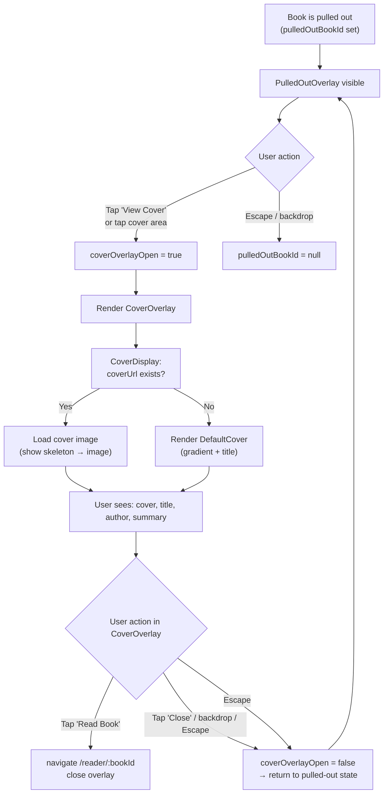
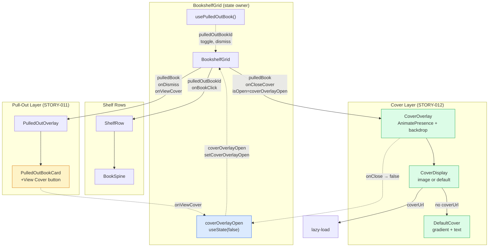
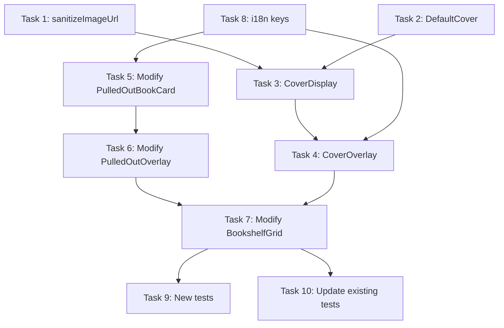

# STORY-012 — Technical Analysis: Cover Overlay View

**Epic**: EPIC-001 · **Persona**: Julia (Young Author) · **Priority**: Must Have · **SP**: 3
**Dependencies**: STORY-011 ✅
**Stack**: Node.js 22 + React 18 + Vite 5 + Tailwind 3 + Framer Motion 11 + Zustand 5 + TanStack Query 5
**Stack Source**: `docs/architecture/TECH-STACK.md`

---

## 1. Technical Summary

STORY-012 adds a full cover overlay/modal that opens when Julia taps "View Cover" (or taps the cover area) on a pulled-out book. It displays the book's cover image at full size, along with title, author name, and optional summary. The story is **entirely frontend** — no API, schema, or backend changes.

Relationship to STORY-011:
- STORY-011 introduced the pull-out interaction (`PulledOutOverlay` + `PulledOutBookCard` + `usePulledOutBook` hook)
- The cover overlay is a **second-layer state on top of pull-out** — it can only open when a book is already pulled out
- Closing the cover overlay returns to the pulled-out state (AC-3), not to dismissed

Key technical work:
- Add "View Cover" trigger to `PulledOutBookCard` (button + clickable cover area)
- Create `CoverOverlay` component (custom modal, not Flowbite) with Framer Motion transitions
- Create `CoverDisplay` component (cover image or default cover)
- Manage `coverOverlayOpen` boolean state in `BookshelfGrid`
- Lazy-load cover image when overlay opens
- Full WCAG 2.1 AA compliance: focus trap, `aria-modal`, `role="dialog"`, Escape close
- Respect `prefers-reduced-motion` per existing pattern

---

## 2. Impacted Components

| File | Change Type | Description |
|------|------------|-------------|
| `components/shelf/CoverOverlay.jsx` | **CREATE** | Full cover overlay modal: `AnimatePresence` enter/exit, backdrop, focus trap, Escape dismiss, renders `CoverDisplay`. Follows `PulledOutOverlay` pattern. |
| `components/shelf/CoverDisplay.jsx` | **CREATE** | Cover image display with lazy-load skeleton, or default cover (CSS gradient + text). Handles loading/error states. |
| `components/shelf/DefaultCover.jsx` | **CREATE** | CSS-generated cover using book's `spineColor` virtual + title + author name. Zero network cost. |
| `components/shelf/PulledOutBookCard.jsx` | **MODIFY** | Add "View Cover" button and make cover placeholder area clickable with `onViewCover` callback. |
| `components/shelf/BookshelfGrid.jsx` | **MODIFY** | Add `coverOverlayOpen` local state; render `CoverOverlay` when active; wire `onViewCover` from `PulledOutOverlay`; pass `onCloseCover` to return to pulled-out state. |
| `components/shelf/PulledOutOverlay.jsx` | **MODIFY** | Accept and forward `onViewCover` prop to `PulledOutBookCard`. |
| `i18n/locales/en/shelf.json` | **MODIFY** | Add keys: `coverOverlay.title`, `coverOverlay.readBook`, `coverOverlay.close`, `coverOverlay.viewCover`, `coverOverlay.defaultCover`, `coverOverlay.ariaLabel`. |
| `i18n/locales/pt-BR/shelf.json` | **MODIFY** | Portuguese translations for same keys. |
| `__tests__/CoverOverlay.test.jsx` | **CREATE** | Tests: renders cover image, default cover fallback, backdrop click closes, Escape closes, focus trap, "Read Book" navigates, "Close" returns to pulled-out state, `aria-modal` + `role="dialog"`. |
| `__tests__/CoverDisplay.test.jsx` | **CREATE** | Tests: renders image with valid URL, shows skeleton while loading, shows DefaultCover when no URL, error state. |
| `__tests__/DefaultCover.test.jsx` | **CREATE** | Tests: renders title and author, applies spineColor gradient, text contrast ≥ 4.5:1. |
| `__tests__/PulledOutBookCard.test.jsx` | **MODIFY** | Add tests: "View Cover" button renders and fires callback, cover area is clickable. |
| `__tests__/BookshelfGrid.test.jsx` | **MODIFY** | Add tests: cover overlay opens/closes, closing cover returns to pulled-out state, "Read Book" navigates. |
| `__tests__/CoverOverlayReducedMotion.test.jsx` | **CREATE** | Reduced-motion path: transitions are instant (follow `BookSpineReducedMotion.test.jsx` pattern). |

---

## 3. API Contracts

**None.** This story is purely frontend. The cover overlay consumes book data already fetched by `useBooksQuery`.

**Future integration note**: When STORY-006 (asset CDN) is implemented, the book API response may include a `coverUrl` field (resolved from `coverAssetId` → Asset URL). The `CoverDisplay` component is designed to consume `coverUrl` when available, falling back to `DefaultCover` when absent or null. No frontend API changes are needed in this story.

---

## 4. Schema / DB Changes

**None.** The book model already has `coverAssetId` (ObjectId ref to Asset collection). No new fields, indexes, or collections.

---

## 5. Data Flow



---

## 6. Architectural Decisions

### AD-1: Custom Overlay Component (not Flowbite Modal)

**Decision**: Build `CoverOverlay` as a custom component following the `PulledOutOverlay` pattern. Do NOT use Flowbite React's `Modal`.

**Rationale**:
- Flowbite Modal (`flowbite-react@0.10.2`) provides `role="dialog"`, `aria-modal`, focus trap, backdrop click, `overflow: hidden` on body — all a11y requirements ✅
- **However**, Flowbite Modal uses its own CSS transitions and does NOT integrate with Framer Motion. The story requires specific custom transitions (fade 150ms + scale 200ms via Framer Motion `AnimatePresence`)
- STORY-011 established a custom overlay pattern (`PulledOutOverlay`) with Framer Motion — consistency is more important than using Flowbite for this case
- `PulledOutOverlay` already implements: focus trap, Escape key, backdrop click, `role="dialog"`, `aria-label` — `CoverOverlay` reuses the same pattern
- The existing `SessionTimeoutModal` uses Flowbite Modal because it has standard dialog needs (no custom animation). The cover overlay is a different UX pattern (immersive, animated, contextual)
- Using the same pattern as `PulledOutOverlay` reduces cognitive load for developers

**Implementation**:
```jsx
// CoverOverlay.jsx — follows PulledOutOverlay.jsx structure
<AnimatePresence>
  {isOpen && (
    <>
      <motion.div /* backdrop */
        initial={{ opacity: 0 }}
        animate={{ opacity: 1 }}
        exit={{ opacity: 0 }}
        transition={{ duration: reducedMotion ? 0 : 0.15 }}
        onClick={handleClose}
        className="fixed inset-0 bg-black/50 z-[60]"
        aria-hidden="true"
      />
      <motion.div /* modal */
        role="dialog"
        aria-modal="true"
        aria-label={t('coverOverlay.ariaLabel', { title })}
        initial={{ opacity: 0, scale: 0.9 }}
        animate={{ opacity: 1, scale: 1 }}
        exit={{ opacity: 0, scale: 0.9 }}
        transition={{ duration: reducedMotion ? 0 : 0.2, ease: EASE_OUT }}
      >
        <CoverDisplay ... />
      </motion.div>
    </>
  )}
</AnimatePresence>
```

### AD-2: State Ownership — Option C (cover overlay as second-layer state in BookshelfGrid)

**Decision**: Manage `coverOverlayOpen` as a local `useState` boolean in `BookshelfGrid`, alongside the existing `usePulledOutBook` hook. The cover overlay is a child of the pull-out state.

**Rationale**:
- AC-1: Cover overlay only opens when a book is already pulled out → it's inherently a sub-state
- AC-3: Closing cover overlay returns to pulled-out state → closing sets `coverOverlayOpen = false` but leaves `pulledOutBookId` unchanged
- The cover overlay never exists independently of pull-out → no need for a separate hook
- `usePulledOutBook` hook stays focused on pull-out/dismiss concerns (SRP)
- `coverOverlayOpen` is a simple boolean — `useState` is sufficient, no custom hook needed
- State flow: `pulledOutBookId` (STORY-011) → `coverOverlayOpen` (STORY-012) — clear hierarchy

**Implementation**:
```jsx
// BookshelfGrid.jsx additions
const [coverOverlayOpen, setCoverOverlayOpen] = useState(false);

const handleViewCover = useCallback(() => {
  setCoverOverlayOpen(true);
}, []);

const handleCloseCover = useCallback(() => {
  setCoverOverlayOpen(false);
}, []);

// When pull-out is dismissed, also close cover overlay
const handleDismiss = useCallback(() => {
  dismiss(); // from usePulledOutBook
  setCoverOverlayOpen(false);
}, [dismiss]);
```

### AD-3: Z-Index & Rendering — Fixed overlay above pulled-out overlay

**Decision**: Render `CoverOverlay` at the same level as `PulledOutOverlay` (inside `BookshelfGrid`), with higher z-index (`z-[60]` for backdrop, `z-[70]` for modal content). The cover overlay visually stacks above the pulled-out overlay.

**Rationale**:
- STORY-011 uses `z-40` (backdrop) and `z-50` (card) for `PulledOutOverlay`
- Cover overlay needs to appear above: `z-[60]` (backdrop) + `z-[70]` (content)
- No React Portal needed — both overlays are already `position: fixed` and z-indexed
- When cover overlay is open, the pulled-out overlay is hidden behind the cover's backdrop — visually correct
- Both overlays use `AnimatePresence` for independent enter/exit animations

### AD-4: Cover Image Lazy-Loading — Load on overlay open with skeleton

**Decision**: Load the cover image only when the overlay opens. Show a loading skeleton while the image loads. Do NOT pre-load on pull-out.

**Rationale**:
- The overlay opens on explicit user action (tap "View Cover") — loading on demand is appropriate
- Pre-loading on pull-out would waste bandwidth (user might not view the cover)
- The skeleton placeholder provides visual feedback during load
- The 500ms render budget (NFR-PERF-01) applies to shelf render, not the modal — the modal's own render budget is "feels instant" (< 150ms for frame, < 1s for image)
- React's `` is not useful here (the image is not in viewport until modal opens) — instead, use a simple `onLoad`/`onError` state machine in `CoverDisplay`
- If the image takes > 2s, the skeleton remains visible (acceptable UX)

**Implementation**:
```jsx
// CoverDisplay.jsx
const [imgState, setImgState] = useState('loading'); // 'loading' | 'loaded' | 'error'

{coverUrl ? (
  <div className="relative">
    {imgState === 'loading' && <CoverSkeleton />}
     setImgState('loaded')}
      onError={() => setImgState('error')}
      className={cn('w-full h-full object-cover rounded-lg', imgState !== 'loaded' && 'invisible')}
    />
    {imgState === 'error' && <DefaultCover title={title} authorName={authorName} spineColor={spineColor} />}
  </div>
) : (
  <DefaultCover title={title} authorName={authorName} spineColor={spineColor} />
)}
```

### AD-5: Default Cover — CSS gradient + text component

**Decision**: Generate the default cover using CSS (Tailwind gradient background + centered text). Not SVG, not a static asset.

**Rationale**:
- **Zero network cost** — renders instantly within any performance budget
- Uses the book's `spineColor` virtual for visual consistency with the shelf
- Simple implementation: a `div` with `background: linear-gradient(...)` + title/author text
- No asset management needed — pure CSS
- Accessible: title and author are real text (not images of text), readable by screen readers
- Contrast ensured by using dark text on light pastel backgrounds (the spineColor palette is all light pastels)

**Implementation**:
```jsx
// DefaultCover.jsx
export default function DefaultCover({ title, authorName, spineColor }) {
  return (
    <div
      className="w-full h-full rounded-lg flex flex-col items-center justify-center p-4"
      style={{ background: `linear-gradient(135deg, ${spineColor} 0%, ${spineColor}99 100%)` }}
      role="img"
      aria-label={t('coverOverlay.defaultCover', { title })}
    >
      <span className="text-gray-800 font-bold text-lg text-center leading-tight line-clamp-3">
        {title}
      </span>
      {authorName && (
        <span className="text-gray-600 text-sm mt-2">
          {authorName}
        </span>
      )}
    </div>
  );
}
```

### AD-6: URL Sanitization — Protocol validation + DOMPurify

**Decision**: Use a lightweight `sanitizeImageUrl` utility that validates the URL protocol is `https://` or a relative path, and passes through DOMPurify (already a project dependency).

**Rationale**:
- NFR-SEC-04 requires cover image URLs sanitized to prevent XSS
- React auto-escapes JSX attribute values, but `` with crafted URLs could load external resources
- The primary risks: `javascript:` URIs (harmless in `` but best practice to block), `data:` URIs with embedded SVG/HTML, and external tracking pixels
- Cover URLs come from the backend (S3/MinIO signed URLs) — already HTTPS. But defense-in-depth is required
- DOMPurify is already imported in the project (`frontend/src/lib/sanitize.js`)
- A simple allowlist (https://, relative /) covers all legitimate use cases

**Implementation**:
```jsx
// lib/sanitize.js — add to existing file
export function sanitizeImageUrl(url) {
  if (!url) return '';
  const trimmed = url.trim();
  // Allow only https:// and relative paths
  if (/^https:\/\//i.test(trimmed) || /^\//.test(trimmed)) {
    return DOMPurify.sanitize(trimmed, { ALLOWED_TAGS: [] });
  }
  return ''; // Block javascript:, data:, http:, etc.
}
```

### AD-7: "View Cover" Trigger — Button + clickable cover area

**Decision**: Add a "View Cover" button to `PulledOutBookCard` AND make the existing cover placeholder area clickable. Both trigger `onViewCover`.

**Rationale**:
- AC-1 says "tapping the book again or tapping 'View Cover'" — two trigger paths
- The existing cover placeholder (`<div className="w-full h-16 rounded bg-gray-200" />`) is the natural "tap the book again" target
- Adding a dedicated "View Cover" button provides an explicit, discoverable action
- The cover placeholder becomes a `<button>` with `aria-label="View Cover"` for accessibility
- The "View Cover" text button is secondary styling (not primary amber) to avoid visual clutter

---

## 7. Risks & Mitigations

| Risk | Severity | Mitigation |
|------|----------|------------|
| **Cover image slow/no load**: CDN latency or missing cover URL | Medium | `CoverDisplay` shows skeleton → DefaultCover on error. Timeout handled by ``. Default cover is zero-cost CSS. |
| **Z-index collision**: Three layers (spines z-0, pulled-out z-40/50, cover z-60/70) | Low | Explicit z-index hierarchy documented. Tailwind `z-[60]`/`z-[70]` avoids collisions with existing z-40/50. |
| **Focus trap conflict**: Both PulledOutOverlay and CoverOverlay have focus traps | Medium | Only the topmost overlay (CoverOverlay) should trap focus. When `coverOverlayOpen` is true, `PulledOutOverlay`'s focus trap is hidden behind the cover backdrop — it won't receive events. Verify with Tab/Shift+Tab test. |
| **Body scroll lock**: Two overlays both setting `overflow: hidden` | Low | Use a ref-counting approach or simply let CoverOverlay set `overflow: hidden` on mount and remove on unmount. Since CoverOverlay always opens on top of PulledOutOverlay (which already set overflow), this is a no-op. Add cleanup in `useEffect`. |
| **Reduced-motion inconsistency**: Two overlay components with independent motion logic | Low | Both use the same `useReducedMotion()` from Framer Motion + `duration = reducedMotion ? 0 : X` pattern. Consistent. |
| **Book data missing `coverUrl`**: Current API doesn't include cover URL in book response | Low | `CoverDisplay` handles null/undefined `coverUrl` by showing `DefaultCover`. Story is designed to work without backend changes. Future STORY-006 integration will populate `coverUrl`. |
| **Author name not in book data**: Book model has `authorId` but frontend may not have resolved the author's name | Medium | For MVP, use `"by [Author]"` placeholder or derive from auth store. Story's scope is cover display — full author name resolution is a separate concern. Check if `useAuthStore` has the user's display name. |

---

## 8. Complexity Estimate

| Factor | Assessment |
|--------|------------|
| **Story Points** | 3 (as given by PM) — appropriate. Work is: 3 new small components, 3 modified files, 2 i18n files, ~6 test files. No backend, no complex state. |
| **Time Estimate** | 4–5 hours implementation + 2–3 hours tests |
| **Technical Risk** | Low — follows established `PulledOutOverlay` pattern exactly. Main unknown is cover image loading UX, mitigated by DefaultCover fallback. |
| **Parallelization** | High — `DefaultCover`, `CoverDisplay`, `CoverOverlay` can be built in parallel. i18n is independent. Tests depend on components. |
| **Test Effort** | Medium — 3 new test files + 3 modified. Focus trap and reduced-motion tests are the most involved. |

---

## 9. Architecture Diagram



---

## 10. Implementation Checklist

| # | Task | File(s) | Agent | Description |
|---|------|---------|-------|-------------|
| 1 | Add `sanitizeImageUrl` utility | `frontend/src/lib/sanitize.js` | FrontendDeveloperReact | Add URL protocol validation to existing sanitize module. Allow `https://` and relative `/`. Block `javascript:`, `data:`, `http:`. |
| 2 | Create `DefaultCover` component | `frontend/src/components/shelf/DefaultCover.jsx` | FrontendDeveloperReact | CSS gradient cover using `spineColor` + title + author. `role="img"`, `aria-label`. Ensure text contrast ≥ 4.5:1 on pastel backgrounds. |
| 3 | Create `CoverDisplay` component | `frontend/src/components/shelf/CoverDisplay.jsx` | FrontendDeveloperReact | Conditionally renders `` (with skeleton → loaded → error states) or `DefaultCover`. Uses `sanitizeImageUrl` for URL. `onLoad`/`onError` state machine. |
| 4 | Create `CoverOverlay` component | `frontend/src/components/shelf/CoverOverlay.jsx` | FrontendDeveloperReact | Full modal: `AnimatePresence`, backdrop (`z-[60]`), dialog (`z-[70]`, `aria-modal`, `role="dialog"`), focus trap (same pattern as `PulledOutOverlay`), Escape close, `overflow: hidden` on body. Fade 150ms + scale 200ms. Renders `CoverDisplay`. |
| 5 | Modify `PulledOutBookCard` | `frontend/src/components/shelf/PulledOutBookCard.jsx` | FrontendDeveloperReact | Add `onViewCover` prop. Make cover area a `<button>`. Add "View Cover" text button. Both call `onViewCover`. |
| 6 | Modify `PulledOutOverlay` | `frontend/src/components/shelf/PulledOutOverlay.jsx` | FrontendDeveloperReact | Accept and forward `onViewCover` prop to `PulledOutBookCard`. |
| 7 | Modify `BookshelfGrid` | `frontend/src/components/shelf/BookshelfGrid.jsx` | FrontendDeveloperReact | Add `coverOverlayOpen` state + `handleViewCover`/`handleCloseCover`. Render `CoverOverlay` when `coverOverlayOpen && pulledBook`. Wire `onViewCover` to PulledOutOverlay. Update `handleDismiss` to also close cover. |
| 8 | Add i18n keys | `frontend/src/i18n/locales/{en,pt-BR}/shelf.json` | FrontendDeveloperReact | Add `coverOverlay.*` keys: title, readBook, close, viewCover, defaultCover, ariaLabel, authorBy. |
| 9 | Write tests | `frontend/src/__tests__/{CoverOverlay,CoverDisplay,DefaultCover,CoverOverlayReducedMotion}.test.jsx` | TestEngineer | New test files: overlay focus trap, default cover, image loading states, reduced motion. |
| 10 | Update existing tests | `frontend/src/__tests__/{PulledOutBookCard,BookshelfGrid}.test.jsx` | TestEngineer | Add: "View Cover" button renders/fires, cover overlay open/close flow, close returns to pulled-out. |

---

## 11. Execution Order



**Parallelization**:
- **Phase 1 (parallel, max 2 agents)**: Task 1 (`sanitizeImageUrl`) + Task 2 (`DefaultCover`) — no dependencies
- **Phase 2 (parallel, max 2 agents)**: Task 3 (`CoverDisplay`, depends on T1+T2) + Task 5 (`PulledOutBookCard`, independent) — can run in parallel
- **Phase 3 (parallel, max 2 agents)**: Task 4 (`CoverOverlay`, depends on T3) + Task 6 (`PulledOutOverlay`, depends on T5)
- **Phase 4 (sequential)**: Task 7 (`BookshelfGrid`, depends on T4+T6)
- **Phase 5 (parallel)**: Task 8 (`i18n`) can run anytime before T4/T5
- **Phase 6 (parallel, max 2 agents)**: Task 9 + Task 10 (both depend on T7)

**Recommended agent: FrontendDeveloperReact** for Tasks 1–8, **TestEngineer** for Tasks 9–10.

---

## 12. NFR Compliance Matrix

| NFR ID | Requirement | Implementation Check | Verification |
|--------|-------------|---------------------|--------------|
| **NFR-PERF-01** | Cover image loads within 500ms shelf render budget; lazy-load if needed | Cover image is NOT loaded during shelf render. It loads only when `CoverOverlay` opens (on user interaction). Shelf render is unaffected. `CoverDisplay` shows skeleton while image loads, then reveals. | DevTools Network tab: no cover image requests during initial shelf load. Cover image request fires only on overlay open. |
| **NFR-ACC-01** | WCAG 2.1 AA — modal is keyboard navigable, focus trapped, close on Escape | `CoverOverlay`: `role="dialog"`, `aria-modal="true"`, `aria-label` with book title. Focus trap implemented (same pattern as `PulledOutOverlay`): Tab/Shift+Tab cycle within modal. Escape closes. Focus returns to trigger on close. | Manual keyboard test: Tab → Enter on "View Cover" → Tab cycles within modal → Escape closes → focus returns to "View Cover" button. Automated: `CoverOverlay.test.jsx` verifies focus trap and Escape. |
| **NFR-ACC-03** | Screen reader announces modal title and status | `aria-modal="true"` causes screen readers to announce the dialog. `aria-label` on the dialog includes book title (e.g., "Cover view for [Book Title]"). `aria-live="polite"` on loading state announces image load completion. | VoiceOver/NVDA test: open cover overlay → verify "Cover view for [title]" is announced. Axe-core scan: no violations. |
| **NFR-ACC-04** | Cover text contrast meets 4.5:1 | `DefaultCover` uses `text-gray-800` (#1f2937, contrast ratio > 4.5:1 on all spineColor pastels) for title, `text-gray-600` (#4b5563, contrast ratio > 4.5:1 on light backgrounds) for author. Verified against the 7-color spineColor palette. | Automated: `DefaultCover.test.jsx` computes contrast ratios. Manual: Chrome DevTools color picker on rendered component. |
| **NFR-SEC-04** | Cover image URLs sanitized to prevent XSS | `sanitizeImageUrl()` validates protocol is `https://` or relative `/`. Blocks `javascript:`, `data:`, `http:`. Uses DOMPurify as additional layer. Applied to `` attribute. | Unit test: `sanitizeImageUrl` rejects `javascript:alert(1)`, `data:text/html,...`, accepts `https://cdn.example.com/cover.jpg` and `/assets/cover.jpg`. |

---

## Appendix A: Component Props Interface

```
CoverOverlay
  ├── isOpen: boolean
  ├── book: { _id, title, description, coverUrl?, spineColor, authorName? }
  ├── onClose: () => void
  └── onRead: () => void

CoverDisplay
  ├── coverUrl: string | null
  ├── title: string
  ├── authorName: string
  ├── spineColor: string
  └── className?: string

DefaultCover
  ├── title: string
  ├── authorName: string
  ├── spineColor: string
  └── className?: string

PulledOutBookCard (modified)
  ├── book: Book
  ├── onRead: () => void
  ├── onEdit: () => void
  ├── onDesignCover: () => void
  └── onViewCover: () => void  ← NEW
```

## Appendix B: i18n Keys to Add

**en/shelf.json**:
```json
{
  "coverOverlay.title": "Cover View",
  "coverOverlay.readBook": "Read Book",
  "coverOverlay.close": "Close",
  "coverOverlay.viewCover": "View Cover",
  "coverOverlay.defaultCover": "Default cover for {{title}}",
  "coverOverlay.ariaLabel": "Cover view for {{title}}",
  "coverOverlay.authorBy": "by {{name}}"
}
```

**pt-BR/shelf.json**:
```json
{
  "coverOverlay.title": "Ver Capa",
  "coverOverlay.readBook": "Ler Livro",
  "coverOverlay.close": "Fechar",
  "coverOverlay.viewCover": "Ver Capa",
  "coverOverlay.defaultCover": "Capa padrão para {{title}}",
  "coverOverlay.ariaLabel": "Visualização da capa de {{title}}",
  "coverOverlay.authorBy": "por {{name}}"
}
```

## Appendix C: Existing Patterns Referenced

| Pattern | Source | Reuse in STORY-012 |
|---------|--------|-------------------|
| Framer Motion overlay | `PulledOutOverlay.jsx` | `CoverOverlay` follows identical structure: `AnimatePresence` + backdrop + motion dialog |
| Focus trap | `PulledOutOverlay.jsx` L31-60 | Copy same Tab/Shift+Tab + Escape handler |
| Reduced motion | `PulledOutBookCard.jsx` → `useReducedMotion()` | Same: `duration = reducedMotion ? 0 : X` |
| Text sanitization | `PulledOutBookCard.jsx` → `sanitizeText()` | Cover title/description use `sanitizeText()` |
| i18n scoping | `shelf.json` → `pullOut.*` | New keys under `coverOverlay.*` namespace |
| Test setup | `setup.js` → mocks `react-i18next` | Same test setup, `vi.fn()` callbacks |
| Reduced-motion test | `BookSpineReducedMotion.test.jsx` | `CoverOverlayReducedMotion.test.jsx` follows same `matchMedia` mock + dynamic import pattern |
