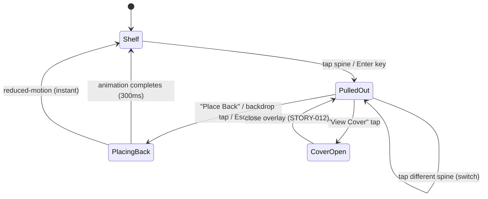
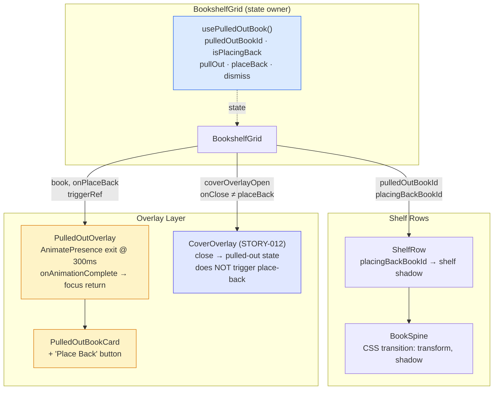
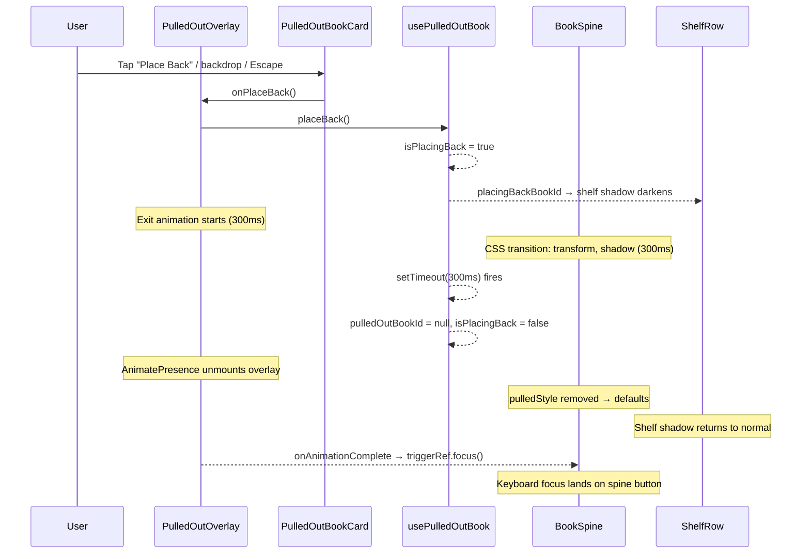
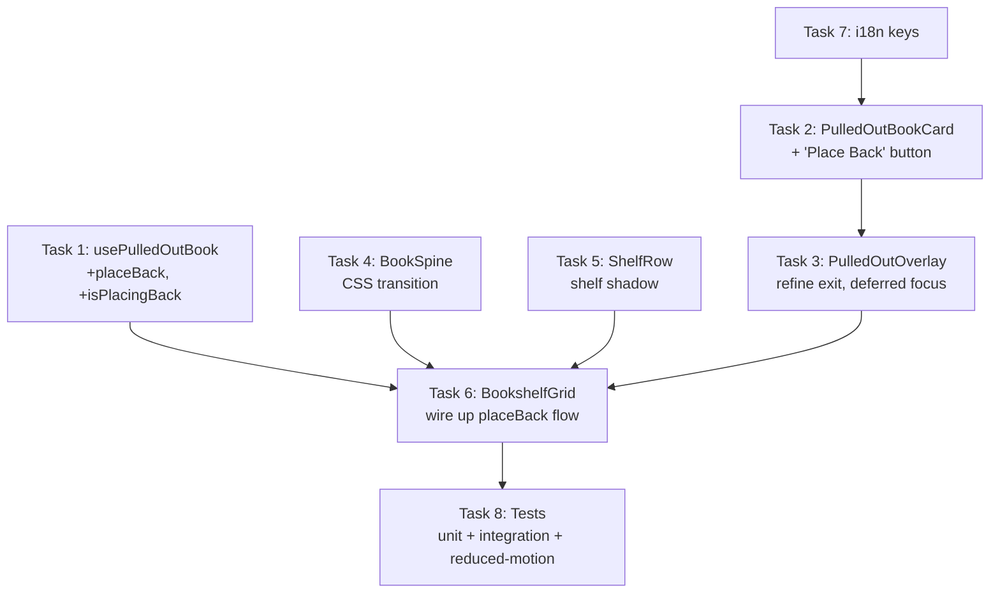

# STORY-013 — Technical Analysis: Place-Back Animation

**Epic**: EPIC-001 · **Persona**: Julia (Young Author) · **Priority**: Must Have · **SP**: 3
**Dependencies**: STORY-011 ✅ merged, STORY-012 ✅ merged
**Stack**: React 18 + Vite 5 + Tailwind 3 + Framer Motion 11 + Zustand 5 + TanStack Query 5
**Stack Source**: `docs/architecture/TECH-STACK.md`

---

## 1. Technical Summary

STORY-013 adds the reverse animation of STORY-011's tap-to-pull interaction. When Julia finishes examining a pulled-out book, the book slides back onto the shelf with a mirrored animation. This is **entirely frontend** — no API, schema, or backend changes.

Key requirements:
- Mirror pull-out animation in reverse: 300ms, same easing (`cubic-bezier(0.25, 0.1, 0.25, 1)`), opposite transforms
- 60fps on mid-range mobile via GPU-composited transforms
- `prefers-reduced-motion` → instant return (no animation)
- Focus returns to spine element after animation completes
- z-index resets **after** animation, not during
- Subtle shelf-shadow animation on the shelf row
- Closing cover overlay (STORY-012) does **NOT** auto-trigger place-back
- Triggered by: explicit "Place Back" button OR tap outside book area (backdrop)

---

## 2. Current State Analysis

### Existing Animation (STORY-011)

The pull-out is implemented via `PulledOutOverlay.jsx` using Framer Motion:

```
Enter: { opacity: 0 → 1, y: +16 → 0, scale: 0.95 → 1 }  @ 250ms, EASE_OUT
Exit:  { opacity: 1 → 0, y: 0 → +16, scale: 1 → 0.95 }   @ 250ms, EASE_OUT
```

`BookSpine.jsx` applies an inline `pulledStyle` when `isPulledOut=true`:
- `zIndex: 50, boxShadow: '0 20px 25px...', transform: 'translateY(-4px) scale(1.05)', willChange: 'transform'`

**Gaps STORY-013 must address:**
1. No explicit "Place Back" button — only backdrop click and Escape dismiss
2. Spine's `pulledStyle` drops **instantly** on dismiss (no reverse CSS transition)
3. z-index drops with state change, not after animation completes
4. No shelf-row shadow effect during place-back
5. `handleDismiss` in overlay calls `triggerRef.focus()` immediately — doesn't wait for animation

---

## 3. Impacted Components

| File | Change Type | Description |
|------|------------|-------------|
| `components/shelf/PulledOutBookCard.jsx` | **MODIFY** | Add "Place Back" button with i18n key and aria-label |
| `components/shelf/PulledOutOverlay.jsx` | **MODIFY** | Refine exit animation to mirror pull-out exactly; defer focus return to `onAnimationComplete`; accept `onPlaceBack` callback |
| `components/shelf/BookSpine.jsx` | **MODIFY** | Add CSS transition for `pulledStyle` changes so spine animates back (reverse of pull-out); conditionally reset z-index after transition ends |
| `components/shelf/ShelfRow.jsx` | **MODIFY** | Accept `placingBackBookId` prop; apply transient shadow class on shelf bar when a book in this row is being placed back |
| `components/shelf/BookshelfGrid.jsx` | **MODIFY** | Add `isPlacingBack` state to coordinate timing; pass `placingBackBookId` to rows; separate cover-close from place-back logic |
| `hooks/usePulledOutBook.js` | **MODIFY** | Add `placeBack()` method: sets `isPlacingBack=true`, then sets `pulledOutBookId=null` after animation duration; expose `isPlacingBack` |
| `i18n/locales/en/shelf.json` | **MODIFY** | Add key: `placeBack` |
| `i18n/locales/pt-BR/shelf.json` | **MODIFY** | Add key: `placeBack` ("Colocar de volta") |
| `__tests__/PulledOutOverlay.test.jsx` | **MODIFY** | Add tests: "Place Back" button renders, triggers callback; animation completion fires focus return |
| `__tests__/PulledOutBookCard.test.jsx` | **MODIFY** | Add tests: "Place Back" button renders with correct label; callback fires on click |
| `__tests__/BookSpine.test.jsx` | **MODIFY** | Add test: CSS transition applied; `transitionend` event resets z-index |
| `__tests__/ShelfRow.test.jsx` | **MODIFY** | Add test: shelf shadow class applied when `placingBackBookId` matches a book in the row |
| `__tests__/BookshelfGrid.test.jsx` | **MODIFY** | Add tests: place-back flow; cover overlay close does NOT trigger place-back; rapid pull/place cycles |
| `__tests__/PlaceBackAnimation.test.jsx` | **CREATE** | Integration test: full place-back flow with animation timing, focus return, z-index reset |
| `__tests__/PlaceBackReducedMotion.test.jsx` | **CREATE** | Reduced-motion path: instant return, no animation, focus still returns to spine |

---

## 4. State Machine



**State variables** (in `usePulledOutBook` hook):
- `pulledOutBookId: string | null` — which book is pulled out
- `isPlacingBack: boolean` — true during place-back animation, false otherwise

**Key constraint**: `CoverOpen → PulledOut` transition must **not** trigger place-back. The `handleCloseCover` callback only sets `coverOverlayOpen = false`; it does **not** call `dismiss()` or `placeBack()`.

---

## 5. Animation Strategy

### Hybrid: Framer Motion + CSS Transitions

The story prefers "CSS transitions over JS-driven animation for GPU compositing." However, the codebase uses Framer Motion throughout. The pragmatic hybrid:

| Animation | Technique | Rationale |
|-----------|-----------|-----------|
| Overlay exit (scale/fade/translate) | **Framer Motion** `exit` prop | Already implemented in `PulledOutOverlay`; `AnimatePresence` handles the lifecycle. Only needs duration tweak to 300ms. |
| Spine settling back | **CSS transition** on inline style | `BookSpine` uses inline `pulledStyle`. Add `transition: transform 300ms ease, box-shadow 300ms ease` when `isPulledOut` becomes false. Pure CSS, GPU-composited. |
| Shelf shadow | **CSS transition** on `ShelfRow` bar | Add/remove Tailwind class (`shadow-lg` → `shadow-md` or brightness filter) with `transition-shadow duration-300`. Pure CSS. |
| z-index reset | **JS** via `onTransitionEnd` | z-index cannot be CSS-transitioned meaningfully. Listen for `transitionend` on the spine, then reset `zIndex` via state. |

### Animation Parameters

```
Pull-OUT (STORY-011):
  Enter: { opacity: 0→1, y: +16→0, scale: 0.95→1 }  @ 250ms, EASE_OUT=[0.25,0.1,0.25,1]
  Spine: transform: translateY(-4px) scale(1.05), zIndex: 50

Place-BACK (STORY-013, mirror):
  Exit:  { opacity: 1→0, y: 0→+16, scale: 1→0.95 }  @ 300ms, EASE_OUT=[0.25,0.1,0.25,1]
  Spine: transform: translateY(0) scale(1),            @ 300ms, same ease
         zIndex: 50 → reset to auto after transitionend
```

**Duration note**: STORY-013 specifies 300ms; STORY-011 used 250ms. Since the place-back should mirror the pull-out, we use 300ms for both directions going forward. The hook's `duration` already returns `0.3` (300ms).

### Reduced Motion

```js
// usePulledOutBook.js (already has this)
const prefersReducedMotion = useReducedMotion();
const duration = prefersReducedMotion ? 0 : 0.3;
```

When `prefers-reduced-motion: reduce`:
- Framer Motion: `duration: 0` → instant state change, no animation frames
- CSS transitions: `transition-duration: 0ms` (set via `prefersReducedMotion` prop)
- Focus still returns to spine (a11y requirement independent of motion)

---

## 6. Component Changes — Detailed

### 6.1 `usePulledOutBook.js` — Add `placeBack()`

```js
// New state
const [isPlacingBack, setIsPlacingBack] = useState(false);

// New method
const placeBack = useCallback(() => {
  setIsPlacingBack(true);
  // After animation completes, clear state
  // Duration is 0 for reduced-motion, 300ms otherwise
  setTimeout(() => {
    setPulledOutBookId(null);
    setIsPlacingBack(false);
  }, duration * 1000);
}, [duration]);

// Return includes isPlacingBack
return { pulledOutBookId, pullOut, dismiss, toggle, isPulledOut, placeBack, isPlacingBack, duration };
```

**Why `setTimeout` over `onAnimationComplete`**: The overlay's `AnimatePresence` exit fires `onAnimationComplete`, but the spine's CSS transition runs independently. `setTimeout` aligned to `duration` ensures both animations finish before state resets. For reduced-motion, `duration=0` means instant.

**Alternative considered**: `onTransitionEnd` on the spine. Rejected because it doesn't fire if transition is interrupted (e.g., rapid tap), leaving stale state.

### 6.2 `PulledOutBookCard.jsx` — Add "Place Back" button

Add a new button after the existing action buttons:

```jsx
<button
  onClick={onPlaceBack}
  aria-label={t('placeBack')}
  className="w-full text-xs font-semibold py-1.5 px-2 rounded bg-amber-100 text-amber-800 hover:bg-amber-200 focus:ring-2 focus:ring-amber-300 focus:outline-none"
>
  {t('placeBack')}
</button>
```

New prop: `onPlaceBack`. The button is always visible (not just on hover/focus) since it's the primary dismissal action.

### 6.3 `PulledOutOverlay.jsx` — Refine exit animation

Changes:
1. Accept `onPlaceBack` prop and pass to `PulledOutBookCard`
2. Change exit transition duration from 250ms to 300ms to match spec
3. Defer `triggerRef.focus()` to `onAnimationComplete` callback instead of calling it in `handleDismiss`

```jsx
// Exit transition updated
exit={{ opacity: 0, y: 16, scale: 0.95 }}
transition={{ duration: prefersReducedMotion ? 0 : 0.3, ease: EASE_OUT }}
onAnimationComplete={() => {
  triggerRef?.current?.focus();
}}
```

**Key change**: `handleDismiss` no longer calls `triggerRef.focus()` directly. The focus return is deferred to Framer Motion's `onAnimationComplete` on the `motion.div`, which fires after the exit animation finishes. For reduced-motion (duration=0), this fires immediately.

### 6.4 `BookSpine.jsx` — CSS transition for reverse

Add CSS transition on the spine when going from pulled-out to shelf:

```jsx
const transitionStyle = isPulledOut
  ? { transition: 'none' } // Instant when pulling OUT (Framer Motion handles enter)
  : { transition: 'transform 300ms cubic-bezier(0.25,0.1,0.25,1), box-shadow 300ms cubic-bezier(0.25,0.1,0.25,1)' };

// For reduced motion, transition duration becomes 0ms
const animDuration = prefersReducedMotion ? 0 : 300;

const transitionStyle = isPulledOut
  ? {}
  : { transition: `transform ${animDuration}ms cubic-bezier(0.25,0.1,0.25,1), box-shadow ${animDuration}ms cubic-bezier(0.25,0.1,0.25,1)` };
```

The `pulledStyle` object already includes `transform`, `boxShadow`, and `zIndex`. When `isPulledOut` flips from `true` to `false`, the inline style changes, and the CSS transition animates it back.

**z-index handling**: `zIndex` stays at `50` during the transition (so the book renders above siblings while sliding back), then resets after `transitionend`:

```jsx
const [zIndexReset, setZIndexReset] = useState(false);

function handleTransitionEnd(e) {
  if (e.propertyName === 'transform' && !isPulledOut) {
    setZIndexReset(true);
  }
}

// In pulledStyle:
const pulledStyle = isPulledOut
  ? { zIndex: 50, ... }
  : zIndexReset
    ? {} // fully reset
    : { zIndex: 50, transform: 'none', boxShadow: 'none' }; // keep z-index during animation
```

Wait, this is getting complex. Let me simplify:

The `isPlacingBack` state from the hook tells us when we're animating back. During `isPlacingBack`, the spine keeps its z-index and animates its transform/shadow via CSS transition. After `isPlacingBack` completes (the `setTimeout` in the hook clears state), `isPulledOut` becomes `false`, and the spine fully resets.

Actually, looking at the flow more carefully:

1. User taps "Place Back" → `placeBack()` called
2. `isPlacingBack = true`, `pulledOutBookId` still set → overlay starts exit animation
3. After 300ms (or 0ms for reduced-motion): `pulledOutBookId = null`, `isPlacingBack = false`
4. `isPulledOut` becomes `false` → spine style drops `pulledStyle`

The spine style change happens at step 3, but the user sees the exit animation from the overlay (step 2). The spine's visual "settling" happens at the same moment since both fire at 300ms.

For the spine to animate smoothly, we need the CSS transition to be present when `pulledStyle` is removed. Since `pulledStyle` includes `transform` and `boxShadow`, adding a CSS transition means when those inline styles are removed, the browser animates back to the default.

Simplified approach:
- Always add `transition: transform 300ms ease, box-shadow 300ms ease` to the spine's style (except when `isPulledOut` is being SET — pull-out animation is handled by Framer Motion on the overlay, not the spine)
- Actually, the spine's `pulledStyle` is decorative (slight lift + shadow) while the overlay is the main visual. When the overlay exits, the spine should smoothly lose its elevated state.

Final approach:
```jsx
// BookSpine style
const baseStyle = {
  backgroundColor: spineColor,
  color: textColor,
  width: `${...}px`,
  height: '140px',
};

// Add transition when NOT currently pulling out (to animate the settle-back)
const transitionProp = !isPulledOut
  ? 'transform 300ms cubic-bezier(0.25,0.1,0.25,1), box-shadow 300ms cubic-bezier(0.25,0.1,0.25,1)'
  : undefined;

const style = {
  ...baseStyle,
  ...(isPulledOut ? pulledStyle : {}),
  transition: prefersReducedMotion ? 'none' : transitionProp,
};
```

When `isPulledOut` goes from `true` → `false`, the inline `transform`/`boxShadow` are removed, and the CSS transition animates them back to defaults. z-index drops with the style change but that's invisible since the overlay is already animating away.

### 6.5 `ShelfRow.jsx` — Shelf shadow effect

```jsx
export default function ShelfRow({ books, onBookClick, pulledOutBookId, placingBackBookId }) {
  const hasPlacingBack = placingBackBookId && books.some(b => b._id === placingBackBookId);

  return (
    <div className="flex flex-col">
      <div className="flex items-end gap-1 px-2">
        {books.map((book) => (
          <BookSpine ... />
        ))}
      </div>
      <div
        className={`h-3 rounded-b-sm transition-shadow duration-300 ${
          hasPlacingBack
            ? 'bg-gradient-to-r from-amber-900 via-amber-800 to-amber-900 shadow-lg'
            : 'bg-gradient-to-r from-amber-800 via-amber-700 to-amber-800 shadow-md'
        }`}
      />
    </div>
  );
}
```

The shelf bar darkens slightly (amber-800 → amber-900) and shadow deepens when a book in this row is being placed back. `transition-shadow duration-300` provides the smooth effect.

### 6.6 `BookshelfGrid.jsx` — Orchestration

```jsx
const { pulledOutBookId, dismiss, toggle, isPulledOut, placeBack, isPlacingBack } = usePulledOutBook();

const handlePlaceBack = useCallback(() => {
  placeBack();
}, [placeBack]);

const handleCloseCover = useCallback(() => {
  setCoverOverlayOpen(false);
  // Intentionally does NOT call dismiss() or placeBack()
  // AC4: closing cover overlay does not auto-trigger place-back
}, []);

// Pass to ShelfRow
<ShelfRow
  books={row}
  onBookClick={handleBookClick}
  pulledOutBookId={pulledOutBookId}
  placingBackBookId={isPlacingBack ? pulledOutBookId : null}
/>

// Pass to PulledOutOverlay
<PulledOutOverlay
  book={pulledBook}
  onDismiss={handlePlaceBack}
  onPlaceBack={handlePlaceBack}
  ...
/>
```

---

## 7. Accessibility & Focus Management

| Scenario | Focus Behavior |
|----------|---------------|
| User clicks "Place Back" | Overlay exit animation → on `onAnimationComplete` → focus moves to spine `ref` |
| User taps backdrop | Same as above — backdrop click calls `handlePlaceBack` |
| User presses Escape | Same flow — Escape triggers `handlePlaceBack` |
| User presses Enter on "Place Back" button | Button's `onClick` fires → same as click |
| Reduced-motion enabled | `duration: 0` → `onAnimationComplete` fires immediately → focus moves to spine |

**Focus target**: `triggerRef` which is `spineRefs.current[pulledOutBookId]` — the `BookSpine` button element for the book being placed back. This is already passed to `PulledOutOverlay` as `triggerRef`.

**Keyboard operability (NFR-ACC-02)**:
- Tab to "Place Back" button → Enter → animation plays → focus returns to spine
- Escape from anywhere in overlay → same flow
- Tab continues cycling through overlay buttons (existing focus trap still works)

---

## 8. Performance Considerations

| Property | Strategy | GPU Composited |
|----------|----------|---------------|
| `transform` (translateY, scale) | CSS transition on `BookSpine` | ✅ Yes — compositor layer |
| `opacity` | Framer Motion on overlay | ✅ Yes — compositor layer |
| `box-shadow` | CSS transition on `BookSpine` | ⚠️ Partial — paint-only, not composited. But only one element, acceptable. |
| Shelf bar shadow | CSS `transition-shadow` | ⚠️ Paint-only. Tiny element, negligible cost. |
| `will-change` | Set on spine during animation only | ✅ Promotes to compositor layer |

**Budget**: All animated properties are either compositor-friendly (transform, opacity) or cheap paint-only on small elements (shadow on single bar). No layout properties animated. Target: <16.67ms per frame.

**`will-change` management**: `will-change: 'transform'` is already set in `pulledStyle` on the spine. It's removed when `isPulledOut` becomes false, which is correct — `will-change` should not persist indefinitely.

---

## 9. NFR Compliance Matrix

| NFR ID | Requirement | Implementation | Verification |
|--------|-------------|---------------|--------------|
| **NFR-PERF-04** | ≥60fps on target devices | GPU-composited transforms only; `will-change: transform`; no layout animation; shadows on small elements | Chrome DevTools Performance panel on mid-range Android emulation |
| **NFR-ACC-05** | Respects `prefers-reduced-motion` | `useReducedMotion()` → `duration: 0`; CSS `transition: none`; `onAnimationComplete` fires immediately | `PlaceBackReducedMotion.test.jsx` with mocked `matchMedia` |
| **NFR-ACC-01** | Focus returns to triggering element | `onAnimationComplete` on overlay → `triggerRef.current.focus()` | Keyboard test: Tab → Enter → verify focus on spine |
| **NFR-ACC-02** | Keyboard operability (Escape / Enter) | "Place Back" button is native `<button>`; Escape handler calls `placeBack()` | Keyboard-only test |

---

## 10. Risks & Mitigations

| Risk | Severity | Mitigation |
|------|----------|------------|
| **setTimeout drift**: 300ms timeout may not align with actual animation end if browser throttles | Medium | Use Framer Motion's `onAnimationComplete` as the primary signal for focus return. `setTimeout` is only used in the hook to clear `pulledOutBookId` — a 50ms tolerance is acceptable for state cleanup. |
| **Rapid pull/place cycles**: user taps spines faster than 300ms animation | High | `usePulledOutBook.placeBack()` checks if already placing back; `toggle()` immediately sets new state, canceling any in-flight place-back timeout. Clear timeout ref on new pull-out. |
| **z-index stacking after interrupted animation**: spine keeps `z-index: 50` if transition is interrupted | Medium | Use `isPlacingBack` flag from hook — when `false`, always remove elevated z-index regardless of transition state. State is the source of truth, not transition completion. |
| **Cover overlay close triggering place-back**: `CoverOverlay.onClose` accidentally calling `dismiss()` | Low | Explicit code review: `handleCloseCover` only sets `coverOverlayOpen = false`. Separate from `handlePlaceBack`. Existing test asserts cover close does not change `pulledOutBookId`. |
| **Framer Motion exit not firing**: `AnimatePresence` requires `key` stability | Low | Overlay already has `key="overlay"` and is conditionally rendered. Verified working in STORY-011 tests. |

---

## 11. Architecture Diagram



---

## 12. Data Flow — Place-Back Sequence



---

## 13. File Changes Summary

### Modified Files (7)

| # | File | Lines Changed (est.) |
|---|------|---------------------|
| 1 | `frontend/src/hooks/usePulledOutBook.js` | +15 (add `placeBack`, `isPlacingBack`, timeout ref) |
| 2 | `frontend/src/components/shelf/PulledOutBookCard.jsx` | +8 (add "Place Back" button + `onPlaceBack` prop) |
| 3 | `frontend/src/components/shelf/PulledOutOverlay.jsx` | +10 (accept `onPlaceBack`, defer focus to `onAnimationComplete`, duration 300ms) |
| 4 | `frontend/src/components/shelf/BookSpine.jsx` | +10 (CSS transition for settle-back, prefersReducedMotion) |
| 5 | `frontend/src/components/shelf/ShelfRow.jsx` | +5 (placingBackBookId prop, shelf shadow class) |
| 6 | `frontend/src/components/shelf/BookshelfGrid.jsx` | +8 (pass placeBack/placingBackBookId, separate cover close) |
| 7 | `frontend/src/i18n/locales/en/shelf.json` + `pt-BR/shelf.json` | +2 (placeBack key) |

### New Test Files (2)

| # | File | Tests |
|---|------|-------|
| 8 | `__tests__/PlaceBackAnimation.test.jsx` | Integration: full place-back flow, focus return, z-index reset, rapid cycles |
| 9 | `__tests__/PlaceBackReducedMotion.test.jsx` | Reduced-motion: instant return, no animation, focus returns |

### Modified Test Files (5)

| # | File | Added Tests |
|---|------|------------|
| 10 | `__tests__/PulledOutOverlay.test.jsx` | "Place Back" button renders; focus deferred to animation complete |
| 11 | `__tests__/PulledOutBookCard.test.jsx` | "Place Back" button renders with label; callback fires |
| 12 | `__tests__/BookSpine.test.jsx` | CSS transition present; transform animates on pull-out removal |
| 13 | `__tests__/ShelfRow.test.jsx` | Shelf shadow class toggles with placingBackBookId |
| 14 | `__tests__/BookshelfGrid.test.jsx` | Place-back flow; cover close ≠ place-back; rapid cycles |

---

## 14. Implementation Checklist

| # | Task | File(s) | Agent | Dependencies |
|---|------|---------|-------|-------------|
| 1 | Extend `usePulledOutBook` hook | `hooks/usePulledOutBook.js` | FrontendDeveloperReact | None |
| 2 | Add "Place Back" button to card | `components/shelf/PulledOutBookCard.jsx` | FrontendDeveloperReact | None |
| 3 | Refine overlay exit + deferred focus | `components/shelf/PulledOutOverlay.jsx` | FrontendDeveloperReact | Task 2 |
| 4 | Add CSS transition to BookSpine | `components/shelf/BookSpine.jsx` | FrontendDeveloperReact | None |
| 5 | Add shelf shadow to ShelfRow | `components/shelf/ShelfRow.jsx` | FrontendDeveloperReact | None |
| 6 | Wire up BookshelfGrid | `components/shelf/BookshelfGrid.jsx` | FrontendDeveloperReact | Tasks 1–5 |
| 7 | Add i18n keys | `i18n/locales/{en,pt-BR}/shelf.json` | FrontendDeveloperReact | None |
| 8 | Write tests | `__tests__/` (7 files) | TestEngineer | Tasks 1–7 |

---

## 15. Execution Order



**Parallelization**:
- **Phase 1 (parallel)**: Tasks 1 (hook) + 7 (i18n) — no dependencies
- **Phase 2 (parallel)**: Tasks 4 (BookSpine CSS) + 5 (ShelfRow shadow) — independent
- **Phase 3 (parallel)**: Tasks 2 (card button) + 4/5 (if not done) — card needs i18n keys from Phase 1
- **Phase 4 (sequential)**: Task 3 (overlay) depends on Task 2
- **Phase 5 (sequential)**: Task 6 (grid) depends on Tasks 1, 3, 4, 5
- **Phase 6 (sequential)**: Task 8 (tests) depends on all prior

**Parallel cap**: Max 2 agents at a time.

---

## 16. Complexity Estimate

| Factor | Assessment |
|--------|------------|
| **Story Points** | 3 (as given by PM) — appropriate for animation refinement + a11y |
| **Time Estimate** | 3–4 hours implementation + 2 hours tests |
| **Technical Risk** | Low — extending existing animation patterns, no new concepts |
| **Parallelization** | High — most component changes are independent |
| **Test Effort** | Medium — 7 test files, but most are small additions |

---

## Appendix: Existing Patterns to Follow

### Framer Motion AnimatePresence exit (from `PulledOutOverlay.jsx`)
```jsx
<AnimatePresence>
  {book && (
    <motion.div
      exit={{ opacity: 0, y: 16, scale: 0.95 }}
      transition={{ duration, ease: EASE_OUT }}
    />
  )}
</AnimatePresence>
```

### Reduced Motion Test Pattern (from `BookSpineReducedMotion.test.jsx`)
```jsx
beforeAll(() => {
  window.matchMedia = vi.fn().mockImplementation((query) => ({
    matches: query === '(prefers-reduced-motion: reduce)',
    // ...
  }));
});
const { default: Component } = await import('../components/...');
```

### i18n Key Convention
- Scoped under `shelf.json` namespace
- Pattern: `placeBack` for single key
- Both `en/` and `pt-BR/` must stay in sync

### Test Framework
- Vitest + `@testing-library/react` + `userEvent`
- `vi.fn()` for callbacks
- `screen.getByRole('button')` for a11y queries
- `setup.js` mocks `react-i18next` to pass through keys
