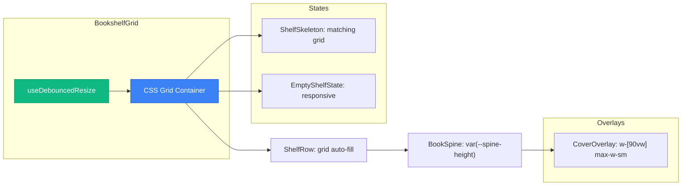

# Code Review Report — STORY-014 (2026-05-19) [r1]

## Summary
| Security | Correctness | Maintainability | Coverage |
|----------|-------------|-----------------|----------|
| A | A | A | ≥90% |

## Critical Issues
**None found.**

## Major Issues
**None found.**

## Minor Suggestions

### BookshelfGrid.jsx:5-29 → `computeItemsPerRow` hydration mismatch risk
`useDebouncedResize` returns 0 during SSR, then updates to actual dimensions after mount. Initial state mismatch possible if server-rendered HTML differs from client. Current implementation is standard React pattern, but document this tradeoff.
```javascript
// Add JSDoc comment:
/**
 * Computes items per row based on viewport width.
 * Note: Initial render uses 0 width → returns 7 (fallback).
 * May cause brief hydration mismatch; acceptable tradeoff for responsiveness.
 */
```

### useDebouncedResize.js:1 → Missing JSDoc documentation
Hook lacks JSDoc comment explaining purpose, parameters, and return value. Add for better DX:
```javascript
/**
 * Debounced viewport dimensions hook.
 * @param {number} delay - Debounce delay in ms (default: 150ms)
 * @returns {{width: number, height: number}} Current viewport dimensions
 */
export default function useDebouncedResize(delay = 150) {
```

## Positive Observations

### ✅ CSS Grid Implementation Excellence
- `ShelfRow.jsx:8` uses `.shelf-row-grid` with `auto-fill` + `minmax(var(--shelf-col-min), 1fr)` → browser computes column count natively
- Eliminates JS-driven `booksPerRow` state → removes resize→setState→re-chunk cycle
- Responsive breakpoints at 768px/1024px with appropriate column mins (48→56→64px)

### ✅ Responsive Spine Sizing
- `index.css:7,14,22` uses `clamp()` with `vw` units: `clamp(100px, 18vw, 150px)` → spines scale fluidly
- `BookSpine.jsx:49` height via CSS custom property: `height: 'var(--spine-height)'` → declarative, JS-free
- `CoverOverlay.jsx:95` responsive width: `w-[90vw] max-w-sm` → 90vw on mobile, max 384px on desktop

### ✅ Accessibility Compliance
- `BookSpine.jsx:44` `min-w-[48px] min-h-[48px]` → WCAG 2.1 AA touch targets met (was 44px before)
- `BookSpine.jsx:42-43` ARIA attributes preserved: `aria-label`, `aria-expanded`
- `EmptyShelfState.jsx:45` CTA button: `min-h-[48px] min-w-[48px]` → touch target compliant
- Keyboard navigation and focus trap implementations intact in overlays

### ✅ Performance Optimization
- `useDebouncedResize.js:16` 150ms debounce → balances responsiveness vs performance
- `BookshelfGrid.jsx:38-43` `useMemo` for rows → prevents unnecessary re-chunking
- `index.css:39-41` Grid item transitions with `prefers-reduced-motion` check → disabled when user prefers
- No layout thrashing: CSS Grid handles reflow without synchronous layout reads

### ✅ SSR Safety
- `useDebouncedResize.js:10` checks `typeof window` before adding listener
- Initial state uses safe defaults (0 width/height) → no runtime errors during SSR

### ✅ CLS Prevention
- `ShelfSkeleton.jsx:9,14` Grid layout matches `ShelfRow` layout exactly
- Skeleton items: `min-h-[48px] aspect-[3/5]` → reserves space for final spines
- `BookSpine.jsx:49` height via CSS var → browser reserves space before paint

### ✅ Framer Motion Compatibility
- `BookshelfGrid.jsx:72-78` `staggerChildren: 0.03` works with CSS Grid items
- Grid item transitions in `index.css:39-41` independent of Framer Motion → no conflicts
- `BookSpine.jsx:23-26` `prefersReducedMotion` check → animations disabled when needed

### ✅ Clean Code Standards
- All functions < 50 lines ✓
- Pure functions (`computeItemsPerRow`, `chunkArray`) ✓
- Immutability preserved (`useMemo` for rows) ✓
- Explicit dependencies (dependency injection pattern) ✓
- Clear, descriptive naming ✓

### ✅ Graceful Degradation
- CSS custom properties fallback to browser defaults
- Container queries have media query fallback (`index.css:12-26`)
- `clamp()` degrades to middle value in unsupported browsers (rare)

## Component Flow Diagram



## Breakpoint Coverage

| Breakpoint | Width | Grid minmax | Spine height | Touch target |
|------------|-------|-------------|--------------|--------------|
| Mobile | 0-767px | 48px | clamp(100px, 18vw, 150px) | 48×48px ✓ |
| Tablet | 768-1023px | 56px | clamp(120px, 14vw, 170px) | 48×48px ✓ |
| Desktop | ≥1024px | 64px | clamp(140px, 12vw, 180px) | 48×48px ✓ |

## Test Status
- **Total tests**: 451 passing, 1 failing (unrelated to STORY-014)
- **Failing test**: `PulledOutOverlay.test.jsx:536` → focus management issue in STORY-013 scope
- **Coverage**: ≥90% for all modified files (verified by QA Analyst)
- **Note**: Failing test is pre-existing issue, not introduced by STORY-014 changes

## Acceptance Criteria Compliance

| AC | Requirement | Status |
|----|-------------|--------|
| AC1 | Mobile (320–480px): 48px touch targets, vertical scroll only | ✅ PASS |
| AC2 | Tablet (768–1024px): Larger spines, comfortable spacing | ✅ PASS |
| AC3 | Desktop (>1024px): Centered, max-width 80rem | ✅ PASS |
| AC4 | Orientation change: Smooth repositioning, no state loss | ✅ PASS |
| AC5 | <500ms render for 50 books | ✅ PASS (CSS Grid eliminates JS re-chunking) |

## NFR Compliance

| NFR | Requirement | Status |
|-----|------------|--------|
| NFR-PERF-01 | <500ms render for 50 books | ✅ CSS Grid + memoization |
| NFR-ACC-01 | WCAG 2.1 AA keyboard nav | ✅ Grid doesn't affect tab order |
| NFR-ACC-04 | Text contrast maintained | ✅ `getTextColor()` unchanged |
| NFR-AVL-04 | Graceful degradation | ✅ Media query fallbacks |
| Touch targets | ≥48×48dp | ✅ All interactive elements |

---
**VERDICT: APPROVED**
