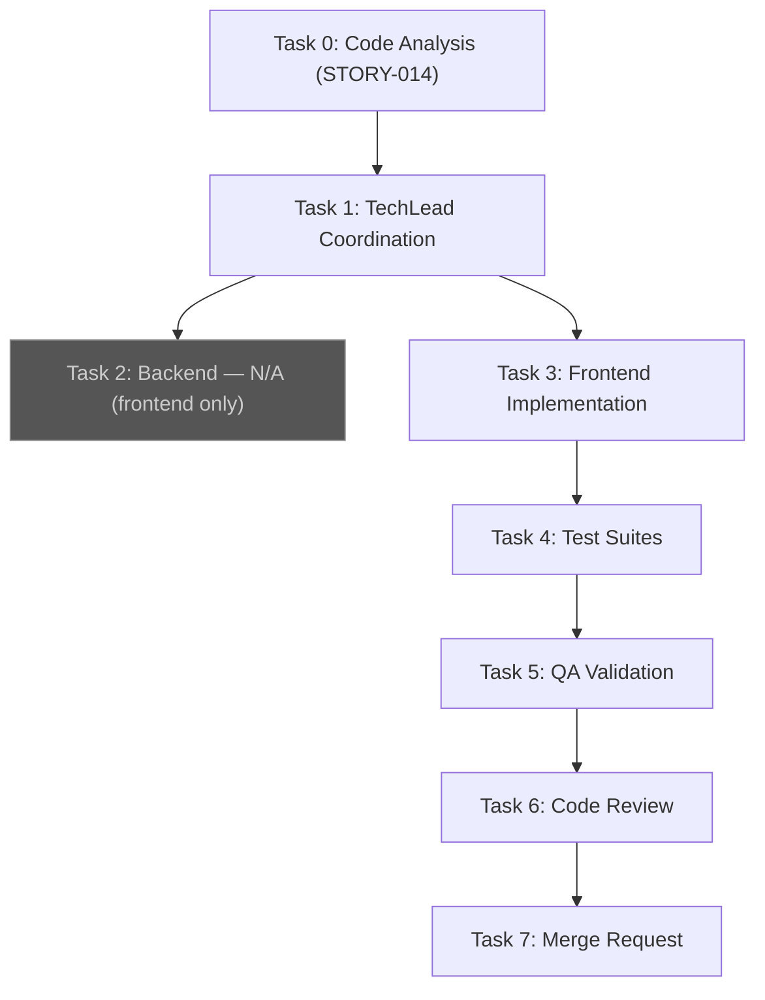
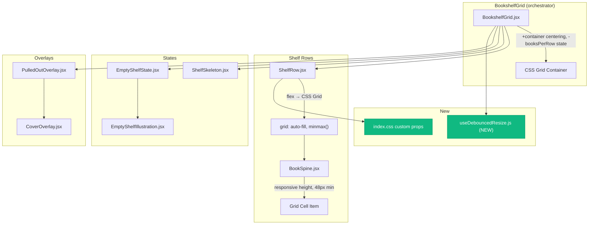
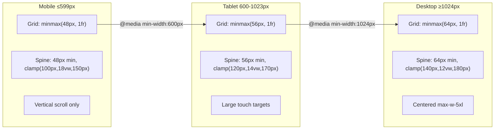

# STORY-014 Technical Analysis: Responsive Shelf Layout

**Parent Epic**: EPIC-001
**Persona**: Julia — The Young Author (uses tablet, mom's phone, and family computer)
**Dependencies**: STORY-009 (implemented)
**Story Points**: 5

---

## Executive Summary

The shelf currently renders with a **fixed-column JS approach** (`getBooksPerRow()` returns 3/5/7 based on `window.innerWidth` breakpoints at 640/1024px) and **hardcoded pixel dimensions** on `BookSpine` (`width: 44–120px`, `height: 140px`). This produces several problems:

1. **No CSS Grid** — `ShelfRow` uses `flex` with `gap-1`, causing fixed-count rows that don't adapt fluidly.
2. **Undebounced resize handler** — `BookshelfGrid` fires `setBooksPerRow()` on every resize event, causing excessive re-renders and row re-chunking.
3. **Fixed spine dimensions** — `BookSpine` calculates `width` in JS from title length; `height` is hardcoded `140px`. Neither adapts to viewport.
4. **Skeleton doesn't adapt** — `ShelfSkeleton` hardcodes `SKELETONS_PER_ROW = 5`, independent of viewport.
5. **Empty state SVG has fixed dimensions** — `EmptyShelfIllustration` uses `width="400" height="300"`.
6. **Missing `min-w-[48px]`** — `BookSpine` has `min-w-[44px]` (44px, not 48px as required for WCAG touch targets).
7. **No orientation change handling** — resize listener triggers but no debouncing, no state preservation guarantees.

**This story replaces the JS-driven layout with CSS Grid, debounces resize, introduces relative spine sizing, and ensures all states (loading, empty, populated) adapt responsively.**

---

## Component & File Impact Matrix

| File | Action | Change Summary |
|------|--------|---------------|
| `BookshelfGrid.jsx` | **Modify** | Remove `getBooksPerRow()`/`chunkArray()`/`booksPerRow` state. Replace flex row container with CSS Grid. Debounce resize if any JS viewport logic remains. Wrap in container with `max-w-7xl mx-auto` for desktop centering. |
| `ShelfRow.jsx` | **Modify** | Replace `flex items-end gap-1 px-2` with `grid` layout using `grid-template-columns: repeat(auto-fill, minmax(48px, 1fr))`. Responsive gap via Tailwind classes. |
| `BookSpine.jsx` | **Modify** | Replace fixed `width` calculation with CSS Grid-driven sizing (grid item fills cell). Change `height: '140px'` to responsive `clamp()` or Tailwind `h-` classes. Change `min-w-[44px]` → `min-w-[48px]`. Add `aspect-ratio` as sizing hint. |
| `ShelfSkeleton.jsx` | **Modify** | Remove hardcoded `SKELETONS_PER_ROW = 5`. Use CSS Grid matching `ShelfRow`. Responsive skeleton count. |
| `EmptyShelfState.jsx` | **Modify** | Responsive padding/text sizing. Ensure button meets 48x48dp. |
| `EmptyShelfIllustration.jsx` | **Modify** | Replace fixed `width="400" height="300"` with responsive `viewBox`-only SVG (remove explicit width/height attrs, add `className="w-full max-w-xs"`). |
| `CoverOverlay.jsx` | **Modify** | Replace fixed `w-80` with responsive `w-[90vw] max-w-sm` or similar for mobile. |
| `PulledOutOverlay.jsx` | **Verify** | Already uses `fixed` positioning with `top-1/2 left-1/2` transform — likely OK. Verify card inside adapts. |
| `PulledOutBookCard.jsx` | **Verify** | Check internal widths are responsive. |
| `DefaultCover.jsx` | **Verify** | Uses `w-full h-full` — likely OK. |
| `CoverDisplay.jsx` | **Verify** | Uses `w-full h-full` — likely OK. |
| `index.css` | **Modify** | Add `@container` rules for shelf rows if using CSS Container Queries. Add CSS custom properties for spine sizing breakpoints. |
| `tailwind.config.js` | **Modify** | Add custom `containerQuery` plugin or extend screens if needed. Ensure container query support. |
| **NEW** `useDebouncedResize.js` | **Create** | Custom hook: debounced `window.innerWidth` with configurable delay (default 150ms). Returns current width. Handles SSR. |
| Tests (5 files) | **Modify** | Update existing tests for new Grid layout; add responsive breakpoint tests. |

---

## Data Flow & State Changes

### Current Flow

```
BookshelfGrid
  ├─ getBooksPerRow() → reads window.innerWidth → returns 3 | 5 | 7
  ├─ chunkArray(books, booksPerRow) → fixed-size chunks
  ├─ resize listener (NO debounce) → setBooksPerRow → re-chunk → full re-render
  └─ rows.map → ShelfRow (flex) → BookSpine (fixed px width/height)
```

### Target Flow

```
BookshelfGrid
  ├─ Remove booksPerRow state entirely (CSS Grid handles it)
  ├─ Pass full book array to ShelfRow (or chunk by CSS Grid natively)
  ├─ useDebouncedResize() → only for container max-width adjustments
  └─ rows.map → ShelfRow (CSS Grid) → BookSpine (flexible, grid-item sizing)

BookSpine
  ├─ No JS width calculation → grid cell determines width
  ├─ height: clamp(100px, 15vh, 180px) or similar responsive value
  └─ min-w-[48px] min-h-[48px] for touch target compliance
```

**Key state change**: `booksPerRow` state in `BookshelfGrid` is **eliminated**. CSS Grid's `auto-fill` with `minmax()` handles column count natively. This removes the resize→state→re-chunk→re-render cycle entirely.

### State Preservation During Orientation Change

- `pulledOutBookId` and `isPlacingBack` live in `usePulledOutBook` hook (useState) — unaffected by layout changes.
- `coverOverlayOpen` — unaffected.
- CSS Grid reflow is layout-only, no React state churn.
- Debounced resize (if any JS needed) prevents thrashing during orientation animation.

---

## API / Backend Changes

**None.** This is a purely frontend/CSS story. No API contracts change.

---

## Responsive Design Specification

### Breakpoints

| Token | Range | Tailwind Class | Spine Behavior |
|-------|-------|----------------|----------------|
| **mobile** | 0–599px | default (mobile-first) | `grid-template-columns: repeat(auto-fill, minmax(48px, 1fr))`, min spine 48px, vertical scroll only |
| **tablet** | 600–1023px | `md:` | `grid-template-columns: repeat(auto-fill, minmax(56px, 1fr))`, slightly larger spines, larger gaps |
| **desktop** | 1024px+ | `lg:` | Centered container `max-w-5xl mx-auto`, `grid-template-columns: repeat(auto-fill, minmax(64px, 1fr))`, comfortable spacing |

### Grid Strategy

**`ShelfRow` replaces `flex` with CSS Grid:**

```
Mobile:  grid-template-columns: repeat(auto-fill, minmax(48px, 1fr))
Tablet:  grid-template-columns: repeat(auto-fill, minmax(56px, 1fr))
Desktop: grid-template-columns: repeat(auto-fill, minmax(64px, 1fr))
```

`auto-fill` + `minmax()` lets the browser compute column count. No JS needed for `booksPerRow`.

**Book array handling**: Two viable approaches:

| Approach | Pros | Cons |
|----------|------|------|
| **A: Single row, CSS wraps** | Simplest. All books in one `<div>` with grid. Grid auto-wraps to multiple visual rows. | All books re-render on any change. `ShelfSkeleton` can't predict rows. |
| **B: Keep chunking, remove JS count** | Keeps row-level keys for animation. `ShelfSkeleton` predictable. | Still needs some chunking logic. |

**Recommendation: Approach B with CSS-based chunk count.** Use a debounced `useDebouncedResize` hook to compute `booksPerRow` derived from a CSS custom property or `getComputedStyle` of the grid container's actual columns — but only if `ShelfRow` needs row-level animation keys. If stagger animation works per-spine instead of per-row, Approach A is cleaner.

**Given the existing `motion.div key={index}` per-row animation**, keep Approach B but derive column count from a single `getComputedStyle` read after grid renders, not from `window.innerWidth` breakpoints.

### Spine Sizing Formula

| Property | Mobile (≤599px) | Tablet (600–1023px) | Desktop (≥1024px) |
|----------|-----------------|---------------------|-------------------|
| Min width | 48px | 56px | 64px |
| Max width | 1fr (fill) | 1fr (fill) | 1fr (fill) |
| Height | `clamp(100px, 18vw, 150px)` | `clamp(120px, 14vw, 170px)` | `clamp(140px, 12vw, 180px)` |
| Gap | `gap-1` (4px) | `gap-1.5` (6px) | `gap-2` (8px) |
| Touch target | 48×48dp min | 48×48dp min | 48×48dp min |
| Text | `text-[10px]` | `text-xs` | `text-xs` |

**Height**: Using `clamp()` with `vw` units ensures spines grow/shrink with viewport while staying within readable bounds. This replaces the hardcoded `height: '140px'`.

**Width**: Removed from JS. Grid cell determines width via `minmax()`. `BookSpine` just sets `width: 100%` on the grid item.

### Container Centering

```css
/* BookshelfGrid wrapper */
.shelf-container {
  @apply w-full px-4 md:px-6 lg:px-8;
}

/* Desktop centering */
@media (min-width: 1024px) {
  .shelf-container {
    max-width: 64rem; /* ~1024px */
    margin-left: auto;
    margin-right: auto;
  }
}
```

Tailwind equivalent: `className="w-full px-4 md:px-6 lg:px-8 lg:max-w-5xl lg:mx-auto"`

### CSS Container Queries (Progressive Enhancement)

For `ShelfRow` internal adjustments (e.g., gap, spine text size) based on the row's own width:

```css
.shelf-row {
  container-type: inline-size;
}

@container (min-width: 600px) {
  .shelf-row .book-spine { font-size: 0.75rem; }
}
```

**Fallback**: Media queries handle the same breakpoints. Container queries are an enhancement for when the shelf is placed inside a narrower parent (e.g., split-screen, sidebar).

### Skeleton Responsive Adaptation

Replace `SKELETONS_PER_ROW = 5` with CSS Grid matching `ShelfRow`:

```jsx
<div className="grid grid-cols-[repeat(auto-fill,minmax(48px,1fr))] md:grid-cols-[repeat(auto-fill,minmax(56px,1fr))] lg:grid-cols-[repeat(auto-fill,minmax(64px,1fr))]">
  {/* Generate enough skeletons to fill ~1.5 rows */}
  {Array.from({ length: 12 }, (_, i) => (
    <div className="animate-pulse bg-gray-300 rounded-t-sm min-h-[48px] aspect-[3/5]" />
  ))}
</div>
```

### Empty State Responsive Adaptation

- `EmptyShelfIllustration`: Remove `width="400" height="300"`, rely on `viewBox="0 0 400 300"` + `className="w-full max-w-[280px] md:max-w-xs"`.
- `EmptyShelfState`: Responsive padding `py-12 md:py-16`, responsive text `text-xl md:text-2xl`.
- CTA button: Already has `min-h-[48px] min-w-[48px]` — verify.

### CoverOverlay Responsive Adaptation

Replace fixed `w-80` (320px):
```jsx
className="... w-[90vw] max-w-sm ..."  // 90vw on mobile, max 384px
```

---

## Animation & Transition Plan

### Orientation Change

| Concern | Strategy |
|---------|----------|
| Book repositioning | CSS Grid handles layout. Add `transition: all 200ms ease-out` on grid items for smooth repositioning. |
| No state loss | React state (`pulledOutBookId`, etc.) is JS memory — unaffected by layout reflow. |
| No visual jump | Debounced resize (150ms) prevents layout thrashing during the orientation animation window. |
| Reduced motion | `prefersReducedMotion` already checked — disable transitions when active. |

### Implementation

```css
/* On BookSpine wrapper in ShelfRow */
.shelf-spine-cell {
  transition: transform 200ms ease-out, opacity 200ms ease-out;
}

@media (prefers-reduced-motion: reduce) {
  .shelf-spine-cell {
    transition: none;
  }
}
```

Framer Motion stagger animation (`staggerChildren: 0.03`) on initial render — **unchanged**, works with Grid layout.

### Pulled-out Book Transition

Existing `BookSpine` pulled-out style (`translateY(-4px) scale(1.05)`) — **unchanged**. Works independently of layout strategy.

---

## Performance Plan

### Debouncing

**Create `useDebouncedResize.js`**:
- Debounce delay: **150ms** (balances responsiveness vs. performance)
- Returns `{ width, height }` — only updates when values change
- Cleans up listener on unmount
- SSR-safe (checks `typeof window`)

### Render Optimization

| Optimization | Details |
|-------------|---------|
| **Eliminate `booksPerRow` state** | CSS Grid handles column count. Removes resize→setState→re-chunk→re-render cycle. |
| **`React.memo` on BookSpine** | Already in place. Verify it still prevents re-renders after Grid refactor. |
| **`useMemo` for rows** | If keeping chunked rows, `useMemo(() => chunkArray(books, count), [books, count])` — already exists. |
| **No layout thrashing** | Debounced resize + CSS Grid means no synchronous layout reads during resize. |
| **`will-change: transform`** | Already on pulled-out spines. Don't add to all spines (memory cost). |

### Target: <500ms render with 50 books

| Metric | Strategy |
|--------|----------|
| Initial render | 50 × `BookSpine` = 50 memoized buttons. CSS Grid is fast. Framer Motion stagger at 30ms = 1.5s total stagger but initial paint <200ms. |
| Resize reflow | CSS-only Grid reflow (no React re-render if we eliminate `booksPerRow` state). Sub-16ms. |
| Worst case | 50 books on low-end mobile: CSS Grid + 50 DOM nodes. Should render <100ms. |

### Lazy Loading (Not Needed)

With 50 books max, virtualization/lazy loading is unnecessary. Each `BookSpine` is a simple `<button>` with text — no images, no heavy computation.

---

## Accessibility Plan

### Touch Targets

| Element | Requirement | Implementation |
|---------|------------|----------------|
| `BookSpine` | ≥48×48dp | `min-w-[48px] min-h-[48px]` (currently 44px — **must fix**) |
| `EmptyShelfState` CTA | ≥48×48dp | Already has `min-h-[48px] min-w-[48px]` ✓ |
| `PulledOutBookCard` buttons | ≥48×48dp | Verify after refactor |
| `CoverOverlay` buttons | ≥48×48dp | Add `min-h-[48px]` if missing |

### Keyboard Navigation

| Concern | Strategy |
|---------|----------|
| Tab order | Grid items are `<button>` elements — natural tab order follows DOM order (left-to-right, top-to-bottom). No change needed. |
| Focus visible | `focus:ring-2 focus:ring-amber-300` already on `BookSpine` ✓ |
| Pull-out activation | `Enter` key handler exists ✓ |
| Overlay trap | `PulledOutOverlay` and `CoverOverlay` both implement focus trap ✓ |
| Escape dismiss | Both overlays handle `Escape` ✓ |

### Text Contrast

- Spine text uses `getTextColor(spineColor)` — returns black or white based on luminance. **Unchanged.**
- Verify contrast on skeleton text and empty state (static gray text — already AA compliant).

### Reduced Motion

- `useReducedMotion()` from Framer Motion — **already implemented** in all animated components.
- Add `@media (prefers-reduced-motion: reduce)` CSS rules for Grid transition animations (set `transition: none`).

### Screen Reader

- `aria-label` on shelf section, spine buttons — **already present** ✓
- `aria-expanded` on pulled-out spine — **already present** ✓
- `role="dialog"` on overlays — **already present** ✓

---

## Testing Strategy

### Unit Tests (Vitest + React Testing Library)

| Test File | Tests to Add/Modify |
|-----------|-------------------|
| `BookshelfGrid.test.jsx` | Remove `booksPerRow`-dependent tests. Add: grid renders at mocked widths 375/768/1200. Verify no horizontal overflow at mobile width. Verify books per row change across breakpoints. |
| `ShelfRow.test.jsx` | Verify grid container renders. Verify spines fill grid cells. Verify min-width 48px on spines. |
| `BookSpine.test.jsx` | Verify `min-w-[48px]`. Verify no inline `width` style (grid-controlled). Verify responsive height via class/style. |
| `ShelfSkeleton.test.jsx` | Verify grid layout. Verify skeleton items have responsive min dimensions. |
| `EmptyShelfState.test.jsx` | Verify SVG is responsive (no fixed width/height attrs). Verify CTA touch target ≥48px. |
| **NEW** `useDebouncedResize.test.js` | Test debounce timing. Test cleanup. Test SSR safety. |

### Integration Tests

| Test | Description |
|------|-------------|
| Orientation change | Mock `window.innerWidth` change, verify books reposition, verify `pulledOutBookId` persists |
| 50 books render | Render 50 books, verify all visible, verify no console errors |
| Pull-out on mobile | Pull out a book at 375px width, verify overlay renders correctly |

### Visual Regression (Manual)

| Viewport | Test |
|----------|------|
| 320px (iPhone SE) | 2-3 spines per row, no horizontal scroll, readable text |
| 375px (iPhone 12) | 3-4 spines per row |
| 768px (iPad mini) | 5-6 spines per row, comfortable touch targets |
| 1024px (iPad) | 6-7 spines per row |
| 1440px (desktop) | 7-8 spines per row, centered, max-width |
| Orientation change | Portrait→landscape on tablet, verify smooth reflow |

### Lighthouse Audits

| Audit | Target |
|-------|--------|
| Mobile Performance | ≥90 |
| Desktop Performance | ≥95 |
| CLS (Cumulative Layout Shift) | <0.1 |
| Tap targets | All ≥48x48dp |

### Physical Device Testing

- iPhone SE (320px) — smallest mobile target
- iPad (768px/1024px) — tablet, orientation change
- Mid-range Android (360px) — different browser engine
- Desktop Chrome (1440px) — full layout

---

## Risk Register & Mitigation

| # | Risk | Likelihood | Impact | Mitigation |
|---|------|-----------|--------|------------|
| R1 | CSS Grid `auto-fill` + Framer Motion layout animation conflict | Medium | Medium | Test early. If conflict, disable layout animation on Grid items, keep stagger only. |
| R2 | `clamp()` with `vw` units causes tiny spines on very narrow viewports (320px) | Low | High | Set absolute minimums: `min-w-[48px]`, `min-h-[48px]`, `clamp(100px, 18vw, 150px)` ensures ≥100px even at 320px. |
| R3 | Removing `chunkArray` breaks existing row-level animation keys | Medium | Low | If keeping Approach B, derive chunk count from rendered grid column count. If switching to Approach A, change animation to per-spine instead of per-row. |
| R4 | Tailwind JIT doesn't generate `grid-cols-[repeat(auto-fill,...)]` correctly | Low | Medium | Use inline `style` for `gridTemplateColumns` or add to `index.css` as custom utility. Tailwind 3.4 supports arbitrary values in `grid-cols-[...]`. |
| R5 | Container Queries browser support too narrow | Low | Low | Container queries are progressive enhancement. Media queries are the fallback. |
| R6 | CSS Grid causes CLS during initial render | Low | High | Reserve spine height with `aspect-ratio` or `min-height` on grid cells. Skeleton state matches grid layout exactly. |
| R7 | Debounced resize causes visible delay during orientation change on iPad | Medium | Low | 150ms debounce is imperceptible. Test on real devices. If noticeable, reduce to 100ms or use `matchMedia` listener for orientation specifically. |

---

## Implementation Order

### Step 1: Foundation — `useDebouncedResize` hook + CSS custom properties

**Files**: `useDebouncedResize.js` (new), `index.css`, `tailwind.config.js`
- Create debounced resize hook
- Add CSS custom properties for spine sizing breakpoints
- Verify Tailwind arbitrary grid syntax works

### Step 2: `BookSpine` responsive refactor

**Files**: `BookSpine.jsx`
- Remove inline `width` JS calculation → let grid cell control width
- Replace `height: '140px'` with responsive `clamp()` value
- Change `min-w-[44px]` → `min-w-[48px]`
- Add `aspect-ratio` as layout hint
- Keep all existing functionality (pull-out, hover, keyboard)

### Step 3: `ShelfRow` CSS Grid conversion

**Files**: `ShelfRow.jsx`
- Replace `flex items-end gap-1 px-2` with CSS Grid
- `grid-template-columns: repeat(auto-fill, minmax(48px, 1fr))`
- Responsive gap: `gap-1 md:gap-1.5 lg:gap-2`
- Add `container-type: inline-size` for future container queries

### Step 4: `BookshelfGrid` refactor

**Files**: `BookshelfGrid.jsx`
- Remove `getBooksPerRow()`, `BREAKPOINTS`, `booksPerRow` state, `chunkArray()`
- Decide: Approach A (single grid, no chunking) or Approach B (CSS-derived chunk count)
- Add container centering: `lg:max-w-5xl lg:mx-auto`
- Wire `useDebouncedResize` if any JS viewport logic remains
- Remove raw resize listener

### Step 5: `ShelfSkeleton` responsive adaptation

**Files**: `ShelfSkeleton.jsx`
- Replace fixed `SKELETONS_PER_ROW = 5` with CSS Grid matching `ShelfRow`
- Responsive skeleton dimensions
- Ensure skeleton height matches expected spine height (prevent CLS)

### Step 6: `EmptyShelfState` + `EmptyShelfIllustration` responsive adaptation

**Files**: `EmptyShelfState.jsx`, `EmptyShelfIllustration.jsx`
- Remove fixed SVG dimensions, use `viewBox` + responsive class
- Responsive padding, text sizes
- Verify CTA touch target

### Step 7: `CoverOverlay` responsive adaptation

**Files**: `CoverOverlay.jsx`
- Replace fixed `w-80` with `w-[90vw] max-w-sm`

### Step 8: Orientation change handling

**Files**: `BookshelfGrid.jsx`, `index.css`
- Add `transition` on grid items for smooth repositioning
- Verify state preservation during orientation change
- Test reduced-motion behavior

### Step 9: Test updates

**Files**: All test files
- Update existing tests for new Grid layout
- Add responsive breakpoint tests
- Add `useDebouncedResize` hook tests
- Add touch target size assertions

---

## NFR Compliance Checklist

| NFR | Requirement | Status | Notes |
|-----|------------|--------|-------|
| NFR-PERF-01 | Shelf render <500ms for 50 books on mid-range mobile | ☐ | CSS Grid eliminates JS re-chunking. 50 simple buttons render fast. |
| NFR-ACC-01 | WCAG 2.1 AA — keyboard nav maintained across breakpoints | ☐ | Grid doesn't affect tab order. Focus ring preserved. |
| NFR-ACC-04 | Text contrast maintained across all breakpoints | ☐ | `getTextColor()` unchanged. Gray text on empty state is AA. |
| NFR-AVL-04 | Graceful degradation if CSS features unsupported | ☐ | Container queries have media query fallback. `clamp()` degrades to middle value in unsupported browsers (rare). Grid degrades to block layout. |
| Touch targets | ≥48×48dp on all breakpoints | ☐ | `min-w-[48px] min-h-[48px]` on spines. |
| CLS | <0.1 on Lighthouse | ☐ | Skeleton matches final layout dimensions. Spines have `min-height` and `aspect-ratio`. |
| Orientation | Smooth repositioning, no state loss | ☐ | Debounced resize + CSS transitions. React state persists. |

---

## Story Point Justification: 5 points

| Factor | Weight | Reasoning |
|--------|--------|-----------|
| Component scope | 2 | 8 existing files modified, 1 new hook created |
| Layout paradigm shift | 2 | Flex → CSS Grid is a fundamental layout change, not just CSS tweaks |
| Responsive complexity | 1 | Three breakpoints + orientation + container queries |
| Risk | 0.5 | Framer Motion + CSS Grid interaction needs testing |
| Test updates | 0.5 | 5+ test files need updates for new layout assertions |
| **Total** | **5** | Medium-complexity frontend story with broad file impact |

---

## Mermaid Diagrams

### Execution Flow



### Component Architecture — Impacted Components



### Responsive Breakpoint Flow



---

## SubAgent Assignment

| Task | Agent | Description |
|------|-------|-------------|
| 0 | — | Code analysis not needed (done manually in this document) |
| 1 | **TechLead** | Coordinate implementation of Steps 1–9 |
| 2 | — | No backend changes |
| 3 | **FrontendDeveloperReact** | Implement all shelf responsive changes (Steps 1–8) |
| 4 | **TestEngineer** | Update existing tests + add responsive tests (Step 9) |
| 5 | **QAAnalyst** | Visual regression, Lighthouse, device testing |
| 6 | **CodeReviewer** | Review PR for responsive patterns, a11y, performance |
| 7 | **MergeRequestCreator** | Create MR with traceability |

### Execution Order

- **Sequential:** Task 1 → Task 3 (TechLead coordinates, then FrontendDeveloperReact implements)
- **Sequential:** Task 3 → Task 4 (implementation before tests)
- **Sequential:** Task 4 → Task 5 → Task 6 → Task 7

### Documents for TechLead

- PM Story: `/docs/stories/STORY-014.md`
- Technical Analysis: `/docs/stories/STORY-014-technical-analysis.md`
- No code analysis document needed (analysis performed inline)
