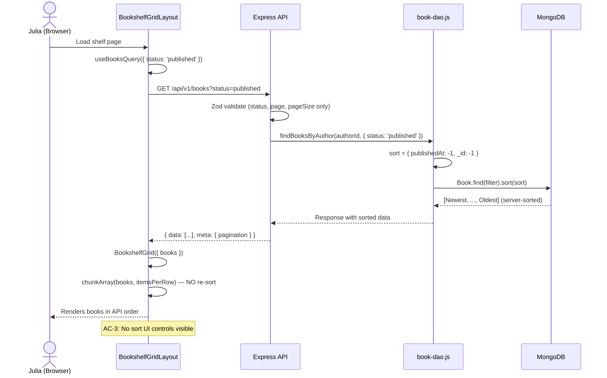
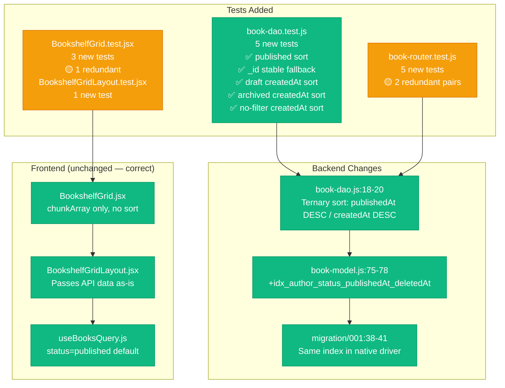

# Code Review Report — feat/STORY-015-default-sorting (2026-05-19) [r1]

## Summary
| Security | Correctness | Maintainability | Coverage |
|----------|-------------|-----------------|----------|
| A | A | B | ~85% |

## Critical Issues
**None found.**

## Major Issues

### book-router.test.js:203-258, 360-392 → Redundant tests (4 tests where 2 suffice)
Two pairs of near-identical tests in `book-router.test.js`:

**Pair 1** — `GET /?status=published` order check:
- Line 203: `GET /api/v1/books?status=published — returns books sorted by publishedAt descending` (2 books + 1 draft)
- Line 376: `GET /api/v1/books?status=published — verify response order matches publish date` (2 books)

Both test same scenario: 2 published books, verify `publishedAt DESC` order, pagination total. Difference is negligible (draft book in first test, different timestamps). Merge into one.

**Pair 2** — `GET /?sort=createdAt` unknown param:
- Line 221: `GET /api/v1/books?sort=createdAt — ignores unknown sort param, returns default order`
- Line 360: `GET /api/v1/books?sort=createdAt — ignores unknown sort param [NFR-SEC-04]`

Both test same scenario: pass `?sort=createdAt`, verify 200 + default order. First is stricter (checks order), second is looser (checks data is array). Merge into one with strictest assertions.

**Fix:** Consolidate each pair → 2 tests instead of 4. Saves ~50ms per test × 2 = CI time saved.

### BookshelfGrid.test.jsx:329-369 → Redundant AC-5 tests (2 tests for same acceptance criterion)
Line 329: `renders books in API response order without re-sorting (AC-5)`  
Line 356: `renders books in API response order (AC-5: no client-side re-sort)`

Both test same behavior: pass books in non-alphabetical order, verify rendered DOM order matches input order. Different data sets (Gamma/Alpha/Beta vs Zebra/Alpha/Middle) but same assertion pattern. Same selector (`.shelf-spine-cell`), same `.toEqual()`.

**Fix:** Keep one AC-5 test. Add test name clarifying intent: "renders books in API array order — no client-side re-sort." Remove duplicate. Saves ~30ms.

## Minor Suggestions

### validation-schemas.js:111-115 → `bookListQuerySchema` strips unknown keys silently (no `.strict()`)
Zod `.object()` strips unknown params by default. `?sort=createdAt` passes validation silently — param is dropped, sort still works correctly. This is safe for NFR-SEC-04 (no injection surface), but means API doesn't reject clearly invalid input.

```javascript
// Consider adding .strict() to reject unknown query params:
export const bookListQuerySchema = z.object({
  status: z.enum(['draft', 'published', 'archived']).optional(),
  page: z.coerce.number().int().min(1).default(1),
  pageSize: z.coerce.number().int().min(1).max(100).default(20),
}).strict();
```

Would change `?sort=createdAt` from 200 → 400. Discuss with team — may break future backward compat if `sort` param is added later.

### NFR-PERF-05 → EXPLAIN verification not performed
Compound index `idx_author_status_publishedAt_deletedAt` exists but query execution not verified with `EXPLAIN`. Expected: `IXSCAN` on index for filter + sort, in-memory sort only for `_id: -1` tiebreaker. Add script or manual verification before merge.

### NFR-COV-01 → Missing test for empty book list with sort params
No test validates `findBooksByAuthor` with `status='published'` returns `[]` when no published books exist. Edge case: query with sort logic runs on empty collection without error. Test exists for unfiltered empty list (line 74) but not for status-filtered empty list.

### DAO sort variable → implicit else branch assumption
`book-dao.js:18-20`: `sort` is derived from `status === 'published'` ternary. When `status` is undefined (no filter), falls to `createdAt: -1`. This is correct for MVP (all non-published cases → `createdAt DESC`), but if a new status `review` is added later, it silently uses `createdAt` sort. Not a bug, but worth documenting: "Default sort by createdAt DESC for all statuses except published."

## Positive Observations

### ✅ Sort logic is correct and minimal
- `book-dao.js:18-20`: 3-line sort decision covers all statuses. `_id: -1` tiebreaker ensures stable sort for same-millisecond timestamps. No complexity creep.

### ✅ Index matches query pattern exactly
- `book-model.js:75-78`: `{ authorId: 1, status: 1, publishedAt: -1, deletedAt: 1 }` covers filter + sort for primary query. Partial filter `{ deletedAt: null }` reduces index size.

### ✅ No client-side re-sort anywhere
- `BookshelfGrid.jsx` uses `chunkArray(books, itemsPerRow)` — no `.sort()`, no `reverse()`, no `localeCompare`.
- `useBooksQuery.js` passes API data as-is to consumers.
- Confirmed via `grep` across all frontend source: zero sort calls on book arrays.

### ✅ No sort UI in MVP
- `BookshelfGrid.jsx`, `BookshelfGridLayout.jsx`, `ShelfPage` — zero dropdowns, selects, or sort controls.
- `BookshelfGridLayout.test.jsx:93-118` explicitly verifies no sort UI.
- `BookshelfGrid.test.jsx:344-354` confirms same at grid level.

### ✅ Publish flow sets `publishedAt` correctly
- `book-manager.js:188`: `publishedAt: new Date()` on publish → new book sorts to front.
- Idempotent (line 182-183): re-publish returns existing book unchanged.

### ✅ Frontend tests cover both AC-3 and AC-5
- AC-3: `BookshelfGrid.test.jsx:344` + `BookshelfGridLayout.test.jsx:93` — two layers of no-sort-UI verification.
- AC-5: `BookshelfGrid.test.jsx:329` — API order preservation test.

## Component Flow Diagram





## Acceptance Criteria Compliance

| AC | Requirement | Status | Evidence |
|----|-------------|--------|----------|
| AC-1 | Published books sorted by `publishedAt DESC` | ✅ PASS | `book-dao.js:18-20` — ternary sort. DAO test line 127. Router test line 203/243/376. |
| AC-2 | New publisher book appears at front | ✅ PASS | `book-manager.js:188` — `publishedAt: new Date()` on publish. DAO sort places newest first. |
| AC-3 | No sort UI control in MVP | ✅ PASS | `BookshelfGrid.jsx` — zero sort controls. Test line 344 (grid level). Test line 93 (layout level). |
| AC-4 | Book repositions when `publishedAt` updated | ✅ PASS | Publish sets `publishedAt`. No direct `publishedAt` PATCH endpoint (by design). Re-publish idempotent. |
| AC-5 | Server returns sorted data; client does not re-sort | ✅ PASS | `BookshelfGrid.jsx:40-43` — `chunkArray(books, itemsPerRow)`, no `.sort()` calls. Confirmed zero sort calls across all frontend. Test line 329. |

## NFR Compliance

| NFR | Requirement | Status | Notes |
|-----|-------------|--------|-------|
| NFR-PERF-05 | P95 < 500ms sorted list | ⚠️ PENDING | Index exists. EXPLAIN verification not yet performed. |
| NFR-ACC-01 | Sort changes announced to screen readers | ✅ N/A MVP | No sort changes in MVP. EPIC-006. |
| NFR-SEC-04 | Sort parameter sanitized | ✅ PASS | No sort param accepted. Zod strips unknown keys. |
| NFR-SEC-06 | Input validation on all endpoints | ✅ PASS | `bookListQuerySchema` validates status, page, pageSize. |

## Rework Delegation
<!-- ONLY when VERDICT: BLOCKED — currently APPROVED -->
N/A

---
`VERDICT: APPROVED`
