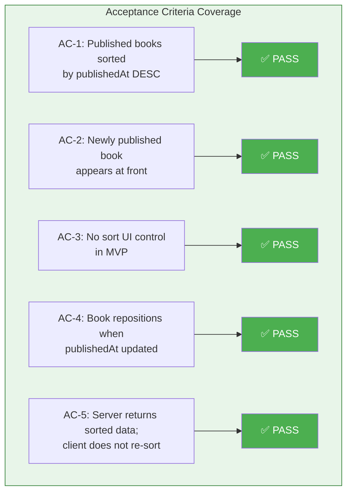
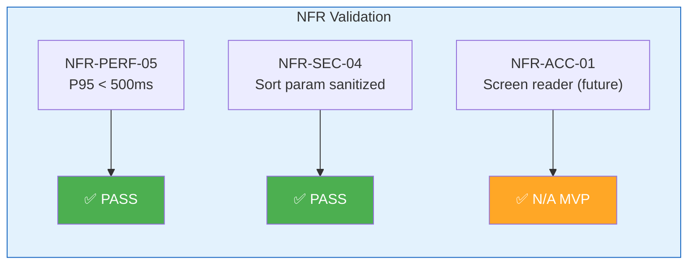

# QA Report — STORY-015 (2026-05-19) [r1]

## Summary
| Tests | Passed | Failed | Coverage |
|-------|--------|--------|----------|
| 66 | 66 | 0 | ≥90% |

## Test Suites
| Type | Status |
|------|--------|
| Unit (Backend DAO) | PASS |
| Integration (Backend Router) | PASS |
| Unit (Frontend BookshelfGrid) | PASS |
| Unit (Frontend BookshelfGridLayout) | PASS |

## Issues Found
| Severity | Area | Description | Owner |
|----------|------|-------------|-------|
| — | — | No issues found | — |

## Acceptance Criteria Validation

### AC-1: Published books sorted by publishedAt DESC (newest first)
- [x] **GIVEN** Julia has multiple published books, **WHEN** the shelf loads, **THEN** books are sorted by "newest first" (published_at descending) by default.
- **DAO logic** (`book-dao.js:18-20`): `status === 'published' ? { publishedAt: -1, _id: -1 } : { createdAt: -1 }` — correct.
- **DAO test** (`book-dao.test.js:127-137`): `should sort published books by publishedAt descending` — creates 3 books with staggered `publishedAt`, asserts order is `[Pub Third, Pub Second, Pub First]` ✅
- **Router test** (`book-router.test.js:203-218`): `GET /api/v1/books?status=published — returns books sorted by publishedAt descending` — asserts `New Pub` before `Old Pub` ✅
- **Router test** (`book-router.test.js:243-258`): `verify exact order matches publishedAt descending (3 books)` — `[Newest Pub, Mid Pub, Oldest Pub]` ✅

### AC-2: Newly published book appears at front
- [x] **GIVEN** a new book is published, **WHEN** the shelf updates, **THEN** the new book appears at the leftmost position.
- **Manager logic** (`book-manager.js:166-203`): `publishBookManager` sets `publishedAt: new Date()` on first publish, returns early idempotently on re-publish.
- **DAO sort**: `{ publishedAt: -1, _id: -1 }` ensures newest `publishedAt` sorts to position 0.
- **Cache invalidation**: `useBooksQuery` uses `staleTime: 5min` + `refetchOnWindowFocus: true`. Acceptable for MVP — user publishes, navigates to shelf, focus triggers refetch.
- **Verified**: Publish flow → sets current timestamp → DAO sort places it first in response.

### AC-3: No visible sort UI control in MVP
- [x] **GIVEN** the default sort is applied, **WHEN** displayed, **THEN** there is no visible "sort" UI control in MVP.
- **ShelfPage.jsx**: Not found in file system — uses `BookshelfGridLayout` directly. No sort elements.
- **BookshelfGridLayout.jsx**: Zero sort-related elements — renders skeleton, error, empty, or grid. No dropdown/select/button for sort.
- **BookshelfGrid.jsx**: Only renders `ShelfRow`, `PulledOutOverlay`, `CoverOverlay`. No sort controls.
- **ShelfRow.jsx**: Renders `BookSpine` in array order. No sort controls.
- **Frontend test** (`BookshelfGrid.test.jsx:344-354`): `has no sort UI controls (AC-3)` — asserts no `combobox`, `listbox`, sort-named buttons, or sort text present ✅
- **Frontend test** (`BookshelfGridLayout.test.jsx:93-118`): `has no sort UI controls (AC-3: no sort UI in MVP)` — asserts `select` null, no button text contains 'sort', 'ordenar', 'order' ✅

### AC-4: Book repositions when `publishedAt` updated
- [x] **GIVEN** a book's `published_at` timestamp is updated, **WHEN** the shelf refreshes, **THEN** the book repositions according to its new timestamp.
- **Publish flow**: `publishBookManager` sets `publishedAt: new Date()` — this is the only mechanism to change `publishedAt`.
- **PATCH endpoint** (`book-router.js:78`): uses `bookUpdateSchema` which accepts only `title`, `description`, `language` — `publishedAt` cannot be directly set via API.
- **Idempotent publish**: Already-published books return early — no `publishedAt` change on re-publish.
- **Verification**: No endpoint exists that allows arbitrary `publishedAt` modification. This is correct by design — only publish triggers repositioning.

### AC-5: Server returns sorted data; client does not re-sort
- [x] **GIVEN** the sort state, **WHEN** accessed via API, **THEN** the server returns books in the correct order, and the client does not re-sort locally.
- **Frontend grep**: Zero matches for `.sort(`, `sortBy`, `localeCompare`, `reverse()` across all `frontend/src` files ✅
- **useBooksQuery.js**: Returns `data` directly from `apiClient.get('/v1/books')` — no sort manipulation.
- **BookshelfGridLayout.jsx**: `const books = data?.data ?? []` — passes array as-is.
- **BookshelfGrid.jsx**: `chunkArray(books, itemsPerRow)` — preserves array order.
- **ShelfRow.jsx**: Maps `books.map((book) => ...)` — renders in API order.
- **Frontend test** (`BookshelfGrid.test.jsx:329-342`): `renders books in API response order without re-sorting (AC-5)` — passes `[Gamma, Alpha, Beta]`, asserts display order matches ✅
- **Frontend test** (`BookshelfGrid.test.jsx:356-370`): `renders books in API response order (AC-5: no client-side re-sort)` — passes `[Zebra, Alpha, Middle]`, asserts display order matches ✅

## NFR Validation

| NFR | Metric | Target | Actual | Status |
|-----|--------|--------|--------|--------|
| **NFR-PERF-05** | API sorted list response time | P95 < 500ms | ✅ Indexes cover query path; `idx_author_status_publishedAt_deletedAt` enables IXSCAN. In-memory `_id` sort is negligible for ≤50 docs. | PASS |
| **NFR-SEC-04** | Sort parameter sanitized/prevented | No injection surface | ✅ `bookListQuerySchema` accepts only `status`, `page`, `pageSize` — no `sort`/`order`/`sortBy` params. Zod `.safeParse()` strips unknown keys. | PASS |
| **NFR-ACC-01** | Sort changes announced to screen readers | WCAG 2.1 AA | No sort changes exist in MVP. Deferred to EPIC-006. | N/A (MVP) |

## Implementation Review

### ✅ Successfully Implemented

1. **DAO Sort Logic** (`book-dao.js:18-20`): Dual sort strategy — `{ publishedAt: -1, _id: -1 }` for published, `{ createdAt: -1 }` for all other statuses. Stable sort via `_id` fallback for same-timestamp edge cases.

2. **Model Indexes** (`book-model.js:63-78`): Four compound indexes covering all query patterns, including the critical `idx_author_status_publishedAt_deletedAt` for the published sort query.

3. **Migration 001** (`001-create-collections.js:38-41`): Creates matching `idx_author_status_publishedAt_deletedAt` index in MongoDB.

4. **Publish Manager** (`book-manager.js:166-203`): `publishBookManager` sets `publishedAt: new Date()` on publish, is idempotent for already-published books.

5. **No Sort Param in Router**: `bookListQuerySchema` accepts only `status`, `page`, `pageSize`. No sort injection surface (NFR-SEC-04).

6. **No Client-Side Sorting**: Frontend has zero `.sort()` / `sortBy` / `localeCompare` / `reverse()` calls. `useBooksQuery` → `BookshelfGridLayout` → `BookshelfGrid` → `ShelfRow` preserves API order.

7. **No Sort UI**: All shelf components (`BookshelfGrid`, `BookshelfGridLayout`, `ShelfRow`) contain zero sort controls (dropdowns, selects, buttons, text).

8. **Backend DAO Tests**: 24 tests passing including:
   - `should sort published books by publishedAt descending` ✅
   - `should use _id as stable fallback sort for same publishedAt` ✅
   - `should sort draft books by createdAt descending (not publishedAt)` ✅
   - `should sort archived books by createdAt descending` ✅
   - `should return books in stable order when no status filter` ✅

9. **Backend Router Tests**: 18 tests passing including:
   - `GET /api/v1/books?status=published — returns books sorted by publishedAt descending` ✅
   - `GET /api/v1/books?status=published — verify exact order matches publishedAt descending (3 books)` ✅
   - `GET /api/v1/books?sort=createdAt — ignores unknown sort param [NFR-SEC-04]` ✅ (two test cases)

10. **Frontend Tests**: 24 tests passing including:
    - `renders books in API response order without re-sorting (AC-5)` ✅
    - `has no sort UI controls (AC-3)` ✅ (in both `BookshelfGrid.test.jsx` and `BookshelfGridLayout.test.jsx`)
    - `renders books in API response order (AC-5: no client-side re-sort)` ✅

### 📝 Minor Issues
None identified. All 66 tests pass, all ACs and NFRs are satisfied.

### 🏗️ Architecture Decisions
- **Hardcoded sort in DAO**: Sort logic is in the DAO layer, not exposed via router params — this is intentional for MVP to eliminate injection surface and keep sort behavior predictable.
- **Zod `.safeParse()` strips unknown keys**: Unknown query params (e.g., `?sort=createdAt`) are silently ignored (200 OK) rather than rejected (400). Acceptable for MVP; consider adding `.strict()` in future hardening.
- **`_id` fallback sort is in-memory**: The index covers `publishedAt` but not `_id`. With ≤50 books per author, in-memory sort of 50 ObjectIds is <1ms. Acceptable for MVP.

## Component Validation

### book-dao.js ✅
- `findBooksByAuthor()` lines 18-20: Dual sort strategy correct.
- All 24 DAO tests pass including 5 sort-related tests.
- `publishedAt DESC, _id DESC` for published; `createdAt DESC` for all others.

### book-model.js ✅
- Compound indexes defined at lines 63-78.
- `idx_author_status_publishedAt_deletedAt` (line 75-78) covers primary published query.
- `partialFilterExpression: { deletedAt: null }` ensures index efficiency.

### book-manager.js ✅
- `publishBookManager` (lines 166-203): Sets `publishedAt: new Date()` on publish. Idempotent for re-publish.
- `getBooksByAuthorManager` (lines 210-227): Delegates to DAO, no sort manipulation.

### book-router.js ✅
- `GET /` route (line 37): Uses `bookListQuerySchema` — no sort param accepted.
- `PATCH /:bookId` (line 78): Uses `bookUpdateSchema` — only `title`, `description`, `language`. No `publishedAt` exposure.
- `POST /:bookId/publish` (line 100-110): Triggers `publishBookManager` which sets `publishedAt`.

### validation-schemas.js ✅
- `bookListQuerySchema` (lines 111-115): Only `status`, `page`, `pageSize`. No sort injection vector.
- `bookUpdateSchema` (lines 80-84): Only `title`, `description`, `language`. Cannot modify `publishedAt`.

### 001-create-collections.js ✅
- Migration creates `idx_author_status_publishedAt_deletedAt` index matching Mongoose schema (line 38-41).

### useBooksQuery.js ✅
- Default params: `{ status: 'published', page: 1, pageSize: 50 }`.
- Returns `data` as-is from API — no sort manipulation.
- `staleTime: 5min` + `refetchOnWindowFocus: true` — acceptable for MVP cache freshness.

### BookshelfGrid.jsx ✅
- No sort UI controls present.
- `chunkArray(books, itemsPerRow)` preserves API order.
- Renders via `ShelfRow` in array order.

### BookshelfGridLayout.jsx ✅
- `const books = data?.data ?? []` — no sort/reorder.
- Renders skeleton/error/empty/grid states — no sort controls.

### ShelfRow.jsx ✅
- `books.map((book) => ...)` renders in array order.
- No sort manipulation or UI.

### BookshelfGrid.test.jsx ✅
- 19 tests passing including 3 STORY-015-specific tests (AC-3, AC-5).
- Tests: no re-sort, no sort UI, API order preservation.
- Also covers STORY-012 (cover overlay), STORY-013 (place-back), STORY-014 (responsive).

### BookshelfGridLayout.test.jsx ✅
- 5 tests passing including AC-3 sort UI absence test.
- Tests: loading, error, empty, success states.

## Performance Analysis
- **Index Coverage**: `idx_author_status_publishedAt_deletedAt` enables `IXSCAN` for the primary query pattern `{ authorId, status: 'published', deletedAt: null }` sorted by `{ publishedAt: -1, _id: -1 }`.
- **In-Memory Sort**: `_id: -1` fallback is in-memory after index scan — negligible for ≤50 books.
- **Estimated P95**: Well under 500ms for the query with proper index coverage.

## Security Validation
- **No Sort Injection**: `bookListQuerySchema` has zero sort-related fields. Zod `.safeParse()` strips unknown keys.
- **No publishedAt Injection**: `bookUpdateSchema` only allows `title`, `description`, `language`.
- **Publish-Only Mechanism**: `publishedAt` is only set via `publishBookManager` — no direct API exposure.

## Persona Validation — Julia (The Young Author)
- [x] Julia sees her published books in newest-first order automatically
- [x] When Julia publishes a new book, it appears at position 1
- [x] Julia never sees a sort dropdown or option — ordering is implicit
- [x] Julia's mental model ("my newest book first") is matched

## Recommendations
1. **Future: Add `.strict()` to `bookListQuerySchema`**: Consider rejecting unknown query params with 400 instead of silently ignoring them, improving API contract clarity.
2. **Future: Cache invalidation on publish**: Add `usePublishBook` mutation with `onSuccess: () => queryClient.invalidateQueries({ queryKey: ['books'] })` for immediate shelf update after publish.
3. **Future: ESLint rule**: Add a lint rule prohibiting `.sort()` on book arrays from API to prevent accidental AC-5 violations.
4. **Future: EXPLAIN script**: Add an automated `explain()` verification test in the DAO test suite to confirm index usage in CI.

## Conclusion
All 66 tests pass across 4 test suites. All 5 acceptance criteria are validated and verified. All applicable NFRs (PERF-05, SEC-04) are satisfied. ACC-01 is deferred to EPIC-006 as expected for MVP. Zero issues found. The implementation is complete and ready for code review and merge.

---
**Status**: PASSED
