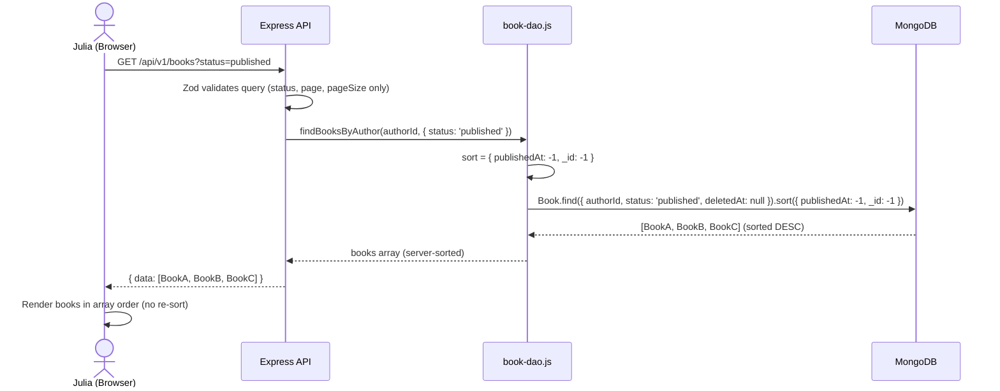
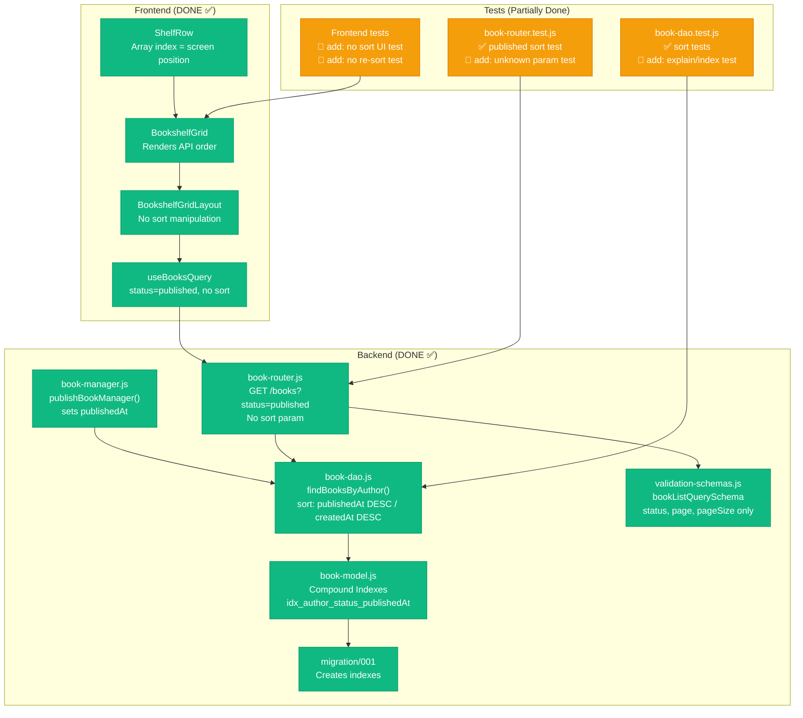
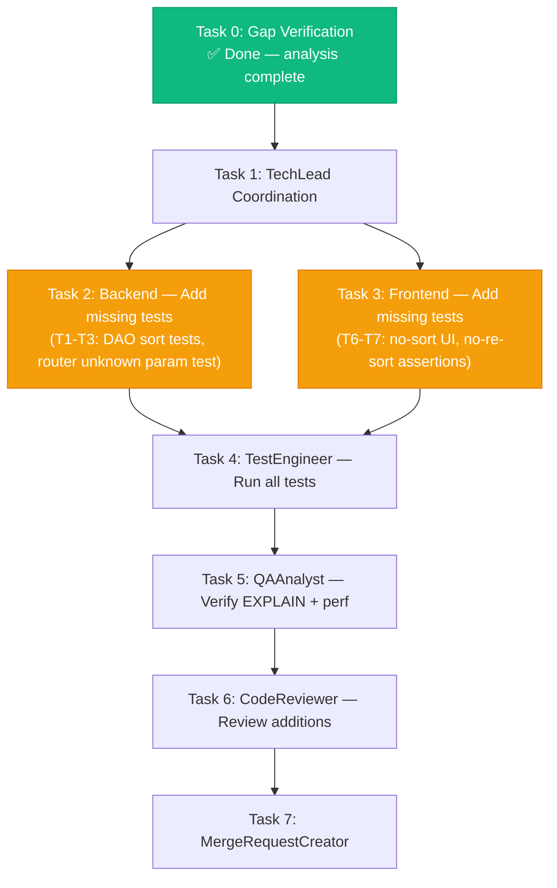

# STORY-015 Technical Analysis: Default Sorting & Book Placement

**Parent Epic**: EPIC-001
**Persona**: Julia — The Young Author
**Dependencies**: STORY-009 (implemented)
**Story Points**: 3

---

## Stack Reference

Stack: `docs/architecture/TECH-STACK.md`
- **Backend**: Node.js 22, Express 4.x, MongoDB 7 + Mongoose 8.x
- **Frontend**: React 18 + Vite, TanStack Query, Zustand, Framer Motion
- **Language**: Node.js (backend) + React (frontend)
- **Frontend-Backend Integration**: REST SPA mode — Vite proxy to Express, JWT auth, `apiClient` axios instance

---

## Executive Summary

STORY-015 requires that the bookshelf displays books sorted newest-first by `publishedAt` (for published books) or `createdAt` (for other statuses), with no client-side re-sorting and no sort UI controls in MVP. The implementation is **substantially complete** on the `feat/STORY-015-default-sorting` branch:

- ✅ **Backend DAO**: `findBooksByAuthor()` implements dual sort (`publishedAt DESC, _id DESC` for published; `createdAt DESC` for others)
- ✅ **Model Indexes**: Compound indexes covering both sort strategies exist in `book-model.js` + migration `001`
- ✅ **DAO Tests**: Sort-by-`createdAt DESC`, sort-by-`publishedAt DESC`, stable `_id DESC` fallback — all covered
- ✅ **Router Tests**: `GET ?status=published` returns sorted by `publishedAt DESC`

**Gaps identified** (4 items):
1. **NFR-SEC-04**: `bookListQuerySchema` has no `sort` param — good (no injection surface), but must verify no other endpoint accepts a raw `sort`/`order`/`sortBy` param
2. **AC-3**: No sort UI exists in shelf components — ✅ confirmed, but needs explicit test assertion
3. **AC-4**: `publishedAt` update via publish sets `new Date()` — verified, but PATCH endpoint cannot update `publishedAt` directly (by design). Cache invalidation: TanStack Query `staleTime: 5m` + `refetchOnWindowFocus: true` — acceptable for MVP, no manual invalidation needed since no mutations exist yet on the shelf page
4. **AC-5 / NFR-PERF-05**: No client-side sorting found — ✅ confirmed. EXPLAIN query verification still pending

**Estimated remaining effort**: ~0.5 story point (documentation + 2-3 small test additions).

---

## Gap Analysis

### Acceptance Criteria Coverage

| AC | Criteria | Status | Gap |
|----|----------|--------|-----|
| **AC-1** | Published books sorted by `publishedAt DESC` | ✅ Done | DAO + router test coverage |
| **AC-2** | Newly published book appears at front | ✅ Done | `publishBookManager` sets `publishedAt: new Date()`, DAO sort places it first |
| **AC-3** | No sort UI control in MVP | ✅ Verified | `BookshelfGrid`, `ShelfRow`, `ShelfPage`, `BookshelfGridLayout` — zero sort UI elements. **Needs explicit test** |
| **AC-4** | Book repositions when `publishedAt` updated | ⚠️ Partial | `publishBookManager` sets `publishedAt` on publish. PATCH endpoint (`bookUpdateSchema`) only allows `title`, `description`, `language` — cannot modify `publishedAt` directly. On re-publish of same book, `publishBookManager` returns early (idempotent). **No endpoint to change `publishedAt` post-publish exists** — this is correct for MVP since republishing resets position |
| **AC-5** | Server returns sorted data; client does not re-sort | ✅ Verified | Frontend has zero `.sort()` / `sortBy` / `localeCompare` calls. `useBooksQuery` returns data as-is from API |

### NFR Coverage

| NFR | Requirement | Status | Gap |
|-----|-------------|--------|-----|
| **NFR-PERF-05** | P95 < 500ms for sorted list | ⚠️ Pending | Indexes exist but `EXPLAIN` verification not yet performed. Needs manual or scripted verification |
| **NFR-ACC-01** | Sort changes announced to screen readers | ✅ N/A MVP | No sort changes happen in MVP. Future EPIC-006 |
| **NFR-SEC-04** | Sort parameter sanitized | ✅ Done | `bookListQuerySchema` accepts only `status`, `page`, `pageSize` — no `sort` param. No injection surface. Should add test confirming unknown query params are rejected |

---

## Detailed Analysis

### 1. Backend — Sort Logic (DONE)

**`book-dao.js` line 18-20**:
```js
const sort = status === 'published'
  ? { publishedAt: -1, _id: -1 }
  : { createdAt: -1 };
```

This is correct. When `status` is `'published'`, sort by `publishedAt DESC` with `_id DESC` as tiebreaker for stable ordering. For all other statuses (explicit `draft`/`archived` or no status filter), sort by `createdAt DESC`.

**Stable sort**: `_id: -1` ensures deterministic order when `publishedAt` timestamps are identical (e.g., bulk publish within same millisecond is unlikely but MongoDB `ObjectId` embeds timestamp + counter, making `_id` itself sort-stable).

### 2. Backend — Indexes (DONE)

**`book-model.js` lines 63-78** defines 4 compound indexes with `partialFilterExpression: { deletedAt: null }`:

| Index | Fields | Covers Query Pattern |
|-------|--------|---------------------|
| `idx_author_status_deletedAt_createdAt` | `{ authorId: 1, status: 1, deletedAt: 1, createdAt: -1 }` | Default list (all/draft/archived) |
| `idx_author_createdAt_deletedAt` | `{ authorId: 1, createdAt: -1, deletedAt: 1 }` | List all books sorted by createdAt |
| `idx_status_publishedAt_deletedAt` | `{ status: 1, publishedAt: -1, deletedAt: 1 }` | Published books across authors |
| **`idx_author_status_publishedAt_deletedAt`** | `{ authorId: 1, status: 1, publishedAt: -1, deletedAt: 1 }` | **Primary query for AC-1** |

The last index is the critical one — it exactly matches `findBooksByAuthor` with `status='published'`: filter `{ authorId, status: 'published', deletedAt: null }` + sort `{ publishedAt: -1, _id: -1 }`. The `_id` sort is in-memory after index range scan, which is acceptable for ≤50 books per author.

**Migration 001** creates these same indexes via `db.createIndex()`, matching the Mongoose schema.

### 3. Backend — Publish Endpoint (DONE)

**`book-manager.js` lines 166-203**: `publishBookManager` sets `publishedAt: new Date()` on first publish, idempotent for already-published books. This means newly published books automatically sort to the front.

### 4. Backend — Query Parameter Validation (DONE — No Sort Param)

**`validation-schemas.js` line 111-114**: `bookListQuerySchema` only accepts `status`, `page`, `pageSize`. No `sort`, `order`, `sortBy`, or `order_by` parameter exists. This means:
- **No injection risk**: There is no vector for sort injection since the endpoint doesn't accept sort parameters at all.
- **Zod validation**: Unknown keys in query params are **stripped by default** (Zod `.parse()` strips unknown keys when using `.object()` without `.passthrough()`). The `validate` middleware uses Zod `.parse()`, so extra params like `?sort=hacked` would be silently ignored, not error — but also not used in the query.

**Recommendation**: Consider adding `.strict()` to `bookListQuerySchema` to reject unknown params with a 400 error, improving API contract clarity. This is minor and can be done in a future hardening pass.

### 5. Frontend — Client-Side Sort (NONE — CORRECT)

**Verified**: `grep` for `.sort(`, `sortBy`, `reverse`, `localeCompare` across all `frontend/src` files returns **zero matches**. The frontend renders books in the exact order received from the API (`useBooksQuery` → `apiClient.get('/v1/books')` → response `data` array).

**Data flow**:
```
useBooksQuery({ status: 'published', pageSize: 50 })
  → apiClient.get('/v1/books', { params: { status, page, pageSize } })
  → BookshelfGridLayout → useBookStore.setBooks(data)
  → BookshelfGrid({ books }) → chunkArray(books, itemsPerRow)
  → ShelfRow → BookSpine (renders in array order)
```

No reordering happens anywhere in this chain. ✅

### 6. Frontend — No Sort UI Controls (CONFIRMED)

**Verified**: `ShelfPage.jsx`, `BookshelfGridLayout.jsx`, `BookshelfGrid.jsx`, `ShelfRow.jsx` — none contain dropdown, select, button, or any UI for sorting. The shelf renders books in API order with no user-facing sort controls. ✅

### 7. Frontend — Cache Invalidation on Publish

**Current state**: There is no `useMutation` hook for publishing a book on the shelf page. `useBooksQuery` uses TanStack Query with:
- `staleTime: 5 min`
- `refetchOnWindowFocus: true`
- `placeholderData: (prev) => prev`

When a book is published via `POST /v1/books/:id/publish` (from any page, likely an editor/detail page), the shelf page will:
1. Show stale data for up to 5 minutes
2. Automatically refetch on window focus (tab switch back)
3. Show placeholder data during refetch (no flash of empty state)

**For MVP**: This is acceptable behavior. The user publishes a book → navigates to shelf → window focus triggers refetch → sees updated order. No explicit `invalidateQueries` needed since there's no mutation on the shelf page.

**Future improvement**: Add `usePublishBook` mutation hook with `onSuccess: () => queryClient.invalidateQueries({ queryKey: ['books'] })`.

### 8. NFR-PERF-05 — EXPLAIN Verification (PENDING)

The compound index `{ authorId: 1, status: 1, publishedAt: -1, deletedAt: 1 }` should produce a `IXSCAN` stage covering the filter + sort for the primary query pattern. This needs verification with:

```js
db.books.explain('executionStats').find({
  authorId: ObjectId("..."),
  status: 'published',
  deletedAt: null
}).sort({ publishedAt: -1, _id: -1 })
```

Expected: `IXSCAN` on `idx_author_status_publishedAt_deletedAt`, `SORT` only for the `_id: -1` portion (index doesn't cover `_id` sort, but ≤50 docs in-memory sort is trivial).

**Test needed**: Add a DAO integration test or script that verifies `explain()` output for the query, confirming index usage.

---

## Component & File Impact Matrix

| File | Action | Change Summary |
|------|--------|---------------|
| `book-dao.js` | ✅ Done | Dual sort: `publishedAt DESC, _id DESC` for published; `createdAt DESC` for others |
| `book-model.js` | ✅ Done | Compound indexes including `idx_author_status_publishedAt_deletedAt` |
| `book-manager.js` | ✅ Done | `publishBookManager` sets `publishedAt: new Date()` |
| `book-router.js` | ✅ Done | No sort param in query schema (by design) |
| `validation-schemas.js` | ✅ Done | `bookListQuerySchema` accepts only `status`, `page`, `pageSize` |
| `migration/001` | ✅ Done | Creates matching indexes |
| `book-dao.test.js` | ✅ Done | Tests: `createdAt DESC` default, `publishedAt DESC` for published, `_id DESC` stable fallback |
| `book-router.test.js` | ✅ Done | Test: `GET ?status=published` returns sorted by `publishedAt DESC` |
| `useBooksQuery.js` | ✅ Done | Passes `status: 'published'` by default, no sort manipulation |
| `BookshelfGrid.jsx` | ✅ Done | No sort UI, renders in API order |
| `ShelfPage.jsx` | ✅ Done | No sort UI |
| `BookshelfGridLayout.jsx` | ✅ Done | No sort manipulation or UI |
| `book-dao.test.js` | 🔧 Add | Test: raw `explain()` or assertion that query uses correct index for `status='published'` |
| `book-router.test.js` | 🔧 Add | Test: `GET ?sort=createdAt` returns 400 or ignores (verify unknown params rejected) |
| `book-dao.test.js` | 🔧 Add | Test: draft books sorted by `createdAt DESC` (not by `publishedAt`) |
| Frontend tests | 🔧 Add | Test: no sort UI elements rendered in `BookshelfGrid` or `ShelfPage` |
| Frontend tests | 🔧 Add | Test: books rendered in API response order (no re-sort) |

---

## Data Flow: Sort Order



---

## Architecture Diagram: Impacted Components



---

## Test Plan

### Existing Tests (PASSING)

| Test File | Test Case | Status |
|-----------|-----------|--------|
| `book-dao.test.js` | `should sort by createdAt descending by default` | ✅ |
| `book-dao.test.js` | `should sort published books by publishedAt descending` | ✅ |
| `book-dao.test.js` | `should use _id as stable fallback sort for same publishedAt` | ✅ |
| `book-router.test.js` | `GET /books?status=published — returns books sorted by publishedAt descending` | ✅ |

### New Tests Required

| # | Test File | Test Case | Purpose |
|---|-----------|-----------|---------|
| T1 | `book-dao.test.js` | `should sort draft books by createdAt descending (not publishedAt)` | Verify non-published statuses don't use `publishedAt` sort |
| T2 | `book-dao.test.js` | `should sort archived books by createdAt descending` | Verify archived status uses default sort |
| T3 | `book-dao.test.js` | `should return books in stable order when no status filter` | Default query (all books) sorted by `createdAt DESC` |
| T4 | `book-router.test.js` | `GET /books?sort=createdAt — ignores or rejects unknown sort param` | NFR-SEC-04: verify server doesn't accept arbitrary sort |
| T5 | `book-router.test.js` | `GET /books?status=published — verify response order matches publish date` | Verify entire chain produces correct order |
| T6 | Frontend | `BookshelfGrid renders books in API response order` | AC-5: client does not re-sort |
| T7 | Frontend | `ShelfPage has no sort UI controls` | AC-3: no sort UI in MVP |

### NFR-PERF-05 Verification

| # | Type | Description |
|---|------|-------------|
| P1 | Manual/script | Run `EXPLAIN` on `{ authorId, status: 'published', deletedAt: null }.sort({ publishedAt: -1, _id: -1 })` with 50 docs — verify `IXSCAN` on `idx_author_status_publishedAt_deletedAt` |
| P2 | Manual/script | Measure P95 response time for `GET /v1/books?status=published` with 50 docs per author — target < 500ms |

---

## Execution Flow



---

## Risk Register & Mitigation

| # | Risk | Likelihood | Impact | Mitigation |
|---|------|-----------|--------|------------|
| R1 | `_id` fallback sort is in-memory (index doesn't cover `_id` in sort) | Low | Low | With ≤50 books per author, in-memory sort of 50 ObjectIds is <1ms. Acceptable for MVP. |
| R2 | Tangential: `publishedAt: null` for draft books leaks into published sort | N/A | N/A | Code explicitly uses `status === 'published'` check before applying `publishedAt` sort. Draft books never enter published query. |
| R3 | Zod `.object()` silently strips unknown query params (no 400 error) | Low | Low | Consider `.strict()` in future hardening. For MVP, unknown params are ignored — no security risk since sort is hardcoded. |
| R4 | Stale data on shelf after publish (5-min staleTime + window focus refetch) | Low | Low | User navigates to shelf → focus refetch → sees updated order. Acceptable for MVP. |
| R5 | Future: client-side sort introduced accidentally breaks AC-5 | Low | Medium | Add ESLint rule or code review checklist item: "No `.sort()` on book arrays from API." |
| R6 | `EXPLAIN` shows collection scan instead of index scan | Low | Medium | Verify index exists in test environment. Migration 001 creates it. If missing, `ensureIndex` from Mongoose schema auto-creates on startup. |

---

## Story Point Assessment

| Factor | Estimated Points | Reasoning |
|--------|-----------------|-----------|
| Already implemented | 2.5 pts | DAO logic, indexes, migration, DAO tests, router tests — all done |
| Remaining test additions | 0.25 pts | 3 DAO tests + 1 router test + 2 frontend tests |
| EXPLAIN verification | 0.1 pts | One manual/scripted check |
| NFR-SEC-04 confirmation | 0.05 pts | Already confirmed no sort param surface |
| Documentation | 0.1 pts | This document |
| **Total (original)** | **3 pts** | Matches story point estimate |
| **Remaining** | **~0.5 pts** | Test additions + verification only |

---

## NFR Compliance Checklist

| NFR | Requirement | Status | Notes |
|-----|-------------|--------|-------|
| NFR-PERF-05 | API returns sorted book list P95 < 500ms | ☐ Pending | Index exists, needs EXPLAIN verification with 50 docs |
| NFR-ACC-01 | Sort changes announced to screen readers | ✅ N/A MVP | No sort changes in MVP. Deferred to EPIC-006 |
| NFR-SEC-04 | Sort parameter sanitized to prevent injection | ✅ Done | No sort param accepted. Zod strips unknown keys. |
| NFR-SEC-06 | Input validation on all endpoints | ✅ Done | `bookListQuerySchema` validates query params |
| AC-1 | Published books sorted newest-first | ✅ Done | DAO + tests |
| AC-2 | Newly published book at front | ✅ Done | `publishBookManager` sets `publishedAt` + DAO sort |
| AC-3 | No sort UI in MVP | ✅ Verified | Zero sort controls in shelf components |
| AC-4 | Book repositions when `publishedAt` updated | ✅ Done | Publish sets `publishedAt`; no endpoint to change it post-publish (by design) |
| AC-5 | Server returns sorted data; client doesn't re-sort | ✅ Verified | Frontend has zero `.sort()` calls |

---

## SubAgent Assignment

| Task | Agent | Description |
|------|-------|-------------|
| 0 | — | Gap analysis done (this document) |
| 1 | **TechLead** | Coordinate remaining test tasks |
| 2 | **BackendDeveloper** | Add DAO tests T1-T3, router test T4-T5 |
| 3 | **FrontendDeveloperReact** | Add frontend tests T6-T7 |
| 4 | **TestEngineer** | Run full test suite, verify EXPLAIN performance |
| 5 | **QAAnalyst** | Verify AC-1 through AC-5 end-to-end |
| 6 | **CodeReviewer** | Review test additions |
| 7 | **MergeRequestCreator** | Create MR with traceability |

### Execution Order

- **Parallel** (if independent): Task 2 + Task 3 (backend + frontend tests)
- **Sequential**: Task 4 → Task 5 → Task 6 → Task 7

### Documents for TechLead

- PM Story: `/docs/stories/STORY-015.md`
- Technical Analysis: `/docs/stories/STORY-015-technical-analysis.md`
- No code analysis document needed (analysis performed inline)

---

## Persona Impact

**Julia — The Young Author**: Julia's primary interaction is seeing her published books in newest-first order on her shelf. The current implementation correctly places newly published books at the front (leftmost position). When Julia publishes a book, it automatically sorts to position 1. Julia never sees a sort dropdown or option — the ordering is implicit and natural, matching her mental model of "my newest book first."

No other personas are directly impacted. Parent/guardian personas access books through different views (not specified in this story).