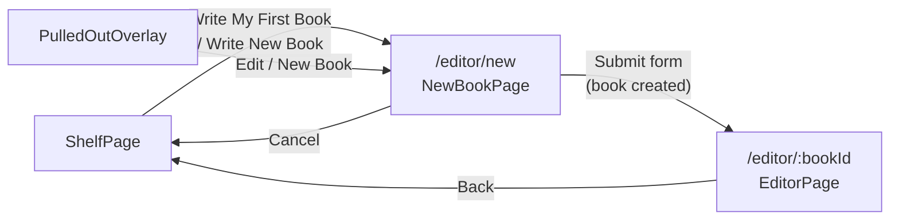
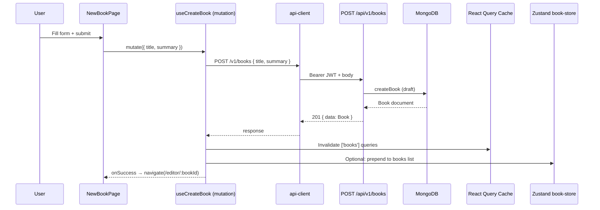
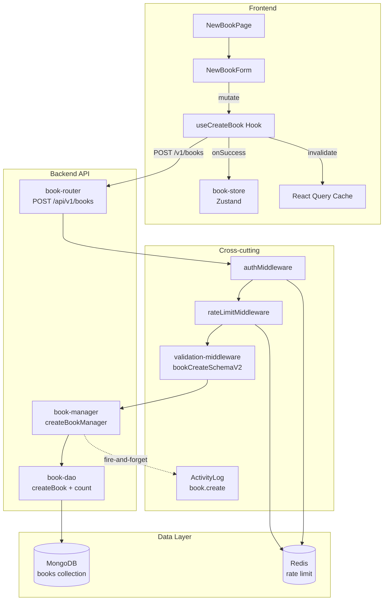
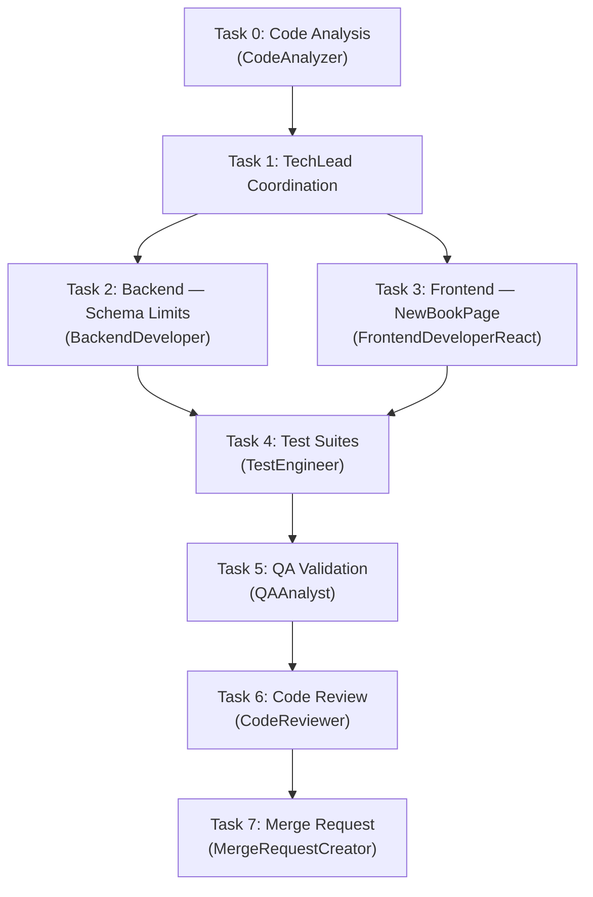

# STORY-016 Technical Analysis: Create a New Book

**Epic**: EPIC-003
**Persona**: Julia — The Young Author
**Stack**: Node.js 22 / Express 4.x / MongoDB 7 / Mongoose 8 / Zod / Pino / Vitest (backend) + React 18 / Vite 5 / Tailwind 3 / Flowbite React / react-hook-form / Zustand / TanStack Query / react-i18next / Framer Motion (frontend)
**Language**: Node.js (ESM)
**Frontend**: React 18 + Vite (SPA mode — typed API client via axios, CORS, JWT manual handling)
**Depends on**: STORY-004 (data model + schemas), STORY-005 (API endpoints + validation)

---

## 1. Feature Scope & Boundaries

### In Scope

- **New Book creation form** — dedicated page at `/editor/new` (already referenced by `EmptyShelfState` navigate)
- Title field (required) + Summary field (optional, multiline textarea)
- Character count indicators (encouraging tone)
- Form validation: title required, max 120 chars (story), 200 chars (model); summary max 500 chars (story), 2000 chars (model)
- `POST /api/v1/books` already exists — validate schema compatibility with story requirements
- Navigation: "Write My First Book" → `/editor/new` → on submit → `/editor/:bookId` (chapter editor)
- Draft books appear in "My Drafts" on shelf (status `draft`), NOT on main bookshelf (status `published`)
- i18n: Portuguese (pt-BR) + English
- Accessibility: WCAG 2.1 AA, keyboard nav, screen reader, auto-focus, contrast 4.5:1
- XSS sanitization on title and summary fields (DOMPurify on frontend, Zod trim on backend)

### Out of Scope

- Chapter creation (future story)
- Book cover design (Cover module)
- Book publishing flow (separate story)
- Draft list view on shelf (partially exists via `status=draft` query param)
- Collaborative editing

---

## 2. Data Model — Impact Assessment

### Existing Book Schema (STORY-004)

The `books` collection already supports all fields needed:

| Field | Story Requirement | Existing Schema | Gap? |
|-------|------------------|-----------------|------|
| `title` | Required, max 120 chars | `String, required, trim, maxlength: 200` | **maxlen mismatch**: story says 120, schema allows 200 |
| `description` (mapped from `summary`) | Optional, max 500 chars | `String, trim, maxlength: 2000, default: ''` | **maxlen mismatch**: story says 500, schema allows 2000 |
| `status` | Default `draft` | `enum: ['draft', 'published', 'archived'], default: 'draft'` | ✅ |
| `authorId` | From JWT | `ObjectId, ref: 'Child', required, indexed` | ✅ |
| `language` | Optional, default pt-BR | `String, default: 'pt-BR'` | ✅ |
| `createdAt` | Needed for list ordering | Auto via `timestamps: true` | ✅ |

### Schema Decision: Soft Limits at API Layer, Hard Limits at Model Layer

| Field | Frontend Soft Limit | Frontend Hard Limit | API Zod Schema | Mongoose Hard Limit |
|-------|---------------------|--------------------|-----------------|---------------------|
| `title` | Warning at 100 chars | Block at 120 chars | `max(120)` **CHANGE from 200** | `maxlength: 200` (keep — defensive) |
| `summary`/`description` | Warning at 400 chars | Block at 500 chars | `max(500)` **CHANGE from 2000** | `maxlength: 2000` (keep — defensive) |

**Rationale**: Story explicitly specifies 120/500 as user-facing limits. Mongoose maxlimits stay at 200/2000 as defense-in-depth. API Zod schemas tighten to story values. This means:
- `bookCreateSchemaV2` title max: 200 → **120**
- `bookCreateSchemaV2` summary/description max: 2000 → **500**
- Frontend Zod mirrors: title max 120, summary max 500
- Mongoose model: keep 200/2000 (no migration needed, allows future expansion)

### No Schema Migration Required

The `books` collection schema already supports this feature. Changes are at the API validation layer only (Zod schema max values).

---

## 3. API Design

### POST /api/v1/books — Already Exists

The endpoint is **fully implemented** in `book-router.js` (line 21). The `bookCreateSchemaV2` validates and normalizes `summary → description`. The `createBookManager` creates books in `draft` status.

**Required Changes**:

1. **Update `bookCreateSchemaV2`** — tighten max lengths:
   - `title`: `z.string().min(1).max(120).trim()` (was `max(200)`)
   - `summary`: `z.string().max(500).trim().optional().default('')` (was `max(2000)`)
   - `description`: `z.string().max(500).trim().optional()` (was `max(2000)`)

2. **Update `bookCreateSchema`** (original, if still used): mirror the same limits for consistency.

3. **Update `validation-middleware.js`** `mapZodIssue()` — add story-specific messages:
   - Title too big: `"Try a shorter title — under 120 characters works best!"` (i18n-aware in future)
   - Summary too big: `"Keep your summary under 500 characters — short and sweet!"` (i18n-aware)

### Response Shape (Already Defined)

```json
{
  "data": {
    "_id": "ObjectId",
    "authorId": "ObjectId",
    "title": "My First Adventure",
    "description": "A story about a brave cat",
    "status": "draft",
    "chapterIds": [],
    "coverAssetId": null,
    "publishedAt": null,
    "language": "pt-BR",
    "deletedAt": null,
    "createdAt": "2026-05-19T...",
    "updatedAt": "2026-05-19T...",
    "spineColor": "#4ECDC4"
  },
  "meta": { "requestId": "..." }
}
```

---

## 4. UI/UX Plan

### 4.1 Navigation Flow



### 4.2 Route Addition

Add `/editor/new` route in `App.jsx`. Note: `/editor/new` must be placed **before** `/editor/:bookId` to avoid "new" being captured as `:bookId`.

```jsx
<Route element={<ProtectedLayout />}>
  <Route path="/shelf" element={<ShelfPage />} />
  <Route path="/editor/new" element={<NewBookPage />} />  {/* NEW — before :bookId */}
  <Route path="/editor/:bookId" element={<EditorPage />} />
  ...
</Route>
```

### 4.3 NewBookPage Component

A dedicated page (not a modal) following existing page patterns:

- **Layout**: Centered card with amber/teal gradient background (matches shelf/editor pages)
- **Header**: `HiPencilAlt` icon (same as EditorPage), title "Create Your Book" (i18n)
- **Form fields**:
  - Title: Flowbite `TextInput`, id="bookTitle", type="text", required
  - Summary: Flowbite `Textarea`, id="bookSummary", rows=4
- **Character counts**: Inline below each field, right-aligned, encouraging tone:
  - Title: "{{count}}/120 characters" — turns amber at 100+, red at 120+
  - Summary: "{{count}}/500 characters" — turns amber at 400+, red at 500+
- **Buttons**:
  - "Start Writing" (primary, amber bg) — submits form
  - "Cancel" (secondary, light) — navigates back to shelf
- **Auto-focus**: Title input on mount via `useEffect` + `ref.current.focus()`
- **Animation**: Framer Motion fade-up entry, respects `useReducedMotion`

### 4.4 NewBookForm Component (Extracted for Testability)

Separate form component receiving `onSubmit`, `isPending`, `serverError` props — same pattern as `RegisterForm`:

| Prop | Type | Description |
|------|------|-------------|
| `onSubmit` | `(data: { title, summary }) => void` | Form submission handler |
| `isPending` | `boolean` | Disables submit, shows Spinner |
| `serverError` | `string \| null` | API error displayed in Alert |

### 4.5 Form Validation (Frontend Zod)

```js
const newBookSchema = z.object({
  title: z.string().min(1).max(120).trim(),
  summary: z.string().max(500).trim().optional().default(''),
});
```

Used with `zodResolver(newBookSchema)` in `react-hook-form`.

### 4.6 Entry Points to NewBookPage

Two existing buttons already navigate to `/editor/new`:
1. **EmptyShelfState**: "Write My First Book" button → `navigate('/editor/new')` ✅ already coded
2. **Navbar or ShelfPage**: needs "New Book" / "+" button → add to ShelfPage or Navbar

---

## 5. State Management Approach

### 5.1 Data Flow Diagram



### 5.2 New Hook: `useCreateBook`

**Location**: `frontend/src/hooks/useCreateBook.js`

Uses TanStack `useMutation`:

```js
export default function useCreateBook() {
  const queryClient = useQueryClient();
  
  return useMutation({
    mutationFn: async ({ title, summary }) => {
      const { data } = await apiClient.post('/v1/books', { 
        title, 
        summary  // API schema maps summary → description
      });
      return data.data; // unwrap envelope
    },
    onSuccess: (book) => {
      // Invalidate books list queries to refetch on next shelf visit
      queryClient.invalidateQueries({ queryKey: ['books'] });
    },
  });
}
```

### 5.3 Zustand `book-store.js` — No Changes Required

The book store already has `books`, `setBooks`, `setCurrentBook`. The mutation hook invalidates React Query cache, which triggers refetch. The store is synced via `useEffect` in the shelf page — no direct store mutation needed on create.

---

## 6. Error Handling Strategy

### 6.1 Frontend Error Handling

| Scenario | Display | Tone |
|----------|---------|------|
| Empty title | Inline field error below title | "Give your book a name — every story needs one!" |
| Title > 120 chars | Inline field error | "That's a long title! Try something under 120 characters." |
| Summary > 500 chars | Inline field error | "Keep it short and sweet — under 500 characters works best." |
| 401 Unauthorized | Global toast → redirect login | (handled by api-client interceptor) |
| 403 Book limit reached | Alert above form | "You've written so many stories! You'll need to finish one before starting another." |
| 400 Validation from server | Alert above form | (server-side Zod validation as fallback) |
| Network error | Global toast | (handled by api-client interceptor + error-store) |
| 500 Internal error | Alert above form | "Something went wrong — please try again" |

### 6.2 Backend Error Handling

Already fully covered by `book-router.js` `handleError()` and `validation-middleware.js`. The only change needed is updating `mapZodIssue()` with story-specific friendly messages for the 120/500 character limits.

### 6.3 Error Response → i18n Mapping

Frontend `errors.json` already maps backend error codes. Add two new error codes if desired:

| Error Code | pt-BR | en |
|-----------|-------|----|
| `BOOK_LIMIT_REACHED` | "Você já escreveu muitas histórias! Termine uma antes de começar outra." | "You've written so many stories! You'll need to finish one before starting another." |

---

## 7. Security Considerations

### 7.1 XSS Sanitization

| Layer | Mechanism | Detail |
|-------|-----------|--------|
| **Frontend rendering** | React auto-escapes JSX | Built-in XSS protection — title/summary rendered as text nodes |
| **Frontend form** | DOMPurify `sanitizeText()` | Apply `sanitizeText()` to title and summary before sending to API |
| **API input** | Zod `.trim()` | Strips leading/trailing whitespace; strips are on `bookCreateSchemaV2` |
| **Mongoose** | Schema `trim: true` | Double-trim at model level |
| **Mongoose** | No HTML interpretation | MongoDB stores strings as-is; no HTML rendering engine |
| **Response** | `Content-Type: application/json` | Browser won't execute JSON as HTML |
| **Response** | `helmet` CSP headers | Already configured in `app.js` — blocks inline scripts |

**Test**: Submit `<script>alert(1)</script>` as title — should be stored as text (not executed), rendered as escaped text. With React's JSX auto-escaping, this is inherently safe. DOMPurify provides belt-and-suspenders.

### 7.2 Input Validation (Defense in Depth)

1. **Frontend Zod**: `min(1).max(120).trim()` on title, `max(500).trim()` on summary
2. **API Zod** (`bookCreateSchemaV2`): Same limits, `.transform()` normalizes summary→description
3. **Mongoose**: `maxlength: 200` / `maxlength: 2000` (model-level defense)
4. **API rate limit**: 100 req/min per user (already exists)
5. **Auth middleware**: JWT verification on all `/api/v1/books` routes

### 7.3 COPPA / Privacy (NFR-PRV-03)

- Only `title` and `summary` (description) collected — no unnecessary fields
- `authorId` from JWT — no user-controlled author spoofing
- `language` default pt-BR — not user-specified in form (reduces data collection)

---

## 8. Accessibility Plan (WCAG 2.1 AA)

| Requirement | Implementation | NFR |
|-------------|---------------|-----|
| **Keyboard navigation** | Tab order: title → summary → Start Writing → Cancel; Escape closes nothing (no modal) | NFR-ACC-01 |
| **Focus management** | `useEffect(() => { titleRef.current?.focus() }, [])` on page mount | NFR-ACC-03 |
| **Form labels** | Flowbite `Label htmlFor` matching input ids; `aria-label` on form element | NFR-ACC-01 |
| **Error announcements** | `aria-invalid={!!error}` on inputs; `aria-describedby` linking to error spans; `aria-live="polite"` on error container | NFR-ACC-03 |
| **Character count** | `aria-live="polite"` on character count regions so screen readers announce count changes | NFR-ACC-03 |
| **Button labels** | `aria-label` on both buttons with i18n text | NFR-ACC-01 |
| **Text contrast** | Tailwind text colors `gray-700`+ on `white` bg = 9.4:1 ratio; amber buttons with `white` text = 4.7:1 | NFR-ACC-04 |
| **Reduced motion** | Framer Motion `useReducedMotion()` — skip entry animation | Existing pattern |
| **Screen reader form announcement** | `role="form"` + `aria-label={t('createBook.formLabel')}` on form element | NFR-ACC-03 |
| **Skip to content** | Navbar already provides skip link (existing) | Existing pattern |

---

## 9. Internationalization (i18n)

### 9.1 Namespace: `editor` (Extend Existing)

The `editor` namespace already exists with 11 placeholder keys. Add create-book keys:

**pt-BR/editor.json** (additions):
```json
{
  "createBook.title": "Criar Seu Livro",
  "createBook.subtitle": "Toda grande história começa com um nome!",
  "createBook.titleLabel": "Título do Livro",
  "createBook.titlePlaceholder": "Qual o nome da sua história?",
  "createBook.summaryLabel": "Resumo (opcional)",
  "createBook.summaryPlaceholder": "Conte um pouco do que é a sua história...",
  "createBook.startWriting": "Começar a Escrever",
  "createBook.cancel": "Cancelar",
  "createBook.charCount": "{{count}}/{{max}} caracteres",
  "createBook.charCountWarn": "{{count}}/{{max}} caracteres — quase lá!",
  "createBook.charCountOver": "{{count}}/{{max}} caracteres — está grande demais!",
  "createBook.errorTitleRequired": "Dê um nome ao seu livro — toda história precisa de um!",
  "createBook.errorTitleTooLong": "Esse título está grande! Tente algo com menos de 120 caracteres.",
  "createBook.errorSummaryTooLong": "Mantenha curto — até 500 caracteres funciona melhor!",
  "createBook.errorBookLimit": "Você já escreveu muitas histórias! Termine uma antes de começar outra.",
  "createBook.formLabel": "Formulário de criação de livro",
  "createBook.newBook": "Novo Livro"
}
```

**en/editor.json** (additions):
```json
{
  "createBook.title": "Create Your Book",
  "createBook.subtitle": "Every great story starts with a name!",
  "createBook.titleLabel": "Book Title",
  "createBook.titlePlaceholder": "What's your story called?",
  "createBook.summaryLabel": "Summary (optional)",
  "createBook.summaryPlaceholder": "Tell us a little about your story...",
  "createBook.startWriting": "Start Writing",
  "createBook.cancel": "Cancel",
  "createBook.charCount": "{{count}}/{{max}} characters",
  "createBook.charCountWarn": "{{count}}/{{max}} characters — almost there!",
  "createBook.charCountOver": "{{count}}/{{max}} characters — that's too long!",
  "createBook.errorTitleRequired": "Give your book a name — every story needs one!",
  "createBook.errorTitleTooLong": "That's a long title! Try something under 120 characters.",
  "createBook.errorSummaryTooLong": "Keep it short and sweet — under 500 characters works best!",
  "createBook.errorBookLimit": "You've written so many stories! You'll need to finish one before starting another.",
  "createBook.formLabel": "Book creation form",
  "createBook.newBook": "New Book"
}
```

### 9.2 shelf.json (Additions)

```json
"newBookButton": "Novo Livro"    (pt-BR)
"newBookButton": "New Book"       (en)
```

---

## 10. Performance Targets

### NFR-PERF-05: API P95 < 500ms

| Component | Expected Time | Optimization |
|-----------|--------------|--------------|
| JWT verification + auth middleware | ~2ms | Redis blacklist check (in-memory) |
| Zod validation | <1ms | In-process, no I/O |
| `countBooksByAuthor` | ~3ms | Covered by `{ authorId: 1, deletedAt: 1 }` compound index |
| `createBook` (insertOne) | ~5ms | Single document insert, indexed |
| `createActivityLog` (fire-and-forget) | ~2ms (async) | Non-blocking `.catch()` |
| **Total P95 estimate** | **~15ms** | Well under 500ms target |

### Frontend Performance

| Metric | Target | Approach |
|--------|--------|----------|
| Page load (LCP) | <2s | Vite code splitting, route-level lazy loading |
| Form validation | <50ms | Zod synchronous validation |
| Character count update | <16ms | React `watch` mode on react-hook-form |

---

## 11. Testing Strategy

### 11.1 Backend Tests (Vitest + Supertest)

**Existing**: `backend/src/app/book/__tests__/book-router.test.js` already has tests for `POST /`. Update/extend:

| Test Case | Type | Assertion |
|-----------|------|-----------|
| Create book with valid title + summary | Integration | 201, book returned with status `draft` |
| Create book with title only (no summary) | Integration | 201, description defaults to `''` |
| Create book with empty title | Integration | 400, `VALIDATION_ERROR`, friendly message |
| Create book with title > 120 chars | Integration | 400, `VALIDATION_ERROR` |
| Create book with summary > 500 chars | Integration | 400, `VALIDATION_ERROR` |
| Book limit reached (100 books) | Integration | 403, `BOOK_LIMIT_REACHED` |
| No auth token | Integration | 401 per authMiddleware |
| XSS in title/summary stored as text | Integration | `<script>alert(1)</script>` stored verbatim, no execution |
| Audit log fires on create | Unit (manager) | `createActivityLog` called with `book.create` |
| Activity log fire-and-forget | Unit (manager) | Audit log failure doesn't block response |

### 11.2 Frontend Tests (Vitest + Testing Library)

**New file**: `frontend/src/__tests__/NewBookPage.test.jsx`

| Test Case | Type | Assertion |
|-----------|------|-----------|
| Renders form with title + summary fields | Unit | Both inputs in document |
| Title input auto-focused on mount | Unit | `document.activeElement === titleInput` |
| Shows validation error on empty title submit | Unit | Error text visible with friendly message |
| Shows validation error on title > 120 | Unit | Error text visible |
| Shows validation error on summary > 500 | Unit | Error text visible |
| Character count updates on typing | Unit | Count text reflects input length |
| Submit calls mutation with correct data | Unit | `onSubmit({ title, summary })` called |
| isPending disables submit + shows Spinner | Unit | Button disabled, Spinner visible |
| Server error displays in Alert | Unit | Alert with error text visible |
| Cancel navigates to /shelf | Unit | `navigate('/shelf')` called |
| Keyboard navigation through form | Unit | Tab cycles title → summary → submit → cancel |
| Screen reader: aria labels present | Unit | form, inputs, buttons have correct `aria-label`/`aria-describedby` |

### 11.3 E2E Tests (Future)

E2E tests deferred to a dedicated E2E story. Manual QA covers:
- Full flow: shelf → new book → fill form → submit → editor page
- Book appears in "My Drafts" (shelf with `status=draft`)
- No XSS execution from malicious input

---

## 12. Architecture Diagram



---

## 13. Execution Order & Dependencies



### Parallelization

- **Tasks 2 and 3 CAN run in parallel** — backend validation limit changes and frontend page are independent
- Task 2 is small (update 2 Zod schemas + 1 validation message map) — BackendDeveloper
- Task 3 is the main work (new page, form, hook, i18n, route) — FrontendDeveloperReact
- Task 4 blocked on both 2 and 3

---

## 14. Task Details

| Task | Agent | Description | Depends On |
|------|-------|-------------|------------|
| 0 | CodeAnalyzer | Analyze existing book-router, validation-schemas, EditorPage, ShelfPage | — |
| 1 | TechLead | Coordinate implementation per this analysis | 0 |
| 2 | BackendDeveloper | Update `bookCreateSchemaV2` max limits (120/500); update `validation-middleware.js` friendly messages for new limits | 1 |
| 3 | FrontendDeveloperReact | Create `NewBookPage.jsx`, `NewBookForm.jsx`, `useCreateBook.js`; add `/editor/new` route; add i18n keys; add "New Book" button to ShelfPage | 1 |
| 4 | TestEngineer | Backend: update/extend book-router tests for new limits; Frontend: NewBookPage unit tests | 2, 3 |
| 5 | QAAnalyst | Validate all 6 ACs; XSS test; keyboard nav; screen reader; P95 <500ms | 4 |
| 6 | CodeReviewer | Review all changes for security, accessibility, i18n completeness | 5 |
| 7 | MergeRequestCreator | Create MR with traceability to STORY-016 | 6 |

---

## 15. Files to Create

| File | Purpose |
|------|---------|
| `frontend/src/app/editor/NewBookPage.jsx` | Page component — route target for `/editor/new` |
| `frontend/src/components/editor/NewBookForm.jsx` | Form component — extracted for testability |
| `frontend/src/hooks/useCreateBook.js` | TanStack `useMutation` hook for `POST /v1/books` |

## 16. Files to Modify

| File | Change |
|------|--------|
| `backend/src/app/common/validation-schemas.js` | Update `bookCreateSchemaV2`: title `max(120)`, summary/description `max(500)` |
| `backend/src/app/common/validation-middleware.js` | Update `mapZodIssue()` with 120/500-character friendly messages |
| `frontend/src/App.jsx` | Add `<Route path="/editor/new" element={<NewBookPage />} />` **before** `:bookId` route |
| `frontend/src/i18n/locales/pt-BR/editor.json` | Add `createBook.*` keys (16 entries) |
| `frontend/src/i18n/locales/en/editor.json` | Add `createBook.*` keys (16 entries) |
| `frontend/src/i18n/locales/pt-BR/shelf.json` | Add `newBookButton` key |
| `frontend/src/i18n/locales/en/shelf.json` | Add `newBookButton` key |
| `frontend/src/app/shelf/ShelfPage.jsx` | Add "New Book" FAB or button for existing users with books |
| `backend/src/app/book/__tests__/book-router.test.js` | Add/extend tests for 120/500 char limits |

---

## 17. Acceptance Criteria Mapping

| AC# | Requirement | Implementation | Verification |
|-----|-------------|----------------|-------------|
| AC1 | Julia sees Title + Summary + "Start Writing" form | `NewBookPage` with `NewBookForm` component; Title TextInput, Summary Textarea, Start Writing Button | Visual: form renders with correct fields |
| AC2 | New book created in `draft` status → redirected to chapter editor | `useCreateBook` mutation → `POST /v1/books` → 201 → `navigate(/editor/${bookId})` | Integration: 201 response, status=draft, redirect |
| AC3 | Empty title → friendly validation message | Frontend Zod `min(1)` → i18n error "Give your book a name" | Unit: type nothing, submit, see error |
| AC4 | Title > 120 chars → blocked/warned | Frontend Zod `max(120)` + inline char count indicator | Unit: type 121+ chars, see error; visual: char count turns red |
| AC5 | Book appears in "My Drafts", NOT on shelf | React Query invalidation on create → shelf refetch with `status=draft` includes new book; `status=published` does not | Integration: GET /books?status=draft includes new book; status=published does not |
| AC6 | Screen reader: all fields labeled + focus to title on open | `Label htmlFor`, `aria-label`, `aria-describedby`, `useEffect(() => titleRef.focus())` | Accessibility audit: axe-core passes; manual screen reader test |

---

## 18. NFR Analysis

| NFR | Target | Approach | Verification |
|-----|--------|----------|-------------|
| **NFR-PERF-05** | P95 < 500ms | Indexed queries, `.lean()`, fire-and-forget audit | k6 load test: 100 concurrent creates, P95 < 500ms |
| **NFR-ACC-01** | WCAG 2.1 AA keyboard nav | Tab order, focus management, form labels | axe-core + manual keyboard test |
| **NFR-ACC-03** | Screen reader support | `aria-label`, `aria-describedby`, `aria-live` on errors/counts | NVDA/VoiceOver test |
| **NFR-ACC-04** | Text contrast 4.5:1 | Tailwind gray-700+ on white bg (>9:1) | Lighthouse contrast check |
| **NFR-ACC-07** | pt-BR + English UI | react-i18next keys in both locales | Manual language switch test |
| **NFR-SEC-04** | Input validation + sanitization | Zod `.trim()` + `.max()` (API), DOMPurify (frontend), Mongoose trim | XSS payload test: `<script>` stored as text, never executed |
| **NFR-PRV-03** | Only title + summary stored | Form collects only title + summary; no extra data | Code review: no hidden fields |

---

## 19. Risk Assessment

| Risk | Impact | Likelihood | Mitigation |
|------|--------|-----------|------------|
| Route `/editor/new` captured by `/editor/:bookId` | **High** — NewBookPage never renders | **High** if route order wrong | Place `/editor/new` **before** `/editor/:bookId` in App.jsx; add test for route precedence |
| Schema max mismatch (API 120 vs model 200) causes confusion | **Low** — still validated at API | **Medium** | Document in code comments and API docs; Zod is the gatekeeper |
| Character count accessibility — screen reader spam | **Medium** — constant announcements | **Medium** | Use `aria-live="polite"` (not assertive); debounce announcements (>5 char change threshold) |
| XSS via title/summary in non-React context (e.g., future email template) | **High** — if rendered as HTML | **Low** (current: React only) | DOMPurify sanitize on input + backend escape if future HTML rendering added |
| React Query cache stale after book creation | **Low** — user navigates away then back | **Medium** | `invalidateQueries(['books'])` on mutation success; `staleTime: 5min` ensures refetch |
| Book limit (100) reached — unclear UX for child | **Medium** — frustration | **Low** | Friendly i18n error message; suggest finishing a book first |
| "New Book" button missing for users with existing books | **Medium** — can't find entry point | **High** if not added | Add FAB or header button on ShelfPage for non-empty shelves |
| Zod `.transform()` in `bookCreateSchemaV2` breaks frontend response mapping | **Low** — summary→description is transparent | **Low** | Frontend sends `summary`, API transforms to `description`, response includes `description` — document mapping |

---

## 20. SubAgent Assignments

| Task | Agent | Language/Framework |
|------|-------|-------------------|
| 0 | CodeAnalyzer | Node.js — analyze book-router, validation-schemas, EditorPage, ShelfPage |
| 1 | TechLead | Coordinate execution per this analysis |
| 2 | BackendDeveloper | Node.js/Express — update Zod schemas + validation messages |
| 3 | FrontendDeveloperReact | React 18 / react-hook-form / Flowbite / react-i18next / TanStack Query |
| 4 | TestEngineer | Vitest — backend (Supertest) + frontend (Testing Library) |
| 5 | QAAnalyst | NFR verification, accessibility audit, XSS test, P95 |
| 6 | CodeReviewer | Node.js + React code review |
| 7 | MergeRequestCreator | Git MR creation with STORY-016 traceability |

**Stack Summary**: Node.js 22 LTS + Express 4.x + MongoDB 7 + Mongoose 8.x + Zod + Pino + Vitest (backend) · React 18 + Vite 5 + Tailwind 3 + Flowbite React + react-hook-form + Zustand + TanStack Query + react-i18next + Framer Motion (frontend)
**Integration Pattern**: SPA mode — Vite dev proxy → Express API; axios typed API client; JWT manual handling; CORS config; separate deployment behind nginx