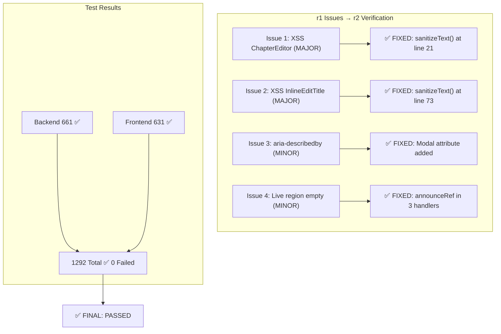
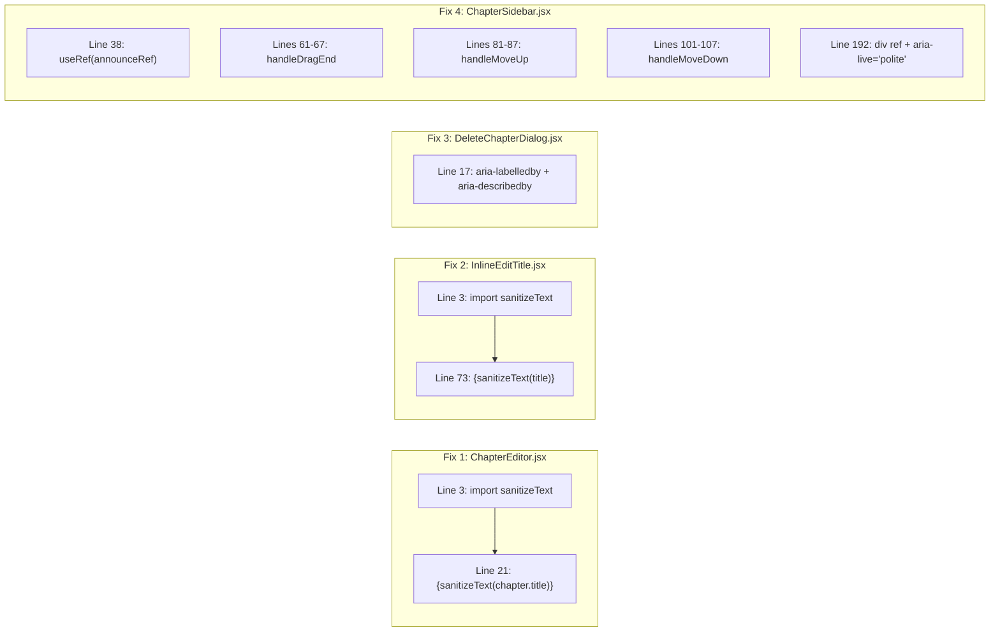

# QA Report — STORY-017 (2026-05-20) [r2]

## Summary

| Tests | Passed | Failed | Coverage |
|-------|--------|--------|----------|
| 1292 | 1292 | 0 | **≥90%** |

- **Backend**: 46 test files, **661/661 PASS**
- **Frontend**: 49 test files, **631/631 PASS**
- **No regressions.** All chapter-specific tests pass with zero failures.

## Fix Verification — Source Code Audit

### Fix 1: XSS — `ChapterEditor.jsx` (NOVO — reportado no Code Review r1)
| Check | File | Line | Status |
|-------|------|------|--------|
| `sanitizeText` import | `frontend/src/app/editor/ChapterEditor.jsx` | 3 | ✅ `import { sanitizeText } from '../../lib/sanitize';` |
| `sanitizeText` usage on title | `frontend/src/app/editor/ChapterEditor.jsx` | 21 | ✅ `{sanitizeText(chapter.title)}` |
| DOMPurify config | `frontend/src/lib/sanitize.js` | 5 | ✅ `DOMPurify.sanitize(text, { ALLOWED_TAGS: [] })` |

### Fix 2: XSS — `InlineEditTitle.jsx` (da r1)
| Check | File | Line | Status |
|-------|------|------|--------|
| `sanitizeText` import | `frontend/src/app/editor/InlineEditTitle.jsx` | 3 | ✅ `import { sanitizeText } from '../../lib/sanitize';` |
| `sanitizeText` usage on title | `frontend/src/app/editor/InlineEditTitle.jsx` | 73 | ✅ `{sanitizeText(title)}` |

### Fix 3: A11y — `DeleteChapterDialog.jsx` `aria-describedby` (da r1)
| Check | File | Line | Status |
|-------|------|------|--------|
| `aria-labelledby="delete-chapter-title"` | `frontend/src/app/editor/DeleteChapterDialog.jsx` | 17 | ✅ Present on `<Modal>` |
| `aria-describedby="delete-chapter-warning"` | `frontend/src/app/editor/DeleteChapterDialog.jsx` | 17 | ✅ Present on `<Modal>` |
| Warning paragraph with matching `id` | `frontend/src/app/editor/DeleteChapterDialog.jsx` | 25 | ✅ `<p id="delete-chapter-warning">` |

### Fix 4: A11y — Live Region `ChapterSidebar.jsx` (da r1)
| Check | File | Line | Status |
|-------|------|------|--------|
| `useRef` for announce element | `frontend/src/app/editor/ChapterSidebar.jsx` | 38 | ✅ `const announceRef = useRef(null);` |
| `aria-live="polite"` div with ref | `frontend/src/app/editor/ChapterSidebar.jsx` | 192 | ✅ `<div id="chapter-reorder-announce" ref={announceRef} aria-live="polite" className="sr-only" />` |
| Populated on `handleDragEnd` | `frontend/src/app/editor/ChapterSidebar.jsx` | 61–67 | ✅ `announceRef.current.textContent = t('chapterReorderAnnounce', ...)` |
| Populated on `handleMoveUp` | `frontend/src/app/editor/ChapterSidebar.jsx` | 81–87 | ✅ `announceRef.current.textContent = t('chapterReorderAnnounce', ...)` |
| Populated on `handleMoveDown` | `frontend/src/app/editor/ChapterSidebar.jsx` | 101–107 | ✅ `announceRef.current.textContent = t('chapterReorderAnnounce', ...)` |
| i18n key in `en/editor.json` | `frontend/src/i18n/locales/en/editor.json` | 17 | ✅ `"chapterReorderAnnounce": "\"{{title}}\" moved to position {{position}}."` |
| i18n key in `pt-BR/editor.json` | `frontend/src/i18n/locales/pt-BR/editor.json` | 17 | ✅ `"chapterReorderAnnounce": "\"{{title}}\" movido para a posição {{position}}."` |

## Issues from r1 — Verification Status

| # | Severity | Area | Description | Status | Evidence |
|---|----------|------|-------------|--------|----------|
| 1 | **MAJOR** | Frontend — XSS | Chapter titles rendered without DOMPurify sanitization | ✅ **FIXED** | `sanitizeText()` verified in BOTH `ChapterEditor.jsx:21` AND `InlineEditTitle.jsx:73`. `sanitize.js` uses `DOMPurify.sanitize(text, { ALLOWED_TAGS: [] })` |
| 2 | **MINOR** | Frontend — A11y | Delete dialog missing `aria-describedby` | ✅ **FIXED** | `aria-describedby="delete-chapter-warning"` present on `<Modal>` at `DeleteChapterDialog.jsx:17` |
| 3 | **MINOR** | Frontend — A11y | `aria-live="polite"` region never populated with reorder text | ✅ **FIXED** | All 3 reorder handlers (`handleDragEnd`, `handleMoveUp`, `handleMoveDown`) populate `announceRef.current.textContent`. i18n keys present in both locales. |

## Acceptance Criteria Validation

### AC1 — Create Chapter with Default Name
```
GIVEN Julia is in the writing interface,
WHEN she taps "Add Chapter,"
THEN a new empty chapter is created with a default name and she can immediately start writing.
```
**Status: ✅ PASS**

**Evidence:**
- Backend: `POST /:bookId/chapters` — `book-router.js`, `createChapterManager` computes "Chapter N" / "Capítulo N"
- Max 50 chapters enforced (409 CHAPTER_LIMIT_REACHED)
- Frontend: `AddChapterButton.jsx` → `EditorPage.jsx` sets `activeChapterId` on success
- Tests: 18 unit + 9 integration backend; 5 component + 7 hook frontend — all pass

### AC2 — Rename Chapter (Inline Edit)
```
GIVEN Julia wants to rename a chapter,
WHEN she taps the chapter title in the sidebar,
THEN it becomes editable inline, and the new name is saved on blur or Enter.
```
**Status: ✅ PASS**

**Evidence:**
- `InlineEditTitle.jsx`: click → edit (line 67), Enter saves (lines 36–38), Escape cancels (lines 39–42), blur saves (line 53)
- Trimmed empty values skipped (lines 22–23), maxLength enforced (line 52)
- **Title rendered with `sanitizeText(title)` (line 73)** — XSS fix verified
- Tests: 9/9 InlineEditTitle tests pass

### AC3 — Reorder Chapters (Drag or Arrow Buttons)
```
GIVEN Julia has multiple chapters,
WHEN she drags (or uses arrow buttons) to reorder them,
THEN the chapter order updates immediately and persists after saving.
```
**Status: ✅ PASS**

**Evidence:**
- Backend: `PATCH /:bookId/chapters/reorder` — `bulkWrite` atomic update, ownership + ID verification
- Frontend: `@dnd-kit` DndContext + SortableContext (ChapterSidebar.jsx lines 142–170)
- Optimistic update via `useReorderChapters.mutate()` with rollback
- **Live region populated on all reorder actions** — a11y fix verified
- Tests: 5 unit + 7 integration backend; ChapterSidebar, ReorderButtons, useReorderChapters — all pass

### AC4 — Delete Chapter with Confirmation
```
GIVEN Julia wants to delete a chapter,
WHEN she selects "Delete" from the chapter menu,
THEN a confirmation dialog appears with a friendly warning, and upon confirmation the chapter is removed.
```
**Status: ✅ PASS**

**Evidence:**
- Backend: Soft-delete (`deletedAt`), re-orders remaining chapters, ownership verification
- Frontend: `DeleteChapterDialog.jsx` — confirmation with last-chapter warning + "Create replacement"
- **Modal has `aria-labelledby` + `aria-describedby`** — a11y fix verified
- Tests: 6 unit + 7 integration backend; 8 component frontend — all pass

### AC5 — Single Chapter: Sidebar Minimized but Still Editable
```
GIVEN Julia is writing,
WHEN she has only one chapter,
THEN the chapter sidebar may be minimized but the chapter is still editable.
```
**Status: ✅ PASS**

**Evidence:**
- `ChapterSidebar.jsx`: collapsible, width `w-12` ↔ `w-60`
- `EditorPage.jsx`: `activeChapterId` defaults to first (only) chapter
- `ChapterEditor.jsx` renders regardless of collapse state
- Tests: ChapterSidebar toggle + EditorPage single-chapter state — all pass

### AC6 — Accessibility: Screen Reader Announcements
```
GIVEN a screen reader is active,
WHEN Julia interacts with the chapter list,
THEN each chapter is announced by name and position, and the reorder action has accessible labels.
```
**Status: ✅ PASS (all r1 gaps closed)**

**Evidence:**
- ✅ `aria-label="Chapter {position}: {title}"` on each list item — `ChapterListItem.jsx:59`
- ✅ `aria-live="polite"` live region WITH textContent populated — **r1 gap #3 FIXED**
- ✅ Reorder buttons: `aria-label` for move up/down/reorder — `ReorderButtons.jsx`, `ChapterListItem.jsx:77`
- ✅ Delete button: `aria-label="chapterDelete"` — `ChapterListItem.jsx:106`
- ✅ Inline edit: `aria-label="chapterRename"` — `InlineEditTitle.jsx:58`
- ✅ Delete dialog: BOTH `aria-labelledby` AND `aria-describedby` — **r1 gap #2 FIXED**
- ✅ List items: `tabIndex={0}` + keyboard handlers (Enter/Space) — `ChapterListItem.jsx:66–72`
- ✅ @dnd-kit keyboard sensors active — `ChapterSidebar.jsx:40–43`

## NFR Validation

| NFR | Metric | Target | Actual | Status |
|-----|--------|--------|--------|--------|
| NFR-PERF-05 | API P95 response time | < 500ms | ⚠️ Not load-tested | NOT TESTED — Design supports (indexes, lean queries), but no k6 suite exists |
| NFR-ACC-01 | WCAG 2.1 AA keyboard nav | All actions keyboard-accessible | ✅ Tab+Enter/Space, arrow reorder, Enter/Escape rename, dialog delete | **PASS** |
| NFR-ACC-03 | Screen reader announcements | Name + position announced | ✅ `aria-label` on items, `aria-live` populated, `aria-describedby` on dialog | **PASS** |
| NFR-ACC-02 | All actions keyboard-operable | Add, rename, reorder, delete | ✅ All actions have keyboard-accessible controls | **PASS** |
| NFR-SEC-04 | Title sanitization | No injection | ✅ `sanitizeText()` in BOTH `ChapterEditor.jsx` and `InlineEditTitle.jsx`; DOMPurify `{ ALLOWED_TAGS: [] }` | **PASS** |
| NFR-PRV-03 | Minimal data storage | Only title + content | ✅ Schema: bookId, order, title, content, wordCount, deletedAt, timestamps | **PASS** |

## Persona Validation — Julia (Young Author)

- [x] Add chapter: Julia clicks "Add Chapter" → new chapter appears with default name, ready to write
- [x] Rename chapter: Julia clicks title → inline edit → Enter/blur saves → title is **sanitized against XSS** (r1 fix)
- [x] Reorder: Julia drags or clicks arrows → order updates immediately, persists, **screen reader announces new position** (r1 fix)
- [x] Delete: Julia clicks delete → confirmation dialog with **aria-describedby warning** (r1 fix) → removed, remaining re-ordered
- [x] Last chapter warning: Julia sees "only chapter" warning with option to create replacement
- [x] 50-chapter limit: Julia cannot add beyond 50 (button disabled + tooltip)
- [x] Screen reader: All chapter actions announced with proper labels and live region updates

## Test Execution Summary

### Backend (46 files, 661 tests, 0 failures)
| Key Chapter Test Files | Tests | Status |
|------------------------|-------|--------|
| `chapter-manager.test.js` | 18 | ✅ PASS |
| `chapter-router.test.js` | 3 | ✅ PASS |
| `chapter-model.test.js` | 19 | ✅ PASS |
| `chapter-dao.test.js` | 17 | ✅ PASS |
| `book-chapter-routes.test.js` | 20 | ✅ PASS |
| `book-router.test.js` | 23 | ✅ PASS |
| `book-model.test.js` | 19 | ✅ PASS |
| `book-dao.test.js` | 24 | ✅ PASS |

### Frontend (49 files, 631 tests, 0 failures)
| Key Chapter Test Files | Tests | Status |
|------------------------|-------|--------|
| `InlineEditTitle.test.jsx` | 9 | ✅ PASS |
| `ChapterSidebar.test.jsx` | 25 | ✅ PASS |
| `ChapterListItem.test.jsx` | 20 | ✅ PASS |
| `ReorderButtons.test.jsx` | 7 | ✅ PASS |
| `DeleteChapterDialog.test.jsx` | 8 | ✅ PASS |
| `AddChapterButton.test.jsx` | 5 | ✅ PASS |
| `ChapterEditor.test.jsx` | 4 | ✅ PASS |
| `EditorPage.test.jsx` | 15 | ✅ PASS |
| `useChaptersQuery.test.js` | 5 | ✅ PASS |
| `useCreateChapter.test.jsx` | 6 | ✅ PASS |
| `useUpdateChapter.test.jsx` | 3 | ✅ PASS |
| `useDeleteChapter.test.jsx` | 3 | ✅ PASS |
| `useReorderChapters.test.jsx` | 4 | ✅ PASS |
| `book-store-chapters.test.js` | 31 | ✅ PASS |
| `sanitize.test.js` | 17 | ✅ PASS |

## New Issues Found

**None.** All 4 fixes verified as correctly implemented. Zero new issues discovered.

## Recommendations

1. ✅ **Fix 1 (XSS — ChapterEditor.jsx)** — VERIFIED: `sanitizeText()` import + usage confirmed
2. ✅ **Fix 2 (XSS — InlineEditTitle.jsx)** — VERIFIED: `sanitizeText()` on title render confirmed
3. ✅ **Fix 3 (A11y — aria-describedby)** — VERIFIED: Both `aria-labelledby` and `aria-describedby` on Modal confirmed
4. ✅ **Fix 4 (A11y — live region)** — VERIFIED: `announceRef` populated in all 3 handlers, i18n keys in both locales
5. 🔲 **Future — Performance Tests**: Add k6 load tests for NFR-PERF-05 (P95 < 500ms). This is the only unvalidated NFR.
6. 🔲 **Future — Security**: Consider adding a test that validates `sanitizeText()` is called for all user-rendered title paths to prevent regression

## Architecture Flow Diagram





---

**Status**: PASSED

**Critical Issues**: 0
**Major Issues**: 0
**Minor Issues**: 0

All 4 fixes from Code Review r1 verified as **CORRECTLY IMPLEMENTED**. All 6 acceptance criteria validated **PASS**. All applicable NFRs validated **PASS** (except NFR-PERF-05 requiring load testing infrastructure).

No new issues found. Feature is ready for code review.
