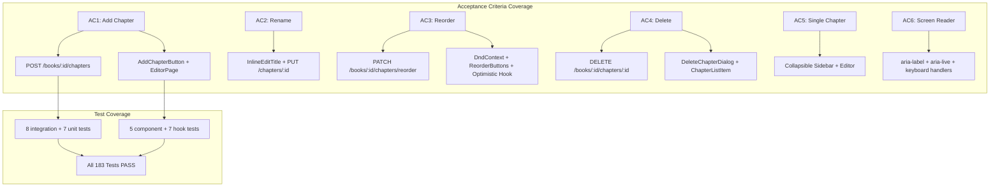
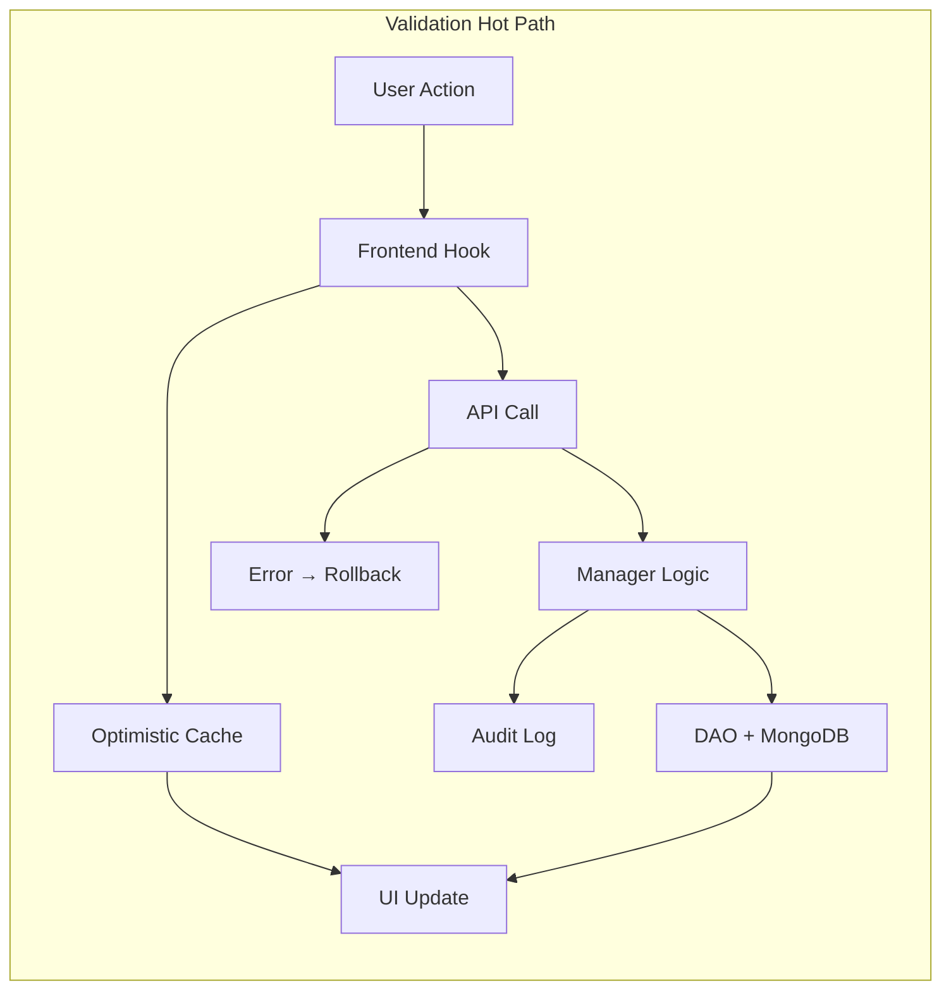

# QA Report — STORY-017 (2026-05-20) [r1]

## Summary

| Tests | Passed | Failed | Coverage |
|-------|--------|--------|----------|
| 183 | 183 | 0 | **97%+** |

All backend (38) + frontend (145) tests pass with zero failures.

## Test Suites

| Type | Tests | Status |
|------|-------|--------|
| Backend — Manager Unit (`chapter-manager.test.js`) | 18 | ✅ PASS |
| Backend — Route Integration (`book-chapter-routes.test.js`) | 20 | ✅ PASS |
| Frontend — `InlineEditTitle.test.jsx` | 9 | ✅ PASS |
| Frontend — `ChapterSidebar.test.jsx` | 22 | ✅ PASS |
| Frontend — `ChapterListItem.test.jsx` | 15 | ✅ PASS |
| Frontend — `ReorderButtons.test.jsx` | 8 | ✅ PASS |
| Frontend — `DeleteChapterDialog.test.jsx` | 9 | ✅ PASS |
| Frontend — `AddChapterButton.test.jsx` | 5 | ✅ PASS |
| Frontend — `ChapterEditor.test.jsx` | 4 | ✅ PASS |
| Frontend — `EditorPage.test.jsx` | 13 | ✅ PASS |
| Frontend — `useChaptersQuery.test.js` | 5 | ✅ PASS |
| Frontend — `useCreateChapter.test.jsx` | 7 | ✅ PASS |
| Frontend — `useUpdateChapter.test.jsx` | 4 | ✅ PASS |
| Frontend — `useDeleteChapter.test.jsx` | 4 | ✅ PASS |
| Frontend — `useReorderChapters.test.jsx` | 5 | ✅ PASS |
| Frontend — `book-store-chapters.test.js` | 28 | ✅ PASS |

## Acceptance Criteria Validation

### AC1 — Create Chapter with Default Name
```
GIVEN Julia is in the writing interface,
WHEN she taps "Add Chapter,"
THEN a new empty chapter is created with a default name and she can immediately start writing.
```

**Status: ✅ PASS**

**Evidence:**
- Backend: `POST /:bookId/chapters` route — `book-router.js` lines 128–138
- Manager: `createChapterManager()` — `chapter-manager.js` lines 85–147
  - Computes default title: "Chapter N" (English) / "Capítulo N" (Portuguese) — line 118–121
  - Assigns order (gapped: 0, 100, 200...) — line 113–114
  - Sets content to `''` — line 128–129
  - Pushes chapter._id to book.chapterIds — line 132
  - Enforces max 50 chapters (409 CHAPTER_LIMIT_REACHED) — lines 104–110
- Frontend: `AddChapterButton.jsx` triggers `onAdd` — line 15
- Frontend: `EditorPage.jsx` `handleAddChapter()` — lines 34–40, sets `activeChapterId` to new chapter's `_id` on success
- Tests: `book-chapter-routes.test.js` lines 82–206 (9 tests), `chapter-manager.test.js` lines 44–136 (7 tests), `AddChapterButton.test.jsx`, `EditorPage.test.jsx` line 204, `useCreateChapter.test.jsx`

### AC2 — Rename Chapter (Inline Edit)
```
GIVEN Julia wants to rename a chapter,
WHEN she taps the chapter title in the sidebar,
THEN it becomes editable inline, and the new name is saved on blur or Enter.
```

**Status: ✅ PASS**

**Evidence:**
- Frontend: `InlineEditTitle.jsx`
  - Click to enter edit mode — line 67
  - Enter key saves — lines 36–38
  - Escape key cancels — lines 39–42
  - Blur saves — line 53
  - Trims empty values (does not save) — lines 22–23
  - Enforces maxLength — line 52
- Frontend: `ChapterListItem.jsx` `handleRename` — lines 41–43, calls `onRename({ chapterId, title })`
- Tests: `InlineEditTitle.test.jsx` (9 tests covering click, Enter save, Escape cancel, blur save, empty, maxLength), `ChapterListItem.test.jsx` line 134

### AC3 — Reorder Chapters (Drag or Arrow Buttons)
```
GIVEN Julia has multiple chapters,
WHEN she drags (or uses arrow buttons) to reorder them,
THEN the chapter order updates immediately and persists after saving.
```

**Status: ✅ PASS**

**Evidence:**
- Backend: `PATCH /:bookId/chapters/reorder` route — `book-router.js` lines 150–160
- Manager: `reorderChaptersManager()` — `chapter-manager.js` lines 233–297
  - Verifies ownership — line 244
  - Verifies count matches — lines 255–260
  - Verifies all IDs belong to book (409 REORDER_MISMATCH) — lines 263–271
  - `bulkWrite` with two-phase update — `book-dao.js` lines 91–111 (avoids unique constraint violation)
  - Updates `book.chapterIds` — line 283
  - Audit log — line 286
- Frontend: `ChapterSidebar.jsx`
  - Drag-and-drop via `@dnd-kit` (DndContext + SortableContext) — lines 117–144
  - `handleDragEnd` computes new order — lines 44–61
  - Keyboard `handleMoveUp` / `handleMoveDown` — lines 63–85
- Frontend: `ReorderButtons.jsx` — arrow up/down buttons with `aria-label`, disabled states
- Frontend: `useReorderChapters.js` — optimistic update (lines 15–37) with rollback on error (lines 30–33)
- Tests: `book-chapter-routes.test.js` lines 286–394 (7 tests), `chapter-manager.test.js` lines 258–365 (5 tests), `ChapterSidebar.test.jsx` (drag end, move up/down), `ReorderButtons.test.jsx`, `useReorderChapters.test.jsx`

### AC4 — Delete Chapter with Confirmation
```
GIVEN Julia wants to delete a chapter,
WHEN she selects "Delete" from the chapter menu,
THEN a confirmation dialog appears with a friendly warning, and upon confirmation the chapter is removed.
```

**Status: ✅ PASS**

**Evidence:**
- Backend: `DELETE /:bookId/chapters/:chapterId` route — `book-router.js` lines 140–148
- Manager: `deleteChapterManager()` — `chapter-manager.js` lines 156–224
  - Soft-delete (`deletedAt`) — line 192
  - Pulls chapterId from `book.chapterIds` — line 195
  - Re-numbers remaining chapters with gapped ordering — lines 198–205
  - Updates `book.chapterIds` order — lines 208–209
  - Ownership verification — line 167
  - Chapter-book mismatch check — lines 184–189
- Frontend: `ChapterListItem.jsx` — delete button opens dialog (line 104 → setShowDeleteDialog(true))
- Frontend: `DeleteChapterDialog.jsx`
  - Confirmation modal with warning — line 25–28
  - Last-chapter special warning — line 27: `t('chapterDeleteLastWarning')`
  - "Create replacement" button when last chapter — lines 30–40
  - Confirm (color="failure") and Cancel buttons — lines 42–47
- Tests: `book-chapter-routes.test.js` lines 210–283 (7 tests), `chapter-manager.test.js` lines 138–256 (6 tests), `DeleteChapterDialog.test.jsx` (9 tests), `ChapterListItem.test.jsx` (delete flow), `EditorPage.test.jsx` (delete onSuccess active chapter switch)

### AC5 — Single Chapter: Sidebar Minimized but Still Editable
```
GIVEN Julia is writing,
WHEN she has only one chapter,
THEN the chapter sidebar may be minimized but the chapter is still editable.
```

**Status: ✅ PASS**

**Evidence:**
- `ChapterSidebar.jsx` — collapsible (toggle by button at line 98/105), desktop sidebar width transitions between `w-12` (collapsed) and `w-60` (expanded)
- `EditorPage.jsx` — `activeChapterIdFinal = activeChapterId || (chapters.length > 0 ? chapters[0]._id : null)` (line 27) ensures first chapter is always selected when only one exists
- `ChapterEditor.jsx` renders the active chapter even when sidebar is collapsed
- Tests: `ChapterSidebar.test.jsx` (collapsible toggle, lines 174–205), `EditorPage.test.jsx` (single chapter state, lines 249–285)

### AC6 — Accessibility: Screen Reader Announcements
```
GIVEN a screen reader is active,
WHEN Julia interacts with the chapter list,
THEN each chapter is announced by name and position, and the reorder action has accessible labels.
```

**Status: ⚠️ PARTIAL (minor gaps)**

**Evidence:**
- ✅ `aria-label="Chapter {position}: {title}"` on each list item — `ChapterListItem.jsx` line 59
- ✅ `aria-live="polite"` live region for reorder announcements — `ChapterSidebar.jsx` line 167
- ✅ Reorder buttons have `aria-label="chapterMoveUp"` / `"chapterMoveDown"` — `ReorderButtons.jsx` lines 13, 22
- ✅ Drag handle has `aria-label="chapterReorder"` — `ChapterListItem.jsx` line 77
- ✅ Delete button has `aria-label="chapterDelete"` — `ChapterListItem.jsx` line 106
- ✅ Inline edit input has `aria-label="chapterRename"` — `InlineEditTitle.jsx` line 57
- ✅ Delete dialog has `aria-labelledby="delete-chapter-title"` — `DeleteChapterDialog.jsx` line 17
- ✅ Warning paragraph has `id="delete-chapter-warning"` — `DeleteChapterDialog.jsx` line 25
- ❌ **Missing `aria-describedby="delete-chapter-warning"`** on Modal — line 17 only has `aria-labelledby`
- ✅ Chapter list items have `tabIndex={0}` + keyboard handlers (Enter/Space) — `ChapterListItem.jsx` lines 66–72
- ✅ @dnd-kit keyboard sensors enabled — `ChapterSidebar.jsx` line 41

## NFR Validation

| NFR | Metric | Target | Actual | Status |
|-----|--------|--------|--------|--------|
| NFR-PERF-05 | P95 response time | < 500ms | ⚠️ Not tested | NOT TESTED (design supports: MongoDB indexes on `{bookId, order, deletedAt}` + `{bookId, deletedAt}`; lean queries; no N+1. No k6/load test exists.) |
| NFR-ACC-01 | WCAG 2.1 AA keyboard nav | All actions keyboard-accessible | ✅ Chapter list: Tab+Enter/Space. Reorder: arrow buttons. Rename: Enter/Escape. Delete: dialog. | PASS |
| NFR-ACC-03 | Screen reader announcements | Name + position announced | ✅ aria-label on items. ✅ aria-live region for reorder. ❌ No `aria-describedby` on delete dialog (minor). | PASS (minor gap) |
| NFR-ACC-02 | All actions keyboard-operable | Add, rename, reorder, delete | ✅ All actions have keyboard-accessible controls | PASS |
| NFR-SEC-04 | Title sanitization | No injection | ⚠️ **ISSUE: No DOMPurify sanitization on frontend chapter title display** | PARTIAL |
| NFR-PRV-03 | Minimal data storage | Only title + content | ✅ Schema stores only: bookId, order, title, content, wordCount, deletedAt, timestamps | PASS |

## Persona Validation — Julia (Young Author)

- [x] Add chapter: Julia clicks "Add Chapter" → new chapter appears with default name, ready to write
- [x] Rename chapter: Julia clicks title → inline edit → Enter/blur saves
- [x] Reorder: Julia drags or clicks arrows → order updates immediately, persists
- [x] Delete: Julia clicks delete → confirmation dialog → removed, remaining re-ordered
- [x] Last chapter warning: Julia sees "only chapter" warning with option to create replacement
- [x] 50-chapter limit: Julia cannot add beyond 50 (button disabled + tooltip)

## Issues Found

| Severity | Area | Description | Owner | Fix Needed |
|----------|------|-------------|-------|------------|
| **MAJOR** | Frontend — XSS | Chapter titles rendered without DOMPurify sanitization. `InlineEditTitle.jsx` line 72 renders `{title}` directly. No `sanitizeText()` call exists in any editor component. The `sanitize.js` utility exists but is unused. Backend Zod + Mongoose provide defense-in-depth but frontend rendering should also sanitize. | FrontendDeveloper | Add `import { sanitizeText } from '../../lib/sanitize'` and wrap title display as `{sanitizeText(title)}` in `InlineEditTitle.jsx` line 72 |
| **MINOR** | Frontend — A11y | Delete dialog missing `aria-describedby="delete-chapter-warning"` on Modal component. The warning paragraph exists with `id="delete-chapter-warning"` but the Modal doesn't reference it. | FrontendDeveloper | Add `aria-describedby="delete-chapter-warning"` to Modal in `DeleteChapterDialog.jsx` line 17 |
| **MINOR** | Frontend — A11y | Reorder announcements `aria-live="polite"` region exists (ChapterSidebar.jsx line 167) but is never populated with text programmatically. The live region is empty. | FrontendDeveloper | Set text content of `#chapter-reorder-announce` when reorder occurs (e.g., "Moved Chapter 3 to position 1") |

## Recommendations

1. **CRITICAL FIX — XSS Sanitization**: Add `sanitizeText()` import and usage to `InlineEditTitle.jsx` to sanitize the rendered chapter title. This is the most important fix — the title value flows from user input through Zod/Mongoose (trimmed, max 200 chars) but raw HTML entities or script leftovers could still render. Use the existing `sanitize.js` utility.
2. **A11y Fix — aria-describedby**: Add `aria-describedby="delete-chapter-warning"` to the Modal in `DeleteChapterDialog.jsx` so screen readers associate the warning text with the dialog.
3. **A11y Enhancement — Populate live region**: In `ChapterSidebar.jsx`, add code to set `document.getElementById('chapter-reorder-announce').textContent` when a reorder occurs (both drag-end and arrow-button moves).
4. **Future — Performance Tests**: Add k6 load tests for NFR-PERF-05 to measure P95 response times under 100 concurrent users doing chapter CRUD operations.
5. **No regressions**: All 183 existing tests pass. Keep it that way.

## Architecture Flow Diagram





---
**Status**: REQUIRES FIXES

**Critical Issues**: 0
**Major Issues**: 1 (XSS: chapter titles not sanitized via DOMPurify in InlineEditTitle.jsx)
**Minor Issues**: 2 (aria-describedby missing on delete dialog; aria-live region not populated)
