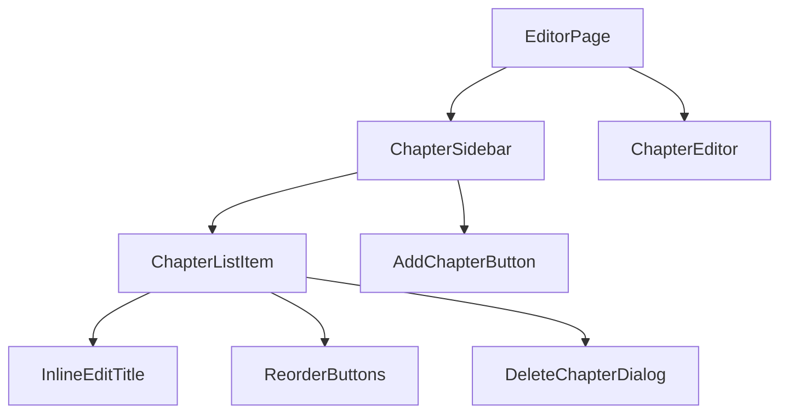
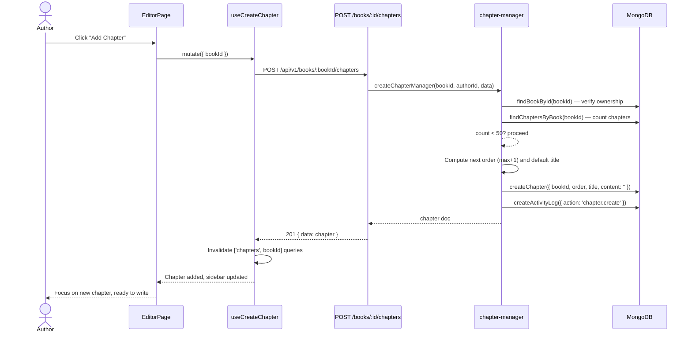
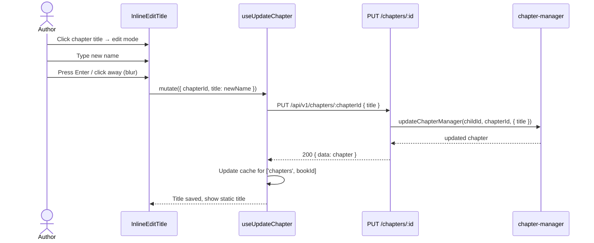
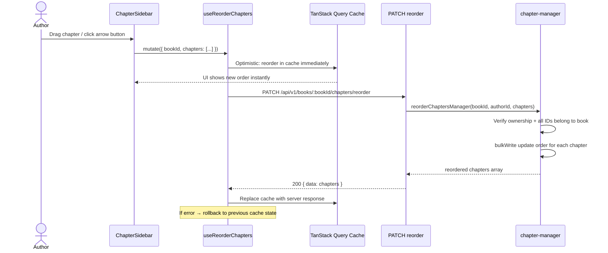
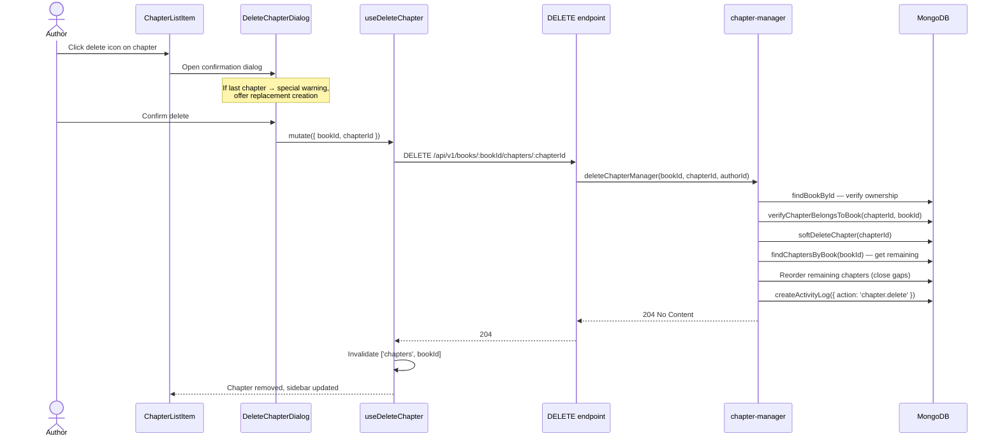
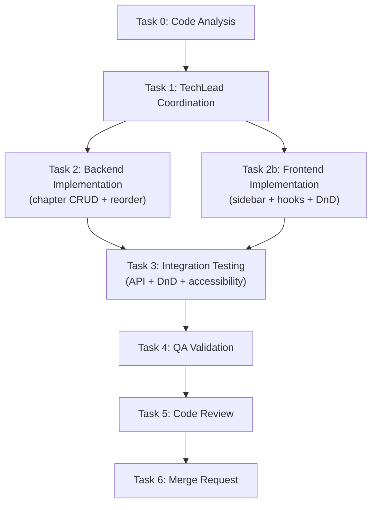
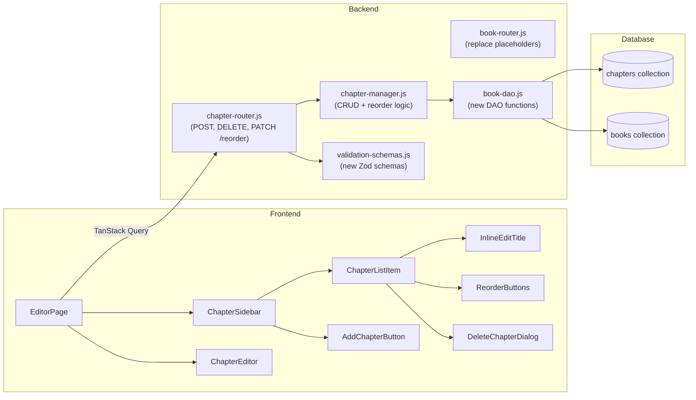

# STORY-017 Technical Analysis: Chapter-Based Writing & CRUD

**Epic**: EPIC-003
**Persona**: Julia — The Young Author
**Stack**: Node.js 22 / Express 4.x / MongoDB 7 / Mongoose 8 / Zod / Pino / Vitest (backend) + React 18 / Vite 5 / Tailwind 3 / Flowbite React / Zustand / TanStack Query / react-i18next / Framer Motion / TipTap (frontend)
**Language**: Node.js (ESM)
**Frontend**: React 18 + Vite (SPA mode — typed API client via axios, JWT manual handling)
**Frontend-Backend Integration**: Vite dev proxy → Express, JWT Bearer auth, Zod validation both sides, DOMPurify sanitization
**Depends on**: STORY-004 (data model + schemas), STORY-005 (API endpoints + validation), STORY-016 (Create a New Book)

---

## 1. Feature Scope & Boundaries

### In Scope

- **Chapter CRUD**: Create, rename, update content, delete chapters within a book
- **Chapter sidebar**: Collapsible panel (desktop) / drawer/bottom sheet (mobile) showing chapter list
- **Inline title editing**: Click-to-edit chapter names in sidebar, save on blur/Enter
- **Chapter reordering**: Drag-and-drop + keyboard arrow buttons, optimistic UI update, persistent reorder via API
- **Default chapter naming**: "Chapter 1", "Chapter 2", etc. (or i18n variant "Capítulo 1")
- **Delete with confirmation**: Friendly dialog; adjust order_index of remaining chapters; special handling for last chapter
- **Max 50 chapters per book** (soft limit with warning)
- **Accessibility**: WCAG 2.1 AA — keyboard-navigable chapter list, screen reader announces name + position, all actions keyboard-operable
- **XSS sanitization**: Chapter titles sanitized (Zod trim on backend, DOMPurify on frontend)
- **Audit logging**: Chapter CRUD actions logged via ActivityLog

### Out of Scope

- Rich text content editing (covered by TipTap integration in a future story)
- Real-time collaborative editing
- Chapter content diff / version history
- Book publishing flow
- Cover designer integration

---

## 2. Architectural Decisions

### 2.1 Backend vs Frontend Responsibilities

| Responsibility | Backend | Frontend |
|---|---|---|
| Chapter CRUD persistence | ✅ Mongoose + MongoDB | — |
| Default name generation ("Chapter N") | ✅ Manager computes next order + title | ✅ Fallback display if API returns slow |
| Order reassignment (reorder) | ✅ Transactional bulkWrite | ✅ Optimistic reorder in TanStack Query cache |
| 50-chapter soft limit enforcement | ✅ Manager checks count before create | ✅ UI disables "Add Chapter" button at 50 |
| Title sanitization | ✅ Zod `trim()` + maxlength 200 | ✅ DOMPurify on render |
| Ownership verification | ✅ Manager checks book.authorId === req.childId | — |
| Word count computation | ✅ Manager auto-computes from content | — (display only) |
| Delete last-chapter warning | — | ✅ Client-side UX pattern |

### 2.2 Drag-and-Drop Library Choice

**Decision: `@dnd-kit/core` + `@dnd-kit/sortable`**

Rationale:
- React-native DnD: modern, accessible, maintained, tree-shakeable
- Built-in keyboard support (satisfies WCAG requirements)
- Works with Framer Motion for smooth animations
- ~14KB gzipped — acceptable for PWA
- Alternative `react-beautiful-dnd` is deprecated (no React 18 support planned)

### 2.3 Sanitization Strategy

| Layer | Mechanism | Scope |
|---|---|---|
| API validation | Zod schema: `z.string().min(1).max(200).trim()` | Title input |
| Storage | Mongoose `trim: true, maxlength: 200` | Defense-in-depth |
| Render | DOMPurify on chapter title display | XSS prevention |
| Content | Future TipTap sanitization (not this story) | Rich text content |

### 2.4 Reorder Strategy

- **Client**: Optimistic reorder via TanStack Query cache invalidation
- **Server**: `PATCH /api/v1/books/:bookId/chapters/reorder` accepts `{ chapters: [{ id, order }] }` array
- **Database**: Mongoose `bulkWrite` with `updateOne` operations in a loop — atomic enough for single-document updates
- **Error recovery**: On API failure, TanStack Query rolls back to previous cache state

### 2.5 Chapter Model Field: `order` vs `order_index`

The existing Mongoose schema uses `order` (not `order_index` as the story spec states). **Decision: keep `order` in Mongoose** for consistency with existing schema. The API will use `order` in responses. The story spec's `order_index` is treated as a naming alias.

---

## 3. REST API Design

### 3.1 POST /api/v1/books/:bookId/chapters — Create Chapter

| Property | Value |
|---|---|
| **Method** | `POST` |
| **Path** | `/api/v1/books/:bookId/chapters` |
| **Auth** | Bearer JWT (authMiddleware) |
| **Params** | `bookId` (ObjectId, validated) |

**Request Body** (optional — defaults applied):
```json
{
  "title": "Chapter 3",       // optional, default computed
  "content": ""              // optional, default ""
}
```

**Response 201**:
```json
{
  "data": {
    "_id": "ObjectId",
    "bookId": "ObjectId",
    "order": 3,
    "title": "Chapter 3",
    "content": "",
    "wordCount": 0,
    "createdAt": "ISO8601",
    "updatedAt": "ISO8601"
  },
  "meta": { "requestId": "uuid" }
}
```

**Error Responses**:
- `400` — VALIDATION_ERROR (invalid bookId, title too long)
- `403` — FORBIDDEN (not the book owner)
- `404` — NOT_FOUND (book doesn't exist)
- `409` — CHAPTER_LIMIT_REACHED (50 chapters already)
- `429` — RATE_LIMITED

**Implementation Notes**:
- Replace existing **placeholder** endpoint in `book-router.js` (lines 125-130)
- Manager: compute next `order` (`max(order) + 1` or `0` if first), compute default title if not provided
- Manager: verify book ownership (authorId === req.childId)
- Manager: check chapter count < 50 before creating
- Audit log: `chapter.create`

### 3.2 PUT /api/v1/chapters/:chapterId — Update Chapter (Already Exists)

Already implemented in `chapter-router.js`. **No changes needed** for basic title/content update. This endpoint will be extended in a future story for rich text content.

### 3.3 DELETE /api/v1/books/:bookId/chapters/:chapterId — Delete Chapter

| Property | Value |
|---|---|
| **Method** | `DELETE` |
| **Path** | `/api/v1/books/:bookId/chapters/:chapterId` |
| **Auth** | Bearer JWT |
| **Params** | `bookId`, `chapterId` (ObjectIds, validated) |

**Response 204**: No content

**Error Responses**:
- `400` — VALIDATION_ERROR
- `403` — FORBIDDEN (not the book owner)
- `404` — NOT_FOUND (chapter or book doesn't exist)

**Implementation Notes**:
- Soft-delete: sets `deletedAt` on the chapter
- Manager: verify ownership, then reorder remaining chapters to close gaps
- Replace existing **placeholder** in `book-router.js` (lines 140-146)
- Audit log: `chapter.delete`

### 3.4 PATCH /api/v1/books/:bookId/chapters/reorder — Reorder Chapters

| Property | Value |
|---|---|
| **Method** | `PATCH` |
| **Path** | `/api/v1/books/:bookId/chapters/reorder` |
| **Auth** | Bearer JWT |
| **Params** | `bookId` (ObjectId, validated) |

**Request Body**:
```json
{
  "chapters": [
    { "id": "ObjectId1", "order": 0 },
    { "id": "ObjectId2", "order": 1 },
    { "id": "ObjectId3", "order": 2 }
  ]
}
```

**Response 200**:
```json
{
  "data": [
    { "_id": "ObjectId1", "order": 0, "title": "Chapter 1", ... },
    { "_id": "ObjectId2", "order": 1, "title": "Chapter 2", ... },
    { "_id": "ObjectId3", "order": 2, "title": "Chapter 3", ... }
  ],
  "meta": { "requestId": "uuid" }
}
```

**Validation Schema** (Zod):
```javascript
export const chapterReorderSchema = z.object({
  chapters: z.array(
    z.object({
      id: z.string().regex(objectIdRegex, 'Invalid chapter ID format'),
      order: z.number().int().min(0),
    })
  ).min(1).max(50),
});
```

**Error Responses**:
- `400` — VALIDATION_ERROR (invalid structure, duplicate IDs, mismatched count)
- `403` — FORBIDDEN (not the book owner)
- `404` — NOT_FOUND (book doesn't exist)
- `409` — REORDER_MISMATCH (chapter IDs don't match book's chapters)

**Implementation Notes**:
- Manager: verify ownership, verify all chapter IDs belong to the book and count matches
- Use Mongoose `bulkWrite` with `updateOne` operations for each chapter's `order` field
- Update the `book.chapterIds` array order to match
- Audit log: `chapter.reorder`

### 3.5 GET /api/v1/books/:bookId/chapters — List Chapters (Already Exists)

Already implemented in `book-router.js` (line 112-121). Returns chapters sorted by `order` ascending.

---

## 4. Database Schema

### 4.1 Existing Chapter Schema (No Migration Needed)

The `chapters` collection schema already exists in `book-model.js`:

```javascript
const chapterSchema = new Schema(
  {
    bookId: {
      type: Schema.Types.ObjectId,
      ref: 'Book',
      required: [true, 'Book ID is required'],
      index: true,
    },
    order: {
      type: Number,
      required: [true, 'Chapter order is required'],
      min: 0,
    },
    title: {
      type: String,
      required: [true, 'Chapter title is required'],
      trim: true,
      maxlength: 200,
    },
    content: {
      type: String,
      default: '',
    },
    wordCount: {
      type: Number,
      default: 0,
      min: 0,
    },
    deletedAt: {
      type: Date,
      default: null,
    },
  },
  {
    timestamps: true,
    collection: 'chapters',
  }
);
```

### 4.2 Indexes (Already Exist)

```javascript
// Unique compound index: no two active chapters share same bookId+order
chapterSchema.index(
  { bookId: 1, order: 1, deletedAt: 1 },
  { unique: true, partialFilterExpression: { deletedAt: null } }
);
// Compound index for listing chapters by book
chapterSchema.index(
  { bookId: 1, deletedAt: 1 },
  { partialFilterExpression: { deletedAt: null } }
);
```

### 4.3 Schema Assessment

| Story Requirement | Schema Support | Gap? |
|---|---|---|
| `id` | `_id` (auto ObjectId) | ✅ |
| `book_id` | `bookId` (ObjectId, ref: 'Book', indexed) | ✅ |
| `title` | `String, required, trim, maxlength: 200` | ✅ |
| `content` (rich text) | `String, default: ''` | ✅ (content stored as HTML string) |
| `order_index` | `order` (Number, required, min: 0) | ✅ (named `order` not `order_index`) |
| `created_at` | `timestamps: true` → `createdAt` | ✅ |
| `updated_at` | `timestamps: true` → `updatedAt` | ✅ |
| Soft delete | `deletedAt` with partial filter indexes | ✅ |
| Word count | `wordCount` (auto-computed on content update) | ✅ |
| Max 50 chapters | Not in schema — enforced in manager | ✅ (soft limit) |

**No schema migration required.** The `chapters` collection already supports all needed fields.

### 4.4 Book Schema — `chapterIds` Field

The `books` collection has a `chapterIds: [Schema.Types.ObjectId]` array. This must be kept in sync with chapters for efficient reads (e.g., "which chapters does this book have?"). The reorder endpoint must also update the order of IDs in this array.

---

## 5. Frontend Components

### 5.1 Component Tree



### 5.2 Component Specifications

| Component | Responsibility | Key Props | Key State |
|---|---|---|---|
| `ChapterSidebar` | Collapsible chapter list panel; responsive (sidebar desktop, drawer mobile) | `bookId`, `chapters`, `activeChapterId`, `onSelectChapter` | `isCollapsed` |
| `ChapterListItem` | Single chapter entry in sidebar; displays title, selected state, hover actions | `chapter`, `isActive`, `onSelect`, `onRename`, `onDelete`, `onReorder` | — |
| `InlineEditTitle` | Click-to-edit chapter name; saves on blur/Enter; escapes on Escape | `title`, `onSave`, `maxWidth` | `isEditing`, `editValue` |
| `DeleteChapterDialog` | Confirmation modal with friendly warning; prevents last-chapter deletion or offers replacement | `isOpen`, `chapterTitle`, `isLastChapter`, `onConfirm`, `onCancel` | — |
| `ChapterEditor` | Main editing area; shows active chapter content (placeholder for TipTap) | `chapter`, `onContentChange` | — |
| `ReorderButtons` | Up/Down arrow buttons for keyboard-driven reorder | `chapter`, `onMoveUp`, `onMoveDown`, `canMoveUp`, `canMoveDown` | — |
| `AddChapterButton` | "Add Chapter" button at bottom of sidebar; disables at 50 chapters | `chaptersCount`, `maxChapters`, `onAdd` | `isCreating` |

### 5.3 Custom Hooks

| Hook | Responsibility | TanStack Query Keys |
|---|---|---|
| `useChapters(bookId)` | Fetch chapters list, CRUD operations, reorder | `['chapters', bookId]` |
| `useCreateChapter(bookId)` | Create new chapter with optimistic update | Mutation invalidating `['chapters', bookId]` |
| `useUpdateChapter()` | Update chapter title/content | Mutation invalidating `['chapters', bookId]` |
| `useDeleteChapter(bookId)` | Delete chapter with optimistic update + reorder | Mutation invalidating `['chapters', bookId]` |
| `useReorderChapters(bookId)` | Reorder chapters with optimistic update | Mutation invalidating `['chapters', bookId]` |

### 5.4 Zustand Store Updates

Extend `useBookStore` with:
- `setChapters(chapters)` — already exists
- `addChapter(chapter)` — append to `chapters` array
- `removeChapter(chapterId)` — remove from `chapters` array
- `updateChapter(chapterId, updates)` — merge updates
- `reorderChapters(reorderedList)` — replace `chapters` array with new order

### 5.5 Responsive Behavior

| Breakpoint | Sidebar Mode | Behavior |
|---|---|---|
| `sm`–`md` (mobile) | Bottom drawer (Framer Motion slide-up) | Full-width, 40vh max-height, overlay backdrop |
| `lg`+ (desktop) | Left sidebar (240px fixed) | Collapsible to icon-only (48px), expand on hover/click |

---

## 6. Data Flows & Event Flows

### 6.1 Add Chapter Flow



### 6.2 Rename Chapter (Inline Edit) Flow



### 6.3 Reorder Chapter Flow (Optimistic)



### 6.4 Delete Chapter Flow



---

## 7. Backend Implementation Plan

### 7.1 Files to Create/Modify

| File | Action | Description |
|---|---|---|
| `backend/src/app/editor/chapter-router.js` | **Modify** | Replace placeholder endpoints; add reorder route |
| `backend/src/app/editor/chapter-manager.js` | **Modify** | Add createChapterManager, deleteChapterManager, reorderChaptersManager |
| `backend/src/app/book/book-dao.js` | **Modify** | Add countChaptersByBook, reorderChapters DAO functions |
| `backend/src/app/book/book-router.js` | **Modify** | Replace placeholder chapter create/delete/reorder endpoints |
| `backend/src/app/common/validation-schemas.js` | **Modify** | Add chapterCreateBodySchema, chapterReorderSchema, chapterDeleteParamsSchema |
| `backend/src/app/editor/__tests__/chapter-manager.test.js` | **Create** | Manager-level unit tests |
| `backend/src/app/editor/__tests__/chapter-router.test.js` | **Modify** | Integration tests for new endpoints |

### 7.2 Manager Functions to Implement

#### `createChapterManager(authorId, bookId, data)`

```
1. Find book by ID → 404 if not found
2. Verify book.authorId === authorId → 403 if not owner
3. Count active chapters for book → 409 CHAPTER_LIMIT_REACHED if ≥ 50
4. Find max order among existing chapters
5. Compute default title: "Chapter {count+1}" (i18n: "Capítulo {count+1}" if book.language starts with 'pt')
6. Create chapter with { bookId, order: maxOrder+1, title: data.title || defaultTitle, content: data.content || '' }
7. Push chapter._id to book.chapterIds array
8. Audit log: chapter.create
9. Return chapter document
```

#### `deleteChapterManager(authorId, bookId, chapterId)`

```
1. Find book by ID → 404 if not found
2. Verify book.authorId === authorId → 403 if not owner
3. Find chapter by ID → 404 if not found
4. Verify chapter.bookId === bookId → 400 if mismatch
5. Soft-delete chapter (set deletedAt)
6. Pull chapterId from book.chapterIds
7. Get remaining active chapters sorted by order
8. Re-number remaining chapters: order = index * 10 (gap strategy for future inserts)
9. Audit log: chapter.delete
10. Return { deleted: true }
```

#### `reorderChaptersManager(authorId, bookId, chapters)`

```
1. Find book by ID → 404 if not found
2. Verify book.authorId === authorId → 403 if not owner
3. Get all active chapters for book
4. Verify chapters array count matches active chapters count
5. Verify all chapter IDs in request belong to book
6. bulkWrite: updateOne for each { filter: {_id}, update: {$set: {order}} }
7. Update book.chapterIds array order to match new order
8. Audit log: chapter.reorder
9. Return reordered chapters list
```

### 7.3 Order Index Strategy

Use **gapped ordering** (order values: 0, 100, 200, ...) instead of sequential (0, 1, 2, ...). Benefits:
- Inserting between chapters doesn't require reordering siblings (just assign order = avg of neighbors)
- Reduces reorder operations on insert
- Reorder endpoint normalizes to gapped values after each reorder operation

### 7.4 Validation Schemas to Add

```javascript
// chapterCreateBodySchema
export const chapterCreateBodySchema = z.object({
  title: z.string().min(1).max(200).trim().optional(),
  content: z.string().optional().default(''),
});

// chapterDeleteParamsSchema
export const chapterDeleteParamsSchema = z.object({
  bookId: z.string().regex(objectIdRegex, 'Invalid book ID format'),
  chapterId: z.string().regex(objectIdRegex, 'Invalid chapter ID format'),
});

// chapterReorderSchema
export const chapterReorderSchema = z.object({
  chapters: z.array(
    z.object({
      id: z.string().regex(objectIdRegex, 'Invalid chapter ID format'),
      order: z.number().int().min(0),
    })
  ).min(1).max(50),
});

// bookChaptersParamsSchema — already exists, reuse for create endpoint params
```

---

## 8. Frontend Implementation Plan

### 8.1 Files to Create/Modify

| File | Action | Description |
|---|---|---|
| `frontend/src/hooks/useChaptersQuery.js` | **Create** | TanStack Query hook for fetching chapters |
| `frontend/src/hooks/useCreateChapter.js` | **Create** | Mutation hook for creating a chapter |
| `frontend/src/hooks/useUpdateChapter.js` | **Create** | Mutation hook for updating a chapter |
| `frontend/src/hooks/useDeleteChapter.js` | **Create** | Mutation hook for deleting a chapter |
| `frontend/src/hooks/useReorderChapters.js` | **Create** | Mutation hook for reordering chapters (optimistic) |
| `frontend/src/app/editor/EditorPage.jsx` | **Modify** | Integrate ChapterSidebar + ChapterEditor layout |
| `frontend/src/app/editor/ChapterSidebar.jsx` | **Create** | Collapsible sidebar with chapter list |
| `frontend/src/app/editor/ChapterListItem.jsx` | **Create** | Single chapter entry with inline edit + actions |
| `frontend/src/app/editor/InlineEditTitle.jsx` | **Create** | Click-to-edit title component |
| `frontend/src/app/editor/DeleteChapterDialog.jsx` | **Create** | Confirmation dialog for chapter deletion |
| `frontend/src/app/editor/ChapterEditor.jsx` | **Create** | Chapter content editing area (TipTap placeholder) |
| `frontend/src/app/editor/ReorderButtons.jsx` | **Create** | Up/down arrow buttons for keyboard reorder |
| `frontend/src/app/editor/AddChapterButton.jsx` | **Create** | "Add Chapter" button with count/limit |
| `frontend/src/stores/book-store.js` | **Modify** | Add chapter mutation actions |
| `frontend/src/i18n/locales/pt/editor.json` | **Modify** | Add chapter-related translations |
| `frontend/src/i18n/locales/en/editor.json` | **Modify** | Add chapter-related translations |

### 8.2 Key Implementation Details

#### Optimistic Update Pattern (useReorderChapters)

```javascript
const useReorderChapters = (bookId) => {
  const queryClient = useQueryClient();

  return useMutation({
    mutationFn: (chapters) =>
      apiClient.patch(`/v1/books/${bookId}/chapters/reorder`, { chapters }),
    onMutate: async (newChapters) => {
      await queryClient.cancelQueries(['chapters', bookId]);
      const previous = queryClient.getQueryData(['chapters', bookId]);
      queryClient.setQueryData(['chapters', bookId], (old) => {
        // Apply optimistic reorder
        return newChapters.map(nc => {
          const oldChapter = old?.data?.find(c => c._id === nc.id);
          return { ...oldChapter, order: nc.order };
        }).sort((a, b) => a.order - b.order);
      });
      return { previous };
    },
    onError: (_err, _vars, context) => {
      // Rollback
      queryClient.setQueryData(['chapters', bookId], context.previous);
    },
    onSettled: () => {
      queryClient.invalidateQueries(['chapters', bookId]);
    },
  });
};
```

#### Drag-and-Drop with @dnd-kit

```mermaid
graph LR
    DND[@dnd-kit/core] -->|onDragEnd| Handler[Reorder Handler]
    Handler -->|compute new order| Opt[Optistic Cache Update]
    Opt -->|API call| EP[PATCH /reorder]
    EP -->|on success| Cache[Invalidate & Sync]
    EP -->|on error| Rollback[Rollback to Previous]
```

- Use `SortableContext` with `verticalListSortingStrategy`
- Each `ChapterListItem` wrapped in `useSortable` hook
- On `onDragEnd` → compute new order array → `useReorderChapters.mutate()`
- Keyboard reorder: `ReorderButtons` component with aria-labels

#### Accessibility Requirements

| Requirement | Implementation |
|---|---|
| Keyboard navigation | Tab through chapter list items; Arrow keys reorder with buttons |
| Screen reader names | `aria-label="Chapter {position}: {title}"` on list items |
| Reorder announcements | `aria-live="polite"` region announces reorder actions |
| Drag-and-drop accessible | `@dnd-kit` keyboard sensors enabled by default |
| Delete confirmation | Focus trap in dialog; `aria-describedby` for warning text |
| Inline edit | Enter to save, Escape to cancel; announce "editing chapter name" |

---

## 9. Test Plan

### 9.1 Backend Unit/Integration Tests

| Test | Type | Description |
|---|---|---|
| `createChapterManager` — happy path | Unit | Create chapter with computed title and order |
| `createChapterManager` — custom title | Unit | Create chapter with provided title |
| `createChapterManager` — max 50 limit | Unit | Reject when 50 chapters already exist |
| `createChapterManager` — not owner | Unit | 403 when authorId doesn't match book owner |
| `createChapterManager` — book not found | Unit | 404 when book doesn't exist |
| `createChapterManager` — first chapter | Unit | Order 0, title "Chapter 1" |
| `createChapterManager` — subsequent chapters | Unit | Order increments, title increments |
| `deleteChapterManager` — happy path | Unit | Soft-delete chapter, re-order remaining |
| `deleteChapterManager` — not owner | Unit | 403 when authorId doesn't match |
| `deleteChapterManager` — not found | Unit | 404 when chapter doesn't exist |
| `deleteChapterManager` — reorder after delete | Unit | Verify remaining chapters have sequential orders |
| `reorderChaptersManager` — happy path | Unit | Reorder and verify new positions |
| `reorderChaptersManager` — mismatched IDs | Unit | 409 when chapter IDs don't match book |
| `reorderChaptersManager` — not owner | Unit | 403 when authorId doesn't match |
| `POST /books/:id/chapters` — 201 | Integration | Create chapter via API |
| `POST /books/:id/chapters` — 403 | Integration | Not owner creates chapter |
| `POST /books/:id/chapters` — 409 | Integration | Chapter limit reached |
| `DELETE /books/:id/chapters/:cid` — 204 | Integration | Delete chapter via API |
| `DELETE /books/:id/chapters/:cid` — 403 | Integration | Not owner deletes |
| `PATCH /books/:id/chapters/reorder` — 200 | Integration | Reorder chapters via API |
| `PATCH /books/:id/chapters/reorder` — 400 | Integration | Invalid body (missing IDs, wrong count) |
| XSS in title | Integration | Script tags in title are trimmed/sanitized |

### 9.2 Frontend Unit/Integration Tests

| Test | Type | Description |
|---|---|---|
| `InlineEditTitle` — click to edit | Unit | Clicking title enters edit mode |
| `InlineEditTitle` — save on Enter | Unit | Enter key saves the new title |
| `InlineEditTitle` — cancel on Escape | Unit | Escape key reverts to original title |
| `InlineEditTitle` — save on blur | Unit | Blur event saves the new title |
| `ChapterSidebar` — render chapters | Unit | Displays list of chapters in order |
| `ChapterSidebar` — collapsible | Unit | Collapse/expand toggle works |
| `DeleteChapterDialog` — confirm | Unit | Confirm button triggers delete mutation |
| `DeleteChapterDialog` — cancel | Unit | Cancel button closes dialog |
| `DeleteChapterDialog` — last chapter warning | Unit | Special message when deleting last chapter |
| `useChapters` — fetch chapters | Hook | Returns chapters sorted by order |
| `useCreateChapter` — optimistic | Hook | Chapter appears immediately |
| `useReorderChapters` — optimistic reorder | Hook | UI updates before API responds |
| `useReorderChapters` — rollback on error | Hook | UI reverts on API failure |

### 9.3 E2E Tests

| Test | Description |
|---|---|
| Add chapter flow | Login → open book → click "Add Chapter" → verify new chapter in sidebar |
| Rename chapter flow | Click title → type new name → Enter → verify title updated |
| Reorder by drag | Drag chapter 3 to position 1 → verify order persisted after page reload |
| Reorder by keyboard | Tab to chapter → click up arrow → verify order updated |
| Delete chapter flow | Click delete → confirm → verify chapter removed, remaining re-ordered |
| Delete last chapter warning | Delete last chapter → verify warning appears, option to create replacement |
| 50 chapter limit | Create 50 chapters → verify "Add Chapter" disabled |
| XSS in title | Enter `<script>alert(1)</script>` as title → verify sanitized |
| Screen reader navigation | Verify aria-labels, live regions, focus management |
| Mobile drawer | Verify sidebar as bottom sheet on small viewport |

---

## 10. Dependencies & Risks

### 10.1 Dependencies

| Dependency | Status | Impact |
|---|---|---|
| STORY-016 (Create a New Book) | ✅ Complete | POST /api/v1/books endpoint exists |
| STORY-004 (Data Model) | ✅ Complete | Chapter schema exists in Mongoose |
| STORY-005 (API Endpoints) | ✅ Partial | GET/PUT chapter endpoints exist; POST/DELETE/REORDER are placeholders |
| `@dnd-kit/core` + `@dnd-kit/sortable` | ⚠️ Not installed | Must add to frontend dependencies |
| TipTap integration | 🔲 Future story | Chapter editor content area will be placeholder in this story |

### 10.2 Risks & Mitigations

| Risk | Likelihood | Impact | Mitigation |
|---|---|---|---|
| Concurrent reorder race condition | Medium | Data inconsistency | Use `bulkWrite` atomically; client-side optimistic lock with version check |
| Drag-and-Drop accessibility gaps | Low | WCAG non-compliance | Use `@dnd-kit` keyboard sensors; add `aria-live` announcements; manual QA with screen reader |
| 50-chapter limit edge cases | Low | UX confusion | Frontend disables button + tooltip; backend enforces hard limit |
| Last chapter deletion UX | Medium | Author locked out | Modal offers "Create new chapter"; backend allows deleting (book can have 0 chapters temporarily) |
| Gap strategy order collision | Very Low | Unique constraint violation | Gapped ordering (0, 100, 200) makes collision extremely unlikely; reorder normalizes gaps |

### 10.3 Complexity Estimate

| Component | Complexity | Rationale |
|---|---|---|
| Backend: Create chapter | Low | Straightforward CRUD + count check |
| Backend: Delete chapter + reorder | Medium | Must close gaps in order, update book.chapterIds |
| Backend: Reorder endpoint | Medium | bulkWrite + ownership + ID verification |
| Frontend: Chapter sidebar | Medium | Responsive, collapsible, accessible |
| Frontend: Drag-and-drop reorder | Medium-High | @dnd-kit integration + optimistic updates + keyboard |
| Frontend: Inline edit | Low | Standard pattern |
| Frontend: Delete confirmation | Low | Dialog + last-chapter edge case |
| Overall | **Medium** (5 story points) | Well-bounded, schema exists, placeholder endpoints ready |

---

## 11. Execution Plan — Mermaid Diagrams

### 11.1 Task Dependency Flow



### 11.2 Impacted Components Architecture



---

## 12. SubAgent Assignments

| Task | Description | Agent | Language |
|---|---|---|---|
| 0 | Code analysis (impacted files, patterns) | CodeAnalyzer | Node.js |
| 0b | UX design (sidebar, inline edit, DnD a11y) | UXDesigner | — |
| 1 | Coordination (plan, sequence, delegate) | TechLead | — |
| 2 | Backend implementation (CRUD + reorder endpoints, manager, DAO, validation) | BackendDeveloper | Node.js |
| 3 | Frontend implementation (sidebar, hooks, inline edit, DnD, accessibility) | FrontendDeveloperReact | React |
| 4 | Test suites (unit, integration, e2e) | TestEngineer | Node.js + React |
| 5 | QA validation (acceptance criteria verification) | QAAnalyst | — |
| 6 | Code review (security, performance, a11y) | CodeReviewer | Node.js + React |
| 7 | Merge request creation | MergeRequestCreator | — |

### Parallelization

- **Tasks 2 and 3** can run in **parallel** (backend and frontend are independent — API contracts are defined above)
- Task 4 must wait for Tasks 2 and 3
- Tasks 5, 6, 7 are sequential after Task 4

---

## 13. NFR Analysis

| NFR | Requirement | Implementation | Verification |
|---|---|---|---|
| NFR-PERF-05 | API P95 < 500ms | MongoDB indexes on `{bookId, order, deletedAt}` + `{bookId, deletedAt}`; lean queries; no N+1 | k6 load test: 100 concurrent users, CRUD operations P95 < 500ms |
| NFR-ACC-01 | WCAG 2.1 AA keyboard nav | Tab navigation through chapter list; arrow keys for reorder; Enter/Space for actions | axe-core audit + manual keyboard test |
| NFR-ACC-03 | Screen reader announcements | `aria-label` on chapter items with name + position; `aria-live="polite"` for reorder events | NVDA/VoiceOver testing |
| NFR-ACC-02 | Keyboard-operable actions | All actions (add, rename, reorder, delete) accessible via keyboard | Manual keyboard-only test |
| NFR-SEC-04 | Title sanitization | Zod `trim()` + `maxlength` on backend; DOMPurify on frontend; Mongoose `trim: true` | XSS injection tests in integration suite |
| NFR-PRV-03 | Minimal data storage | Only `title` and `content` stored; no tracking metadata beyond timestamps | Schema audit |

---

## 14. Definition of Done Checklist

- [ ] **Backend**: POST /api/v1/books/:bookId/chapters creates chapter with default name, returns 201
- [ ] **Backend**: DELETE /api/v1/books/:bookId/chapters/:chapterId soft-deletes chapter, reorders remaining
- [ ] **Backend**: PATCH /api/v1/books/:bookId/chapters/reorder updates order for all chapters atomically
- [ ] **Backend**: GET /api/v1/books/:bookId/chapters returns ordered list (already exists, verify)
- [ ] **Backend**: PUT /api/v1/chapters/:chapterId updates title/content (already exists, verify)
- [ ] **Backend**: 50-chapter limit enforced in createChapterManager
- [ ] **Backend**: Ownership verification on all chapter mutations
- [ ] **Backend**: Audit logs for create, update, delete, reorder actions
- [ ] **Backend**: Zod validation schemas for all new endpoints
- [ ] **Backend**: All integration tests passing
- [ ] **Frontend**: ChapterSidebar renders chapter list sorted by order
- [ ] **Frontend**: "Add Chapter" button creates chapter with default name
- [ ] **Frontend**: InlineEditTitle allows rename with blur/Enter save and Escape cancel
- [ ] **Frontend**: Drag-and-drop reorder works with optimistic update
- [ ] **Frontend**: Keyboard reorder buttons (up/down arrows) work
- [ ] **Frontend**: Delete confirmation dialog shows warning; special message for last chapter
- [ ] **Frontend**: Sidebar collapsible on desktop, drawer on mobile
- [ ] **Frontend**: 50-chapter limit disables "Add Chapter" button with tooltip
- [ ] **Frontend**: XSS sanitization on chapter titles (DOMPurify)
- [ ] **Accessibility**: Chapter list navigable by keyboard (Tab, Arrow)
- [ ] **Accessibility**: Screen reader announces chapter name + position
- [ ] **Accessibility**: All actions operable by keyboard
- [ ] **Accessibility**: Delete dialog has focus trap and aria-describedby
- [ ] **NFR**: API P95 response < 500ms (verified by load test)
- [ ] **i18n**: Chapter UI strings in pt-BR and en
- [ ] **No regressions**: All existing tests still pass