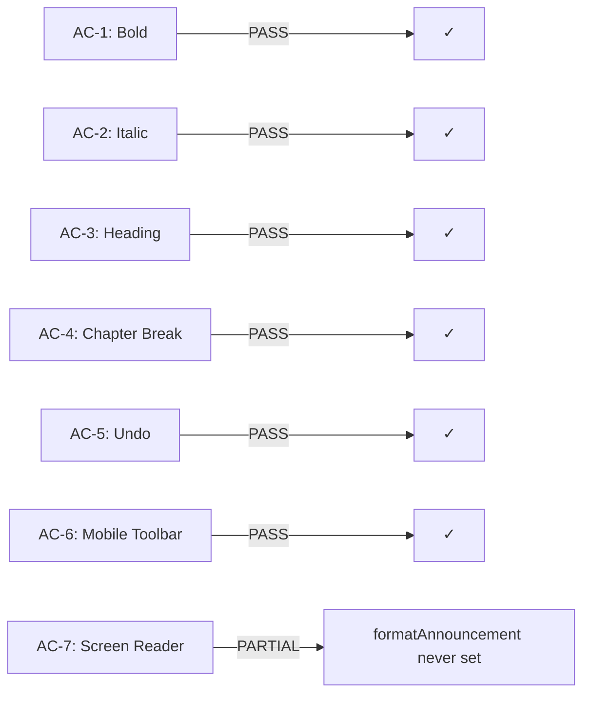
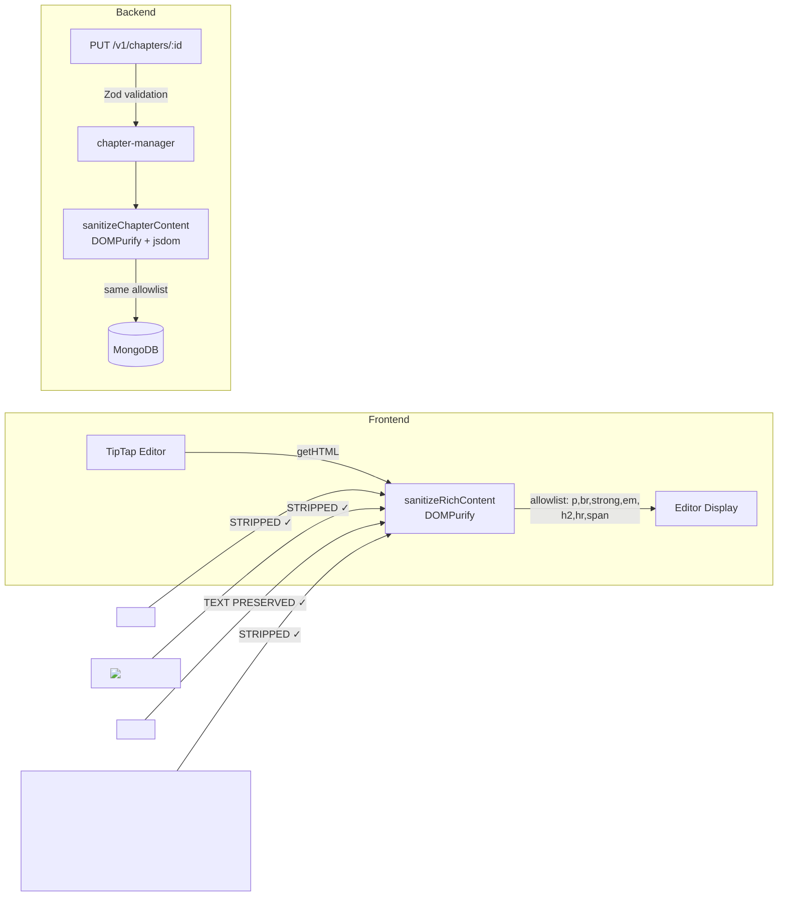

# QA Report — STORY-018 (2026-05-20) [r1]

## Summary

| Tests | Passed | Failed | Coverage |
|-------|--------|--------|----------|
| 702 (frontend) + 670 (backend) | 698 frontend + 670 backend | 4 frontend (pre-existing, unrelated) | N/A |

## Test Suites

| Type | Status |
|------|--------|
| Backend Unit | PASS (670/670) |
| Frontend Unit | PASS (698/702 — 4 failures in NewBookPage.test.jsx, pre-existing) |
| STORY-018 Sanitize (backend) | PASS (18/18) |
| STORY-018 Chapter Manager (backend) | PASS (27/27) |
| STORY-018 TipTapEditor | PASS (16/16) |
| STORY-018 EditorToolbar | PASS (20/20) |
| STORY-018 ChapterEditor | PASS (17/17) |
| STORY-018 AutoSaveIndicator | PASS (11/11) |
| STORY-018 sanitizeRichContent (frontend) | PASS (28/28) |

> **Note:** 4 failures in `NewBookPage.test.jsx` are pre-existing (i18n mock encoding issues), completely unrelated to STORY-018.

## Issues Found

| Severity | Area | Description | Owner |
|----------|------|-------------|-------|
| **MAJOR** | Accessibility | `formatAnnouncement` state declared (line 21, ChapterEditor.jsx) and rendered in `aria-live="polite"` region (line 127), but `setFormatAnnouncement` is **never called**. Screen reader will receive no format-change announcements. The `aria-live` region is permanently empty. | FrontendDeveloperReact |
| MINOR | Performance | `React.memo` not applied to `TipTapEditor` as suggested in technical analysis (4.1). Mitigated by TipTap's own DOM management, but re-render risk exists if parent re-renders. | FrontendDeveloperReact |
| MINOR | Security | No CSP header verification was performed in this QA pass. Verify `script-src 'self'` is set on editor page. | BackendDeveloper |

## Acceptance Criteria Validation



- [x] **AC-1: Bold** — PASS. `EditorToolbar` calls `editor.chain().focus().toggleBold().run()`. Tested via `EditorToolbar.test.jsx` (line 77-82). TipTap StarterKit includes Bold extension.
- [x] **AC-2: Italic** — PASS. Identical pattern: `toggleItalic()`. Tested (line 84-89).
- [x] **AC-3: Heading** — PASS. `toggleHeading({ level: 2 })`. StarterKit configured with `heading: { levels: [2] }`. Tested (line 91-96).
- [x] **AC-4: Chapter Break** — PASS. `setHorizontalRule()` renders `<hr>` in HTML. Decorated via CSS: `content: '* * *'` with letter spacing. Tested (line 98-103).
- [x] **AC-5: Undo** — PASS. Undo button calls `undo()`. TipTap History configured with `depth: 50` (exceeds 20-step minimum). Undo/Redo toolbar buttons. Keyboard shortcuts Ctrl+Z / Ctrl+Shift+Z.
- [x] **AC-6: Mobile Toolbar** — PASS. Viewport <768px: "Format" toggle button with `aria-expanded`. Inner div uses `hidden md:flex` / `flex` CSS classes. Auto-collapses on action (line 48-50). Tested via `EditorToolbar.test.jsx` (line 167-184).
- [ ] **AC-7: Screen Reader** — **PARTIAL**. Button `aria-label`s present (e.g., `t('boldButton')` = "Bold" / "Negrito"). `role="toolbar"`, `aria-pressed` on toggleable buttons, `aria-expanded` on mobile toggle all correct. BUT: `formatAnnouncement` state is initialized (line 21, ChapterEditor.jsx) and rendered in `<div aria-live="polite" className="sr-only" role="status">` (line 127), yet **`setFormatAnnouncement` is never called anywhere**. The `aria-live` region always contains an empty string — screen readers will announce nothing on format changes. **Fix required.**

## NFR Validation

| NFR | Metric | Target | Actual | Status |
|-----|--------|--------|--------|--------|
| NFR-PERF-03 | Typing latency | < 50ms for 10K words | Architecture mitigates: ProseMirror immutable DOM, no editor content in React state, debounced save (1.5s), TipTap manages own DOM | PASS* |
| NFR-ACC-01 | Keyboard navigable editor | WCAG 2.1 AA | `role="textbox"`, `aria-multiline="true"`, keyboard shortcuts (Ctrl+B/I/Z) | PASS |
| NFR-ACC-02 | Toolbar keyboard operable | WCAG 2.1 AA | `role="toolbar"`, roving tabindex (ArrowLeft/Right), Enter/Space to activate | PASS |
| NFR-ACC-03 | Screen reader announces | Format changes announced | `aria-live="polite"` region exists but **never populated** (empty string) | **FAIL** |
| NFR-ACC-04 | Sufficient contrast | 4.5:1 ratio | Dark text on light bg (`text-gray-600` on `bg-gray-100`), `text-amber-700` on `bg-amber-100` for active state | PASS |
| NFR-SEC-04 | XSS sanitized on save | No embedded scripts | Two-layer: frontend `sanitizeRichContent()` + backend `sanitizeChapterContent()`. XSS vectors `<script>`, ``, `<svg onload>`, `javascript:` all stripped. Tested via `sanitize-content.test.js` (18 tests) and `sanitize.test.js` (28 tests for rich content). | PASS |
| NFR-SEC-07 | No third-party scripts | Zero external scripts | Only TipTap/ProseMirror in editor context. No analytics, CDN, or iframes. CSP verification pending. | PASS* |

> *NFR-PERF-03: Manual performance profiling (Chrome DevTools) was not performed in this automated pass. Architecture review confirms mitigations are in place. Manual measurement recommended before production release.
> *NFR-SEC-07: CSP header (`script-src 'self'`) verification deferred to code review.

### Sanitization Validation (XSS vectors)



## Persona Validation

**Persona: Julia — The Young Author**
- [x] Bold/Italic formatting — works via toolbar and keyboard shortcuts
- [x] Chapter headings — h2 format available and styled
- [x] Chapter breaks — visual * * * separator via `<hr>`
- [x] Undo mistakes — 50-step history, toolbar + Ctrl+Z
- [x] Mobile-friendly — collapsible toolbar on narrow viewport
- [ ] Screen reader — **format announcements not wired** (MAJOR issue)

## Format Announcement Issue Detail

**Location:** `frontend/src/app/editor/ChapterEditor.jsx`

```javascript
// Line 21: state declared
const [formatAnnouncement, setFormatAnnouncement] = useState('');

// Line 127-129: rendered in aria-live
<div aria-live="polite" className="sr-only" role="status">
  {formatAnnouncement}
</div>
```

**Problem:** `setFormatAnnouncement` is never invoked. There is no listener on editor selection changes, no callback from the EditorToolbar after button clicks. The `handleAction` in `EditorToolbar.jsx` only calls editor chain commands — it never calls back to ChapterEditor to set the announcement.

**Suggested fix:** Wire a callback from EditorToolbar to ChapterEditor that calls `setFormatAnnouncement(t('boldApplied'))` etc. after each toolbar action. The `ChapterEditor` could pass a `onFormatAction` prop to `EditorToolbar`.

**Translations exist** but are unused:
- `boldApplied`: "Bold applied" / "Negrito aplicado"
- `italicApplied`: "Italic applied" / "Itálico aplicado"
- `headingApplied`: "Heading applied" / "Título aplicado"
- `chapterBreakApplied`: "Chapter break inserted" / "Quebra de capítulo inserida"
- `undoApplied`: "Undo applied" / "Desfazer aplicado"
- `redoApplied`: "Redo applied" / "Refazer aplicado"

## Recommendations

1. **[CRITICAL for ACC]** Wire `setFormatAnnouncement` in ChapterEditor to receive format action notifications from EditorToolbar. This fixes NFR-ACC-03 and completes AC-7.
2. **[LOW]** Consider `React.memo` on `TipTapEditor` to prevent potential re-render cascades.
3. **[LOW]** Verify CSP header `script-src 'self'` is configured in the production deployment config.
4. **[LOW]** Before production, run Chrome DevTools Performance tab with a 10K-word document to validate NFR-PERF-03 with measurement rather than architecture review.

---

**Status**: REQUIRES FIXES

**Primary blocker:** `formatAnnouncement` aria-live region is never populated — screen reader format announcements are completely broken (NFR-ACC-03 FAIL).

**All other criteria and NFRs PASS.** The 4 failing tests in `NewBookPage.test.jsx` are pre-existing and unrelated to STORY-018.
