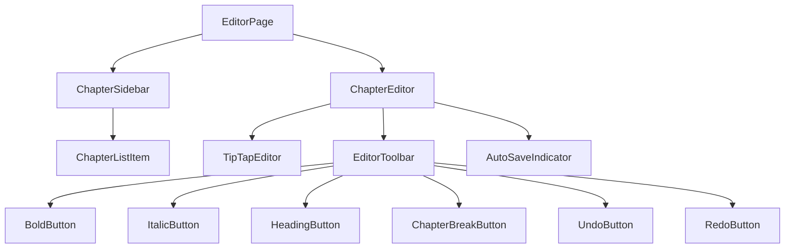
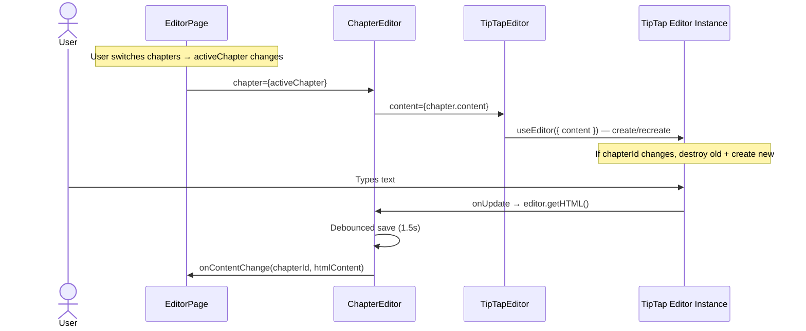
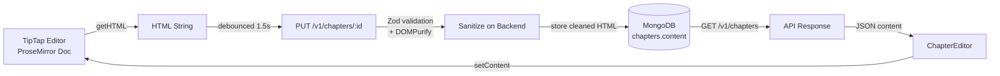
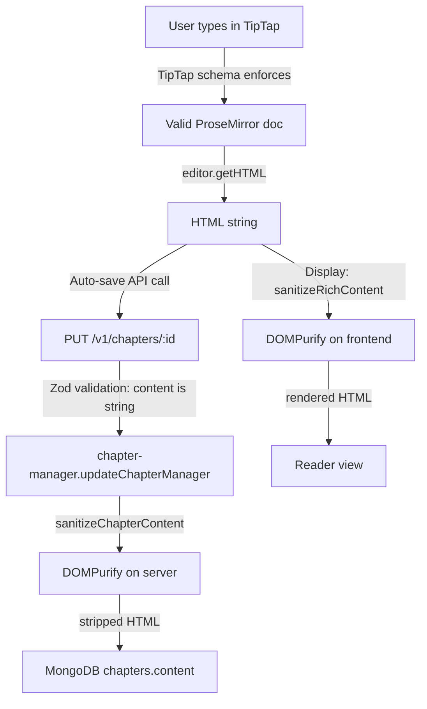
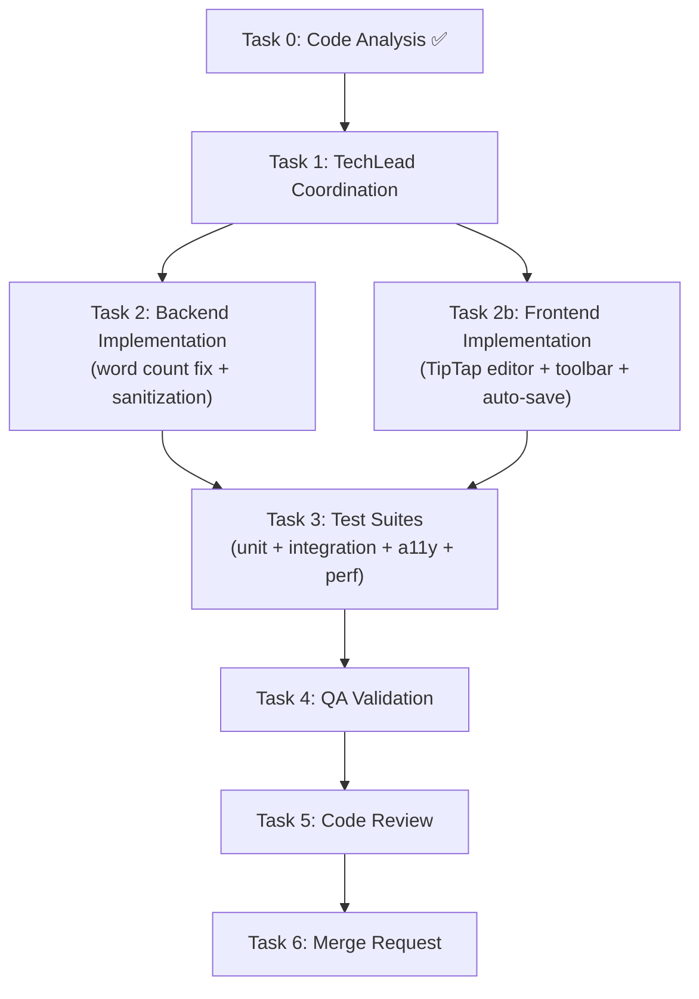
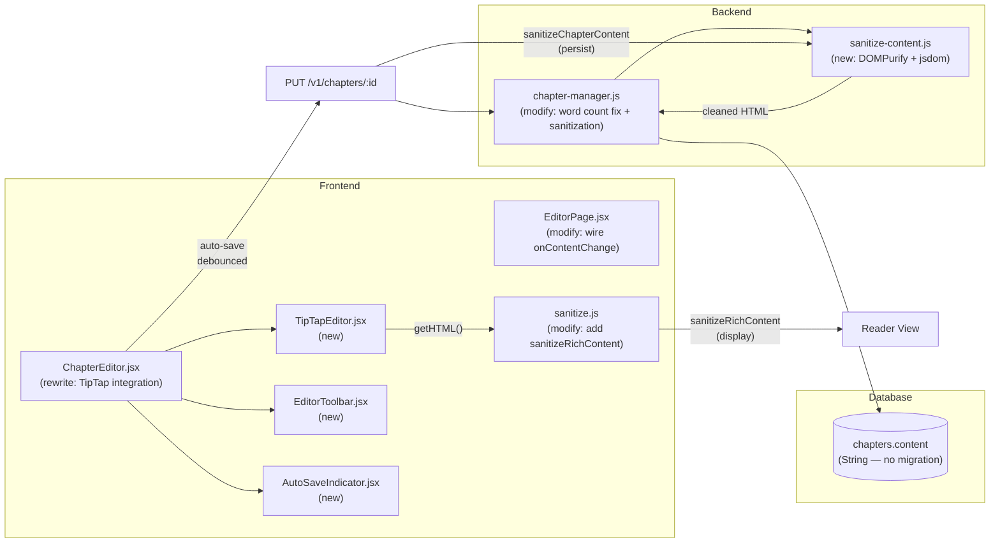

# STORY-018 Technical Analysis: Simplified Rich Text Editor

**Epic**: EPIC-003
**Persona**: Julia — The Young Author
**Stack**: Node.js 22 / Express 4.x / MongoDB 7 / Mongoose 8 / Zod / Pino / Vitest (backend) + React 18 / Vite 5 / Tailwind 3 / Flowbite React / Zustand / TanStack Query / react-i18next / Framer Motion / TipTap 2.8 (frontend)
**Language**: Node.js (ESM)
**Frontend**: React 18 + Vite (SPA mode — typed API client via axios, JWT manual handling)
**Frontend-Backend Integration**: Vite dev proxy → Express, JWT Bearer auth, Zod validation both sides, DOMPurify sanitization on both sides
**Depends on**: STORY-016 (Create a New Book), STORY-017 (Chapter-Based Writing & CRUD)
**Code Analysis**: `docs/stories/STORY-018-code-analysis.md`

---

## 1. Component Design

### 1.1 Component Tree



### 1.2 Component Specifications

| Component | Responsibility | Key Props | Key State |
|---|---|---|---|
| `ChapterEditor` | Orchestrator: loads chapter content into editor, manages auto-save lifecycle, renders toolbar + editor + save indicator | `chapter`, `onContentChange` | `editorInstance` (ref) |
| `TipTapEditor` | ProseMirror editing surface: initializes `useEditor`, renders `EditorContent`, manages lifecycle | `content`, `onUpdate`, `editorRef` | — (editor instance via `useEditor`) |
| `EditorToolbar` | Sticky toolbar with formatting buttons; responsive layout (collapsible on mobile) | `editor` (TipTap instance) | `isMobileExpanded` (for mobile toggle) |
| `AutoSaveIndicator` | Shows "Saving…" / "Saved" / "Unsaved" status, last-saved timestamp | `isSaving`, `lastSavedAt`, `isDirty` | — |

### 1.3 State Management: Local + Zustand (No New Store)

**Decision: Use TipTap's local editor state + Zustand draft for unsaved content, NOT a Zustand store for editor state.**

Rationale:
- TipTap manages its own ProseMirror document state internally — syncing document state to Zustand on every keystroke would cause unnecessary re-renders and break the <50ms latency NFR
- The existing `useBookStore` already has `draft` / `saveDraft()` / `clearDraft()` — these are perfect for persisting unsaved content to `localStorage` before a save completes
- Auto-save flow: `onUpdate` (TipTap) → debounced `useUpdateChapter.mutate()` → on success, `clearDraft()`; on failure, `saveDraft(content)` to preserve content

```
TipTap Editor State (ProseMirror, in-memory)
       │
       │ onUpdate (debounced 1.5s)
       ▼
useUpdateChapter mutation (TanStack Query)
       │
       ├─ onSuccess → clear draft
       │
       └─ onError → saveDraft(content) to localStorage via Zustand
```

---

## 2. Editor Library Configuration

### 2.1 TipTap Extensions

**Decision: Use `@tiptap/starter-kit` + explicit History extension override for undo/redo depth.**

`starter-kit` already bundles: Bold, Italic, Strike, Code, Heading, BulletList, OrderedList, Blockquote, HorizontalRule, HardBreak, Paragraph, Text, History, Document, Dropcursor, Gapcursor.

**Required extensions (from starter-kit)**:
- `StarterKit` — includes Bold, Italic, Heading, HorizontalRule, History, Paragraph, HardBreak, Text, Document
- We explicitly **disable** extensions we don't need: `code`, `codeBlock`, `strike`, `bulletList`, `orderedList`, `blockquote`

**Configuration**:

```javascript
const editor = useEditor({
  extensions: [
    StarterKit.configure({
      heading: { levels: [2] },      // h2 only per story spec
      history: { depth: 50 },         // 50 > 20 minimum, generous buffer
      code: false,
      codeBlock: false,
      strike: false,
      bulletList: false,
      orderedList: false,
      blockquote: false,
    }),
    Placeholder.configure({
      placeholder: t('editorPlaceholder'),  // i18n: "Start writing your story…"
    }),
  ],
  content: chapter.content || '',
  editorProps: {
    attributes: {
      'aria-label': t('editorAriaLabel'),  // i18n
      role: 'textbox',
      'aria-multiline': 'true',
    },
  },
  onUpdate: ({ editor }) => {
    handleContentChange(editor.getHTML());
  },
},
```

**Chapter Break implementation**: Use `HorizontalRule` from StarterKit — already renders as `<hr>` in HTML, maps to ProseMirror `horizontal_rule` node. Decorative styling applied via CSS on `.ProseMirror hr` selector. No custom node type needed for MVP.

### 2.2 Editor Instance Lifecycle in React



**Key lifecycle detail**: When `chapterId` changes (user switches chapters), destroy the current editor instance and create a new one with the new content. Use `useEditor`'s `onCreate` callback. **Do not** try to swap content in-place (ProseMirror state is immutable; swapping causes cursor/state issues).

### 2.3 TipTap Installation Status

**Already installed** in `frontend/package.json`:
- `@tiptap/react ^2.8.0`
- `@tiptap/starter-kit ^2.8.0`

**Additional packages needed**:
- `@tiptap/extension-placeholder` — for empty-state placeholder text (install via npm)

No other TipTap extensions needed for MVP.

---

## 3. Data Flow

### 3.1 Content Flow Diagram



### 3.2 JSON vs HTML Decision

**Decision: Store content as HTML string in the existing `content` field (type: String).**

Rationale:
- **Schema change: None.** The Mongoose schema already has `content: { type: String, default: '' }` — stores HTML naturally.
- **TipTap supports both**: `editor.getHTML()` and `editor.getJSON()`. HTML is simpler for this MVP.
- **HTML is human-readable** in MongoDB — easier debugging and migrations.
- **JSON adds complexity**: Would need schema migration (String → Mixed), versioning concerns, and no tangible benefit for 2 formatting features (bold, italic).
- **Rendering is trivial**: React can render sanitized HTML via `dangerouslySetInnerHTML` or TipTap's own `EditorContent` component for editing.
- **Future flexibility**: Can migrate to JSON later if needed (TipTap can parse HTML → JSON).

### 3.3 Sanitization Strategy

**Two-layer defense:**

| Layer | Mechanism | Allowlist |
|---|---|---|
| **Frontend (display)** | `sanitizeRichContent()` in `sanitize.js` — new function uses DOMPurify with allowed tags | `p`, `br`, `strong`, `em`, `h2`, `hr`, `span` (TipTap marks) |
| **Backend (persist)** | DOMPurify on server before `updateChapterById` — strip anything not in allowlist | Same as above |

**Frontend sanitize.js changes**:
- Keep existing `sanitizeText()` (strips ALL tags — used for chapter titles, book titles)
- Add `sanitizeRichContent(html)` — DOMPurify with `ALLOWED_TAGS` allowlist
- Add `ALLOWED_TAGS` constant array shared between frontend and backend

**Backend sanitization middleware**: Add a `sanitizeChapterContent()` function in `book-dao.js` or a shared utility that runs DOMPurify on `content` before persisting. This requires `dompurify` + `jsdom` on the backend (isomorphic-dompurify or dompurify + jsdom setup).

**Allowlist tags** (minimal per story scope):
```
p, br, strong, em, h2, hr, span
```
- `strong` = bold, `em` = italic (TipTap defaults)
- `h2` = heading (story spec says h2)
- `hr` = chapter break
- `span` = TipTap mark wrappers (e.g., font-weight marks)
- `p` = paragraphs, `br` = line breaks

**Attributes**: Allow only `class` (for TipTap styling) — strip `style`, `onclick`, `on*` event handlers, `src`, `href`.

**XSS test vectors** (must be stripped):
- `<script>alert(1)</script>`
- ``
- `<a href="javascript:alert(1)">click</a>`
- `<div style="background:url('javascript:alert(1)')">`
- `<svg onload=alert(1)>`

---

## 4. Performance Plan

### 4.1 Typing Latency <50ms Target

**TipTap/ProseMirror architecture** already provides excellent performance:
- ProseMirror uses immutable document model with efficient diffing
- No virtual DOM reconciliation on every keystroke — ProseMirror manages its own DOM
- Document parsing is incremental, not full-reparse

**Key risks to <50ms latency and mitigations:**

| Risk | Mitigation |
|---|---|
| React re-renders on every keystroke | `React.memo` on `TipTapEditor`; `useRef` for editor instance; never put editor content in React state |
| Auto-save on every keystroke | Debounce save to 1.5s of inactivity; never synchronously save in `onUpdate` |
| Large document DOM size | ProseMirror only renders visible viewport — no virtualization needed for 10K words (~50KB HTML) |
| Mobile JavaScript performance | No external scripts in editor context; minimal extensions (5 formats); consider `requestIdleCallback` for auto-save |
| Toolbar re-render on selection change | Use `editor.on('selectionUpdate')` with `useRef` to avoid React re-renders; toolbar buttons read active state via `editor.isActive()` |

**Measurement plan:**
- Chrome DevTools Performance tab: measure input latency on a 10,000-word document
- `performance.mark()` / `performance.measure()` around `onUpdate` handlers
- Target: `keydown → DOM paint` < 50ms on Chrome on mid-range Android device
- Test with 10K-word document (~50KB HTML) on Chrome DevTools mobile emulation (6x slowdown)

### 4.2 Auto-Save Architecture

```
TipTap onUpdate
    │
    ├─ Mark content as "dirty" (local ref)
    ├─ Save draft to Zustand (sync, fast — localStorage)
    ├─ Start debounce timer (1.5s)
    │
    ├─ [1.5s pass, no new keystroke]
    │   └─ useUpdateChapter.mutate({ chapterId, content })
    │       ├─ onSuccess → clear dirty flag, clear draft
    │       └─ onError → keep dirty flag, show error, retry on next change
    │
    └─ [New keystroke within 1.5s]
        └─ Reset debounce timer
```

**Debounce implementation**: Use `useRef` for timer + `useCallback` with debounce pattern. Do NOT use `setTimeout` inside render — use a custom `useDebouncedCallback` hook or `lodash.debounce` wrapping the mutation.

**Draft persistence**: Zustand `saveDraft(content)` writes to store (in-memory). For crash recovery, consider `localStorage.setItem('draft_chapterId', content)` in the save. This is optional for MVP but recommended.

---

## 5. Mobile & Responsive

### 5.1 Responsive Breakpoints

| Breakpoint | Toolbar Behavior | Editor Layout |
|---|---|---|
| `lg+` (≥1024px) | Sticky bar at top of editor area (desktop view) | Full-width editor, sidebar on left |
| `md` (768-1023px) | Sticky bar, horizontal scroll if needed | Full-width editor, sidebar collapsed |
| `sm` (≤767px) | **Collapsible toolbar**: single row with "Format" toggle → expands to show all buttons | Full-width editor, sidebar as bottom drawer |

### 5.2 Mobile Toolbar Design

**Desktop** (≥768px):
```
[Bold] [Italic] [Heading] [Chapter Break] [Divider] [Undo] [Redo]
```
Sticky at top of editor. Always visible. `position: sticky; top: 0; z-index: 10;`

**Mobile** (<768px):
```
[Format ▼]  ….auto-save indicator….
```
- Default: collapsed single row showing "Format" dropdown toggle
- Expanded: full toolbar row slides down with `overflow-x: auto; -webkit-overflow-scrolling: touch; scroll-snap-type: x proximity;`
- Toggle via button with `aria-expanded` attribute
- Close on format application (auto-collapse), or keep open while user is actively formatting (smart toggle: close after 2s of inactivity)

### 5.3 Touch Selection Handling

- ProseMirror/TipTap handles native touch selection internally
- **No custom selection overlay** needed for MVP
- Test on iOS Safari: verify `contenteditable` touch selection works for bold/italic (double-tap to select word, drag handles)
- Known issue: iOS Safari may show native formatting menu — disable with `CSS -webkit-user-select: text` on editor area

### 5.4 Viewport Considerations

- Editor area: `min-h-[60vh]` on desktop, `min-h-[50vh]` on mobile (accounting for on-screen keyboard)
- Toolbar: `h-10` fixed height, `overflow-x-auto` on mobile
- Save indicator: inline with toolbar on desktop, bottom of toolbar on mobile

---

## 6. Accessibility Plan

### 6.1 WCAG 2.1 AA Requirements

| NFR | Requirement | Implementation |
|---|---|---|
| NFR-ACC-01 | Keyboard navigable editor | TipTap/ProseMirror natively supports keyboard editing; ensure `role="textbox"` and `aria-multiline="true"` on editor div |
| NFR-ACC-02 | Toolbar buttons keyboard operable | `role="toolbar"` on toolbar container; `roving tabindex` pattern for arrow-key navigation between buttons |
| NFR-ACC-03 | Screen reader announcements | `aria-live="polite"` region for format announcements: "Bold applied", "Heading applied" |
| NFR-ACC-04 | Sufficient color contrast | Toolbar icons: minimum 4.5:1 contrast ratio; use `fill="currentColor"` with dark text on light background |

### 6.2 Accessibility Implementation Details

**Toolbar container**:
```html
<div role="toolbar" aria-label={t('formattingToolbar')} className="...">
```

**Toolbar buttons** (roving tabindex pattern):
```html
<button
  role="button"
  aria-label={t('boldButton')}             // "Make text bold"
  aria-pressed={editor.isActive('bold')}   // true/false
  tabIndex={isActiveButton ? 0 : -1}       // roving tabindex
  onClick={() => editor.chain().focus().toggleBold().run()}
>
  <BoldIcon />
</button>
```

**Keyboard shortcuts** (built into TipTap):
- `Ctrl+B` / `Cmd+B` → Bold
- `Ctrl+I` / `Cmd+I` → Italic
- `Ctrl+Z` / `Cmd+Z` → Undo
- `Ctrl+Shift+Z` / `Cmd+Shift+Z` → Redo

**Live region for format changes**:
```html
<div aria-live="polite" className="sr-only" role="status">
  {formatAnnouncement}  // e.g., "Bold applied", "Heading applied"
</div>
```

**Screen reader testing approach**:
- NVDA on Windows + Chrome
- VoiceOver on macOS + Safari
- VoiceOver on iOS Safari
- axe-core automated audit in CI (vitest + @axe-core/react)

---

## 7. Undo/Redo

### 7.1 TipTap History Extension

**Configuration**: `StarterKit` includes the `History` extension. Override its `depth` option:

```javascript
StarterKit.configure({
  history: { depth: 50 },  // 50 steps > 20 minimum; generous buffer
})
```

**Undo/Redo behavior:**
- `Ctrl+Z` / `Cmd+Z` → Undo last change
- `Ctrl+Shift+Z` / `Cmd+Shift+Z` → Redo
- Toolbar buttons: Undo/Redo buttons with `editor.commands.undo()` / `editor.commands.redo()`
- Buttons disabled when undo/redo stack is empty: `editor.can().undo()` / `editor.can().redo()`

### 7.2 Undo Across Save Boundaries

**Key decision: TipTap's History extension operates on the ProseMirror transaction stack, which is in-memory. When content is saved to the server, the undo stack is NOT cleared.**

This means:
- Undo continues working across auto-save boundaries ✅
- Undo stack resets when user switches chapters (new editor instance) ✅
- Undo stack resets on page refresh (expected behavior) ✅
- No action needed to preserve undo across saves — TipTap does this naturally

**Edge case**: If the server returns an error on save and we need to "revert" to server state, we would use `editor.commands.setContent(serverContent)` — but this pushes to the undo stack. For MVP, this is acceptable. A production edge case would be `editor.commands.setContent(content, false, { preserved: true })` to avoid pushing to history.

---

## 8. Paste Handling

### 8.1 Strip Unsupported Styling on Paste

**TipTap default behavior**: ProseMirror's paste handling already normalizes pasted content to the document schema. This means:
- Unsupported formats (font family, font size, color, lists, blockquotes) are automatically stripped
- Only supported marks (bold, italic, heading, paragraph, hardBreak, horizontalRule) are preserved

**Risk**: Pasting from Word/Google Docs may introduce:
- Inline styles (`style="font-weight: bold"`)
- Custom HTML structures
- `<meta>` tags, `<!--[if gte...]-->` comments

**Mitigation**: Configure TipTap's clipboard text parser to strip all inline styles:

```javascript
editorProps: {
  attributes: { ... },
  transformPastedHTML(html) {
    // Strip all inline styles and class attributes from pasted HTML
    return html.replace(/ style="[^"]*"/g, '').replace(/ class="[^"]*"/g, '');
  },
},
```

Additionally, DOMPurify sanitization on the backend ensures that any content making it through the paste handler is stripped on save.

### 8.2 XSS Paste Test Cases

| Vector | Input | Expected Output |
|---|---|---|
| Script tag | `<script>alert(1)</script>Hello` | `Hello` (script stripped) |
| Image onerror | `` | `` (entire tag stripped) |
| JavaScript URL | `<a href="javascript:alert(1)">click</a>` | `click` (tag stripped, text preserved) |
| SVG with event | `<svg onload=alert(1)>` | `` (stripped) |
| Style injection | `<div style="background:url(javascript:alert(1))">` | `<div>` (style stripped) |
| Legitimate HTML | `<strong>Bold</strong> text` | `<strong>Bold</strong> text` (preserved) |
| Heading | `<h2>Chapter Title</h2>` | `<h2>Chapter Title</h2>` (preserved) |
| HR chapter break | `<hr>` | `<hr>` (preserved) |

---

## 9. Security

### 9.1 Sanitization Library

**Decision: DOMPurify on both frontend and backend.**

- Frontend: Already using `dompurify ^3.4.3` for `sanitizeText()`
- Backend: Add `dompurify` + `jsdom` for server-side sanitization

**Backend sanitization function** (new file: `backend/src/common/sanitize-content.js`):

```javascript
import { JSDOM } from 'jsdom';
import createDOMPurify from 'dompurify';

const window = new JSDOM('').window;
const DOMPurify = createDOMPurify(window);

const ALLOWED_TAGS = ['p', 'br', 'strong', 'em', 'h2', 'hr', 'span'];

const ALLOWED_ATTR = ['class'];  // TipTap marks may add class

export function sanitizeChapterContent(html) {
  if (!html) return '';
  return DOMPurify.sanitize(html, {
    ALLOWED_TAGS,
    ALLOWED_ATTR,
    ALLOW_DATA_ATTR: false,
  });
}
```

### 9.2 Content Sanitization Flow



### 9.3 No Third-Party Scripts in Editor Context

**Requirement**: NFR-SEC-07 — No third-party scripts loaded in editor.

**Guarantee mechanism**:
- TipTap is the only JS running in the editor context
- No analytics, CDN scripts, or iframes in the editor component
- DOMPurify strips `<script>` tags and event handlers (`onclick`, `onerror`, etc.)
- Content Security Policy (CSP) header on the editor page: `script-src 'self'` — blocks any injected script execution
- Build review: `frontend/package.json` only includes runtime dependencies listed above; no editor-analytics plugins

---

## 10. API Changes

### 10.1 Chapter Save Endpoint — No New Endpoints Needed

**Existing endpoint**: `PUT /api/v1/chapters/:chapterId`

This endpoint already accepts `{ content: string }` in the body. No new endpoint needed.

**Backend changes required**:

| File | Change | Impact |
|---|---|---|
| `backend/src/app/editor/chapter-manager.js:57` | Fix word count: strip HTML before counting words | Medium (bug fix) |
| `backend/src/common/sanitize-content.js` | **New file**: `sanitizeChapterContent()` using DOMPurify + jsdom | New (security) |
| `backend/src/app/editor/chapter-manager.js` | Call `sanitizeChapterContent` on `content` before persisting | Low |
| `backend/src/app/common/validation-schemas.js` | No change needed — `content: z.string().optional()` already accepts HTML string | None |

### 10.2 Word Count Fix

**Bug**: `chapter-manager.js:57` counts HTML tags as words.

**Fix**:
```javascript
// Before (buggy):
cleanUpdates.wordCount = updates.content.split(/\s+/).filter((w) => w.length > 0).length;

// After (correct):
const plainText = updates.content.replace(/<[^>]*>/g, ' ').replace(/\s+/g, ' ').trim();
cleanUpdates.wordCount = plainText ? plainText.split(/\s+/).length : 0;
```

### 10.3 Backend Sanitization Integration Point

In `updateChapterManager`, add sanitization BEFORE computing word count:

```javascript
if (updates.content !== undefined) {
  const sanitized = sanitizeChapterContent(updates.content);
  cleanUpdates.content = sanitized;
  const plainText = sanitized.replace(/<[^>]*>/g, ' ').replace(/\s+/g, ' ').trim();
  cleanUpdates.wordCount = plainText ? plainText.split(/\s+/).length : 0;
}
```

### 10.4 Mongoose Schema — No Migration

The `content` field is already `String, default: ''` — stores HTML naturally. No schema change needed for rich text.

---

## 11. Testing Strategy

### 11.1 Unit Tests

| Test | Type | Description |
|---|---|---|
| `TipTapEditor` renders with initial content | Component | Verify editor mounts and displays chapter HTML |
| `TipTapEditor` updates on content change | Component | `onUpdate` callback fires with HTML |
| `EditorToolbar` renders all buttons | Component | 6 buttons: Bold, Italic, Heading, Chapter Break, Undo, Redo |
| `EditorToolbar` button states reflect editor | Component | Bold button shows `aria-pressed=true` when bold is active |
| `EditorToolbar` keyboard navigation | Component | Roving tabindex — Arrow keys move focus between buttons |
| `sanitizeRichContent()` — allows safe tags | Unit | `<strong>Bold</strong>` → preserved |
| `sanitizeRichContent()` — strips scripts | Unit | `<script>alert(1)</script>` → stripped |
| `sanitizeRichContent()` — strips event handlers | Unit | `` → stripped |
| `sanitizeChapterContent()` (backend) — allows safe tags | Unit | Same allowlist test on server |
| `updateChapterManager` — word count from HTML | Unit | `'<p>Hello world</p>'` → wordCount: 2 |
| `updateChapterManager` — sanitizes content | Unit | `<script>alert(1)</script>` in content → stripped |
| Mobile toolbar toggle | Component | Clicking "Format" expands/collapses toolbar on mobile viewport |

### 11.2 Integration Tests

| Test | Type | Description |
|---|---|---|
| Save/load roundtrip | Integration | Edit content → auto-save → reload → content preserved |
| XSS paste roundtrip | Integration | Paste `<script>alert(1)</script>` → save → reload → script stripped |
| Undo after save | Integration | Type text → wait for auto-save → undo → content reverts in editor |
| Chapter switch preserves content | Integration | Edit chapter A → switch to chapter B → back to A → content preserved |
| Formatting roundtrip | Integration | Apply bold → save → reload → bold preserved |
| Heading roundtrip | Integration | Apply h2 → save → reload → heading preserved |
| HR roundtrip | Integration | Insert chapter break → save → reload → `<hr>` preserved |

### 11.3 Accessibility Tests

| Test | Type | Description |
|---|---|---|
| axe-core audit | Automated | Run axe-core on editor page — no violations |
| Toolbar role | Automated | Verify `role="toolbar"` on toolbar container |
| Button aria-labels | Automated | Each button has descriptive `aria-label` |
| Button aria-pressed | Automated | Active format buttons show `aria-pressed="true"` |
| Keyboard formatting | Manual | Ctrl+B applies bold, Ctrl+I applies italic |
| Screen reader navigation | Manual | Tab to toolbar, Arrow keys between buttons, Enter to activate |

### 11.4 Performance Tests

| Test | Type | Description |
|---|---|---|
| Typing latency benchmark | Manual | Chrome DevTools Performance tab: type in 10K-word doc, verify <50ms per keystroke |
| Auto-save debounce | Unit | Verify save doesn't fire within 1.5s of last keystroke |
| Editor mount time | Manual | Measure time from chapter select to editor ready (< 200ms target) |

---

## 12. Task Breakdown & Execution Plan

### 12.1 Task Dependency Flow



### 12.2 SubTask Breakdown

#### Task 2: Backend Implementation (BackendDeveloper)

| Subtask | Description | File | Dependency |
|---|---|---|---|
| 2a | Install `dompurify` + `jsdom` on backend | `backend/package.json` | None |
| 2b | Create `sanitizeChapterContent()` utility | `backend/src/common/sanitize-content.js` | 2a |
| 2c | Fix word count to strip HTML before counting | `backend/src/app/editor/chapter-manager.js:57` | None |
| 2d | Integrate sanitization into `updateChapterManager` | `backend/src/app/editor/chapter-manager.js` | 2b |
| 2e | Add sanitization unit tests | `backend/src/app/common/__tests__/sanitize-content.test.js` | 2b |
| 2f | Add word count unit tests (with HTML input) | `backend/src/app/editor/__tests__/chapter-manager.test.js` | 2c |

#### Task 2b: Frontend Implementation (FrontendDeveloperReact)

| Subtask | Description | File | Dependency |
|---|---|---|---|
| 2b-1 | Install `@tiptap/extension-placeholder` | `frontend/package.json` | None |
| 2b-2 | Create `TipTapEditor` component | `frontend/src/components/editor/TipTapEditor.jsx` | 2b-1 |
| 2b-3 | Create `EditorToolbar` component (desktop) | `frontend/src/components/editor/EditorToolbar.jsx` | 2b-1 |
| 2b-4 | Create mobile toolbar variant (collapsible) | `frontend/src/components/editor/EditorToolbar.jsx` (responsive) | 2b-3 |
| 2b-5 | Create `AutoSaveIndicator` component | `frontend/src/components/editor/AutoSaveIndicator.jsx` | None |
| 2b-6 | Add `sanitizeRichContent()` to `sanitize.js` | `frontend/src/lib/sanitize.js` | None |
| 2b-7 | Add TipTap editor CSS (ProseMirror styles + chapter break styling) | `frontend/src/styles/editor.css` | 2b-2 |
| 2b-8 | Rewrite `ChapterEditor.jsx` to use TipTap | `frontend/src/app/editor/ChapterEditor.jsx` | 2b-2, 2b-3, 2b-5 |
| 2b-9 | Wire auto-save debounce in `ChapterEditor` | `frontend/src/app/editor/ChapterEditor.jsx` | 2b-8 |
| 2b-10 | Wire `onContentChange` in `EditorPage.jsx` | `frontend/src/app/editor/EditorPage.jsx` | 2b-9 |
| 2b-11 | Add i18n strings for editor | `frontend/src/i18n/locales/pt/editor.json` + `en/editor.json` | None |
| 2b-12 | Add accessibility: roving tabindex, aria-live region, aria-labels | `EditorToolbar.jsx` + `TipTapEditor.jsx` | 2b-3, 2b-2 |

#### Task 3: Test Suites (TestEngineer)

| Subtask | Description | Dependency |
|---|---|---|
| 3a | Frontend unit tests: TipTapEditor, EditorToolbar, sanitizeRichContent | Task 2b |
| 3b | Frontend integration tests: save/load roundtrip, formatting roundtrip, XSS paste | Task 2b |
| 3c | Frontend a11y tests: axe-core audit, keyboard navigation | Task 2b |
| 3d | Backend unit tests: sanitizeChapterContent, word count with HTML | Task 2 |

#### Task 4: QA Validation (QAAnalyst)

| Subtask | Description | Dependency |
|---|---|---|
| 4a | Verify all acceptance criteria from STORY-018 | Task 3 |
| 4b | Manual: typing latency <50ms on 10K-word document | Task 3 |
| 4c | Manual: mobile responsive toolbar (iOS Safari, Android Chrome) | Task 3 |
| 4d | Manual: screen reader navigation (VoiceOver) | Task 3 |

#### Task 5: Code Review (CodeReviewer)

| Subtask | Description | Dependency |
|---|---|---|
| 5a | Security review: XSS sanitization, CSP, no external scripts | Task 4 |
| 5b | Performance review: re-render analysis, debounce correctness | Task 4 |
| 5c | Accessibility review: WCAG 2.1 AA compliance | Task 4 |

#### Task 6: Merge Request (MergeRequestCreator)

| Subtask | Description | Dependency |
|---|---|---|
| 6a | Create MR with all changes, link to STORY-018 | Task 5 |

---

## 13. Impacted Components Architecture



---

## 14. Key Decisions Summary

| Decision | Choice | Rationale |
|---|---|---|
| Content storage format | **HTML string** (existing `content: String`) | No schema migration needed; TipTap generates/renders HTML natively |
| Editor state management | **TipTap local state** (NOT Zustand) | ProseMirror manages its own state; syncing to Zustand causes re-renders & latency |
| Rich text library | **TipTap (already installed)** | Chosen in TECH-STACK.md; `@tiptap/react ^2.8.0` + `@tiptap/starter-kit ^2.8.0` in package.json |
| Chapter Break implementation | **HorizontalRule** from StarterKit | `<hr>` in HTML, styled with CSS — no custom ProseMirror node needed for MVP |
| Heading level | **h2 only** | Story spec: "e.g., h2" — single heading level keeps toolbar minimal |
| Toolbar format | **Sticky bar (desktop) / Collapsible row (mobile)** | Sticky bar for desktop writing flow; collapsible to save mobile viewport space |
| Auto-save strategy | **Debounced (1.5s)** + Zustand draft persistence | Avoids per-keystroke API calls; draft stored in Zustand for crash recovery |
| Undo/Redo | **TipTap History extension, depth: 50** | >20 minimum; works across saves naturally (ProseMirror in-memory stack) |
| Frontend sanitization | **DOMPurify with allowlist** (`sanitizeRichContent()`) | Already using DOMPurify; add new function with `{ ALLOWED_TAGS: [p, br, strong, em, h2, hr, span] }` |
| Backend sanitization | **DOMPurify + jsdom** (new `sanitize-content.js`) | Isomorphic sanitization; DOMPurify needs a DOM — jsdom provides it on Node.js |
| Paste handling | **TipTap default schema filtering + `transformPastedHTML`** | ProseMirror strips unsupported formats; custom handler removes inline styles |
| Additional npm packages | `@tiptap/extension-placeholder` (frontend), `jsdom` (backend) | Placeholder for empty editor; jsdom for server-side DOMPurify |

---

## 15. NFR Analysis

| NFR | Requirement | Implementation | Verification |
|---|---|---|---|
| NFR-PERF-03 | Typing latency <50ms for 10K words on mobile | TipTap's ProseMirror engine; `React.memo` on editor; no state-sync re-renders; debounced save (1.5s) | Chrome DevTools Performance tab on 10K-word doc |
| NFR-ACC-01 | WCAG 2.1 AA keyboard navigable | `role="textbox"` + `aria-multiline`; TipTap native keyboard support; Tab into/out of editor | axe-core + manual keyboard test |
| NFR-ACC-02 | Toolbar buttons keyboard operable | `role="toolbar"` + roving tabindex; Arrow key navigation; Enter/Space to activate | Manual keyboard test |
| NFR-ACC-03 | Screen reader announces format changes | `aria-live="polite"` region announces "Bold applied", "Heading applied" | VoiceOver + NVDA testing |
| NFR-ACC-04 | Sufficient contrast on toolbar icons | `fill="currentColor"` with dark text on light background (4.5:1 ratio) | axe-core contrast audit |
| NFR-SEC-04 | Content sanitized on save | Two-layer: `sanitizeRichContent()` frontend (display) + `sanitizeChapterContent()` backend (persist) | XSS injection test suite |
| NFR-SEC-07 | No third-party scripts in editor | No analytics/CDN in editor context; CSP `script-src 'self'`; DOMPurify strips `<script>` tags | Dependency audit + CSP header check |

---

## 16. Definition of Done Checklist

- [ ] **Backend**: `sanitizeChapterContent()` strips XSS vectors from HTML content
- [ ] **Backend**: Word count correctly strips HTML tags before counting
- [ ] **Backend**: Sanitization applied in `updateChapterManager` before persisting
- [ ] **Backend**: All existing tests still pass
- [ ] **Frontend**: `TipTapEditor` component mounts with TipTap StarterKit (Bold, Italic, Heading, HorizontalRule, History)
- [ ] **Frontend**: `EditorToolbar` shows all 6 buttons (Bold, Italic, Heading, Chapter Break, Undo, Redo)
- [ ] **Frontend**: Toolbar sticky on desktop, collapsible on mobile (<768px)
- [ ] **Frontend**: `ChapterEditor` replaced with TipTap integration (no more dashed placeholder)
- [ ] **Frontend**: Auto-save debounce (1.5s) wired to `useUpdateChapter`
- [ ] **Frontend**: Draft persistence via Zustand `saveDraft()` on failed saves
- [ ] **Frontend**: `sanitizeRichContent()` allows safe HTML tags, strips scripts
- [ ] **Frontend**: `@tiptap/extension-placeholder` shows placeholder text
- [ ] **Accessibility**: `role="toolbar"` on toolbar, `aria-label` on each button, `aria-pressed` on toggle buttons
- [ ] **Accessibility**: Roving tabindex for keyboard navigation between toolbar buttons
- [ ] **Accessibility**: `aria-live="polite"` region for format change announcements
- [ ] **Accessibility**: Keyboard shortcuts work (Ctrl+B, Ctrl+I, Ctrl+Z, Ctrl+Shift+Z)
- [ ] **Performance**: Typing latency <50ms on 10K-word document (mobile emulation)
- [ ] **Security**: XSS paste test vectors all stripped before save
- [ ] **i18n**: All editor strings in pt-BR and en translation files
- [ ] **No regressions**: All existing tests still pass

---

## 17. SubAgent Assignments

| Task | Description | Agent | Language |
|---|---|---|---|
| 0 | Code analysis (completed) | CodeAnalyzer | Node.js |
| 1 | Coordination (plan, sequence, delegate) | TechLead | — |
| 2 | Backend implementation (word count fix + sanitization) | BackendDeveloper | Node.js |
| 2b | Frontend implementation (TipTap + toolbar + auto-save + a11y) | FrontendDeveloperReact | React |
| 3 | Test suites (unit + integration + a11y + perf) | TestEngineer | Node.js + React |
| 4 | QA validation (acceptance criteria verification) | QAAnalyst | — |
| 5 | Code review (security + performance + a11y) | CodeReviewer | Node.js + React |
| 6 | Merge request creation | MergeRequestCreator | — |

### Parallelization

- **Tasks 2 and 2b** can run in **parallel** (backend sanitization is independent of frontend TipTap integration)
- Task 3 must wait for Tasks 2 and 2b
- Tasks 4, 5, 6 are sequential after Task 3

### Key References for TechLead

- PM story: `docs/stories/STORY-018.md`
- Technical analysis: `docs/stories/STORY-018-technical-analysis.md`
- Code analysis: `docs/stories/STORY-018-code-analysis.md`
- Existing chapter module: `backend/src/app/editor/chapter-manager.js`
- Existing ChapterEditor placeholder: `frontend/src/app/editor/ChapterEditor.jsx`
- Zustand store (draft state): `frontend/src/stores/book-store.js`