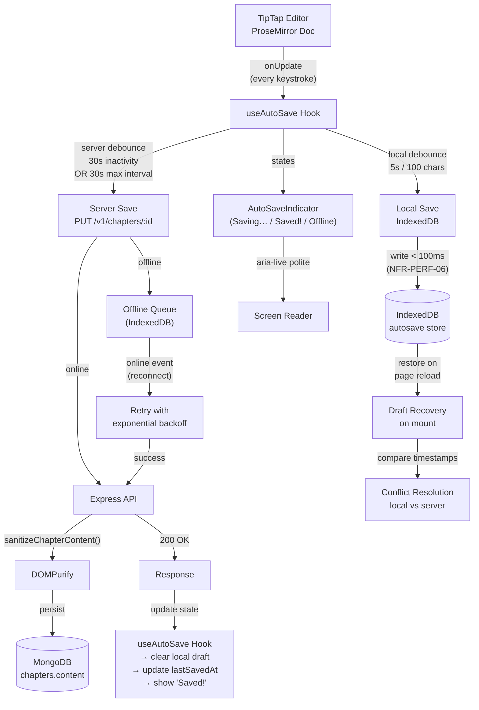
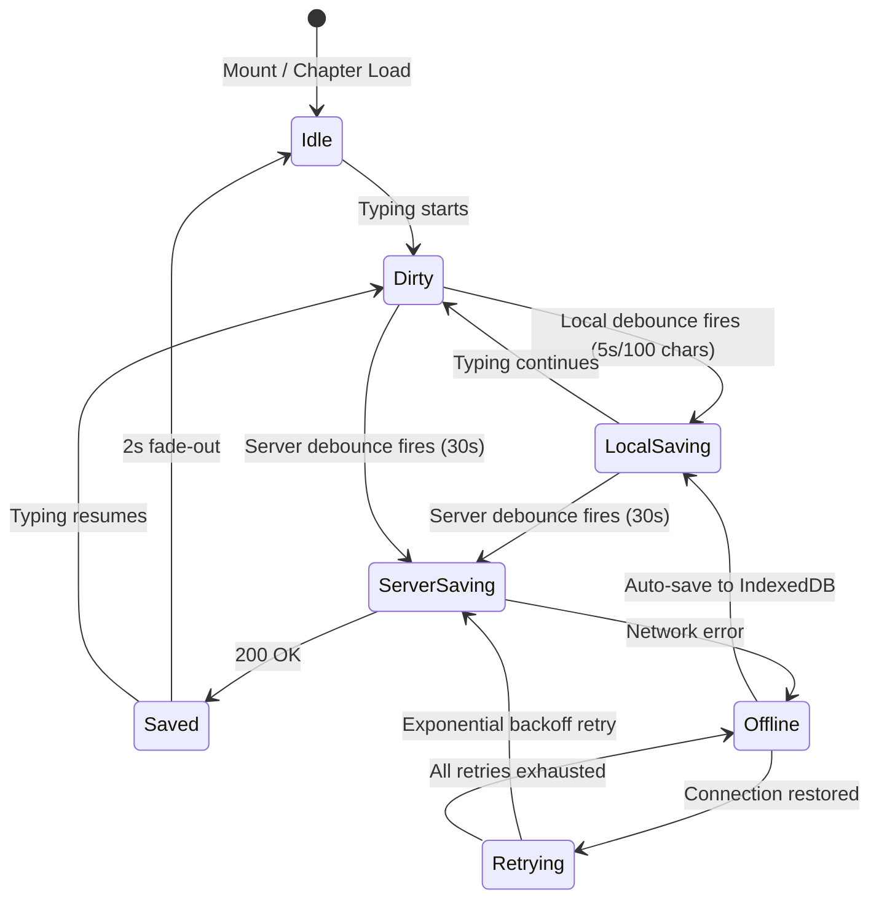
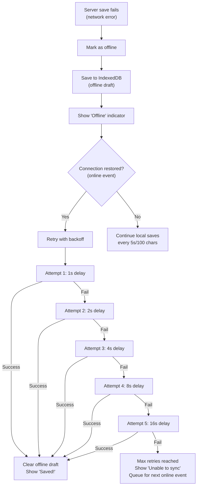
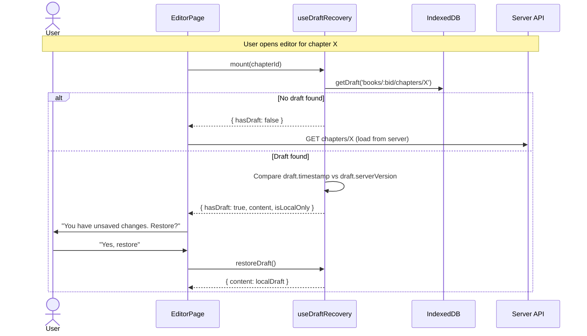
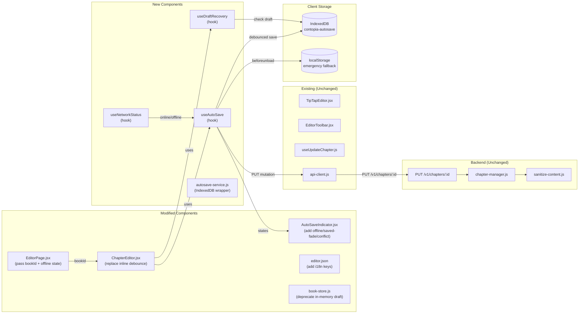
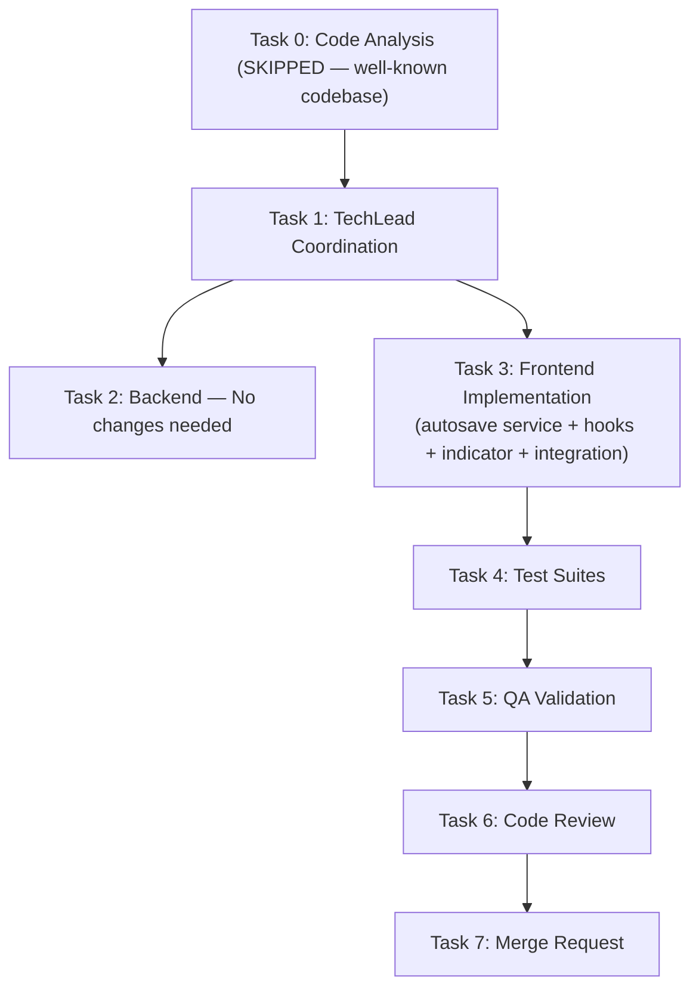

# STORY-019 Technical Analysis: Autosave with Visual Indicator

**Epic**: EPIC-003
**Persona**: Julia — The Young Author
**Stack**: Node.js 22 / Express 4.x / MongoDB 7 / Mongoose 8 / Zod / Pino / Vitest (backend) + React 18 / Vite 5 / Tailwind 3 / Flowbite React / Zustand / TanStack Query / react-i18next / Framer Motion / TipTap 2.8 (frontend)
**Language**: Node.js (ESM)
**Frontend**: React 18 + Vite (SPA mode — typed API client via axios, JWT manual handling)
**Frontend-Backend Integration**: Vite dev proxy → Express, JWT Bearer auth, Zod validation both sides, DOMPurify sanitization on both sides
**Depends on**: STORY-018 (Simplified Rich Text Editor — already implemented)
**Code Analysis**: Not required — existing well-understood codebase, changes are incremental

---

## 1. Overview

STORY-019 enhances the existing auto-save mechanism (1.5s debounce in `ChapterEditor.jsx`) with:

1. **Extended server-save debounce**: 30 seconds of inactivity OR every 30s during active typing (max interval)
2. **Local-save on significant changes**: Write draft to IndexedDB every 5s or 100 characters of change, keyed by `autosave:/books/:bookId/chapters/:chapterId`
3. **Visual indicator lifecycle**: "Saving…" → "Saved!" (fades after 2s) → idle; offline indicator when network unavailable
4. **Offline fallback**: When network is unavailable, auto-save writes to IndexedDB locally and syncs when connection returns
5. **Conflict resolution**: On reconnect, compare local draft version timestamp with server `updatedAt`; prefer local if diverged, with warning
6. **Exponential backoff retry**: On network failure, retry with backoff (1s → 2s → 4s → 8s → 16s, max 5 retries)
7. **Background thread**: Use `requestIdleCallback` (preferred) or Web Worker for local saves to avoid blocking UI; server saves via existing TanStack Query mutation

The existing auto-save is a simple 1.5s debounce → `useUpdateChapter` mutation → Zustand `saveDraft`/`clearDraft` (in-memory only, lost on page refresh). This story upgrades it to a robust offline-first autosave with visual feedback and crash recovery.

---

## 2. Architecture & Flow

### 2.1 Data Flow Diagram



### 2.2 Auto-Save State Machine



### 2.3 Save Timing Strategy

| Event | Timer | Action |
|-------|-------|--------|
| Every keystroke | — | Mark content as dirty |
| 5s of inactivity OR 100 chars of change | Local debounce | Write to IndexedDB (`localDebounce`) |
| 30s of inactivity | Server debounce | PUT to server (`serverDebounce`) |
| 30s since last server save (active typing) | Max interval | PUT to server (even if still typing) |
| Page `beforeunload` | — | Synchronous localStorage fallback + IndexedDB write |
| Browser/tab crash recovery | — | Restore from IndexedDB on next mount |
| Network offline event | — | Queue for later, show "Offline" indicator |
| Network online event | — | Retry queued saves with exponential backoff |

### 2.4 Web Worker vs requestIdleCallback Decision

**Decision: Use `requestIdleCallback` for local saves, NOT a dedicated Web Worker.**

Rationale:
- Local save to IndexedDB is already async and fast (< 100ms per NFR-PERF-06)
- `requestIdleCallback` ensures saves don't interrupt high-priority work (typing, rendering)
- A Web Worker adds complexity: message passing, serialization, separate bundle, synchronization
- Local save payload is small (~50KB HTML) — no CPU-heavy processing needed
- Fallback: `setTimeout(fn, 0)` in browsers without `requestIdleCallback`

Server saves already happen in the TanStack Query mutation (async, non-blocking).

### 2.5 IndexedDB Schema

```javascript
// Database: 'contopia-autosave'
// Object Store: 'drafts'
// Key: `books/:bookId/chapters/:chapterId`
// Indexes: 'byTimestamp' on 'timestamp'

const draft = {
  key: 'books/abc123/chapters/ch456',  // composite key
  bookId: 'abc123',
  chapterId: 'ch456',
  content: '<p>Chapter content HTML...</p>',
  wordCount: 542,
  timestamp: Date.now(),               // last local save time
  serverVersion: Date.now(),            // server updatedAt at time of last successful save
  isLocalOnly: true                     // true if never synced to server
};
```

---

## 3. Components / Modules / Files to Create or Modify

### 3.1 New Files

| File | Purpose |
|------|---------|
| `frontend/src/services/autosave-service.js` | IndexedDB wrapper: open DB, get/save/delete drafts, get all pending drafts |
| `frontend/src/hooks/useAutoSave.js` | Main auto-save orchestration hook: manages local/server debounce, offline queue, retry, state transitions |
| `frontend/src/hooks/useNetworkStatus.js` | Offline/online detection hook: listens to `navigator.onLine`, `online`/`offline` events |
| `frontend/src/hooks/useDraftRecovery.js` | Draft recovery on mount: checks IndexedDB for unsaved drafts, compares with server data, resolves conflicts |
| `frontend/src/components/editor/AutoSaveIndicator.jsx` | **REWRITE**: Add offline state, "Saved!" fade-out animation, conflict warning UI, debounced screen reader announcements |
| `frontend/src/__tests__/autosave-service.test.js` | Unit tests for IndexedDB wrapper (using `fake-indexeddb`) |
| `frontend/src/__tests__/useAutoSave.test.js` | Unit tests for auto-save hook |
| `frontend/src/__tests__/useNetworkStatus.test.js` | Unit tests for network status hook |
| `frontend/src/__tests__/useDraftRecovery.test.js` | Unit tests for draft recovery hook |
| `frontend/src/__tests__/AutoSaveIndicator.test.jsx` | **REWRITE**: Expanded tests for offline, "Saved!" fade, conflict warning |

### 3.2 Modified Files

| File | Change | Impact |
|------|--------|--------|
| `frontend/src/app/editor/ChapterEditor.jsx` | Replace inline debounce logic with `useAutoSave` hook; add `useDraftRecovery`; pass offline/conflict states to indicator | Medium — significant refactor of auto-save logic |
| `frontend/src/app/editor/EditorPage.jsx` | Pass `bookId` to `ChapterEditor` for IndexedDB key composition; wire online/offline state | Low — add prop |
| `frontend/src/stores/book-store.js` | Remove `draft`/`saveDraft`/`clearDraft` (replaced by IndexedDB); or keep as fallback for localStorage | Low — may deprecate in-memory draft |
| `frontend/src/i18n/locales/en/editor.json` | Add: `savingOffline`, `savedExclamation`, `offlineMessage`, `conflictWarning`, `syncingMessage` | Low — add i18n keys |
| `frontend/src/i18n/locales/pt-BR/editor.json` | Same as above in Portuguese | Low — add i18n keys |
| `frontend/vite.config.js` | Add `fake-indexeddb` to Vitest setup for test environment | Low — test config |

### 3.3 No Backend Changes Required

The existing `PUT /api/v1/chapters/:chapterId` endpoint already accepts `{ content }` and returns the updated chapter with `updatedAt`. The `updatedAt` timestamp from the server response is essential for conflict resolution and will be used as `serverVersion`.

**Why no new endpoint?** The current PUT endpoint is sufficient:
- It accepts `{ content, title }` (partial update)
- It returns the full updated chapter document including `updatedAt`
- It sanitizes content via `sanitizeChapterContent()`
- It auto-computes `wordCount`

No new REST endpoint for "sync" or "draft" is needed because IndexedDB drafts are entirely client-side. The server only sees the final PUT.

---

## 4. API Design

### 4.1 Existing Endpoint (No Changes)

```
PUT /api/v1/chapters/:chapterId
Authorization: Bearer <accessToken>
Content-Type: application/json

Request Body:
{
  "content": "<p>Updated chapter content...</p>"
}

Response 200:
{
  "success": true,
  "data": {
    "_id": "ch456",
    "bookId": "abc123",
    "title": "Chapter 1",
    "content": "<p>Updated chapter content...</p>",
    "wordCount": 42,
    "order": 0,
    "updatedAt": "2026-05-20T14:30:00.000Z",  // ← Critical for conflict resolution
    "createdAt": "2026-05-15T10:00:00.000Z"
  }
}

Response 404: chapter not found
Response 403: not owner
```

### 4.2 Response Schema Enhancement (Optional, Future)

**Decision: No schema change for STORY-019.** The `updatedAt` field is already returned by Mongoose `timestamps: true`. The client uses this for conflict resolution.

**Future consideration**: A `version` or `etag` field could be added for proper optimistic concurrency (HTTP `If-Match` / `ETag`), but that's out of scope for this story. For now, `updatedAt` timestamp comparison is sufficient.

---

## 5. Data Model / Schema Changes

### 5.1 MongoDB — No Changes

The `chapters` schema already has:
- `content: String, default: ''` — stores HTML from TipTap
- `wordCount: Number, default: 0` — auto-computed by `updateChapterManager`
- `timestamps: true` — provides `updatedAt` for conflict resolution

No new fields or collections needed on the server side.

### 5.2 IndexedDB — New Client-Side Database

```javascript
// Database schema for 'contopia-autosave'
const DB_NAME = 'contopia-autosave';
const DB_VERSION = 1;
const STORE_NAME = 'drafts';

// Object store: 'drafts'
// Key path: 'key' (string: "books/:bookId/chapters/:chapterId")
// Indexes:
//   - 'byTimestamp': 'timestamp' (for LRU cleanup)
//   - 'byBookId': 'bookId' (for bulk operations)

// Record shape:
{
  key: 'books/abc123/chapters/ch456',
  bookId: 'abc123',
  chapterId: 'ch456',
  content: '<p>...</p>',
  wordCount: 542,
  timestamp: Date.now(),
  serverVersion: Date.now(),   // server updatedAt from last PUT response
  isLocalOnly: false             // true if never synced
}
```

### 5.3 localStorage Fallback (Synchronous Crash Save)

For `beforeunload` events where async IndexedDB may not complete in time, use synchronous `localStorage` as a last-resort fallback:

```javascript
// Key: `autosave_emergency_${chapterId}`
// Value: JSON string of { content, timestamp }
// Written synchronously in beforeunload handler
// Checked on mount; if found and more recent than IndexedDB, prefer it
// Cleaned up after successful server save
```

---

## 6. Error Handling & Edge Cases

### 6.1 Network Failure — Exponential Backoff



**Backoff configuration:**
- Base delay: 1000ms
- Max retries: 5
- Multiplier: 2 (exponential)
- Jitter: ±200ms random (to prevent thundering herd)
- Formula: `delay = min(1000 * 2^attempt, 30000) + jitter`

### 6.2 Conflict Resolution

When the user comes back online after being offline:

1. **Compare timestamps**: Local draft `timestamp` vs server `updatedAt` from last known save
2. **If local is newer**: Use local draft (prefer local content — user was actively writing)
3. **If timestamps diverge by >5 minutes**: Show a gentle warning toast: "Your offline changes may differ from the server version. Your local changes have been kept."
4. **Merge strategy**: For this MVP, we use "local wins" with user notification. No interactive merge UI needed.

### 6.3 Tab/Browser Crash Recovery

| Scenario | Mechanism |
|----------|-----------|
| Normal close (beforeunload) | Synchronous `localStorage.setItem` + async IndexedDB write |
| Tab crash (no beforeunload) | IndexedDB draft persists; restored on next visit |
| Multiple tabs open | IndexedDB draft keyed by chapter; last-write-wins (same user, same chapter) |
| Browser crash recovery | On mount: check IndexedDB for `isLocalOnly: true` drafts → offer to restore |

### 6.4 Edge Cases

| Edge Case | Handling |
|-----------|----------|
| User switches chapters rapidly | Cancel pending debounce timer; save any dirty content to IndexedDB for old chapter; load new chapter |
| Two tabs editing same chapter | Last-write-wins on server; conflict warning shown if timestamps diverge |
| Server returns 403 (token expired) | `apiClient` interceptor handles 401 → refresh; 403 → show error |
| Content exceeds max size (MongoDB 16MB doc) | TipTap HTML unlikely to exceed ~1MB for a chapter; no need for size check in MVP |
| IndexedDB quota exceeded | Catch `QuotaExceededError`; fall back to `localStorage` with truncated content; log warning |
| User clears browser data | Drafts lost — acceptable; next autosave creates new draft |

---

## 7. Testing Strategy

### 7.1 Unit Tests

| Test File | Tests | Description |
|-----------|-------|-------------|
| `autosave-service.test.js` | Open/close DB, save/get/delete draft, list pending drafts, quota error handling | IndexedDB wrapper unit tests using `fake-indexeddb` |
| `useAutoSave.test.js` | Local debounce timing, server debounce timing, max-interval save, offline/offline transitions, retry backoff, rapid chapter switching, beforeunload handler | Hook tests with `@testing-library/react-hooks` or renderHook |
| `useNetworkStatus.test.js` | Online/offline event detection, `navigator.onLine` initial state | Hook tests |
| `useDraftRecovery.test.js` | Draft exists in IndexedDB → offer restore, no draft → normal load, conflict detection (local newer vs server newer) | Hook tests |
| `AutoSaveIndicator.test.jsx` | All existing states + new: offline state, "Saved!" fade-out, conflict warning, screen reader debounced announcements | Component tests |
| `ChapterEditor.test.jsx` | Integration: useAutoSave wired correctly, draft recovery flow, offline→online transitions | Component tests |

### 7.2 Integration Tests

| Test | Type | Description |
|------|------|-------------|
| Local save → restore roundtrip | Integration | Write to IndexedDB → close tab → reopen → draft restored |
| Offline save → online sync | Integration | Go offline → edit → go online → verify server receives save |
| Conflict resolution (local wins) | Integration | Edit offline → server content changes → reconnect → local content saved |
| `beforeunload` crash save | Integration | Trigger beforeunload → verify localStorage has content → verify IndexedDB has content |
| Rapid chapter switching | Integration | Switch chapter every 500ms for 5s → verify no data loss, correct debounce behavior |
| Exponential backoff | Integration | Force network error → verify 5 retry attempts with increasing delays |

### 7.3 Performance Tests

| Test | Type | Description |
|------|------|-------------|
| Typing latency during autosave | Manual | Chrome DevTools Performance tab: type continuously → verify no >50ms input delay during local save |
| IndexedDB write time | Manual | Measure `performance.mark/measure` for IndexedDB writes — must be < 100ms |
| "Saved!" indicator CLS | Manual | Lighthouse CLS audit: verify indicator appearance/disappearance does not cause >0.1 CLS |

### 7.4 Accessibility Tests

| Test | Type | Description |
|------|------|-------------|
| Screen reader "Saved" announcement | Manual | VoiceOver/NVDA: verify `aria-live="polite"` announces "Saved" once (debounced, not on every keystroke) |
| Offline indicator accessible | Manual | Verify offline indicator has `role="status"` and is announced |
| No flashing | Manual | Verify indicator transitions are subtle (no rapid on/off that could trigger photosensitivity) |

---

## 8. Detailed Implementation Design

### 8.1 `useAutoSave` Hook — Core Logic

```javascript
// frontend/src/hooks/useAutoSave.js

// Timers
const LOCAL_DEBOUNCE_MS = 5000;      // 5s local save debounce
const SERVER_DEBOUNCE_MS = 30000;     // 30s server save debounce
const SERVER_MAX_INTERVAL_MS = 30000; // 30s max interval during active typing
const LOCAL_CHANGE_THRESHOLD = 100;    // 100 characters triggers early local save

// Backoff
const RETRY_BASE_DELAY_MS = 1000;
const RETRY_MAX_ATTEMPTS = 5;
const RETRY_MULTIPLIER = 2;
const RETRY_JITTER_MS = 200;

// Indicator
const SAVED_FADE_MS = 2000;  // "Saved!" fades after 2s
```

**Hook signature:**
```javascript
const {
  isSaving,        // boolean: server save in progress
  isLocalSaving,   // boolean: local IndexedDB save in progress
  isDirty,         // boolean: unsaved changes exist
  isOffline,       // boolean: network unavailable
  lastSavedAt,     // number | null: timestamp of last successful server save
  saveStatus,      // 'idle' | 'saving' | 'saved' | 'offline' | 'error' | 'conflict'
  conflictInfo,    // object | null: conflict details
  saveNow,         // (): force immediate server save
} = useAutoSave({
  bookId,          // string: for IndexedDB key
  chapterId,       // string: for IndexedDB key
  content,         // string: current HTML from TipTap
  serverVersion,   // number | null: updatedAt from last server response
  onServerSave,    // (chapterId, content) => Promise<chapter>: mutation function
  enabled,         // boolean: enable/disable auto-save (default: true)
});
```

**Key behaviors:**
- On mount: check for unsaved draft in IndexedDB → trigger draft recovery flow
- On `content` change: mark dirty, start local + server debounce timers
- On server save success: update `serverVersion`, clear dirty flag, show "Saved!" → fade to idle after 2s
- On server save failure: mark offline, save to IndexedDB, start retry on reconnect
- On `chapterId` change: cancel all timers, flush any pending save, reset state
- On unmount: write emergency localStorage backup

### 8.2 `AutoSaveIndicator` Component — States

| State | Visual | `aria-live` | Duration |
|-------|--------|-------------|----------|
| `idle` | Nothing (or last saved timestamp) | — | Until next edit |
| `saving` | "Saving…" + subtle spinner (amber) | Announced once on transition | Until server responds |
| `saved` | "Saved!" + checkmark (green) → fade out after 2s | Announced via `aria-live="polite"` (debounced) | 2s then → idle |
| `offline` | "Offline" + cloud-off icon (gray) | Announced on transition | Until back online |
| `error` | "Unable to sync" + warning icon (red) | Announced via `aria-live="polite"` | Until retry or manual dismiss |
| `conflict` | "Local changes kept" + info icon (amber) | Announced briefly | User acknowledgment or 5s timeout |

### 8.3 `DraftRecovery` Flow



### 8.4 `beforeunload` Handler

```javascript
// In useAutoSave hook:
useEffect(() => {
  const handleBeforeUnload = (e) => {
    if (isDirty) {
      // 1. Synchronous localStorage fallback
      const emergencyKey = `autosave_emergency_${chapterId}`;
      localStorage.setItem(emergencyKey, JSON.stringify({
        content: dirtyContent,
        timestamp: Date.now(),
      }));
      // 2. Attempt IndexedDB write (may not complete)
      autosaveService.saveDraft(bookId, chapterId, {
        content: dirtyContent,
        timestamp: Date.now(),
        isLocalOnly: true,
      });
      // 3. Prompt user (modern browsers may ignore this)
      e.preventDefault();
      e.returnValue = '';
    }
  };

  window.addEventListener('beforeunload', handleBeforeUnload);
  return () => window.removeEventListener('beforeunload', handleBeforeUnload);
}, [isDirty, chapterId, bookId, dirtyContent]);
```

---

## 9. Security & Performance Considerations

### 9.1 Security

| Concern | Mitigation |
|---------|-----------|
| XSS via autosave content | Content already sanitized via `sanitizeRichContent()` (frontend) and `sanitizeChapterContent()` (backend) before persist |
| IndexedDB data tampering | IndexedDB is per-origin; no cross-origin access. Content is re-sanitized on server save |
| Stale token on offline save | `apiClient` interceptor handles 401 → refresh on retry; if refresh fails, queue save for next login |
| Draft data exposure | IndexedDB stores are same-origin; content is HTML (not PII); book content is user-owned |
| Quota bombing | Catch `QuotaExceededError`; limit drafts to 50 most recent (LRU cleanup) |

### 9.2 Performance

| Concern | Mitigation |
|---------|-----------|
| Typing latency (NFR-PERF-03) | Local save via `requestIdleCallback` (off main thread scheduling); server save is async; no synchronous blocking |
| Local save latency < 100ms (NFR-PERF-06) | IndexedDB async write is non-blocking; `requestIdleCallback` ensures save happens during idle time only |
| CLS from indicator | Indicator is `position: absolute` or `fixed` with reserved space; no layout shift on state change |
| Memory leaks from timers | All debounce timers cleaned up in `useEffect` return; all `beforeunload` listeners removed on unmount |
| IndexedDB size | LRU cleanup: keep max 50 drafts; delete drafts older than 7 days on open |
| Multiple rapid saves | Debounce prevents duplicate saves; in-flight saves are queued (not cancelled) — next save starts after previous completes |

### 9.3 Accessibility (WCAG 2.1 AA)

| NFR | Requirement | Implementation |
|-----|------------|----------------|
| NFR-ACC-01 | Indicator is subtle, no accessibility violation | Use `role="status"` with `aria-live="polite"`; no auto-updating more than every 5 seconds |
| NFR-ACC-03 | Screen reader announces "Saved" | Debounce announcements: announce "Saved" max once every 5 seconds; announce "Offline" on state change only; use `aria-live="polite"` region |
| No flashing | Transitions use opacity fade (CSS `transition: opacity 0.3s`); never rapid on/off cycling |

---

## 10. Impacted Components Architecture



---

## 11. NFR Analysis

| NFR | Requirement | Implementation | Verification |
|-----|------------|----------------|-------------|
| NFR-PERF-03 | Typing latency not degraded by autosave | `requestIdleCallback` for local saves; server saves async via TanStack Query; no synchronous operations during typing | Chrome DevTools Performance tab: measure input latency during autosave on 10K-word doc |
| NFR-PERF-06 | Offline save within 100ms | IndexedDB write is < 50ms for typical chapter (50KB HTML); `requestIdleCallback` schedules during idle time | Unit test with `performance.now()` measurement; manual verification |
| NFR-ACC-01 | WCAG 2.1 AA — no accessibility violation | `role="status"`, `aria-live="polite"`, no flashing, 4.5:1 contrast ratio, subtle animations | axe-core audit + manual VoiceOver + NVDA testing |
| NFR-ACC-03 | Screen reader announces "Saved" | Debounced announcements via `aria-live="polite"` region; announce "Saved" max once per 5s | Manual VoiceOver + NVDA testing |
| NFR-AVL-04 | Graceful degradation with local save when offline | IndexedDB + localStorage fallback; auto-sync on reconnect; exponential backoff retry | Integration test: disconnect → edit → reconnect → verify sync |
| NFR-SEC-04 | Autosave payload validated and sanitized | Server-side `sanitizeChapterContent()` strips XSS; client-side `sanitizeRichContent()` for display | Existing XSS test suite + new autosave-specific tests |

---

## 12. Key Decisions Summary

| Decision | Choice | Rationale |
|----------|--------|-----------|
| Local storage engine | **IndexedDB** (primary) + localStorage (emergency) | IndexedDB is async (doesn't block UI), supports large content, structured data; localStorage is synchronous for `beforeunload` |
| Server save debounce | **30s inactivity OR 30s max interval** | STORY-019 specifies "30 seconds without pausing" and "every 30 seconds if actively typing" |
| Local save debounce | **5s OR 100 characters** | Frequent enough for crash recovery without overhead; 100 chars ≈ 1 paragraph |
| Retry strategy | **Exponential backoff** (1s → 2s → 4s → 8s → 16s, max 5 retries) | STORY-019 specifies exponential backoff; prevents server hammering |
| Conflict resolution | **Local wins** with user notification | Story says "prefer local with warning if diverged significantly"; no merge UI needed for MVP |
| Background processing | **requestIdleCallback** (not Web Worker) | IndexedDB ops are already async and <100ms; no CPU-heavy work; avoids Web Worker complexity |
| Visual indicator placement | **Existing location** (top-right of chapter header) | STORY-018 already placed `AutoSaveIndicator` in the chapter header; extend it with new states |
| "Saved!" fade behavior | **CSS opacity transition** over 2s | STORY-019: "fades out after 2 seconds" — use `transition: opacity 0.3s` + `setTimeout(2000)` |
| No new backend endpoint | **Reuse PUT /v1/chapters/:id** | Existing endpoint returns `updatedAt` for conflict resolution; no sync/draft endpoint needed |
| Zustand draft deprecated | **Replaced by IndexedDB** | In-memory draft is lost on refresh; IndexedDB persists across crashes and refreshes |
| beforeunload strategy | **localStorage (sync) + IndexedDB (best-effort)** | `beforeunload` can't guarantee async completion; localStorage is synchronous and reliable |

---

## 13. Dependency Installation

| Package | Location | Purpose |
|---------|----------|---------|
| `fake-indexeddb` | frontend/devDependencies | Mock IndexedDB for unit tests |
| `idb` | frontend/dependencies | Lightweight IndexedDB Promise wrapper (optional — can use raw IndexedDB API) |

**Decision: Use raw IndexedDB API** instead of `idb` wrapper. Rationale:
- Only one object store (`drafts`) with simple CRUD operations
- No complex queries or transactions needed
- Avoids extra dependency
- `fake-indexeddb` provides the test mock

---

## 14. Task Breakdown & Execution Plan

### 14.1 Task Dependency Flow



### 14.2 SubTask Breakdown

#### Task 3: Frontend Implementation (FrontendDeveloperReact)

| Subtask | Description | File | Dependency |
|---------|-------------|------|-----------|
| 3a | Create `autosave-service.js` (IndexedDB wrapper) | `frontend/src/services/autosave-service.js` | None |
| 3b | Create `useNetworkStatus` hook | `frontend/src/hooks/useNetworkStatus.js` | None |
| 3c | Create `useAutoSave` hook (debounce, retry, state) | `frontend/src/hooks/useAutoSave.js` | 3a, 3b |
| 3d | Create `useDraftRecovery` hook (mount restore) | `frontend/src/hooks/useDraftRecovery.js` | 3a |
| 3e | Rewrite `AutoSaveIndicator` (offline, saved-fade, conflict, screen reader) | `frontend/src/components/editor/AutoSaveIndicator.jsx` | None |
| 3f | Refactor `ChapterEditor.jsx` (wire useAutoSave + useDraftRecovery) | `frontend/src/app/editor/ChapterEditor.jsx` | 3c, 3d |
| 3g | Update `EditorPage.jsx` (pass bookId to ChapterEditor) | `frontend/src/app/editor/EditorPage.jsx` | 3f |
| 3h | Add i18n keys for autosave states | `frontend/src/i18n/locales/*/editor.json` | None |
| 3i | Deprecate book-store draft fields (comment out saveDraft/clearDraft) | `frontend/src/stores/book-store.js` | 3c |
| 3j | Add `fake-indexeddb` to test setup | `frontend/vite.config.js` + `frontend/src/__tests__/setup.js` | None |
| 3k | Add autosave CSS (fade animation, offline icon styles) | `frontend/src/styles/editor.css` | 3e |

#### Task 4: Test Suites (TestEngineer)

| Subtask | Description | Dependency |
|---------|-------------|-----------|
| 4a | Unit: `autosave-service.test.js` (IndexedDB CRUD, LRU cleanup, quota error) | Task 3 |
| 4b | Unit: `useAutoSave.test.js` (debounce timing, retry backoff, state transitions) | Task 3 |
| 4c | Unit: `useNetworkStatus.test.js` (online/offline events) | Task 3 |
| 4d | Unit: `useDraftRecovery.test.js` (draft restore, conflict detection) | Task 3 |
| 4e | Unit: `AutoSaveIndicator.test.jsx` (all states, fade, screen reader) | Task 3 |
| 4f | Integration: `ChapterEditor.test.jsx` (full autosave flow, draft recovery) | Task 3 |

#### Task 5: QA Validation (QAAnalyst)

| Subtask | Description | Dependency |
|---------|-------------|-----------|
| 5a | Verify all acceptance criteria from STORY-019 | Task 4 |
| 5b | Manual: typing latency <50ms during autosave on 10K-word document | Task 4 |
| 5c | Manual: disconnect network → edit → reconnect → verify sync | Task 4 |
| 5d | Manual: browser crash → reopen → verify content restored from IndexedDB | Task 4 |
| 5e | Manual: "Saved!" indicator fades after 2s, no CLS | Task 4 |
| 5f | Manual: screen reader announces "Saved" (debounced, not on every keystroke) | Task 4 |

#### Task 6: Code Review (CodeReviewer)

| Subtask | Description | Dependency |
|---------|-------------|-----------|
| 6a | Security review: IndexedDB content handling, XSS via draft restore | Task 5 |
| 6b | Performance review: debounce correctness, requestIdleCallback usage, memory leaks | Task 5 |
| 6c | Accessibility review: WCAG 2.1 AA compliance, screen reader behavior | Task 5 |

#### Task 7: Merge Request (MergeRequestCreator)

| Subtask | Description | Dependency |
|---------|-------------|-----------|
| 7a | Create MR with all changes, link to STORY-019 | Task 6 |

---

## 15. Execution Order

- **Sequential**: Task 0 (skipped) → Task 1 (TechLead)
- **Parallel**: Tasks 3 (Frontend only — no backend changes this story)
- **Sequential**: Task 4 → Task 5 → Task 6 → Task 7

### Parallelization Notes

This story is **frontend-only** (no backend changes). All implementation happens in Task 3 (FrontendDeveloperReact). No parallel backend/frontend split needed.

Subtasks 3a, 3b, 3e, 3h, 3j have no dependencies and can start immediately.
Subtasks 3c, 3d depend on 3a (and 3b for 3c).
Subtask 3f depends on 3c and 3d.
Subtask 3g depends on 3f.
Subtask 3i depends on 3c.
Subtask 3k depends on 3e.

---

## 16. SubAgent Assignments

| Task | Description | Agent | Language |
|------|-------------|-------|----------|
| 1 | Coordination (plan, sequence, delegate) | TechLead | — |
| 3 | Frontend implementation (autosave service + hooks + indicator + integration) | FrontendDeveloperReact | React |
| 4 | Test suites (unit + integration + a11y + perf) | TestEngineer | React |
| 5 | QA validation (acceptance criteria verification) | QAAnalyst | — |
| 6 | Code review (security + performance + a11y) | CodeReviewer | React |
| 7 | Merge request creation | MergeRequestCreator | — |

---

## 17. Key References for TechLead

- PM story: `docs/stories/STORY-019.md`
- Technical analysis: `docs/stories/STORY-019-technical-analysis.md` (this file)
- Related story: `docs/stories/STORY-018-technical-analysis.md` (editor implementation)
- Existing auto-save: `frontend/src/app/editor/ChapterEditor.jsx` (lines 10-78)
- Existing indicator: `frontend/src/components/editor/AutoSaveIndicator.jsx`
- Zustand store: `frontend/src/stores/book-store.js`
- Chapter API: `backend/src/app/editor/chapter-router.js` + `chapter-manager.js`
- TipTap editor: `frontend/src/components/editor/TipTapEditor.jsx`
- Sanitization: `frontend/src/lib/sanitize.js` + `backend/src/common/sanitize-content.js`

---

## 18. Definition of Done Checklist

- [ ] **Frontend**: `autosave-service.js` opens IndexedDB, saves/gets/deletes drafts with LRU cleanup
- [ ] **Frontend**: `useAutoSave` hook manages dual debounce (5s local / 30s server), offline state, retry backoff
- [ ] **Frontend**: `useNetworkStatus` hook detects online/offline transitions
- [ ] **Frontend**: `useDraftRecovery` hook restores drafts from IndexedDB on mount
- [ ] **Frontend**: `AutoSaveIndicator` shows all states: Saving, Saved (fade 2s), Offline, Error, Conflict
- [ ] **Frontend**: `AutoSaveIndicator` uses `aria-live="polite"` with debounced announcements (max once per 5s)
- [ ] **Frontend**: `ChapterEditor` refactored to use `useAutoSave` instead of inline debounce
- [ ] **Frontend**: `beforeunload` handler writes emergency localStorage backup + IndexedDB draft
- [ ] **Frontend**: Exponential backoff retry on network failure (1s→2s→4s→8s→16s, max 5)
- [ ] **Frontend**: Conflict resolution: local wins with user notification when timestamps diverge >5min
- [ ] **Frontend**: i18n keys for all autosave states (en + pt-BR)
- [ ] **Frontend**: CSS fade animation for "Saved!" indicator (0.3s opacity transition)
- [ ] **Frontend**: No CLS when indicator appears/disappears
- [ ] **Performance**: Typing latency <50ms during autosave (requestIdleCallback for local saves)
- [ ] **Performance**: Local save completes within 100ms (IndexedDB write)
- [ ] **Accessibility**: WCAG 2.1 AA — no flashing, sufficient contrast, screen reader announcements
- [ ] **Security**: Autocalled content sanitized via `sanitizeChapterContent()` on server save
- [ ] **Tests**: Unit tests for all new hooks and service (autosave-service, useAutoSave, useNetworkStatus, useDraftRecovery)
- [ ] **Tests**: AutoSaveIndicator test coverage for all states including fade and screen reader
- [ ] **Tests**: ChapterEditor integration test for draft recovery and offline→online flow
- [ ] **No regressions**: All existing tests still pass