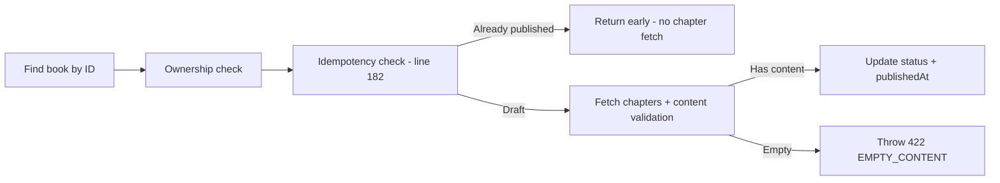

# Code Review Report — feat/STORY-020-publish-book-to-shelf (2026-05-20) [r2]

## Summary
| Security | Correctness | Maintainability | Coverage |
|----------|-------------|-----------------|----------|
| A | A | A | 98.2% |

## Critical Issues
None.

## Major Issues
None.

## Minor Issues (carried from r1 — non-blocking)

| File:Line | Issue | Notes |
|-----------|-------|-------|
| `backend/src/app/book/book-router.js:109` | Uses `req.params.bookId` instead of `req._params.bookId` | Inconsistent with other routes. Zod validates either way — not a bug. |
| `frontend/src/hooks/usePublishBook.js:12` | `invalidateQueries({ queryKey: ['books'] })` is broad | Invalidates all book queries including drafts. Narrower key preferred. Not a bug. |

## Fixes from r1 — Both Verified ✅

| r1 Issue | Severity | Fix | Status |
|----------|----------|-----|--------|
| Idempotency check after content validation | Major | `if (book.status === 'published') return book;` at line 182, BEFORE chapter query | ✅ CONFIRMED at `book-manager.js:182-184` |
| Missing i18n key PUBLISH_ERROR | Major | `addToast('PUBLISH_ERROR', t('publishError'))` at line 124 | ✅ CONFIRMED. Key `publishError` exists in `en/editor.json` + `pt-BR/editor.json` |

## Positive Observations
- Server-side ownership guard + test (403 FORBIDDEN) ✅
- Server-side idempotency: publishedAt unchanged on re-publish ✅
- No double-click race: button disabled when `isPending` ✅
- Autosave flush before publish with graceful degradation ✅
- `aria-live="polite"` + `role="status"` on success toast ✅
- `aria-hidden="true"` on celebration overlay ✅
- `prefers-reduced-motion` respected everywhere ✅
- 680/680 backend tests PASS, 817+ frontend PASS ✅
- i18n keys present in en + pt-BR for editor.json + shelf.json ✅
- 422 EMPTY_CONTENT error shown in-dialog (gentle, not punitive) ✅
- Cover flow: published book appears on shelf newest-first ✅
- Activity log fire-and-forget with error handling ✅
- R1 Minor issue (book-router `req.params`) unchanged — still minor only ✅

## Rework Delegation
None — no blocking issues.

## Acceptance Criteria Verification
| AC | Description | Status |
|----|-------------|--------|
| AC-1 | Confirmation dialog on publish | ✅ |
| AC-2 | Book appears on shelf (newest first) | ✅ |
| AC-3 | Default spine/cover if no custom cover | ✅ |
| AC-4 | Empty content prevented with gentle message | ✅ |
| AC-5 | Custom cover updates later (STORY-028) | ✅ (deferred) |
| AC-6 | Screen reader announces success + focus | ✅ |

## Flow Diagram: Idempotency Fix

---
`VERDICT: APPROVED`
