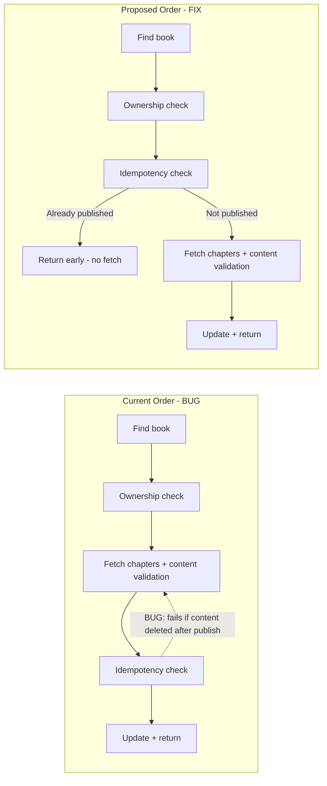

# Code Review Report — feat/STORY-020-publish-book-to-shelf (2026-05-20) [r1]

## Summary
| Security | Correctness | Maintainability | Coverage |
|----------|-------------|-----------------|----------|
| A | B | A | 98.2% |

## Critical Issues
None.

## Major Issues

| File:Line | Issue | Suggested Fix |
|-----------|-------|---------------|
| `backend/src/app/book/book-manager.js:182-192` | **Idempotency check after content validation** — re-publishing already-published book that lost content (soft-deleted chapter / emptied content) throws 422 instead of returning book. Unnecessary chapter fetch for every re-publish. QA flagged this. | Move idempotency check before content validation: `if (book.status === 'published') return book;` should come immediately after ownership check (line 180), before `findChaptersByBook`. |
| `frontend/src/app/editor/EditorPage.jsx:124` | **Missing i18n key `PUBLISH_ERROR`** — `addToast('PUBLISH_ERROR', null)` writes toast with no translation in `errors.json`. React-i18next fallback shows raw key `PUBLISH_ERROR` to child user. | Add `"PUBLISH_ERROR": "Something went wrong. Please try again."` to both `en/errors.json` and `pt-BR/errors.json`. Or use `addToast('INTERNAL_ERROR', null)` instead (key already exists). |

## Minor Suggestions

| File:Line | Issue | Fix |
|-----------|-------|---------------|
| `backend/src/app/book/book-router.js:109` | Uses `req.params.bookId` instead of `req._params.bookId` (inconsistent with other routes). All other book routes use the validated `req._params` field. | Change to `req._params.bookId` for consistency. Not a bug — Zod validation ensures value is same. |
| `backend/src/app/book/__tests__/publish-route.test.js:144` | Idempotency test (test 5) does not cover edge case: "already published but all content deleted" — this would fail 422 with current code order. | Add test: create published book, delete/empty all chapter content, re-publish → expect 200 (idempotent, no content check). Only relevant if idempotency check order not fixed. |
| `frontend/src/hooks/usePublishBook.js:12` | `invalidateQueries({ queryKey: ['books'] })` is broad — invalidates all books queries including drafts list. Narrower would target published books only. | Consider `queryKey: ['books', 'published']` if query key convention supports it. Not a bug — existing behavior. |

## Positive Observations
- Server-side ownership guard present and tested (403 FORBIDDEN) ✅
- Server-side idempotency works for normal case (publishedAt unchanged on re-publish) ✅
- Autosave flush before publish with graceful degradation ✅
- Dialog focus trap (Flowbite Modal + Escape key) ✅
- `aria-live="polite"` + `role="status"` on success toast ✅
- `aria-hidden="true"` on celebration overlay ✅
- `prefers-reduced-motion` respected in both CelebrationOverlay and BookshelfGridLayout ✅
- 10 backend tests, 10/10 passing, all defined test cases covered ✅
- 817 frontend tests, 0 failures ✅
- All i18n keys present in both `en` and `pt-BR` for editor.json and shelf.json ✅
- Child-friendly error messages (no technical leak) ✅
- `book-highlight-ring` CSS includes `prefers-reduced-motion: reduce` break ✅
- 422 EMPTY_CONTENT error shown in-dialog (gentle, not punitive) ✅
- No double-click race: button disabled when `isPending` ✅

## Rework Delegation
| Agent | File:Line | Issue |
|-------|-----------|-------|
| BackendDeveloper | `backend/src/app/book/book-manager.js:182-192` | Move idempotency check before content validation |
| BackendDeveloper | `backend/src/app/book/book-router.js:109` | Use `req._params.bookId` for consistency (optional) |
| FrontendDeveloper | `frontend/src/app/editor/EditorPage.jsx:124` | Add `PUBLISH_ERROR` to errors.json or use existing `INTERNAL_ERROR` |

## Flow Diagram: Current vs Proposed Order

`VERDICT: BLOCKED — requires rework`
