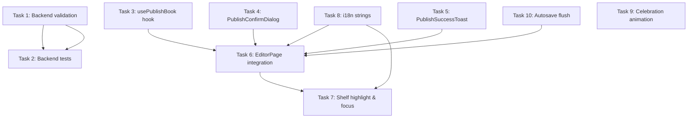

# STORY-020 Implementation Plan: Publish Book to Shelf

**Epic**: EPIC-003  
**Dependencies**: STORY-016, STORY-019  
**Technical Analysis**: `/docs/stories/STORY-020-technical-analysis.md`

---

## Subtask Breakdown

### Task 1: Backend — Chapter Content Validation in publishBookManager

**Files to modify:**
- `backend/src/app/book/book-manager.js`

**Changes:**
1. In `publishBookManager()`, after ownership check and before status update:
   - Call `findChaptersByBook(bookId)` to fetch all non-deleted chapters
   - Validate at least one chapter has non-empty `content` (after `.trim()`)
   - If no content found, throw error with `code: 'EMPTY_CONTENT'`, `status: 422`, friendly message
2. Import `findChaptersByBook` from `book-dao.js` (already imported in the module scope? check — it's used in `getChaptersByBookManager`)

**Validation logic:**
```javascript
const chapters = await findChaptersByBook(bookId);
const hasContent = chapters.some(ch => (ch.content || '').trim().length > 0);
if (!hasContent) {
  const err = new Error('Write something first! Your book needs at least one chapter with content.');
  err.code = 'EMPTY_CONTENT';
  err.status = 422;
  throw err;
}
```

**Test coverage:**
- Publish book with 0 chapters → 422 EMPTY_CONTENT
- Publish book with chapters but all empty content → 422 EMPTY_CONTENT
- Publish book with 1 chapter that has only whitespace → 422 EMPTY_CONTENT
- Publish book with at least 1 chapter with content → 200 OK
- Publish already-published book → 200 OK (idempotent)
- Publish book owned by another user → 403 FORBIDDEN
- Publish non-existent book → 404 NOT_FOUND

---

### Task 2: Backend — Integration Tests for Publish Endpoint

**Files to create:**
- `backend/src/app/book/__tests__/publish-route.test.js`

**Test cases:**
1. `POST /api/v1/books/:bookId/publish — 200 publishes a draft book with content`
2. `POST /api/v1/books/:bookId/publish — 422 EMPTY_CONTENT for book with no chapters`
3. `POST /api/v1/books/:bookId/publish — 422 EMPTY_CONTENT for book with only empty chapters`
4. `POST /api/v1/books/:bookId/publish — 422 EMPTY_CONTENT for book with only whitespace content`
5. `POST /api/v1/books/:bookId/publish — 200 idempotent when book already published`
6. `POST /api/v1/books/:bookId/publish — 403 FORBIDDEN for non-owner`
7. `POST /api/v1/books/:bookId/publish — 404 NOT_FOUND for non-existent book`
8. `POST /api/v1/books/:bookId/publish — 200 sets publishedAt timestamp`
9. `POST /api/v1/books/:bookId/publish — 401 without auth header`
10. `POST /api/v1/books/:bookId/publish — publishes book with exactly one chapter with content`

**Setup:** Same pattern as `book-router.test.js` — supertest + in-memory MongoDB + JWT auth

---

### Task 3: Frontend — usePublishBook Hook

**Files to create:**
- `frontend/src/hooks/usePublishBook.js`

**Implementation:**
```javascript
import { useMutation, useQueryClient } from '@tanstack/react-query';
import apiClient from '../lib/api-client';

export default function usePublishBook() {
  const queryClient = useQueryClient();

  return useMutation({
    mutationFn: async (bookId) => {
      const { data } = await apiClient.post(`/v1/books/${bookId}/publish`);
      return data;
    },
    onSuccess: () => {
      // Invalidate both published and all books queries
      queryClient.invalidateQueries({ queryKey: ['books'] });
    },
  });
}
```

**Design decisions:**
- TanStack Query mutation for automatic loading/error state
- Invalidate all `['books']` queries on success so shelf refreshes
- No optimistic update — wait for server confirmation
- Expose `isPending`, `isError`, `error`, `mutate`, `mutateAsync`

---

### Task 4: Frontend — PublishConfirmDialog Component

**Files to create:**
- `frontend/src/components/editor/PublishConfirmDialog.jsx`

**Requirements:**
- Accessible modal dialog (Flowbite `Modal` component or custom with ARIA)
- Focus trap: Tab cycles within dialog, Escape closes
- Auto-focuses the "Cancel" button on open (safe default)
- Confirmation text: "Your book will appear on your shelf for everyone to see!"
- Two buttons: "Cancel" (secondary) and "Publish to My Shelf" (primary/amber)
- i18n strings from `editor` namespace
- Text contrast 4.5:1 (NFR-ACC-04)
- When `isPublishing` → disable both buttons, show spinner on primary
- `onConfirm` and `onCancel` callbacks

**Props:**
- `isOpen: boolean`
- `onConfirm: () => void`
- `onCancel: () => void`
- `isPublishing: boolean`
- `bookTitle: string` (for display in dialog)

---

### Task 5: Frontend — PublishSuccessToast Component

**Files to create:**
- `frontend/src/components/editor/PublishSuccessToast.jsx`

**Requirements:**
- Celebratory message: "Your book is now on your shelf!"
- Optional sparkle/confetti animation (respects `prefers-reduced-motion`)
- `aria-live="polite"` for screen reader announcement
- Auto-dismiss after 4 seconds
- "Go to my shelf" link/button

**Props:**
- `isOpen: boolean`
- `bookId: string`
- `onDismiss: () => void`

---

### Task 6: Frontend — EditorPage Publish Integration

**Files to modify:**
- `frontend/src/app/editor/EditorPage.jsx`

**Changes:**
1. Import `usePublishBook` hook
2. Import `PublishConfirmDialog` component
3. Import `PublishSuccessToast` component (or use existing toast system)
4. Add state: `isPublishDialogOpen`, `isPublishing`
5. Add "Publish to My Shelf" button in editor header area:
   - Only shown if `book.status === 'draft'` (need to fetch book data or pass as prop)
   - Disabled if `isPublishing`
   - Amber/gold styling, icon button
6. Handle publish flow:
   - On "Publish" click → set `isPublishDialogOpen = true`
   - On dialog confirm → call `publishBook.mutateAsync(bookId)`
   - On success → show success toast + navigate to `/shelf?highlight=${bookId}`
   - On 422 EMPTY_CONTENT → show validation message in dialog
   - On error → show error toast
7. Import `useParams` to get `bookId`
8. Need book status: add a query for book data (`useBookQuery`) or pass via route state

**Button placement**: Top-right of editor, next to AutoSaveIndicator, styled as amber/gold CTA

---

### Task 7: Frontend — Shelf Highlight & Focus After Publish

**Files to modify:**
- `frontend/src/app/shelf/ShelfPage.jsx`
- `frontend/src/app/shelf/BookshelfGridLayout.jsx`

**Changes to ShelfPage:**
1. Parse `?highlight=<bookId>` from URL using `useSearchParams`
2. Pass `highlightBookId` prop to `BookshelfGridLayout`

**Changes to BookshelfGridLayout:**
1. Accept `highlightBookId` prop
2. After books load, if `highlightBookId` exists:
   - Scroll the highlighted book into view (`element.scrollIntoView({ behavior: 'smooth', block: 'center' })`)
   - Add temporary highlight animation (glow/pulse border, 2-3s)
   - Set focus on the book spine element for screen readers
3. Add `useEffect` with cleanup to remove highlight after animation

**Accessibility:**
- After publish navigation, screen reader announces: "Your book is now on your shelf!"
- Focus moves to highlighted book spine element
- `aria-describedby` or `aria-label` on highlighted element

---

### Task 8: Frontend — i18n Strings

**Files to modify:**
- `frontend/src/i18n/locales/en/editor.json`
- `frontend/src/i18n/locales/pt-BR/editor.json`
- `frontend/src/i18n/locales/en/shelf.json`
- `frontend/src/i18n/locales/pt-BR/shelf.json`

**English editor strings:**
```json
{
  "publishButton": "Publish to My Shelf",
  "publishConfirmTitle": "Publish Your Book",
  "publishConfirmMessage": "Your book \"{{title}}\" will appear on your shelf. You can still keep editing it!",
  "publishConfirmButton": "Publish to My Shelf",
  "publishCancelButton": "Cancel",
  "publishing": "Publishing…",
  "publishEmptyContent": "Write something first! Your book needs at least one chapter with content.",
  "publishError": "Something went wrong. Please try again.",
  "publishSuccessAnnouncement": "Your book is now on your shelf!"
}
```

**English shelf strings:**
```json
{
  "highlightNew": "New on your shelf!",
  "goToShelf": "Go to my shelf"
}
```

**Portuguese equivalents** for `pt-BR` namespace.

---

### Task 9: Frontend — Celebration Animation (Confetti/Sparkle)

**Files to create:**
- `frontend/src/components/editor/CelebrationOverlay.jsx`

**Implementation:**
- Use Framer Motion for simple particle effects (stars, sparkles rising)
- Check `useReducedMotion()` — skip animation entirely if reduced motion preferred
- Render as a fixed overlay that fades out after 2-3 seconds
- No emoji in production — use geometric shapes or SVG sparkles
- Clean, not distracting — 5-8 particles max

**Alternative**: Use `canvas-confetti` library if available, or simple CSS keyframe animation. Prefer minimal dependencies.

---

### Task 10: Frontend — Autosave Flush Before Publish

**Files to modify:**
- `frontend/src/services/autosave-service.js`

**Changes:**
1. Add `flushDraftsForBook(bookId)` method that:
   - Gets all pending drafts for the book's chapters from IndexedDB
   - Sends each via `PUT /api/v1/chapters/:chapterId` (or the existing update endpoint)
   - Returns a Promise that resolves when all flushes complete (or times out)
2. This is defensive — the server validates content regardless, but ensures the latest content is on the server before publish

**Usage in EditorPage:**
```javascript
const handlePublishClick = async () => {
  // Force-flush any pending autosave for this book
  try {
    await autosaveService.flushDraftsForBook(bookId);
  } catch {
    // Continue with publish even if flush fails — server validates
  }
  setIsPublishDialogOpen(true);
};
```

---

## Execution Order

```
Task 1 (Backend: chapter validation) ──────────────────────────┐
                                                                │
Task 2 (Backend: integration tests) ──── depends on Task 1 ───┤
                                                                │
Task 3 (Frontend: usePublishBook hook) ────────────────────────┤
Task 4 (Frontend: PublishConfirmDialog) ──────────────────────┤
Task 5 (Frontend: PublishSuccessToast) ────────────────────────┤  Parallel group
Task 8 (Frontend: i18n strings) ───────────────────────────────┤
Task 10 (Frontend: autosave flush) ────────────────────────────┤
Task 9 (Frontend: celebration animation) ─────────────────────┘
                                                                │
Task 6 (Frontend: EditorPage integration) ─── depends on 3,4,5,8,10 ──┐
                                                                        │
Task 7 (Frontend: shelf highlight & focus) ─── depends on 8 ────────────┘
```



**Parallel groups that can run simultaneously:**
- Tasks 3, 4, 5, 8, 9, 10 (all independent frontend components)
- Task 1 + Tasks 3-10 (backend and frontend are independent)

**Sequential dependencies:**
- Task 2 depends on Task 1
- Task 6 depends on Tasks 3, 4, 5, 8, 10
- Task 7 depends on Task 8 (and ideally Task 6 for nav integration)

---

## Test Coverage Requirements

### Backend
- [ ] `publish-route.test.js`: All 10 test cases listed in Task 2
- [ ] Verify P95 response time < 500ms for publish endpoint
- [ ] Test with 50 chapters (edge case for content validation performance)

### Frontend
- [ ] Unit test for `usePublishBook` hook (mock API)
- [ ] Unit test for `PublishConfirmDialog` (render, keyboard navigation, focus management)
- [ ] Unit test for `PublishSuccessToast` (animation, aria-live)
- [ ] Integration test: EditorPage → click publish → confirm → success → navigation
- [ ] Integration test: EditorPage → publish empty book → validation message shows
- [ ] Integration test: ShelfPage → highlight query param → scroll and focus
- [ ] Accessibility test: keyboard-only publish flow
- [ ] Accessibility test: screen reader announcements

### E2E (manual QA per story)
- [ ] Full publish flow: draft → publish → shelf render → reader open
- [ ] Publish empty book (0 chapters or empty content) → gentle message
- [ ] Double-click publish button → only one publish (button disabled, server idempotent)
- [ ] Publish while autosave in progress → no data loss
- [ ] Screen reader: publish confirmation announced, success announced, focus to shelf
- [ ] `prefers-reduced-motion`: no confetti, still show success toast