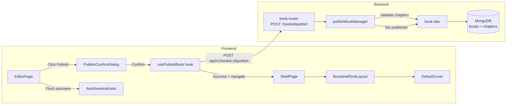
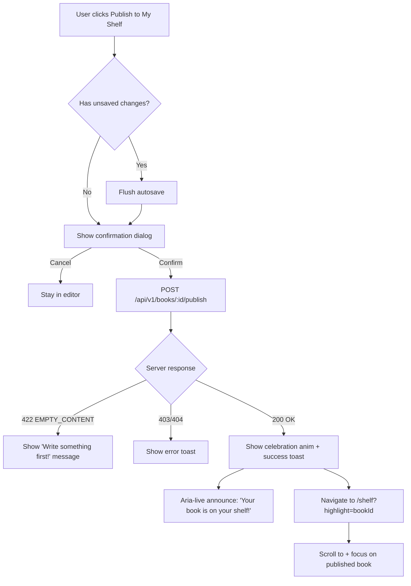

# STORY-020 Technical Analysis: Publish Book to Shelf

**Epic**: EPIC-003  
**Persona**: Julia — The Young Author  
**Priority**: Must Have  
**Story Points**: 5  
**Dependencies**: STORY-016 (Create a New Book), STORY-019 (Autosave)

---

## Stack Reference

- **Source**: `docs/architecture/TECH-STACK.md` (greenfield, project-created)
- **Runtime**: Node.js 22 LTS (ESM)
- **API**: Express 4.x
- **Database**: MongoDB 7 (Mongoose 8.x ODM)
- **Frontend**: React 18 + Vite 5.x + Tailwind CSS 3.x + Flowbite React
- **State**: Zustand + TanStack Query
- **i18n**: react-i18next
- **Animations**: Framer Motion
- **Validation**: Zod (server-side)

### Frontend-Backend Integration Pattern

Node.js fullstack — shared concerns via API contract. Frontend SPA calls Express API via `apiClient` (axios). JWT auth. Single repo. No SSR.

---

## Existing Codebase Analysis

### Backend — Impacted Files

| File | Purpose | Impact |
|------|---------|--------|
| `backend/src/app/book/book-model.js` | Book, Chapter, Asset, ReadingProgress, ActivityLog schemas | ✅ Already has `status: 'draft'|'published'|'archived'`, `publishedAt`, `spineColor` virtual |
| `backend/src/app/book/book-dao.js` | Data access for books, chapters, assets | 🔧 Need `countChaptersWithContent` or reuse `findChaptersByBook` |
| `backend/src/app/book/book-manager.js` | Business logic managers | 🔧 `publishBookManager` exists but **lacks chapter content validation** |
| `backend/src/app/book/book-router.js` | HTTP routes for books | ✅ `POST /:bookId/publish` route exists |
| `backend/src/app/common/validation-schemas.js` | Zod schemas | ✅ `bookIdSchema` already validates publish params |
| `backend/src/app/book/__tests__/book-router.test.js` | Integration tests | 🔧 Need publish-specific test cases |

### Frontend — Impacted Files

| File | Purpose | Impact |
|------|---------|--------|
| `frontend/src/app/editor/EditorPage.jsx` | Main editor page | 🔧 Add "Publish to My Shelf" button |
| `frontend/src/app/shelf/ShelfPage.jsx` | Bookshelf page | 🔧 Handle navigation from publish with scroll-to-book |
| `frontend/src/app/shelf/BookshelfGridLayout.jsx` | Orchestrator for shelf | 🔧 Handle highlight/focus for newly published book |
| `frontend/src/hooks/useBooksQuery.js` | TanStack Query hook for books | 🔧 May need to invalidate cache after publish |
| `frontend/src/stores/book-store.js` | Zustand book store | 🔧 May need update after publish |
| `frontend/src/lib/api-client.js` | Axios client | ✅ Already handles auth, refresh |
| `frontend/src/services/autosave-service.js` | IndexedDB autosave | 🔧 Must flush pending saves before publish |
| `frontend/src/lib/spine-colors.js` | Deterministic spine color | ✅ Already used for default covers |
| `frontend/src/components/shelf/DefaultCover.jsx` | Default cover component | ✅ Already renders title-based covers |
| `frontend/src/i18n/locales/en/editor.json` | Editor i18n | 🔧 Add publish-related strings |
| `frontend/src/i18n/locales/pt-BR/editor.json` | Editor i18n (PT) | 🔧 Add publish-related strings |
| `frontend/src/i18n/locales/en/shelf.json` | Shelf i18n | 🔧 Add publish success strings |
| `frontend/src/i18n/locales/pt-BR/shelf.json` | Shelf i18n (PT) | 🔧 Add publish success strings |

### Models — Current State

**Book Schema** (already has publish fields):
- `status`: enum `['draft', 'published', 'archived']`, default `'draft'`
- `publishedAt`: Date, default `null`
- `coverAssetId`: ObjectId ref Asset, default `null`
- `spineColor`: virtual — deterministic pastel from `book._id`

**Chapter Schema**:
- `content`: String, default `''`
- `wordCount`: Number, default `0`

**ActivityLog Schema**: action enum includes `'book.publish'` (already logged in publishBookManager)

---

## NFR Analysis

| NFR | Requirement | Implementation Strategy |
|-----|-------------|------------------------|
| **NFR-PERF-05** | Publish API P95 < 500ms | Existing `publishBookManager` is fast; add chapter validation query with index. MongoDB `{ bookId: 1, deletedAt: 1 }` index exists. |
| **NFR-ACC-01** | WCAG 2.1 AA — publish dialog keyboard accessible | Flowbite `Modal` or custom dialog with focus trap, Escape to close, Tab cycle. |
| **NFR-ACC-03** | Screen reader announces publish success | `aria-live="polite"` region for success toast; focus management to shelf book after navigation. |
| **NFR-ACC-04** | Confirmation dialog contrast 4.5:1 | Tailwind color tokens; verify text/bg contrast. |
| **NFR-SEC-04** | Server-side status change validation | `publishBookManager` validates ownership + chapter content; no client-only checks. |

---

## Persona Impact

**Julia (Young Author)**:
- Publish flow must feel celebratory (confetti/sparkle) but respect `prefers-reduced-motion`
- Gentle validation messaging, never punitive ("Write something first!" not "ERROR: NO CONTENT")
- Focus moves naturally from editor → shelf after publishing

---

## Technical Design

### Backend: `publishBookManager` Enhancement

Current `publishBookManager` does:
1. ✅ Verify book exists
2. ✅ Verify ownership
3. ✅ Idempotent — returns book if already published
4. ✅ Sets `status: 'published'` + `publishedAt: new Date()`
5. ✅ Creates activity log

**Missing**:
- ❌ Validate at least one chapter has non-empty content (trim whitespace before check)
- ❌ Return validation error with child-friendly message

**Proposed changes** to `book-manager.js`:

```javascript
export async function publishBookManager(bookId, authorId) {
  const book = await findBookById(bookId);
  if (!book) { /* existing 404 */ }
  if (book.authorId.toString() !== authorId.toString()) { /* existing 403 */ }
  if (book.status === 'published') { return book; /* idempotent */ }

  // NEW: Validate at least one chapter with non-empty content
  const chapters = await findChaptersByBook(bookId);
  const hasContent = chapters.some(ch => (ch.content || '').trim().length > 0);
  if (!hasContent) {
    const err = new Error('Write something first! Your book needs at least one chapter with content.');
    err.code = 'EMPTY_CONTENT';
    err.status = 422;
    throw err;
  }

  const updated = await updateBookById(bookId, { status: 'published', publishedAt: new Date() });
  // ... activity log ...
  return updated;
}
```

### Frontend: Publish Flow

**New components**:
- `PublishConfirmDialog.jsx` — Accessible modal with confirmation prompt
- `PublishSuccessToast.jsx` — Celebratory toast with accessibility announce
- `usePublishBook.js` — TanStack Query mutation hook for `POST /api/v1/books/:id/publish`

**EditorPage integration**:
- Add "Publish to My Shelf" button in editor header/toolbar
- On click → check for unsaved content (flush autosave) → show confirmation dialog
- On confirm → call `usePublishBook` mutation
- On success → show confetti/sparkle (respects `prefers-reduced-motion`) → navigate to `/shelf` with `?highlight=<bookId>` query param

**ShelfPage integration**:
- Parse `?highlight=<bookId>` from URL
- Scroll to and highlight the newly published book
- Focus management: set focus on the book spine after animation

### Idempotency & Race Conditions

**Double-click protection**: Disable publish button immediately on click; use mutation state (`isPending`).

**Autosave race condition**: When user clicks "Publish":
1. Force-flush any pending autosave for all chapters in the book
2. Wait for flush to complete (or timeout 3s)
3. Then send publish request
4. If autosave flush fails, still proceed with publish (server validates content)

**Server-side idempotency**: Already handled — `publishBookManager` returns the book unchanged if `status === 'published'`.

### Default Cover/Spine Integration with STORY-028

The `spineColor` virtual already exists on the Book model. The `DefaultCover.jsx` component already renders title-based covers. The `book-dao.js` `findBooksByAuthor` returns `spineColor` via `lean({ virtuals: true })` when `{ status: 'published' }` is queried.

**Integration point**: After publish, the shelf query (`GET /api/v1/books?status=published`) returns books with `spineColor` and `coverAssetId`. If `coverAssetId === null`, the frontend renders `<DefaultCover />`. This is already the existing behavior — no backend changes needed for this integration.

---

## Architecture Diagram



## Execution Flow



---

## Risk Assessment

| Risk | Likelihood | Impact | Mitigation |
|------|-----------|--------|------------|
| Autosave in-progress when publish clicked | Medium | Data loss | Force-flush autosave before publish; server validates content |
| Double-click publish | Low | Duplicate requests | Disable button on click; server idempotent |
| Very long chapter content slows validation | Low | P95 violation | Use `countDocuments` with content regex or add `hasContent` flag to chapter schema |
| Navigation fails after publish | Low | Confusion | Publish is server-confirmed; local success toast before nav; shelf query refetches |
| STORY-028 not yet implemented | Medium | No custom covers | DefaultCover fallback already works; coverAssetId=null → default color |

---

## Impacted Files Summary

### Backend (modify existing)
1. `backend/src/app/book/book-manager.js` — Add chapter content validation
2. `backend/src/app/book/__tests__/book-router.test.js` — Add publish test cases

### Frontend (new files)
1. `frontend/src/hooks/usePublishBook.js` — TanStack mutation hook
2. `frontend/src/components/editor/PublishConfirmDialog.jsx` — Accessible confirmation modal
3. `frontend/src/components/editor/PublishSuccessToast.jsx` — Celebratory success toast

### Frontend (modify existing)
1. `frontend/src/app/editor/EditorPage.jsx` — Add publish button + dialog integration
2. `frontend/src/app/shelf/ShelfPage.jsx` — Handle `?highlight=` query param
3. `frontend/src/app/shelf/BookshelfGridLayout.jsx` — Scroll to + highlight book
4. `frontend/src/i18n/locales/en/editor.json` — Add publish i18n strings
5. `frontend/src/i18n/locales/pt-BR/editor.json` — Add publish i18n strings
6. `frontend/src/i18n/locales/en/shelf.json` — Add shelf highlight strings
7. `frontend/src/i18n/locales/pt-BR/shelf.json` — Add shelf highlight strings

### Backend (new test files)
1. `backend/src/app/book/__tests__/publish-route.test.js` — Dedicated publish integration tests