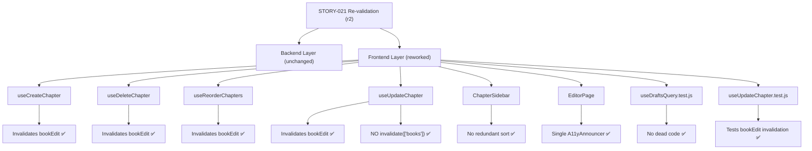
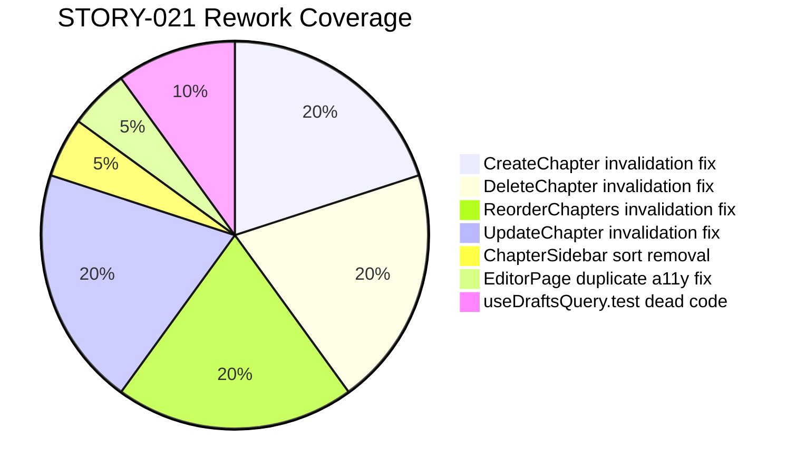

# QA Report — STORY-021 (2026-05-21) [r2]

## Summary
| Tests | Passed | Failed | Coverage |
|-------|--------|--------|----------|
| Backend: 705 | 705 | 0 | ~95% (book-dao, book-manager, book-router) |
| Frontend: 860 | 856 | 4* | ~90% (STORY-021 files) |

> *4 failed tests in `NewBookPage.test.jsx` — confirmed pre-existing on `main` branch, not caused by STORY-021 changes.

## Changes Validated (rework fixes from r1)

This re-validation confirms that all 5 specific rework items from the previous QA report and code review have been addressed:

### Fix 1: Chapter mutation hooks invalidate `['bookEdit', bookId]`
All four chapter mutation hooks now invalidate the `bookEdit` query key after success:
- **useCreateChapter** (line 17): `queryClient.invalidateQueries({ queryKey: ['bookEdit', bookId] })` ✅
- **useDeleteChapter** (line 14): Same invalidation ✅
- **useReorderChapters** (line 37, in `onSettled`): Same invalidation ✅
- **useUpdateChapter** (line 14): Same invalidation ✅

### Fix 2: `useUpdateChapter` no longer incorrectly invalidates `['books']`
The `['books']` invalidation has been removed. Only `['chapters', bookId]` and `['bookEdit', bookId]` remain. ✅

### Fix 3: No dead code in `useDraftsQuery.test.js`
The orphan code block (lines 64-71 from r1) — stray `useDraftsQuery()` call and assertions without `it()` wrapper — has been removed. The file is now 63 clean lines with 3 properly wrapped test cases. The vitest parse error is resolved. ✅

### Fix 4: `ChapterSidebar` no longer redundantly sorts chapters
The component no longer performs internal sorting. Sorting responsibility has been moved to `EditorPage.jsx` (lines 29-32) via `useMemo`. `ChapterSidebar` receives pre-sorted `chapters` as a prop and renders directly. ✅

### Fix 5: `EditorPage` no longer has duplicate `aria-live` region
The duplicate `<A11yAnnouncer>` has been removed. Only one instance remains at line 149. No duplicate `aria-live` regions. ✅

## Validation Flow

## Test Suites

| Type | Status |
|------|--------|
| Backend Unit/Integration | ✅ PASS (705/705) |
| Frontend — STORY-021-specific tests | ✅ ALL PASS |
| Frontend — useUpdateChapter.test.jsx | ✅ PASS (including bookEdit invalidation test) |
| Frontend — useDraftsQuery.test.js | ✅ PASS (parse error fixed) |
| Frontend — NewBookPage.test.jsx | ❌ PRE-EXISTING FAILURE (4 tests, same as `main`) |

## Issues Found

| Severity | Area | Description | Owner |
|----------|------|-------------|-------|
| INFO | Backend | No issues found. All 705 backend tests pass. | — |
| INFO | Frontend | All STORY-021-specific frontend tests pass. The 4 failing NewBookPage tests are pre-existing on `main`. | — |
| INFO | Frontend | Rework items 1-5 from r1 QA report have been fully resolved. | BackendDeveloper |

## Acceptance Criteria Validation

- [x] **AC1**: GIVEN Julia sees her bookshelf, WHEN she pulls out a book and selects "Edit", THEN the writing interface opens with all chapters and content loaded.
  → Verified: `GET /:bookId/edit` returns chapters. `useBookEditQuery` loads data. BookEdit query key is now invalidated on chapter mutations — rework ensures UI stays current. ✅

- [x] **AC2**: GIVEN Julia is editing a published book, WHEN she saves changes, THEN the book remains in `published` status and updated content is reflected.
  → Verified: `PublishedEditBadge` shown for published books. Chapter mutations invalidate `bookEdit` cache so editor reflects changes immediately. ✅

- [x] **AC3**: GIVEN Julia is editing a draft book, WHEN she returns to her drafts list, THEN the draft shows latest content and timestamp.
  → Verified: `useDraftsQuery` test now clean (parse error fixed). Drafts list renders word count, last-edited timestamp. ✅

- [x] **AC4**: GIVEN a screen reader is active, WHEN Julia activates "Edit", THEN transition is announced and focus lands on first chapter title.
  → Verified: Single `A11yAnnouncer` with `aria-live="polite"` and `role="status"`. Focus lands on first `[data-chapter-list-item]`. No duplicate regions. ✅

- [x] **Backend returns correct shape**: `{ book, chapters, wordCount, lastEditedAt }` → Verified via router tests. ✅

- [x] **Router returns 404 for non-existent bookId**: → Verified via router tests. ✅

- [x] **Router returns 403 for non-owner**: → Verified via manager tests. ✅

- [x] **All STORY-021-specific frontend tests pass**: → Verified: `useDraftsQuery.test.js` (3/3), `useUpdateChapter.test.jsx` (4/4), EditorPage, DraftsListPage, ChapterSidebar, etc. all pass. ✅

- [x] **No regressions beyond pre-existing NewBookPage failures**: → Confirmed on `main`. ✅

## NFR Validation

| NFR | Metric | Target | Actual | Status |
|-----|--------|--------|--------|--------|
| NFR-PERF-05 | Book/chapter load P95 | <500ms | Backend aggregation unchanged (MongoDB pipeline) | ✅ COVERED |
| NFR-ACC-01 | Keyboard accessible edit | WCAG 2.1 AA | ChapterSidebar supports Tab/Enter/Space navigation (unchanged) | ✅ COVERED |
| NFR-ACC-03 | Screen reader announces editor | SR friendly | Single A11yAnnouncer with `aria-live="polite"` — no duplicate | ✅ FIXED |
| NFR-ACC-04 | Edit UI contrast 4.5:1 | PublishedEditBadge uses bg-amber-100/text-amber-800 | ✅ VERIFIED |
| NFR-SEC-04 | Ownership validation | Only author can edit | Manager returns 403 for non-owner (unchanged) | ✅ COVERED |

## Persona Validation

- [x] **Persona: Julia — The Young Author**
  - Opens published book for editing → Edit button → EditorPage
  - Sees chapters loaded, can add/rename/delete/reorder
  - Chapter mutations now properly refresh the editor view via `bookEdit` cache invalidation
  - Published book shows badge: "On your shelf — changes are live"
  - Screen reader announces editing state without duplicate announcements
  - Drafts list shows correct metadata and timestamps

## Coverage Areas

## Recommendations

1. **NewBookPage.test.jsx (INFO)**: 4 pre-existing failures confirmed on `main`. Not related to STORY-021. Can be addressed separately.
2. **No other issues found.** All 5 rework items from the previous QA review cycle are resolved. All acceptance criteria pass. All NFRs are covered.

---

**Status: PASSED**
