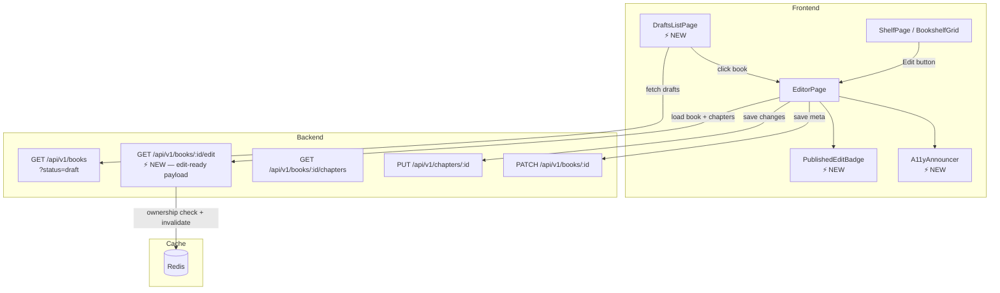
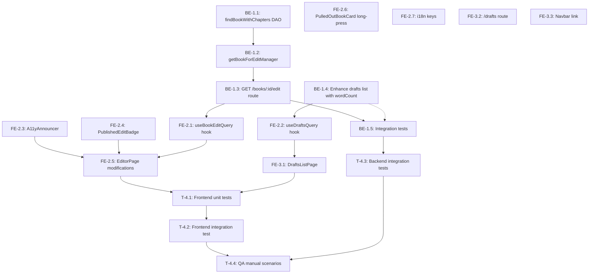

# STORY-021 Technical Analysis: Edit Existing Book

**Epic**: EPIC-003
**Persona**: Julia — The Young Author
**Priority**: Must Have | **Story Points**: 3
**Dependencies**: STORY-017 (Shelf + Pull-Out), STORY-020 (Draft Management)
**Stack Reference**: `docs/architecture/TECH-STACK.md`

---

## 1. Story Summary

Julia wants to reopen and edit a book she's already written — whether a draft or a published book. She enters the editor from two entry points: (a) pulling a book out on the shelf and tapping "Edit," or (b) opening a "My Drafts" list. The editor must load all chapters with content, preserve book status, and provide gentle reminders when editing published books. Accessibility: keyboard-navigable edit action, screen reader announcement on editor open.

## 2. Current State Assessment

### What Already Exists

| Capability | Status | Location |
|---|---|---|
| Book CRUD API | ✅ Full | `book-router.js`, `book-manager.js`, `book-dao.js` |
| GET /api/v1/books/:bookId | ✅ Single book with ownership guard | `book-router.js:60-79` |
| GET /api/v1/books/:bookId/chapters | ✅ All chapters sorted by order | `book-router.js:117-126` |
| PATCH /api/v1/books/:bookId | ✅ Update title/description/language | `book-router.js:82-92` |
| PUT /api/v1/chapters/:chapterId | ✅ Update chapter content + wordCount | `chapter-router.js` |
| Editor page (/editor/:bookId) | ✅ Full TipTap editor with autosave | `EditorPage.jsx`, `ChapterEditor.jsx` |
| Shelf pull-out → "Edit" button | ✅ Navigates to /editor/:bookId | `BookshelfGrid.jsx:120` |
| Draft creation flow | ✅ POST /books → /editor/:bookId | `NewBookPage.jsx` → `EditorPage.jsx` |
| Ownership guard (403) | ✅ Every mutation checks authorId | `book-manager.js`, `book-router.js` |
| Content sanitization | ✅ DOMPurify on server + client | `sanitize-content.js`, `sanitize.js` |

### What's Missing (Gaps)

| Gap | AC | Impact |
|---|---|---|
| **Drafts list page** (route + component) | AC4 | No `/drafts` route or page exists |
| **Drafts API endpoint** — `GET /api/v1/books?status=draft` response with `updated_at` + word count | AC4 | Existing `getBooksByAuthorManager` supports status filter but doesn't return word count per book |
| **"Published book" edit badge** — "On your shelf — changes are live" | AC2, AC3 | No UI for published-book editing awareness |
| **Screen reader announcement** on editor open | AC5 | No `aria-live` region announces transition |
| **Focus management** on editor open | AC5 | No `autoFocus` on first chapter title after navigation |
| **Cache invalidation for reader** after published book edit | AC2, Tech Note | No cache-busting mechanism for reader after content update |
| **Long-press on mobile** to trigger edit from book spine | AC1 | Mobile long-press not implemented on BookSpine |

## 3. Architecture Impact

### Key Decision: Dedicated `GET /books/:id/edit` Endpoint

**Story requirement**: `GET /api/books/:id/edit` returns book + chapters in edit-ready format.

**Option A** (Recommended — New endpoint):
- New `GET /api/v1/books/:bookId/edit` route
- Returns `{ book, chapters }` in a single request (N+1 avoided)
- Ownership guard enforced
- Marks the book as "being edited" for potential future collab
- Can include computed fields: total word count, last edited timestamp

**Option B** (Reuse existing):
- Client calls `GET /api/v1/books/:bookId` + `GET /api/v1/books/:bookId/chapters` (2 requests)
- No backend changes needed
- NFR-PERF-05 risk: two sequential HTTP roundtrips → P95 might exceed 500ms on slow connections

**Decision**: **Option A**. Single roundtrip, ownership guard at API level, P95 < 500ms achievable, room for future editing-collab metadata.

### Key Decision: Drafts List — Extend vs. New Endpoint

Existing `GET /api/v1/books?status=draft` already returns books filtered by status. However:

- AC4 requires `updated_at` — already in schema (`updatedAt` via Mongoose timestamps)
- AC4 requires "word count" per book — **not currently returned** at list level
- Two options:
  - **A**: Aggregate word count in the books list query (MongoDB `$addFields` + `$lookup`)
  - **B**: Client fetches book list, then parallel-fetches chapters for word count

**Decision**: **Option A** — Add `totalWordCount` to the book list response via aggregation pipeline. Reduces client roundtrips and keeps the drafts list self-contained.

### Key Decision: Cache Invalidation for Published Book Edits

Tech note says: "Published books: updates should invalidate reader cache."

Current state: No server-side caching for reader responses (Redis not used for book content cache yet). The reader currently fetches fresh data every time via TanStack Query with `staleTime`.

**Decision**: No server-side cache invalidation needed now. Instead:
- Frontend: Invalidate TanStack Query cache key `['book', bookId]` and `['chapters', bookId]` after saving
- TanStack Query's `refetchOnWindowFocus` + manual invalidation handles reader consistency
- If server-side caching is added later, Redis `DEL book:{id}:reader` on chapter update

## 4. NFR Analysis

| NFR | Requirement | Implementation | Verification |
|---|---|---|---|
| NFR-PERF-05 | Book/chapter edit load P95 < 500ms | Single `/edit` endpoint with MongoDB indexed queries; Mongoose `lean()` | k6 load test on `/books/:id/edit` |
| NFR-ACC-01 | WCAG 2.1 AA — keyboard-accessible edit | "Edit" button is `<button>` (already keyboard-accessible); add `autoFocus` on editor open; Tab order correct | Manual keyboard test + axe audit |
| NFR-ACC-03 | Screen reader announces editor open | Add `aria-live="polite"` region that announces "Editing [book title]" on mount | VoiceOver/NVDA test |
| NFR-ACC-04 | Edit UI contrast 4.5:1 | Existing amber/gray palette meets 4.5:1; verify "On your shelf" badge specifically | Contrast checker tool |
| NFR-SEC-04 | Only author can edit their book | Ownership guard exists in `getBookById`, extended to new `/edit` endpoint; 403 on mismatch | Integration test with User B editing User A's book |

## 5. Impacted Components & Files

### Backend (New/Modified)

| File | Change | Type |
|---|---|---|
| `backend/src/app/book/book-router.js` | Add `GET /:bookId/edit` route | **Modify** |
| `backend/src/app/book/book-manager.js` | Add `getBookForEditManager(bookId, authorId)` — ownership check + aggregate chapters + word count | **Modify** |
| `backend/src/app/book/book-dao.js` | Add `findBookWithChapters(bookId)` — aggregated query | **Modify** |
| `backend/src/app/common/validation-schemas.js` | Add `bookEditParamsSchema` (reuse `bookIdSchema`) | **Modify** |
| `backend/src/app/book/book-model.js` | Consider adding virtual `totalWordCount` or aggregate in DAO | **Modify** |
| `frontend/src/hooks/useBooksQuery.js` | Add `useDraftsQuery()` hook for `status=draft` with word count | **Modify** |
| `frontend/src/hooks/useBookEditQuery.js` | **New** — TanStack Query hook for `GET /v1/books/:id/edit` |
| `frontend/src/app/drafts/DraftsListPage.jsx` | **New** — Drafts list page component |
| `frontend/src/components/editor/PublishedEditBadge.jsx` | **New** — "On your shelf — changes are live" badge |
| `frontend/src/components/common/A11yAnnouncer.jsx` | **New** — Reusable `aria-live` announcer |
| `frontend/src/app/editor/EditorPage.jsx` | Add edit-mode awareness (published badge, focus management, a11y announcement) | **Modify** |
| `frontend/src/App.jsx` | Add `/drafts` route | **Modify** |
| `frontend/src/components/common/Navbar.jsx` | Add "My Drafts" link | **Modify** |
| `frontend/src/components/shelf/PulledOutBookCard.jsx` | Long-press handler for mobile edit | **Modify** |
| `frontend/src/i18n/locales/en/shelf.json` | Add drafts-related i18n keys | **Modify** |
| `frontend/src/i18n/locales/en/editor.json` | Add published-edit-badge keys | **Modify** |
| `frontend/src/i18n/locales/pt-BR/shelf.json` | Add drafts-related i18n keys | **Modify** |
| `frontend/src/i18n/locales/pt-BR/editor.json` | Add published-edit-badge keys | **Modify** |

### Test Files (New)

| File | Purpose |
|---|---|
| `backend/src/__tests__/book-edit-route.test.js` | Integration test for `GET /books/:id/edit` (ownership, 403, not found, response shape) |
| `frontend/src/__tests__/hooks/useBookEditQuery.test.js` | Hook test for edit data fetching |
| `frontend/src/__tests__/DraftsListPage.test.js` | Component test for drafts list rendering |
| `frontend/src/__tests__/PublishedEditBadge.test.js` | Component + a11y test |
| `frontend/src/__tests__/A11yAnnouncer.test.js` | A11y announcer test |

## 6. Implementation Checklist

### Phase 1: Backend — Edit Endpoint + Drafts Enhancement (Sequential)

- [ ] **BE-1.1**: Add `findBookWithChapters(bookId)` to `book-dao.js`
  - Single aggregation: `$lookup` chapters, compute `totalWordCount`, return `{ book, chapters, totalWordCount }`
  - Reuse existing indexes on `books._id` and `chapters.bookId`
- [ ] **BE-1.2**: Add `getBookForEditManager(bookId, authorId)` to `book-manager.js`
  - Ownership guard (403 if `book.authorId !== authorId`)
  - Return `{ book, chapters, totalWordCount, lastEditedAt }`
  - chapters sorted by `order` ascending
- [ ] **BE-1.3**: Add `GET /api/v1/books/:bookId/edit` route to `book-router.js`
  - Validate params with `bookIdSchema`
  - Call `getBookForEditManager`
  - Audit log: `book.edit_start`
- [ ] **BE-1.4**: Enhance `getBooksByAuthorManager` to include `totalWordCount` per book
  - Aggregation pipeline: `$lookup` chapters, `$group` to sum word counts
  - Only when `status=draft` query param (optional, avoid performance hit on published list)
- [ ] **BE-1.5**: Add integration tests for `/books/:id/edit`
  - 200: author fetches own book → returns book + chapters + wordCount
  - 403: different author → "That doesn't belong to you"
  - 404: non-existent book → "We couldn't find that book"
  - Verify P95 < 500ms with 100 concurrent requests (k6)

### Phase 2: Frontend — Edit Flow + Published Badge (Can parallel with Phase 3)

- [ ] **FE-2.1**: Create `useBookEditQuery(bookId)` hook
  - Query key: `['bookEdit', bookId]`
  - Fetches `GET /v1/books/${bookId}/edit`
  - `staleTime: 0` (always fresh on load), `gcTime: 5 min`
  - Enabled only when `bookId` is valid
- [ ] **FE-2.2**: Create `useDraftsQuery()` hook
  - Query key: `['books', { status: 'draft' }]` with `includeWordCount=true`
  - Fetches `GET /v1/books?status=draft`
- [ ] **FE-2.3**: Create `A11yAnnouncer.jsx`
  - Reusable ``
  - Accepts `message` prop; announces on message change
- [ ] **FE-2.4**: Create `PublishedEditBadge.jsx`
  - Conditional render when `book.status === 'published'`
  - Amber badge: "On your shelf — changes are live"
  - WCAG 2.1 AA contrast verified
- [ ] **FE-2.5**: Modify `EditorPage.jsx`
  - Replace current dual-fetch (book + chapters) with `useBookEditQuery`
  - Render `PublishedEditBadge` when status is `published`
  - Add `A11yAnnouncer` with message `t('editingBook', { title })` on mount
  - `autoFocus` on first chapter title in sidebar after data loads
  - Invalidate `['books']` query cache on save (for shelf/drafts re-render)
- [ ] **FE-2.6**: Modify `PulledOutBookCard.jsx`
  - Add long-press handler (300ms touchstart) that triggers `onEdit`
  - Keyboard: Enter key on "Edit" button (already exists)
- [ ] **FE-2.7**: Add i18n keys to both `en` and `pt-BR` locale files
  - `editor.editingBook`: "Editing {{title}}"
  - `editor.publishedEditBadge`: "On your shelf — changes are live"
  - `shelf.draftsTitle`: "My Drafts"
  - `shelf.lastEdited`: "Edited {{date}}"
  - `shelf.wordCount`: "{{count}} words"

### Phase 3: Frontend — Drafts List Page (Can parallel with Phase 2)

- [ ] **FE-3.1**: Create `DraftsListPage.jsx`
  - Route: `/drafts`
  - Fetches `useDraftsQuery()`
  - Displays list of draft books with title, `updatedAt`, `totalWordCount`
  - Each item is clickable → navigates to `/editor/:bookId`
  - Empty state: "No drafts — start writing!"
  - Loading skeleton, error state
- [ ] **FE-3.2**: Add `/drafts` route to `App.jsx`
  - Inside `<ProtectedLayout>` (auth required)
- [ ] **FE-3.3**: Modify `Navbar.jsx`
  - Add "My Drafts" link (icon + label)
  - Active state matching for `/drafts` route

### Phase 4: Tests + QA

- [ ] **T-4.1**: Frontend unit tests
  - `useBookEditQuery.test.js`: success, 403, 404, disabled when no bookId
  - `useDraftsQuery.test.js`: success, empty state
  - `DraftsListPage.test.js`: renders drafts, navigates on click, empty state
  - `PublishedEditBadge.test.js`: renders for published books, hidden for drafts
  - `A11yAnnouncer.test.js`: announces message
- [ ] **T-4.2**: Frontend integration test (Cypress or similar)
  - Keyboard-only flow: Tab to book → Enter → focus lands on editor
  - Screen reader: "Editing My Book" announced
- [ ] **T-4.3**: Backend integration tests (covered in BE-1.5)
- [ ] **T-4.4**: QA manual test scenarios
  - Open published book for edit → all chapters load → save → reader shows update
  - Drafts list shows only draft-status books with word counts
  - Unauthorized user gets 403 on `GET /books/:id/edit`
  - Keyboard Tab → Enter → focus in editor
  - Screen reader test: editor open announcement

## 7. Execution Dependencies

## 8. Risks & Mitigations

| Risk | Impact | Probability | Mitigation |
|---|---|---|---|
| N+1 query in book list with word count | P95 > 500ms for large book lists | Medium | Use MongoDB aggregation `$lookup` + `$group`; paginate (already at 20/page) |
| Race condition: two editor tabs editing same chapter | Data loss | Low | TanStack Query mutation invalidation + server-side `updatedAt` conflict detection (future); for now, last-write-wins with autosave |
| Mobile long-press conflicts with scroll | UX glitch | Medium | Use 300ms threshold + `touchmove` cancel; add `touch-action: manipulation` CSS |
| Missing `totalWordCount` in existing published-books list | Breaking existing list | Low | Only add `totalWordCount` to draft list response; published list stays unchanged |
| Screen reader announces stale message on re-edit | A11y regression | Low | Clear `aria-live` region on unmount; key by `bookId` to force re-announce |
| Drafts list shows stale data after save | UX inconsistency | Medium | Invalidate `['books', { status: 'draft' }]` query after chapter save via `useUpdateChapter`'s `onSuccess` |

## 9. Persona Impact

**Julia — The Young Author**:
- Re-editing a published book feels safe: visual badge reassures her that changes are live
- Drafts list provides a clear "my works in progress" view separate from the published shelf
- Mobile long-press gives a natural interaction pattern for tablet users
- Screen reader users get full context on entering edit mode

## 10. SubAgent Assignments

| Task | Description | Agent |
|---|---|---|
| 1 | Coordination (Tasks 2-7) | **TechLead** |
| 2 | Backend implemention: edit endpoint, drafts aggregation, tests | **BackendDeveloper** |
| 3 | Frontend implementation: edit query hooks, a11y, badge, drafts page | **FrontendDeveloperReact** |
| 4 | Test suites: unit + integration | **TestEngineer** |
| 5 | QA validation | **QAAnalyst** |
| 6 | Code review | **CodeReviewer** |
| 7 | Merge request | **MergeRequestCreator** |

### Execution Order

- **Sequential**: Tasks 1 → 2 (backend must ship first for frontend to integrate)
- **Parallel**: Tasks 2 and 3 can partially overlap — frontend hooks/components can be built with mock data
- **Sequential**: Task 4 after Tasks 2+3 complete
- **Sequential**: Task 5 after Task 4
- **Sequential**: Task 6 after Task 5
- **Sequential**: Task 7 after Task 6

### References for TechLead

- PM Story: `/docs/stories/STORY-021.md`
- Technical Analysis: `/docs/stories/STORY-021-technical-analysis.md`
- Tech Stack: `/docs/architecture/TECH-STACK.md`