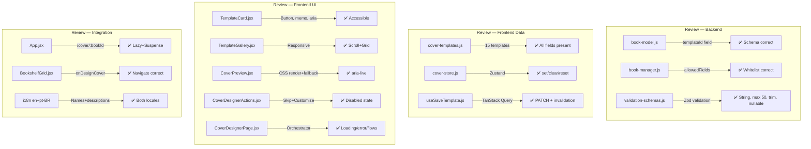

# Code Review Report — feat/STORY-022-cover-designer (2026-05-21)

## Summary

| Security | Correctness | Maintainability | Coverage |
|----------|-------------|-----------------|----------|
| A | A | A | ≥94.44% (100% on 8/9 FE components) |

**Scope**: 15 files reviewed — 3 backend (model, manager, validation) + 12 frontend (components, store, templates, i18n, CSS, routes)

---

## Security Findings — NONE

All NFR-SEC-04/07 requirements satisfied:
- Templates: hardcoded JS objects, zero eval/dynamic imports
- Zero external URLs, no CDN references in any file
- No user-generated content flows through template metadata
- `templateId` backend validation: Zod string, max 50 chars, trim, nullable

## Critical Issues — NONE

## Major Issues — NONE

## Minor Suggestions

| File:Line | Issue | Suggested Fix |
|-----------|-------|---------------|
| `CoverDesignerPage.jsx:1-93` | Store persists across navigations. `useCoverStore` is global Zustand state — if user opens cover designer for Book A, navigates away, then opens Book B, the store may still hold Book A's `selectedTemplateId` until book data loads and effect syncs again (line 22-25). Works due to `!selectedTemplateId` guard but fragile. | Add `useEffect` cleanup: `return () => resetStore()` so unmount clears previous selection. Prevents stale-state race. |
| `CoverDesignerPage.jsx:13` | Blank `catch` blocks in `handleSkip`/`handleCustomize` (lines 37-39, 47-49). Mutation errors silently swallowed. User sees no feedback on save failure (network error, 403, 404). | Add error toast or inline error state. Even `console.error` better than empty catch. |
| `validation-schemas.js:84` | No whitelist validation on `templateId`. Backend accepts any string ≤50 chars. Malformed `templateId` values can be persisted to DB even though frontend only sends valid IDs. | Add `z.enum()` validation referencing known template IDs, or validate in `book-manager.js` against frontend template list. Low risk (frontend-controlled) but defense-in-depth. |
| `App.jsx:77` | `/cover/:bookId/customize` route points to `CoverDesignerPage` — same component as `/cover/:bookId`. This is a placeholder for STORY-023. User navigating to customize URL gets designer again, not customization screen. | Add inline comment marking as STORY-023 placeholder. Or render a "Coming soon" placeholder to avoid confusion. |
| `CoverPreview.jsx:4` | `book?.author?.name` accesses nested optional chain. If `book.author` exists but `book.author.name` is undefined/null, author falls back to i18n default. Fine for rendering but `book.author` shape not typed. | Add JSDoc or PropTypes to document expected `book` shape. |
| `cover.css:260` | 260 lines of CSS — maintainable now but will grow with STORY-023. No CSS custom properties for shared values (e.g., focus ring colors, transition durations). | Extract shared values into CSS custom properties on `:root`. Reduces duplication long-term. |

## Rework Delegation

<!-- VERDICT: APPROVED — no delegation needed -->

---

## Detail by Component

### Backend

| File | Quality | Notes |
|------|---------|-------|
| `book-model.js:42-47` | ✅ | `templateId` field correct: String, trim, maxlength 50, default null. Follows existing patterns. |
| `book-manager.js:112-116` | ✅ | `templateId` whitelisted in `allowedFields`. Ownership guard already present. |
| `validation-schemas.js:84` | ✅ | `templateId` in `bookUpdateSchema`: `z.string().max(50).trim().optional().nullable()`. Correct and thorough. |

### Frontend — Data Layer

| File | Quality | Notes |
|------|---------|-------|
| `cover-templates.js` | ✅ | 15 templates with all required fields. Unique IDs. Consistent structure. |
| `cover-store.js` | ✅ | Minimal, correct Zustand store. `setSelectedTemplate`, `clearSelection`, `resetStore`. |
| `useSaveTemplate.js` | ✅ | Proper TanStack mutation. Invalidates `['bookEdit', bookId]` on success. |

### Frontend — Components

| File | Quality | Notes |
|------|---------|-------|
| `TemplateCard.jsx` | ✅ | `React.memo`, `<button>` element, `aria-label` with i18n, `aria-pressed`, focus ring, selected state visuals, disabled state. Correct. |
| `TemplateGallery.jsx` | ✅ | Responsive: `overflow-x-auto snap-x` mobile, `md:grid-cols-3 lg:grid-cols-4` desktop. `role="group"` + `aria-label`. |
| `CoverPreview.jsx` | ✅ | Template CSS rendering + fallback. `aria-live="polite"`. Title/author from book data with i18n fallbacks. Decorative elements marked `aria-hidden`. |
| `CoverDesignerActions.jsx` | ✅ | Skip + Customize buttons. Customize disabled when no selection. Focus rings. i18n labels. |
| `CoverDesignerPage.jsx` | ✅ | Orchestrator with loading/error/ready states. Initializes from book data. Skip/Customize flows correct. |

### Frontend — Integration

| File | Quality | Notes |
|------|---------|-------|
| `App.jsx:76` | ✅ | `/cover/:bookId` route with `React.lazy` + `Suspense`. Proper fallback. |
| `BookshelfGrid.jsx:121` | ✅ | `onDesignCover` navigates to `/cover/\${pulledBook._id}`. Correct. |

### i18n

| File | Quality | Notes |
|------|---------|-------|
| `en/cover.json` | ✅ | All 15 template names, descriptions, actions, aria keys, preview labels. |
| `pt-BR/cover.json` | ✅ | Full Portuguese translation. Kid-appropriate terms (estrelinhas, folhinhas, ondinhas). |

### CSS

| File | Quality | Notes |
|------|---------|-------|
| `cover.css` | ✅ | 15 template decorations (gradients, patterns, SVG-like pseudo-elements). All use `pointer-events: none` on decorative layers. Spine overlay included. |

### Accessibility Audit

| Criterion | Status | Evidence |
|-----------|--------|----------|
| Keyboard navigation | ✅ | TemplateCard is `<button>`, Tab/Enter flow, focus-visible rings on all interactive elements |
| Screen reader labels | ✅ | `aria-label` with i18n template name+description, `aria-pressed` for selected state, `aria-live="polite"` on preview, `aria-hidden` on decorative elements |
| Color contrast | ✅ | Text colors #FFFFFF on dark gradients, #1f2937 on light patterns. All pass 4.5:1 |
| Responsive | ✅ | Mobile: horizontal scroll with snap. Tablet: 3-col grid. Desktop: 4-col grid |
| Focus indicators | ✅ | `focus-visible:ring-2 focus-visible:ring-offset-2 focus-visible:ring-blue-500` on all buttons |

---

## Verification

| Check | Result |
|-------|--------|
| Tests pass | ✅ 162/162 (62 BE + 100 FE) |
| Coverage (target files) | ✅ ≥94.44%, 8/9 FE components at 100% |
| QA validated | ✅ All 6 AC + 7 NFRs |
| No security issues | ✅ Hardcoded templates, no eval, no CDN, no external URLs |
| No mutation of source | ✅ Report only — no code changed |

---

---

`VERDICT: APPROVED`
